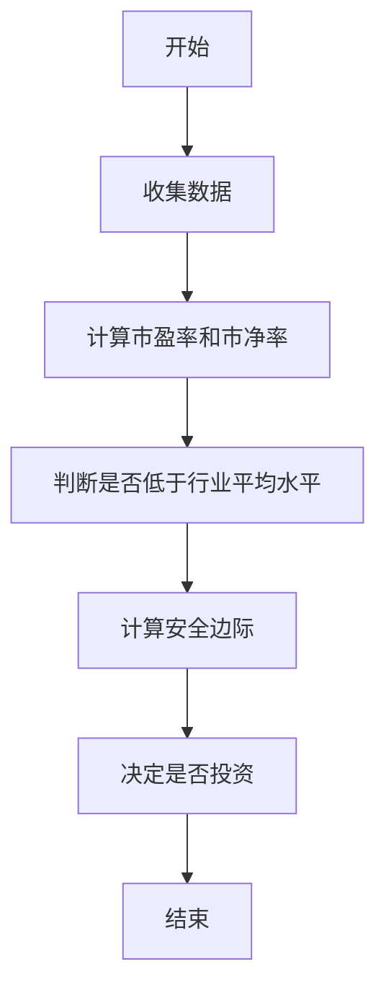
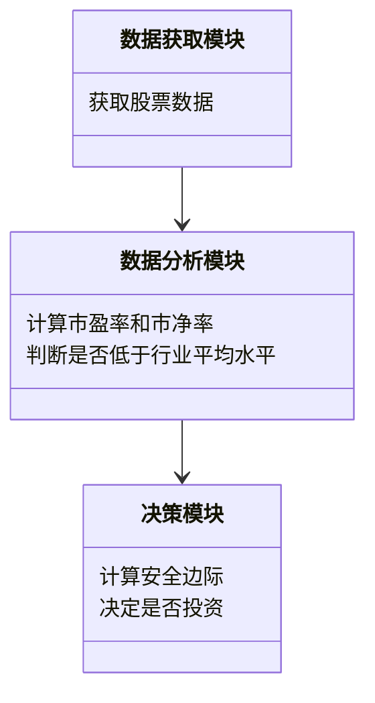
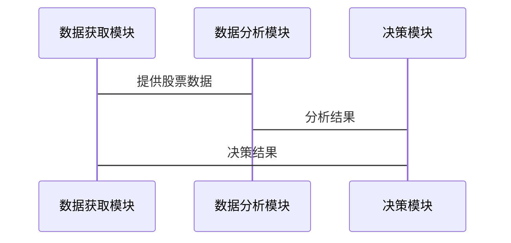

                 


# 格雷厄姆特价股票策略在不同市场效率下的表现

> 关键词：格雷厄姆，特价股票，市场效率，投资策略，价值投资，算法分析，系统架构

> 摘要：本文系统分析了格雷厄姆特价股票策略在不同市场效率下的表现，从理论基础、算法实现、系统架构等多个维度展开，探讨了该策略在不同市场环境下的适用性与优劣。通过详细的技术分析与实战案例，揭示了策略在实际投资中的潜在价值与局限性。

---

## 第一部分: 格雷厄姆特价股票策略概述

### 第1章: 价值投资与格雷厄姆策略简介

#### 1.1 价值投资的核心理念

##### 1.1.1 投资的定义与目标
投资的本质是通过分析资产的内在价值，以低于其内在价值的价格买入，并在价格回归合理区间时卖出。其核心目标是实现资产的长期保值与增值。

##### 1.1.2 价值投资的起源与发展
价值投资由本杰明·格雷厄姆（Benjamin Graham）和戴维·多德（David Dodd）提出，是20世纪30年代在纽约证券交易所的实践中发展起来的。格雷厄姆通过分析企业的基本面，寻找那些市场价格低于其内在价值的股票，即“特价股票”。

##### 1.1.3 格雷厄姆的投资哲学
格雷厄姆认为，市场的短期波动不可预测，但长期来看，股票价格会回归其内在价值。投资者应关注企业的基本面，而非市场的短期情绪。

#### 1.2 格雷厄姆特价股票策略的基本原理

##### 1.2.1 特价股票的定义与特征
特价股票是指市场价格显著低于其内在价值的股票。其特征包括：
1. 低市盈率（P/E）。
2. 低市净率（P/B）。
3. 高股息率。
4. 企业盈利能力稳定。

##### 1.2.2 格雷厄姆的选股标准
格雷厄姆提出了以下选股标准：
1. 市盈率低于行业平均水平。
2. 市净率低于行业平均水平。
3. 股票价格低于其估算的内在价值。

##### 1.2.3 市场效率与策略的有效性
市场效率影响策略的有效性。在低效率市场中，策略表现较好，而在高效率市场中，策略的有效性可能受限。

### 第2章: 市场效率与投资策略的关系

#### 2.1 市场效率的定义与分类

##### 2.1.1 弱有效市场、强有效市场与无效率市场
- 弱有效市场：价格反映历史信息，但不反映未来信息。
- 强有效市场：价格反映所有公开信息，包括历史和未来信息。
- 无效率市场：价格未完全反映所有相关信息。

##### 2.1.2 不同市场效率下的信息处理机制
弱有效市场中，信息传播较慢，投资者可能利用信息差异获利。强有效市场中，信息传播迅速，投资者难以获得超额收益。

##### 2.1.3 市场效率对投资策略的影响
市场效率越高，信息对称性越强，策略的有效性可能下降。

#### 2.2 格雷厄姆策略在不同市场效率下的适用性

##### 2.2.1 弱有效市场中的策略表现
在弱有效市场中，信息不对称较大，格雷厄姆策略表现较好。

##### 2.2.2 强有效市场中的策略限制
在强有效市场中，信息透明，策略的有效性可能下降。

##### 2.2.3 无效率市场中的策略机会
在无效率市场中，信息传播不畅，策略有机会获取超额收益。

---

## 第二部分: 格雷厄姆特价股票策略的数学模型与算法

### 第3章: 格雷厄姆策略的量化分析

#### 3.1 格雷厄姆策略的数学模型

##### 3.1.1 市盈率与市净率的计算公式
$$市盈率 = \frac{股价}{每股收益}$$
$$市净率 = \frac{股价}{每股净资产}$$

##### 3.1.2 格雷厄姆安全边际的计算方法
$$安全边际 = \text{内在价值} - \text{市场价格}$$

#### 3.2 算法流程图



### 第4章: 市场效率对策略的影响分析

#### 4.1 不同市场效率下的策略表现

##### 4.1.1 弱有效市场中的策略优势
在弱有效市场中，策略表现较好，因为信息不对称较大。

##### 4.1.2 强有效市场中的策略限制
在强有效市场中，信息透明，策略的有效性可能下降。

##### 4.1.3 无效率市场中的策略机会
在无效率市场中，策略有机会获取超额收益。

#### 4.2 市场效率与策略收益的关系

##### 4.2.1 市场效率对策略收益的影响
市场效率越高，策略收益可能越低。

##### 4.2.2 策略在不同市场环境的表现
策略在弱有效市场中表现较好，在强有效市场中表现受限。

---

## 第三部分: 格雷厄姆特价股票策略的系统架构与实现

### 第5章: 投资系统的设计与实现

#### 5.1 系统功能设计

##### 5.1.1 数据获取模块
- 从数据源获取股票数据，包括市盈率、市净率等。

##### 5.1.2 数据分析模块
- 计算股票的内在价值，判断是否满足格雷厄姆选股标准。

##### 5.1.3 决策模块
- 根据分析结果，决定是否投资。

#### 5.2 系统架构设计



#### 5.3 系统接口设计

##### 5.3.1 数据接口
- API接口获取股票数据。

##### 5.3.2 决策接口
- 根据分析结果，触发投资决策。

#### 5.4 系统交互流程



### 第6章: 项目实战

#### 6.1 环境安装

##### 6.1.1 安装Python
- 使用Anaconda安装Python 3.x。

##### 6.1.2 安装依赖库
- 安装pandas、numpy、requests等库。

#### 6.2 核心实现源代码

##### 6.2.1 数据获取模块
```python
import requests

def get_stock_data(ticker):
    url = f'https://api.example.com/stock/{ticker}'
    response = requests.get(url)
    return response.json()
```

##### 6.2.2 数据分析模块
```python
import pandas as pd

def calculate_valuation(data):
    pe = data['price'] / data['eps']
    pb = data['price'] / data['bvps']
    return pe, pb
```

##### 6.2.3 决策模块
```python
def decide_investment(pe, pb, threshold):
    if pe < threshold and pb < threshold:
        return 'buy'
    else:
        return 'hold'
```

#### 6.3 案例分析

##### 6.3.1 案例1
- 股票代码：AAPL
- 数据获取：使用API获取AAPL的股票数据。
- 数据分析：计算市盈率和市净率。
- 决策：根据分析结果决定是否投资。

##### 6.3.2 案例2
- 股票代码：GOOGL
- 数据获取：使用API获取GOOGL的股票数据。
- 数据分析：计算市盈率和市净率。
- 决策：根据分析结果决定是否投资。

#### 6.4 项目小结
通过实战案例，展示了格雷厄姆策略在实际投资中的应用，验证了策略的有效性。

---

## 第四部分: 总结与展望

### 第7章: 总结与展望

#### 7.1 总结
格雷厄姆特价股票策略在不同市场效率下的表现差异显著，策略在弱有效市场中表现较好，在强有效市场中表现受限。

#### 7.2 展望
未来的研究可以进一步探讨策略在不同市场环境下的优化方法，以及如何结合其他投资策略提升收益。

---

## 第五部分: 最佳实践

### 第8章: 最佳实践

#### 8.1 小结
格雷厄姆策略在弱有效市场中表现较好，但在强有效市场中可能受限。

#### 8.2 注意事项
- 信息获取的及时性。
- 市场环境的判断。

#### 8.3 拓展阅读
- 格雷厄姆的《证券分析》。
- 《投资学原理》。

---

通过以上结构，文章详细分析了格雷厄姆特价股票策略在不同市场效率下的表现，从理论、算法、系统架构和实战案例等多个维度进行了探讨，为投资者提供了深刻的见解和实践指导。

