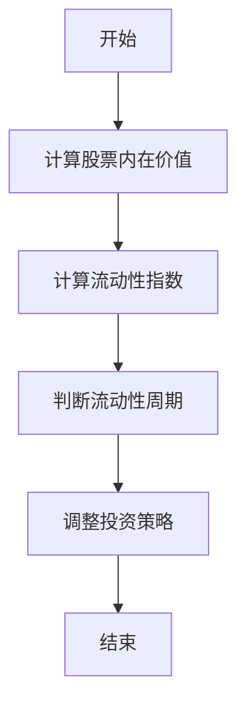

                 


# 格雷厄姆特价股票策略在不同市场流动性周期中的动态调整

## 关键词：
- 格雷厄姆投资理论
- 特价股票策略
- 市场流动性周期
- 动态调整策略
- 价值投资

## 摘要：
本文深入探讨了格雷厄姆的价值投资理念及其特价股票策略在不同市场流动性周期中的应用。通过分析市场流动性周期的特征，结合格雷厄姆的安全边际概念，提出了动态调整策略的方法。文章详细解释了策略的数学模型、算法实现以及系统架构，并通过实际案例展示了策略的应用效果。最后，本文总结了动态调整策略的关键点，为投资者提供了实用的指导。

---

# 第一部分: 格雷厄姆特价股票策略与市场流动性周期概述

## 第1章: 格雷厄姆特价股票策略的背景与核心概念

### 1.1 格雷厄姆投资理论的起源与发展
#### 1.1.1 价值投资的起源
价值投资起源于20世纪初，由本杰明·格雷厄姆和戴维·多德共同提出。他们认为市场先生的情绪波动导致股票价格与内在价值的偏离，投资者应基于基本面分析寻找被低估的股票。

#### 1.1.2 格雷厄姆的投资理念
格雷厄姆强调安全边际和margin of safety，即以低于内在价值的价格买入股票，以降低投资风险。他还提出“买入便宜货”的理念，关注低市盈率、低市净率和高股息率的股票。

#### 1.1.3 特价股票策略的核心思想
格雷厄姆的特价股票策略主要通过量化指标（如市盈率、市净率）筛选出被市场低估的股票。他认为，这些股票在市场恐慌或流动性不足时会进一步下跌，但长期来看具有较高的投资价值。

### 1.2 市场流动性周期的基本概念
#### 1.2.1 市场流动性周期的定义
市场流动性周期指金融市场中资金流动的波动性变化，通常分为宽松、紧缩和波动三个阶段。流动性宽松时，市场资金充裕，股票价格上涨；流动性紧缩时，市场资金短缺，股票价格下跌。

#### 1.2.2 流动性周期的影响因素
流动性周期受宏观经济政策、市场情绪、资金供需等多种因素影响。例如，中央银行的货币政策、投资者情绪波动以及市场参与者的资金配置策略都会影响市场的流动性。

#### 1.2.3 流动性周期与股票价格的关系
流动性宽松时，资金流入股市，推动股价上涨；流动性紧缩时，资金流出股市，导致股价下跌。流动性波动时，股价波动加剧，投资风险增加。

### 1.3 格雷厄姆策略与市场流动性周期的结合
#### 1.3.1 格雷厄姆策略在不同流动性周期中的表现
在流动性宽松周期，格雷厄姆策略表现平平，因为市场情绪乐观，高价股票可能更受青睐。在流动性紧缩周期，格雷厄姆策略可能表现不佳，因为市场恐慌导致低价股票进一步下跌。在流动性波动周期，格雷厄姆策略可能面临更大的波动性风险。

#### 1.3.2 流动性周期对格雷厄姆策略的影响
流动性周期直接影响市场的资金供给和需求，进而影响股票价格。在流动性宽松时，市场资金充裕，高价股票可能被高估，格雷厄姆策略难以找到足够的廉价股票；在流动性紧缩时，市场资金短缺，低价股票可能被低估，格雷厄姆策略更容易找到投资机会。

#### 1.3.3 动态调整策略的必要性
为了应对不同流动性周期对格雷厄姆策略的影响，投资者需要根据市场流动性变化动态调整策略。例如，在流动性宽松时减少对高市盈率股票的关注，在流动性紧缩时增加对低市盈率股票的投资。

---

## 第2章: 格雷厄姆特价股票策略的核心概念与联系

### 2.1 格雷厄姆策略的核心原理
#### 2.1.1 低市盈率与低市净率策略
格雷厄姆策略关注低市盈率（P/E）和低市净率（P/B）股票，认为这些股票的市场价格低于其内在价值，具有较高的投资安全边际。

#### 2.1.2 股票内在价值的计算方法
股票内在价值是基于公司基本面指标（如净利润、现金流、营收增长率）计算得出的。格雷厄姆认为，内在价值是股票的真正价值，市场价格波动围绕内在价值上下波动。

#### 2.1.3 安全边际的概念与应用
安全边际是格雷厄姆策略的核心思想，指买入价格低于内在价值的部分。通过计算安全边际，投资者可以降低投资风险，确保在市场波动中获得稳定收益。

### 2.2 市场流动性周期的特征分析
#### 2.2.1 流动性宽松周期的特征
流动性宽松时，市场资金充裕，投资者情绪乐观，股票价格上涨，市场波动率较低。

#### 2.2.2 流动性紧缩周期的特征
流动性紧缩时，市场资金短缺，投资者情绪悲观，股票价格下跌，市场波动率较高。

#### 2.2.3 流动性波动周期的特征
流动性波动时，市场资金供给和需求频繁变化，股票价格波动剧烈，市场波动率显著增加。

### 2.3 格雷厄姆策略与流动性周期的联系
#### 2.3.1 流动性周期对格雷厄姆策略的影响
流动性周期直接影响市场资金供给和需求，进而影响股票价格和投资者情绪。在不同流动性周期中，格雷厄姆策略的有效性有所不同。

#### 2.3.2 格雷厄姆策略在不同流动性周期中的表现差异
在流动性宽松周期，格雷厄姆策略可能表现平平，因为市场情绪乐观，高价股票可能更受青睐。在流动性紧缩周期，格雷厄姆策略可能表现不佳，因为市场恐慌导致低价股票进一步下跌。在流动性波动周期，格雷厄姆策略可能面临更大的波动性风险。

#### 2.3.3 动态调整策略的必要性
为了应对不同流动性周期对格雷厄姆策略的影响，投资者需要根据市场流动性变化动态调整策略。例如，在流动性宽松时减少对高市盈率股票的关注，在流动性紧缩时增加对低市盈率股票的投资。

### 2.4 核心概念对比分析
#### 2.4.1 格雷厄姆策略与传统价值投资的对比
格雷厄姆策略与传统价值投资的共同点在于寻找被低估的股票，但格雷厄姆更注重安全边际和量化指标，而传统价值投资更注重公司基本面分析。

#### 2.4.2 流动性周期与其他市场周期的对比
流动性周期与经济周期、市场周期等其他市场周期密切相关，但流动性周期更关注资金流动的波动性，而其他周期更关注经济基本面的变化。

#### 2.4.3 动态调整策略与静态策略的对比
动态调整策略根据市场变化实时调整投资组合，而静态策略固定投资策略不变。动态调整策略更具灵活性，能够更好地应对市场变化。

---

## 第3章: 格雷厄姆特价股票策略的数学模型与算法原理

### 3.1 格雷厄姆策略的数学模型
#### 3.1.1 股票内在价值的计算公式
股票内在价值的计算公式如下：

$$ V = \frac{E}{P} + \frac{D}{P} $$

其中，\( V \) 为股票的内在价值，\( E \) 为净利润，\( P \) 为股价，\( D \) 为折旧。

#### 3.1.2 安全边际的计算公式
安全边际的计算公式如下：

$$ S = P \times (1 - \frac{V}{P}) $$

其中，\( S \) 为安全边际，\( P \) 为股价，\( V \) 为内在价值。

### 3.2 市场流动性周期的量化指标
#### 3.2.1 流动性指数的计算
流动性指数的计算公式如下：

$$ LI = \frac{VWAP}{TWAP} $$

其中，\( LI \) 为流动性指数，\( VWAP \) 为加权平均成交量，\( TWAP \) 为加权平均时间。

#### 3.2.2 市场情绪指数的计算
市场情绪指数的计算公式如下：

$$ ME = \frac{VOL}{VWAP} $$

其中，\( ME \) 为市场情绪指数，\( VOL \) 为成交量，\( VWAP \) 为加权平均成交量。

### 3.3 动态调整策略的算法流程
动态调整策略的算法流程如下：

1. **计算股票内在价值**：根据公司基本面指标计算股票的内在价值。
2. **计算流动性指数**：根据市场成交量和时间加权计算流动性指数。
3. **判断流动性周期**：根据流动性指数判断当前市场处于哪个流动性周期（宽松、紧缩或波动）。
4. **调整投资策略**：根据流动性周期调整投资策略，例如在流动性宽松时减少对高市盈率股票的关注，在流动性紧缩时增加对低市盈率股票的投资。

以下是动态调整策略的Mermaid流程图：



### 3.4 Python实现示例
以下是动态调整策略的Python代码示例：

```python
import pandas as pd
import numpy as np

# 计算股票内在价值
def calculate_intrinsic_value(df):
    df['Intrinsic Value'] = df['Earnings'] / df['Price'] + df['Depreciation'] / df['Price']
    return df

# 计算流动性指数
def calculate_liquidity_index(df):
    df['VWAP'] = (df['Volume'] * df['Price']).sum() / df['Volume'].sum()
    df['TWAP'] = (df['Volume'] * df['Time']).sum() / df['Volume'].sum()
    df['LI'] = df['VWAP'] / df['TWAP']
    return df

# 判断流动性周期
def determine_liq

