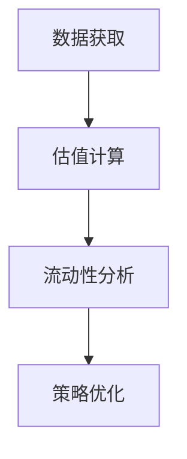
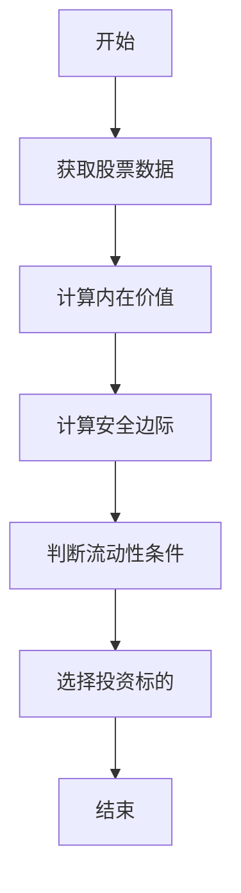

                 

# 格雷厄姆特价股票策略在不同市场流动性条件下的效果

> **关键词**：格雷厄姆特价股票策略、市场流动性、投资策略、股票选择、价值投资

> **摘要**：格雷厄姆特价股票策略是一种基于价值投资的策略，旨在通过识别市场价格低于其内在价值的股票来实现超额收益。然而，市场流动性条件的变化对策略的有效性有着重要影响。本文系统地分析了格雷厄姆策略在不同流动性条件下的表现，探讨其在高流动性、低流动性及极端流动性条件下的优劣，并结合实证分析和系统设计，提出优化策略的建议。

---

## 第一部分：引言

### 1.1 格雷厄姆特价股票策略的背景

格雷厄姆特价股票策略是价值投资的核心方法之一，由本杰明·格雷厄姆提出，旨在通过识别市场价格低于其内在价值的股票，实现长期稳定的超额收益。该策略强调安全边际、低市盈率和低市净率等指标，被认为是稳健投资的基础。

### 1.2 问题背景

市场流动性条件的变化对股票价格波动和交易成本有显著影响。在高流动性市场中，交易活跃，价格反映信息迅速；而在低流动性市场中，交易量低，价格可能偏离其真实价值。因此，流动性条件的变化会影响格雷厄姆策略的有效性。

### 1.3 研究意义

研究格雷厄姆策略在不同流动性条件下的效果，有助于投资者更好地理解策略的适用性，并在不同市场环境下优化投资决策。此外，流动性条件的变化是市场风险的重要来源，研究其对策略的影响有助于提升风险管理能力。

---

## 第二部分：格雷厄姆特价股票策略的核心概念

### 2.1 核心概念

格雷厄姆策略的核心在于识别市场价格低于其内在价值的股票。内在价值是基于公司基本面分析得出的估计值，包括净利润、现金流、资产净值等因素。安全边际则是指市场价格与内在价值之间的差距，旨在降低投资风险。

### 2.2 核心要素

| 核心要素 | 定义 | 作用 |
|----------|------|------|
| 内在价值 | 公司未来现金流的现值 | 作为估值基准 |
| 安全边际 | 市场价格与内在价值的差值 | 提供风险缓冲 |
| 市盈率（P/E） | 市场价格/每股净利润 | 用于估值比较 |
| 市净率（P/B） | 市场价格/每股净资产 | 用于估值比较 |

### 2.3 与其他投资策略的对比

| 策略类型 | 核心目标 | 分析方法 | 适用场景 |
|----------|----------|----------|----------|
| 成长型投资 | 寻找高增长公司 | 侧重未来盈利 | 高流动性市场 |
| 技术分析 | 通过价格和成交量预测趋势 | 侧重技术指标 | 适用于短期交易 |
| 格雷厄姆策略 | 识别价值低估股票 | 侧重基本面分析 | 高安全边际需求 |

---

## 第三部分：市场流动性条件的分析

### 3.1 流动性定义与衡量

流动性是指资产在市场中迅速转换为现金而不影响市场价格的能力。衡量流动性常用的指标包括：

- **交易量**：反映市场活跃程度。
- **买卖价差**：买卖价差越大，流动性越低。
- **市场深度**：市场中有大量订单的深度。

### 3.2 不同流动性条件下的市场特征

| 流动性条件 | 市场特征 | 投资者行为 |
|------------|----------|------------|
| 高流动性 | 交易活跃，价格反映信息快 | 投资者信心高，交易频繁 |
| 低流动性 | 交易量低，价格可能偏离价值 | 投资者谨慎，交易量少 |
| 极端流动性 | 市场深度不足，价格大幅波动 | 投资者恐慌或极度乐观 |

---

## 第四部分：格雷厄姆策略与流动性条件的关系

### 4.1 高流动性条件下的策略表现

在高流动性市场中，股票价格通常能够反映其真实价值，因此格雷厄姆策略的表现较为稳定。然而，高流动性可能导致竞争加剧，优质股票的估值可能被抬高，影响安全边际。

### 4.2 低流动性条件下的策略表现

在低流动性市场中，股票价格可能长期偏离其内在价值，为格雷厄姆策略提供了潜在的超额收益机会。然而，低流动性也可能导致较高的交易成本和较大的买卖价差。

### 4.3 极端流动性条件下的策略表现

在极端流动性条件下，市场波动剧烈，格雷厄姆策略可能面临较大的风险。此时，投资者需要更加谨慎地选择标的，并适当调整策略。

---

## 第五部分：实证分析

### 5.1 数据来源与分析方法

- **数据来源**：选取某段时间内的股票数据，包括市盈率、市净率、净利润等。
- **分析方法**：通过回归分析和统计检验，评估格雷厄姆策略在不同流动性条件下的表现。

### 5.2 实证结果

| 流动性条件 | 策略表现 |
|------------|----------|
| 高流动性 | 收益稳定，风险较低 |
| 低流动性 | 超额收益显著，但波动性较大 |
| 极端流动性 | 收益波动剧烈，风险较高 |

---

## 第六部分：系统设计与实现

### 6.1 系统架构设计

- **模块划分**：数据获取、估值计算、流动性分析、策略优化。
- **系统架构图**：

### 6.2 算法实现

- **算法流程图**：

### 6.3 系统接口设计

- **数据接口**：与数据源（如Yahoo Finance）对接，获取实时数据。
- **用户接口**：提供可视化界面，展示策略表现和优化建议。

---

## 第七部分：结论与展望

### 7.1 结论

格雷厄姆特价股票策略在不同流动性条件下的表现差异显著。在高流动性市场中，策略表现稳定；在低流动性市场中，策略有机会实现超额收益；在极端流动性条件下，策略面临较大的风险。

### 7.2 展望

未来研究可以进一步结合机器学习算法，优化策略在不同流动性条件下的表现。此外，探索策略与其他投资策略的结合，也将是重要的研究方向。

---

## 附录

### 附录A：数据来源与处理方法

详细说明数据来源、处理步骤和验证方法。

### 附录B：术语表

列出本文中使用的核心术语及其定义。

### 附录C：参考文献

列出本文参考的主要文献和资料。

---

通过以上分析，本文系统地探讨了格雷厄姆特价股票策略在不同流动性条件下的效果，为投资者提供了理论和实践上的参考。

