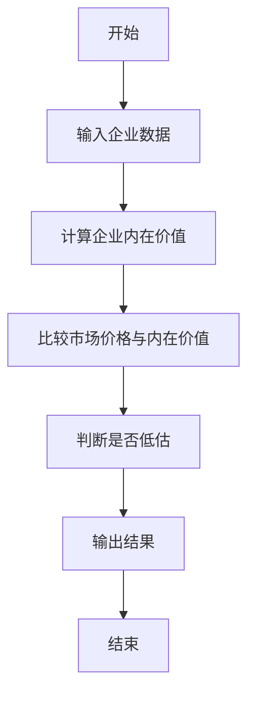
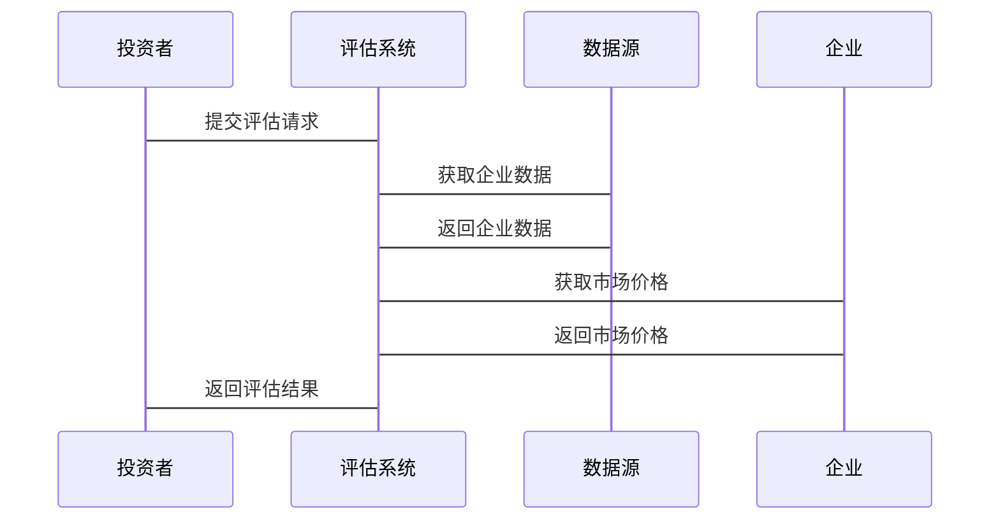

                 


# 《格雷厄姆特价股票策略在不同数字企业文化生态中的适应》

---

## 关键词
- 格雷厄姆特价股票策略
- 数字企业文化生态
- 价值投资
- 数字化转型
- 企业估值

---

## 摘要
本文系统探讨了格雷厄姆价值投资策略在数字企业文化生态中的适应性。通过分析数字企业的特点，结合格雷厄姆的内在价值评估方法，本文提出了如何在数字化转型中识别和评估被低估企业的策略。文章从核心概念、算法原理、系统架构、项目实战到最佳实践，全面解析了格雷厄姆策略在数字企业中的应用，为投资者提供了理论与实践相结合的指导。

---

# 第1章: 格雷厄姆特价股票策略概述

## 1.1 格雷厄姆特价股票策略的核心理念
### 1.1.1 价值投资的基本原则
价值投资的核心在于寻找市场价格低于内在价值的股票。格雷厄姆强调安全边际和长期投资，主张通过基本面分析来评估企业的内在价值。

### 1.1.2 格雷厄姆投资策略的定义
格雷厄姆策略基于以下原则：
1. **安全边际**：买入价格低于内在价值，以确保投资的安全性。
2. **低风险**：选择财务稳定、流动性强的公司。
3. **长期视角**：关注企业的长期盈利能力，而非短期市场波动。

### 1.1.3 特价股票的识别与评估标准
格雷厄姆提出了多个评估标准，包括：
- **市盈率（P/E）**：低于行业平均水平。
- **市净率（P/B）**：低于1。
- **股息率**：稳定且合理的股息支付。

## 1.2 数字企业文化生态的定义与特点
### 1.2.1 数字企业的概念
数字企业是指利用数字技术（如大数据、人工智能、云计算等）进行业务创新和转型的企业。其核心特征包括数据驱动、智能化运营和客户体验优化。

### 1.2.2 数字企业文化生态的构成要素
数字企业文化生态由以下几个关键要素构成：
1. **数据资产**：企业的核心资源。
2. **技术架构**：支持数字化转型的技术基础设施。
3. **组织文化**：适应数字化的组织结构和文化氛围。
4. **客户关系**：基于数据的客户互动和体验。

### 1.2.3 数字化转型对企业价值的影响
数字化转型能够提升企业的运营效率、创新能力和市场竞争力，从而增加企业的内在价值。然而，数字化转型也带来了新的风险，如数据安全和隐私问题。

## 1.3 格雷厄姆策略在数字企业中的适应性
### 1.3.1 数字化对企业估值的影响
数字企业的估值需要考虑其数据资产和技术创新能力。传统估值方法可能无法准确反映数字企业的价值。

### 1.3.2 格雷厄姆策略与数字企业的结合
格雷厄姆策略在数字企业中的应用需要结合企业的数字化转型成果、数据资产价值和技术创新能力，以更准确地评估其内在价值。

### 1.3.3 适应性分析
格雷厄姆策略的核心理念在数字企业中依然适用，但需要调整评估指标和方法，以适应数字化环境下的企业特征。

---

# 第2章: 核心概念与联系

## 2.1 核心概念与联系
### 2.1.1 核心概念的对比分析
通过对比分析，我们可以发现格雷厄姆策略和数字企业价值评估的共性和差异。

| 比较维度 | 传统价值投资 | 数字企业价值评估 |
|----------|--------------|-----------------|
| 核心指标 | 市盈率、市净率 | 数据资产价值、技术创新能力 |
| 评估重点 | 企业财务状况 | 数字化转型成果 |
| 风险因素 | 市场波动、经济周期 | 技术风险、数据安全 |

### 2.1.2 实体关系图（ER图）
```mermaid
er
  actor 投资者
  actor 企业
  actor 评估系统
  actor 数据源
  relation 股票评估结果
  relation 企业数据输入
  relation 系统输出
  relation 评估请求
```

## 2.2 格雷厄姆策略的算法原理
### 2.2.1 格雷厄姆策略的核心算法流程图


## 2.3 数学模型与公式
### 2.3.1 内在价值计算公式
$$ V = \frac{E}{(1 + r)^n} $$
其中，\( V \) 是内在价值，\( E \) 是未来现金流的现值，\( r \) 是折现率，\( n \) 是时间跨度。

### 2.3.2 数字企业价值评估的改进公式
$$ V_{\text{digital}} = V + \text{数字化转型带来的增量价值} $$

## 2.4 核心概念的联系
通过以上分析，我们可以看到格雷厄姆策略在数字企业中的应用需要结合企业的数字化转型成果和数据资产价值，以更准确地评估其内在价值。

---

# 第3章: 格雷厄姆策略的算法实现

## 3.1 算法原理
格雷厄姆策略的核心算法是通过计算企业的内在价值，与市场价格进行比较，判断是否存在低估。具体步骤如下：
1. **数据收集**：收集企业的财务数据（如收入、利润、现金流）和市场数据（如股价、市盈率）。
2. **计算内在价值**：使用格雷厄姆的公式计算企业的内在价值。
3. **比较市场价格与内在价值**：判断是否存在低估。

## 3.2 算法实现
### 3.2.1 Python代码实现
```python
def calculate_intrinsic_value(enterprise_value, discount_rate, years):
    # 计算未来现金流的现值
    present_value = enterprise_value / (1 + discount_rate) ** years
    return present_value

# 示例数据
enterprise_value = 1000000
discount_rate = 0.1
years = 5

# 计算内在价值
intrinsic_value = calculate_intrinsic_value(enterprise_value, discount_rate, years)
print(f"内在价值: ${intrinsic_value:.2f}")
```

### 3.2.2 算法流程图


## 3.3 算法优化
为了更好地适应数字企业，可以对格雷厄姆策略进行优化，例如引入数据资产价值评估和技术创新能力评估。

---

# 第4章: 系统分析与架构设计

## 4.1 系统功能设计
数字企业价值评估系统需要实现以下功能：
1. 数据采集：收集企业的财务数据和市场数据。
2. 评估模型：基于格雷厄姆策略的算法进行评估。
3. 结果输出：生成评估报告。

### 4.1.1 领域模型（类图）


### 4.1.2 系统架构设计（架构图）


### 4.1.3 系统交互（序列图）


---

# 第5章: 项目实战

## 5.1 项目背景
假设我们是一家科技公司，希望通过格雷厄姆策略评估其数字转型后的价值。

## 5.2 项目实施
### 5.2.1 数据准备
收集企业的财务数据和市场数据。

### 5.2.2 评估模型实现
基于格雷厄姆策略的算法进行评估。

### 5.2.3 结果分析
判断是否存在低估，并生成评估报告。

## 5.3 项目总结
通过项目实战，我们验证了格雷厄姆策略在数字企业中的应用效果。

---

# 第6章: 最佳实践与注意事项

## 6.1 最佳实践
1. **数据质量**：确保数据的准确性和完整性。
2. **模型选择**：根据企业的特点选择合适的评估模型。
3. **持续优化**：定期更新模型和数据，以适应市场变化。

## 6.2 注意事项
1. **风险控制**：关注市场波动和企业风险。
2. **团队协作**：需要跨学科团队的协作。
3. **技术选型**：选择合适的技术工具和平台。

---

# 第7章: 总结与展望

## 7.1 总结
本文系统探讨了格雷厄姆策略在数字企业中的应用，提出了结合企业数字化转型成果和数据资产价值的评估方法。

## 7.2 展望
未来的研究可以进一步探索如何结合人工智能和大数据技术，提升格雷厄姆策略在数字企业中的应用效果。

---

通过以上章节的详细分析，我们可以看到格雷厄姆策略在数字企业中的应用是一个复杂而有趣的过程，需要结合企业的数字化转型成果和数据资产价值，以更准确地评估其内在价值。

