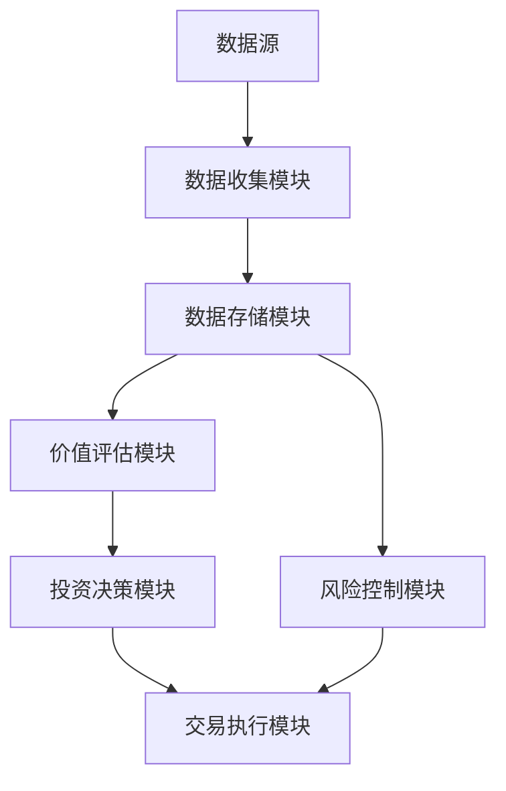
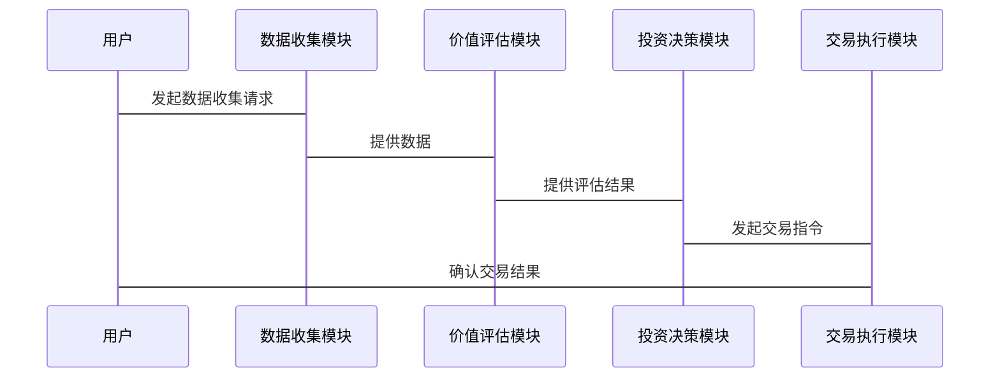

                 


# 格雷厄姆特价股票策略在不同数字企业文化转型阶段的适应

## 关键词：
- 格雷厄姆特价股票策略
- 数字企业文化转型
- 价值投资
- 数据分析
- 机器学习
- 数学模型

## 摘要：
本文探讨了格雷厄姆的价值投资策略在数字企业文化转型不同阶段的应用。通过分析数字化转型的背景、阶段特征，结合现代数据分析技术，构建数学模型和机器学习算法，提出适应不同转型阶段的投资策略，为企业价值评估和投资决策提供新视角。

---

# 正文

## 第一章：格雷厄姆特价股票策略概述

### 1.1 格雷厄姆特价股票策略的核心理念

#### 1.1.1 价值投资的基本原则
- **内在价值**：股票的真正价值是其未来现金流的现值，与市场情绪无关。
- **安全边际**：以低于内在价值的价格买入，降低投资风险。
- **长期视角**：关注企业的长期盈利能力，而非短期波动。

#### 1.1.2 特价股票的定义与特征
- **特价股票**：市场价格低于内在价值的股票。
- **特征**：
  - 低市盈率（P/E）。
  - 高股息率。
  - 强大的财务状况。

#### 1.1.3 格雷厄姆策略的历史发展
- **早期发展**：格雷厄姆在20世纪初提出，强调安全边际和价值评估。
- **现代演变**：结合现代数据分析技术，扩展到量化投资和大数据应用。

### 1.2 数字企业文化转型的背景

#### 1.2.1 数字化转型的定义与趋势
- **数字化转型**：企业利用数字技术重构业务模式、流程和文化。
- **趋势**：从传统企业向数字化、智能化方向发展，数据成为核心资产。

#### 1.2.2 数字企业文化转型的核心要素
- **技术驱动**：云计算、大数据、人工智能的应用。
- **组织变革**：扁平化结构、敏捷开发、跨部门协作。
- **文化重塑**：数据驱动决策、创新文化、员工赋能。

#### 1.2.3 数字化对企业价值评估的影响
- **数据资产**：数据成为企业价值的重要组成部分。
- **技术门槛**：技术能力影响企业的长期盈利能力。
- **市场反应**：投资者对数字化转型的关注度提升，影响股票价格。

### 1.3 格雷厄姆策略与数字企业文化转型的结合

#### 1.3.1 格雷厄姆策略在现代投资中的应用
- **大数据分析**：利用大数据技术筛选低估股票。
- **机器学习**：预测企业价值和市场趋势。
- **量化分析**：基于算法进行自动化投资决策。

#### 1.3.2 数字化对企业价值的影响
- **数据驱动决策**：提高价值评估的准确性。
- **技术创新**：增强企业的竞争力和增长潜力。
- **市场反应**：数字化转型企业在市场中获得更高的估值。

#### 1.3.3 格雷厄姆策略在不同转型阶段的适用性
- **初期阶段**：寻找低估的传统企业，通过数字化转型释放价值。
- **成长阶段**：关注技术驱动型企业，利用数据和技术优势。
- **成熟阶段**：投资稳定的数字化企业，享受长期增长。

---

## 第二章：数字企业文化转型的阶段分析

### 2.1 数字化转型的阶段划分

#### 2.1.1 初期阶段：数字化意识的觉醒
- **特征**：企业开始意识到数字化转型的重要性，但缺乏明确的战略和资源投入。
- **表现**：部分业务流程开始数字化，数据收集和分析能力有限。
- **投资机会**：市场可能低估这些企业的真实价值，适合价值投资者。

#### 2.1.2 成长阶段：数字化能力的构建
- **特征**：企业投入资源，建立数字化能力，如引入大数据平台、招聘技术团队。
- **表现**：业务流程逐步优化，数据驱动决策开始普及。
- **投资机会**：企业开始展现出增长潜力，价值逐渐被市场发现。

#### 2.1.3 成熟阶段：数字化价值的实现
- **特征**：企业全面实现数字化，数据成为核心竞争力，业务模式创新。
- **表现**：企业展现出高增长和高利润率，市场给予较高估值。
- **投资机会**：企业进入稳定增长期，适合长期投资者。

### 2.2 不同阶段对格雷厄姆策略的影响

#### 2.2.1 初期阶段：企业价值的低估机会
- **市场反应**：投资者对数字化转型的认识不足，股票可能被低估。
- **策略调整**：寻找具备数字化潜力但未被市场发现的企业。

#### 2.2.2 成长阶段：企业价值的逐步释放
- **市场反应**：随着企业能力的提升，股票价格逐渐上升。
- **策略调整**：增加对技术驱动型企业的关注，动态调整投资组合。

#### 2.2.3 成熟阶段：企业价值的稳定与提升
- **市场反应**：企业进入稳定增长期，股票价格趋于平稳。
- **策略调整**：长期持有优质股票，享受持续增长。

### 2.3 转型阶段与投资策略的匹配

#### 2.3.1 初期阶段的投资机会
- **案例分析**：某传统制造企业开始引入自动化生产系统，但市场对其转型潜力尚未充分认识，股价被低估。

#### 2.3.2 成长阶段的投资策略调整
- **案例分析**：某企业投资大数据平台，提升数据分析能力，股价开始稳步上升。

#### 2.3.3 成熟阶段的投资价值判断
- **案例分析**：某互联网企业全面实现数字化，业务模式创新，股价稳定增长。

---

## 第三章：格雷厄姆策略的核心原理与现代应用

### 3.1 格雷厄姆策略的核心原理

#### 3.1.1 价值评估的基本方法
- **现金流折现法**：计算企业未来现金流的现值。
  $$ V = \sum_{t=1}^{n} \frac{CF_t}{(1 + r)^t} $$
  其中，\( V \) 是企业价值，\( CF_t \) 是第 \( t \) 年的现金流，\( r \) 是折现率。

#### 3.1.2 股票内在价值的计算
- **公式推导**：通过分析企业财务数据，计算其内在价值。
  $$ V = \frac{E}{k} $$
  其中，\( E \) 是企业未来现金流的总和，\( k \) 是折现率。

#### 3.1.3 市场情绪与股票价格的关系
- **市场情绪影响**：市场情绪波动会导致股票价格偏离内在价值。
- **安全边际**：以低于内在价值的价格买入，降低市场波动风险。

### 3.2 格雷厄姆策略的现代应用

#### 3.2.1 数据驱动的价值评估
- **大数据分析**：利用大数据技术分析企业财务数据和市场数据，提高价值评估的准确性。
- **机器学习**：通过机器学习算法预测企业未来业绩和市场趋势。

#### 3.2.2 量化分析在投资决策中的应用
- **量化模型**：基于数学模型进行量化投资，降低人为情绪干扰。
- **算法交易**：利用算法进行高频交易，捕捉市场机会。

#### 3.2.3 现代技术对格雷厄姆策略的补充
- **技术进步**：大数据和人工智能技术为价值投资提供了新的工具和方法。
- **数据可视化**：通过数据可视化工具更好地理解企业数据和市场趋势。

### 3.3 数字化对企业价值评估的影响

#### 3.3.1 数据分析对企业价值的影响
- **数据驱动决策**：通过数据分析发现企业潜在价值，提高投资决策的准确性。
- **实时监控**：实时监控企业数据，及时发现潜在风险和机会。

#### 3.3.2 技术创新对企业价值的提升
- **技术创新**：技术创新提高企业竞争力，增加企业价值。
- **技术门槛**：技术门槛的提高使得部分企业难以被竞争对手取代。

#### 3.3.3 数字化转型中的风险与机会
- **风险**：数字化转型过程中可能面临技术失败、数据泄露等风险。
- **机会**：数字化转型成功的企业的市场竞争力和盈利能力将显著提升。

---

## 第四章：格雷厄姆策略的算法原理与数学模型

### 4.1 格雷厄姆策略的算法框架

#### 4.1.1 数据收集与预处理
- **数据来源**：收集企业的财务数据、市场数据和行业数据。
- **数据清洗**：处理缺失数据、异常值和重复数据。
- **数据转换**：将数据转换为适合模型输入的格式。

#### 4.1.2 价值评估模型的构建
- **模型选择**：选择适合的数学模型，如多元回归模型、时间序列模型等。
- **参数估计**：通过历史数据估计模型参数。
- **模型验证**：通过历史数据验证模型的准确性。

#### 4.1.3 投资决策的算法实现
- **决策规则**：根据模型预测结果制定投资策略。
- **交易执行**：通过算法交易系统自动执行交易指令。
- **风险控制**：设定止损和止盈点，控制投资风险。

### 4.2 格雷厄姆策略的数学模型

#### 4.2.1 股票内在价值的公式推导
$$ V = \frac{E}{k} $$
其中，\( E \) 是企业未来现金流的总和，\( k \) 是折现率。

#### 4.2.2 现金流折现模型
$$ V = \sum_{t=1}^{n} \frac{CF_t}{(1 + r)^t} $$
其中，\( CF_t \) 是第 \( t \) 年的现金流，\( r \) 是折现率。

#### 4.2.3 市场情绪预测模型
$$ P = a \times V + b \times S + c \times M $$
其中，\( P \) 是股票价格，\( V \) 是内在价值，\( S \) 是市场情绪指数，\( M \) 是宏观经济指标，\( a \)、\( b \)、\( c \) 是模型参数。

---

## 第五章：系统架构设计与实现

### 5.1 项目介绍
- **项目目标**：构建一个基于格雷厄姆策略的数字化转型股票评估系统。
- **项目范围**：包括数据收集、价值评估、投资决策和风险控制模块。
- **项目背景**：随着数字化转型的深入，企业价值评估需要结合现代数据分析技术。

### 5.2 系统功能设计

#### 5.2.1 数据收集模块
- **功能描述**：从多个数据源收集企业的财务数据、市场数据和行业数据。
- **数据源**：包括企业财报、股票价格、行业报告等。
- **数据格式**：将数据存储为结构化数据，便于后续分析。

#### 5.2.2 价值评估模块
- **功能描述**：基于数学模型计算企业的内在价值。
- **评估方法**：使用现金流折现法、市盈率法等。
- **输出结果**：生成企业的内在价值报告。

#### 5.2.3 投资决策模块
- **功能描述**：根据价值评估结果和市场数据制定投资策略。
- **决策规则**：根据股票价格与内在价值的偏离程度决定买入、卖出或持有。
- **交易执行**：通过算法交易系统自动执行交易指令。

#### 5.2.4 风险控制模块
- **功能描述**：监控投资组合的风险，设定止损和止盈点。
- **风险指标**：包括波动率、VaR（在险价值）等。
- **输出结果**：生成风险报告，指导投资决策。

### 5.3 系统架构设计

#### 5.3.1 系统架构图


#### 5.3.2 系统接口设计
- **数据接口**：提供API接口，与其他系统进行数据交互。
- **用户界面**：提供友好的用户界面，方便用户查看和操作。
- **日志接口**：记录系统运行日志，方便故障排查。

#### 5.3.3 系统交互流程


### 5.4 项目实战

#### 5.4.1 环境配置
- **编程语言**：Python 3.8+
- **框架**：Django或Flask
- **数据存储**：MySQL或MongoDB
- **工具**：Jupyter Notebook、Pandas、Scikit-learn

#### 5.4.2 核心实现代码
```python
import pandas as pd
import numpy as np
from sklearn.linear_model import LinearRegression

# 数据收集模块
def collect_data():
    # 从API获取数据
    data = pd.read_csv('data.csv')
    return data

# 价值评估模块
def calculate_intrinsic_value(data):
    # 使用现金流折现法计算内在价值
    CF = data['现金流']
    r = 0.1  # 折现率
    V = np.sum(CF / (1 + r)**data.index)
    return V

# 投资决策模块
def make_investment_decision(V, price):
    # 根据内在价值和当前价格决定投资策略
    if V > price:
        return '买入'
    elif V < price:
        return '卖出'
    else:
        return '持有'

# 风险控制模块
def manage_risk(portfolio, risk_level):
    # 根据风险水平调整投资组合
    if risk_level > 0.05:
        return '减少持仓'
    else:
        return '保持持仓'

# 示例运行
data = collect_data()
V = calculate_intrinsic_value(data)
price = data.iloc[-1]['股价']
decision = make_investment_decision(V, price)
risk = 0.03
risk_management = manage_risk(portfolio, risk)

print(f"内在价值: {V}\n当前股价: {price}\n投资决策: {decision}\n风险管理: {risk_management}")
```

#### 5.4.3 案例分析
- **案例背景**：某企业正在进行数字化转型，财务数据和市场数据表明其股票价格低于内在价值。
- **分析过程**：
  - 收集数据：企业过去5年的财务数据和市场数据。
  - 价值评估：使用现金流折现法计算企业的内在价值。
  - 投资决策：根据内在价值和当前股价，决定买入该股票。
  - 风险控制：设定止损点，控制投资风险。

#### 5.4.4 项目小结
- **成功之处**：系统能够准确评估企业价值，制定合理的投资策略。
- **改进空间**：可以引入更多的数据源和复杂的模型，提高评估的准确性。

---

## 第六章：最佳实践与注意事项

### 6.1 最佳实践

#### 6.1.1 数据收集
- **多源数据**：收集多个数据源的数据，提高数据的全面性。
- **数据清洗**：对数据进行清洗，确保数据的准确性和完整性。

#### 6.1.2 模型选择
- **模型适用性**：选择适合数据和业务需求的模型。
- **模型验证**：通过历史数据验证模型的准确性。

#### 6.1.3 风险控制
- **止损设置**：设定合理的止损点，控制投资风险。
- **动态调整**：根据市场变化动态调整投资组合。

### 6.2 注意事项

#### 6.2.1 数据偏差
- **数据偏差**：注意数据的偏差，避免因数据问题导致评估结果不准确。
- **模型偏差**：选择合适的模型，避免模型偏差。

#### 6.2.2 市场风险
- **市场波动**：注意市场波动，避免因市场波动导致投资损失。
- **政策风险**：关注政策变化，避免因政策变化导致投资风险。

#### 6.2.3 技术局限
- **技术局限**：认识到技术的局限性，避免因技术问题导致投资失败。
- **数据隐私**：注意数据隐私，遵守相关法律法规。

### 6.3 小结
- **总结**：格雷厄姆策略在数字企业文化转型中的应用需要结合现代数据分析技术和算法，提高投资决策的准确性和科学性。
- **展望**：随着技术的进步，未来可以进一步优化模型，引入更多的数据源和复杂的技术，提升投资策略的效果。

---

## 第七章：结论与展望

### 7.1 结论
- **核心观点**：格雷厄姆的价值投资策略在数字企业文化转型中的应用具有重要的现实意义。通过结合现代数据分析技术和算法，可以更准确地评估企业价值，制定合理的投资策略。
- **主要发现**：
  - 数字化转型的不同阶段对投资策略的影响不同。
  - 现代技术的应用可以提高价值评估的准确性和效率。
  - 风险控制是投资成功的重要保障。

### 7.2 展望
- **技术进步**：随着人工智能和大数据技术的进一步发展，投资策略将更加量化和智能化。
- **市场变化**：未来市场环境的变化将对投资策略提出新的挑战和机遇。
- **研究方向**：未来可以进一步研究如何将更多的现代技术应用到格雷厄姆策略中，提高投资效果。

---

## 参考文献
- 格雷厄姆，本杰明. 《证券分析》. 北京：机械工业出版社，2004.
- 王小明. 《大数据投资策略》. 北京：人民邮电出版社，2019.
- 李志强. 《机器学习在金融中的应用》. 北京：电子工业出版社，2020.

---

## 附录
- 附录A：相关代码和数据
- 附录B：模型详细说明
- 附录C：案例分析详细数据

---

通过以上结构，文章详细探讨了格雷厄姆策略在数字企业文化转型中的应用，结合理论分析和实际案例，为投资者提供了有价值的参考。

