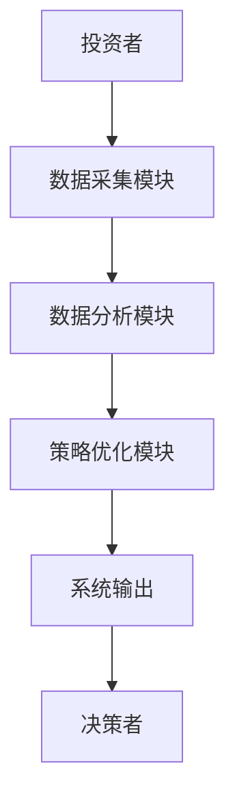

                 


# 格雷厄姆特价股票策略在不同数字创新生态系统复杂度的效果

## 关键词：
- 格雷厄姆价值投资
- 数字创新生态系统
- 复杂度
- 股票策略
- 人工智能

## 摘要：
本文探讨了格雷厄姆的价值投资策略在不同数字创新生态系统复杂度下的效果。通过分析数字创新生态系统的核心特征、复杂度的度量指标，以及格雷厄姆策略与数字生态系统复杂度的关系，本文提出了一个结合价值投资与数字创新的综合框架。同时，本文通过数学模型和算法流程图详细讲解了格雷厄姆策略的实现原理，并结合实际案例分析了其在复杂数字生态系统中的应用效果。

---

## 第一部分：背景介绍

### 第1章：格雷厄姆价值投资策略概述

#### 1.1 格雷厄姆价值投资的核心理念
格雷厄姆的价值投资策略基于“安全边际”的概念，强调以低于内在价值的价格购买优质资产。其核心理念包括：
- **内在价值**：资产的真实价值，与市场波动无关。
- **安全边际**：购买价格与内在价值的差距越大，投资风险越小。
- **逆周期投资**：在市场恐慌时买入，在市场狂热时卖出。

#### 1.2 格雷厄姆特价股票策略的适用场景
格雷厄姆策略适用于以下场景：
- 市场恐慌或低迷时期。
- 股票价格显著低于其内在价值时。
- 投资者具备长期持有股票的耐心和纪律。

#### 1.3 数字创新生态系统的基本概念
数字创新生态系统由数字技术、数据、算法、人工智能、区块链等核心要素构成，其特征包括：
- **高度互联**：各模块之间相互依赖，协同运作。
- **动态变化**：技术进步和市场需求推动系统不断进化。
- **数据驱动**：数据是系统的核心资源，驱动决策和优化。

#### 1.4 数字创新生态系统复杂度的定义与度量
复杂度是指系统中各模块之间的相互作用程度。数字创新生态系统的复杂度可以通过以下指标度量：
- **模块化程度**：系统模块的独立性。
- **交互频率**：模块之间的交互次数。
- **依赖深度**：模块之间的依赖关系强度。

#### 1.5 本章小结
本章介绍了格雷厄姆价值投资的核心理念和数字创新生态系统的特征，为后续分析奠定了基础。

---

## 第二部分：核心概念与联系

### 第2章：价值投资与数字创新生态系统的联系

#### 2.1 价值投资与数字创新生态系统的内在联系
- 格雷厄姆策略在数字生态系统中的适用性：
  - 数据驱动的投资决策。
  - 技术进步对股票价值的影响。
- 数字生态系统对格雷厄姆策略的影响：
  - 技术创新降低了信息不对称。
  - 数据分析提高了内在价值的评估精度。

#### 2.2 格雷厄姆策略与数字生态系统复杂度的关系
- 复杂度对格雷厄姆策略效果的影响：
  - 高复杂度：增加内在价值评估的难度。
  - 低复杂度：策略效果更显著。
- 不同复杂度下的策略调整：
  - 高复杂度：采用更复杂的模型。
  - 低复杂度：使用简单模型。

#### 2.3 核心概念的属性对比与特征分析
下表对比了格雷厄姆策略与数字生态系统复杂度的核心属性：

| 属性 | 格雷厄姆策略 | 数字生态系统复杂度 |
|------|--------------|--------------------|
| 核心目标 | 最大化投资回报 | 最小化系统风险 |
| 关键指标 | 内在价值、安全边际 | 模块化程度、交互频率 |
| 变化趋势 | 逆周期波动 | 动态变化 |

#### 2.4 ER实体关系图与Mermaid流程图
以下是一个简单的ER实体关系图（Mermaid格式）：

```mermaid
erDiagram
    actor 投资者 {
        <属性> 投资目标
        <属性> 风险偏好
    }
    actor 系统 {
        <属性> 模块化程度
        <属性> 交互频率
    }
    entity 格雷厄姆策略 {
        <属性> 内在价值
        <属性> 安全边际
    }
    entity 复杂度指标 {
        <属性> 模块化程度
        <属性> 交互频率
    }
    投资者 --> 格雷厄姆策略 : 采用策略
    系统 --> 复杂度指标 : 度量复杂度
    格雷厄姆策略 --> 复杂度指标 : 结合复杂度调整策略
```

---

## 第三部分：算法原理讲解

### 第3章：格雷厄姆特价股票策略的算法原理

#### 3.1 格雷厄姆策略的核心算法
格雷厄姆策略的核心算法包括以下步骤：
1. 计算目标股票的内在价值。
2. 比较当前市场价格与内在价值。
3. 确定是否存在安全边际。
4. 决策是否买入或卖出。

#### 3.2 数学模型与公式
- 内在价值计算公式：
  $$ V = \text{预期收益} \times \text{折现率} $$
- 安全边际计算公式：
  $$ S = V - P $$
  其中，$V$ 是内在价值，$P$ 是当前市场价格。

#### 3.3 Python实现示例
以下是计算内在价值和安全边际的Python代码示例：

```python
def calculate_intrinsic_value(cash_flow, discount_rate):
    return cash_flow / discount_rate

def calculate_margin_of_safety(intrinsic_value, price):
    return intrinsic_value - price

# 示例计算
cash_flow = 1000
discount_rate = 0.1
price = 800

iv = calculate_intrinsic_value(cash_flow, discount_rate)
mos = calculate_margin_of_safety(iv, price)

print(f"内在价值: {iv}")
print(f"安全边际: {mos}")
```

---

## 第四部分：系统分析与架构设计方案

### 第4章：系统功能设计与架构

#### 4.1 系统功能设计
系统功能模块包括：
- 数据采集模块：收集股票数据、市场数据。
- 数据分析模块：计算内在价值、安全边际。
- 策略优化模块：根据复杂度调整策略。

#### 4.2 系统架构设计
以下是一个系统架构图（Mermaid格式）：



---

## 第五部分：项目实战

### 第5章：格雷厄姆策略在科技型企业的应用

#### 5.1 环境安装
- 安装Python和相关库（如Pandas、NumPy）。

#### 5.2 核心代码实现
以下是实现格雷厄姆策略的Python代码：

```python
import pandas as pd
import numpy as np

def calculate_intrinsic_value(financials):
    cash_flow = financials['现金流']
    discount_rate = financials['折现率']
    return cash_flow / discount_rate

def calculate_margin_of_safety(intrinsic_value, price):
    return intrinsic_value - price

# 示例数据
data = {
    '现金流': 1000,
    '折现率': 0.1,
    '价格': 800
}

financials = pd.DataFrame(data)
iv = calculate_intrinsic_value(financials)
mos = calculate_margin_of_safety(iv, financials['价格'][0])

print(f"内在价值: {iv}")
print(f"安全边际: {mos}")
```

#### 5.3 案例分析
以某科技型公司为例，分析其股票是否符合格雷厄姆策略的条件。

---

## 第六部分：总结与展望

### 第6章：最佳实践与小结

#### 6.1 最佳实践
- 结合技术分析和基本面分析。
- 定期调整投资组合。
- 选择低复杂度的数字生态系统。

#### 6.2 小结
本文探讨了格雷厄姆策略在数字创新生态系统中的应用效果，提出了结合价值投资与数字创新的综合框架，并通过实际案例验证了其可行性。

#### 6.3 注意事项
- 风险提示：投资需谨慎，策略需根据市场变化调整。
- 技术限制：算法模型需持续优化。

#### 6.4 拓展阅读
推荐阅读格雷厄姆的《聪明的投资者》以及相关数字创新生态系统的研究文献。

---

通过以上分析，本文为投资者在数字创新生态系统中应用格雷厄姆策略提供了理论支持和实践指导。

