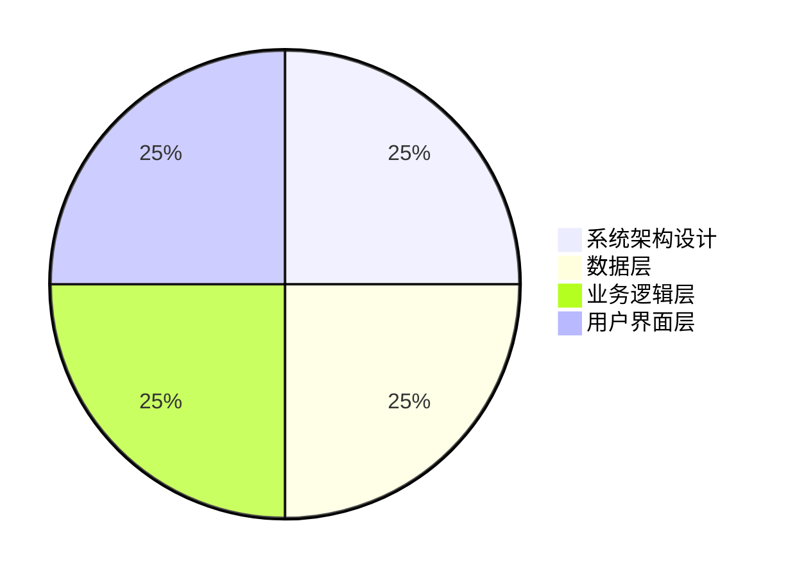

                 


# 格雷厄姆特价股票策略在不同数字创新生态系统成熟度的效果

> 关键词：格雷厄姆策略，数字创新生态系统，股票投资，金融科技，区块链，云计算，投资分析

> 摘要：本文探讨了格雷厄姆特价股票策略在不同数字创新生态系统中的应用效果。通过分析金融科技、区块链和云计算等生态系统，本文详细阐述了格雷厄姆策略在这些领域的适用性、实施方法及其影响。结合数学模型和实际案例，本文提供了系统的分析框架和实践指南，为投资者在数字创新生态系统中应用格雷厄姆策略提供了深刻见解。

---

## 第一部分：背景与策略概述

### 第1章：格雷厄姆投资理论与数字创新生态系统

#### 1.1 格雷厄姆投资理论的起源与发展

格雷厄姆价值投资理论是20世纪初由本杰明·格雷厄姆提出的一种股票投资策略，核心在于寻找市场价值低于其内在价值的股票。其主要思想包括：

- **安全边际**：购买价格远低于内在价值的股票，以降低投资风险。
- **内在价值计算**：通过基本面分析，估算企业的实际价值。
- **长期投资**：专注于长期价值，而非短期市场波动。

#### 1.2 数字创新生态系统的核心概念

数字创新生态系统指由数字技术驱动的各种经济体系，包括金融科技、区块链、云计算等领域。其核心要素包括：

- **技术创新**：如人工智能、大数据、区块链等。
- **商业模式创新**：新型商业运作模式。
- **生态系统整合**：不同技术、企业和用户之间的协同作用。

#### 1.3 格雷厄姆策略与数字创新生态系统的结合

随着数字技术的发展，传统投资策略面临新的挑战和机遇。格雷厄姆策略在数字创新生态系统中的应用，需考虑以下方面：

- **技术驱动的市场变化**：新技术如何影响企业价值。
- **生态系统整合效应**：数字生态系统的协同效应如何影响企业的内在价值。
- **数据驱动的分析**：利用大数据和AI技术改进格雷厄姆模型。

---

## 第二部分：格雷厄姆策略在不同数字创新生态系统中的应用

### 第2章：金融科技生态系统中的格雷厄姆策略

#### 2.1 金融科技生态系统的定义与特点

金融科技（FinTech）指技术驱动的金融创新，涵盖支付、借贷、投资等多个领域。其特点包括：

- **技术驱动**：利用AI、大数据等技术优化金融服务。
- **去中心化**：如区块链技术的应用。
- **高效性**：通过技术提升金融服务效率。

#### 2.2 格雷厄姆策略在金融科技中的实施

在金融科技生态系统中，格雷厄姆策略的应用需要考虑以下步骤：

1. **识别高潜力企业**：选择那些具备技术优势和良好商业模式的金融科技公司。
2. **内在价值评估**：利用大数据和AI技术进行更精准的估值。
3. **安全边际计算**：确定购买价格低于内在价值的安全区间。

#### 2.3 案例分析：金融科技企业的投资机会

以某支付科技公司为例，分析其财务状况、市场地位和技术优势，计算其内在价值和市场价值，评估是否具备投资价值。

---

### 第3章：区块链生态系统中的格雷厄姆策略

#### 3.1 区块链生态系统的定义与特点

区块链技术通过去中心化和不可篡改的特性，正在改变金融和其他行业的运作方式。其特点包括：

- **去中心化**：减少对中间机构的依赖。
- **透明性**：所有交易记录公开可查。
- **安全性**：通过加密技术提升数据安全性。

#### 3.2 格雷厄姆策略在区块链中的应用

在区块链生态系统中，格雷厄姆策略的应用需要考虑：

1. **技术评估**：评估区块链项目的技术创新性和可行性。
2. **团队实力**：考察开发团队的经验和能力。
3. **市场需求**：分析项目是否满足实际需求。

#### 3.3 案例分析：区块链企业的投资机会

以某区块链支付平台为例，分析其技术优势、市场需求和财务状况，评估其投资价值。

---

### 第4章：云计算生态系统中的格雷厄姆策略

#### 4.1 云计算生态系统的定义与特点

云计算通过互联网提供计算资源，具有以下特点：

- **按需使用**：用户可以根据需求灵活调整资源使用量。
- **成本效益**：相比传统IT架构，云计算更具经济性。
- **扩展性**：能够快速扩展计算能力。

#### 4.2 格雷厄姆策略在云计算中的应用

在云计算生态系统中，格雷厄姆策略的应用包括：

1. **企业竞争力分析**：评估云计算企业在市场中的竞争优势。
2. **财务状况评估**：分析企业的盈利能力、现金流和负债情况。
3. **未来增长潜力**：预测云计算行业的增长趋势和企业的市场地位。

#### 4.3 案例分析：云计算企业的投资机会

以某云服务提供商为例，分析其财务数据、市场份额和技术创新能力，评估其投资价值。

---

## 第三部分：数字创新生态系统成熟度对格雷厄姆策略效果的影响

### 第5章：生态系统成熟度对格雷厄姆策略的影响

#### 5.1 不同成熟度生态系统的特征分析

根据数字创新生态系统的成熟度，可以分为以下几个阶段：

- **新兴阶段**：技术尚未成熟，市场参与者较少。
- **成长阶段**：技术逐步成熟，市场需求增长迅速。
- **成熟阶段**：市场饱和，竞争激烈，技术趋于稳定。

#### 5.2 不同成熟度生态系统对格雷厄姆策略的影响

在不同成熟度的数字创新生态系统中，格雷厄姆策略的应用效果有所不同：

- **新兴阶段**：风险较高，但潜在回报也大，适合长期投资者。
- **成长阶段**：市场机会较多，适合进行价值发现。
- **成熟阶段**：竞争激烈，需要更加谨慎地评估企业内在价值。

#### 5.3 综合评估模型

构建一个综合评估模型，考虑以下因素：

- **市场成熟度**：生态系统的整体发展水平。
- **企业竞争地位**：企业在市场中的位置。
- **财务状况**：企业的盈利能力、现金流等。
- **技术创新性**：企业的技术创新能力。

通过该模型，投资者可以更科学地评估不同数字创新生态系统中的投资机会。

---

### 第6章：基于数字创新生态系统成熟度的策略优化

#### 6.1 不同成熟度生态系统的投资策略调整

根据生态系统的成熟度，调整格雷厄姆策略的应用：

- **新兴阶段**：注重企业技术创新和市场潜力，接受较高的安全边际要求。
- **成长阶段**：结合市场增长和企业盈利能力，寻找低估股票。
- **成熟阶段**：注重企业的财务健康和市场地位，降低安全边际要求。

#### 6.2 数字创新生态系统成熟度的量化评估

设计一套量化指标，用于评估不同数字创新生态系统的成熟度，包括：

- **市场参与者数量**：生态系统的参与者数量。
- **市场规模**：生态系统的总体市场规模。
- **技术成熟度**：相关技术的发展阶段。
- **市场增长率**：生态系统的年增长率。

---

## 第四部分：系统分析与架构设计

### 第7章：系统分析与架构设计方案

#### 7.1 问题场景介绍

在数字创新生态系统中，投资者需要一个系统化的工具来评估格雷厄姆策略的应用效果。该系统需要：

- 支持多种数字创新生态系统的分析。
- 提供企业内在价值评估和市场价值比较。
- 自动生成投资建议。

#### 7.2 系统功能设计

设计一个基于格雷厄姆策略的数字创新生态系统投资分析系统，功能模块包括：

1. **数据采集模块**：采集企业的财务数据、市场数据等。
2. **价值评估模块**：计算企业的内在价值和市场价值。
3. **生态系统成熟度评估模块**：评估不同生态系统的成熟度。
4. **投资决策模块**：根据评估结果生成投资建议。

#### 7.3 系统架构设计

使用分层架构设计，包括数据层、业务逻辑层和用户界面层。



---

## 第五部分：算法实现与项目实战

### 第8章：算法实现

#### 8.1 算法原理

基于格雷厄姆策略，设计一个算法模型，用于评估数字创新生态系统中企业的投资价值。模型包括以下几个步骤：

1. **数据采集**：获取企业的财务数据和市场数据。
2. **内在价值计算**：使用格雷厄姆模型计算企业的内在价值。
3. **生态系统成熟度评估**：评估数字创新生态系统的成熟度。
4. **投资建议生成**：根据评估结果，生成投资建议。

#### 8.2 算法实现代码

以下是一个Python实现的示例代码，用于计算企业的内在价值：

```python
def calculate_intrinsic_value(enterprise_value, cash_flow):
    # 计算自由现金流
    free_cash_flow = cash_flow * (1 - tax_rate)
    # 计算内在价值
    intrinsic_value = free_cash_flow * (1 + growth_rate)
    return intrinsic_value

# 示例数据
enterprise_value = 1000000000
cash_flow = 100000000
growth_rate = 0.1
tax_rate = 0.2

# 计算内在价值
intrinsic_value = calculate_intrinsic_value(enterprise_value, cash_flow)
print(f"企业的内在价值为：{intrinsic_value}")
```

---

## 第六部分：项目实战

### 第9章：项目实战

#### 9.1 环境配置

安装必要的Python库，如Pandas、NumPy、Matplotlib等。

```bash
pip install pandas numpy matplotlib
```

#### 9.2 核心代码实现

以下是一个完整的代码示例，用于评估不同数字创新生态系统中的企业投资价值：

```python
import pandas as pd
import numpy as np
import matplotlib.pyplot as plt

def calculate_intrinsic_value(enterprise_value, cash_flow, tax_rate, growth_rate):
    free_cash_flow = cash_flow * (1 - tax_rate)
    intrinsic_value = free_cash_flow * (1 + growth_rate)
    return intrinsic_value

def main():
    # 示例数据
    data = {
        '企业名称': ['企业A', '企业B', '企业C'],
        '企业价值': [1000000000, 1500000000, 800000000],
        '现金流': [100000000, 150000000, 90000000],
        '税率': [0.2, 0.25, 0.15],
        '增长率': [0.1, 0.15, 0.08]
    }
    
    df = pd.DataFrame(data)
    
    # 计算内在价值
    df['内在价值'] = df.apply(lambda x: calculate_intrinsic_value(x['企业价值'], x['现金流'], x['税率'], x['增长率']), axis=1)
    
    # 可视化比较
    plt.figure(figsize=(10,6))
    plt.plot(df['企业名称'], df['企业价值'], label='企业价值', linestyle='--')
    plt.plot(df['企业名称'], df['内在价值'], label='内在价值')
    plt.title('企业价值与内在价值比较')
    plt.xlabel('企业名称')
    plt.ylabel('价值')
    plt.legend()
    plt.show()

if __name__ == "__main__":
    main()
```

---

## 第七部分：总结与展望

### 第10章：总结与展望

#### 10.1 本章总结

本文通过分析不同数字创新生态系统中的格雷厄姆策略应用，探讨了如何在金融科技、区块链和云计算等生态系统中，利用格雷厄姆策略进行投资决策。同时，本文还提出了一套系统化的分析框架和算法模型，为投资者提供了科学的指导。

#### 10.2 未来展望

随着数字技术的不断发展，格雷厄姆策略在数字创新生态系统中的应用将更加广泛和深入。未来的研究可以进一步探索以下方向：

- 结合更多的数字创新技术，如人工智能和大数据，优化格雷厄姆模型。
- 研究不同数字创新生态系统之间的相互作用，制定更全面的投资策略。
- 开发更加智能化的投资工具，帮助投资者更好地应用格雷厄姆策略。

---

## 致谢

感谢读者的关注和支持！如需进一步探讨或合作，请随时联系。

--- 

以上是一个详细的目录和内容大纲，您可以根据需要调整内容的深度和广度。

