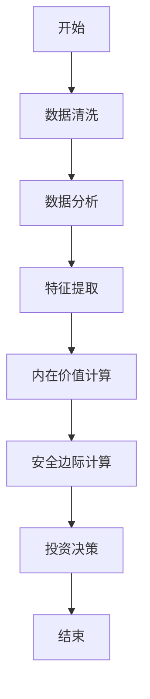

                 


# 格雷厄姆特价股票策略在不同数字创新生态系统的效果

## 关键词：格雷厄姆策略, 数字创新生态系统, 股票投资, 价值投资, 数字化转型, 投资策略, 股票分析

## 摘要：  
本文探讨了格雷厄姆特价股票策略在不同数字创新生态系统中的应用效果。通过分析数字创新生态系统的特点，结合格雷厄姆的价值投资理论，提出了在数字环境下如何优化股票投资策略的方法。文章详细阐述了数字创新生态系统对股票投资的影响，分析了格雷厄姆策略在数字环境中的适用性，并通过实际案例展示了如何利用数字工具和技术优化股票投资决策。本文还提出了结合大数据和人工智能技术的改进策略，为投资者提供了新的视角和方法。

---

# 第1章: 格雷厄姆特价股票策略与数字创新生态系统的结合

## 1.1 格雷厄姆投资理论的起源与发展

### 1.1.1 价值投资的起源  
价值投资是一种以企业内在价值为核心的投资策略，起源于20世纪初。本杰明·格雷厄姆是该理论的奠基人，他强调以低于企业内在价值的价格购买股票，以确保投资的安全性和稳定性。  

### 1.1.2 格雷厄姆投资理论的核心思想  
格雷厄姆的价值投资理论主要包括以下几个核心思想：  
1. **安全边际**：以低于企业内在价值的价格买入股票，以确保投资的安全性。  
2. **企业内在价值**：通过对企业财务状况和经营能力的分析，估算其内在价值。  
3. **长期投资**：价值投资强调长期持有优质资产，避免频繁交易。  

### 1.1.3 格雷厄姆策略在现代投资中的地位  
尽管格雷厄姆的投资理论已有近百年历史，但其核心思想至今仍被广泛应用于股票投资中。现代投资理论（如CAPM）在一定程度上受到格雷厄姆思想的影响，但格雷厄姆策略更注重基本面分析和安全边际。

---

## 1.2 数字创新生态系统的基本概念

### 1.2.1 数字创新生态系统的定义  
数字创新生态系统是指在数字化转型背景下，由技术、数据、企业、用户和生态系统参与者共同构成的一个动态交互网络。它以数据为核心驱动力，通过技术创新和协同合作，推动企业的价值创造和竞争优势。

### 1.2.2 数字创新生态系统的核心特征  
数字创新生态系统具有以下核心特征：  
1. **数据驱动**：数据是生态系统的核心资源。  
2. **技术创新**：以人工智能、大数据、区块链等技术为基础。  
3. **协同合作**：企业、开发者、用户等多方参与者共同参与生态建设。  
4. **动态性**：生态系统具有快速迭代和自我优化的能力。  

### 1.2.3 数字创新生态系统与传统经济的对比  
数字创新生态系统与传统经济的主要区别在于，前者更加依赖数据和技术，具有更高的透明度和效率，且能够快速响应市场变化。

---

## 1.3 格雷厄姆策略与数字创新生态系统的结合

### 1.3.1 格雷厄姆策略在数字环境中的适用性  
尽管格雷厄姆策略的核心思想在数字环境下依然适用，但其实施方式需要结合数字工具和技术进行优化。例如，通过大数据分析和人工智能技术，可以更高效地识别具有投资价值的企业。

### 1.3.2 数字创新生态系统对股票投资的影响  
数字创新生态系统通过提供丰富的数据和工具，降低了投资者的门槛，提高了投资决策的效率。同时，数字技术也使得市场波动更加频繁和复杂，这对格雷厄姆策略的实施提出了新的挑战。

### 1.3.3 本章小结  
本章介绍了格雷厄姆投资理论的基本原理和数字创新生态系统的概念，并探讨了两者结合的可能性和必要性。

---

# 第2章: 格雷厄姆特价股票策略的核心要素

## 2.1 格雷厄姆策略的核心要素分析

### 2.1.1 股票的内在价值  
股票的内在价值是企业未来现金流的现值。计算内在价值时，需要考虑企业的盈利能力、成长性、行业地位等因素。

### 2.1.2 市场价格与内在价值的关系  
市场价格围绕内在价值波动，但短期内可能偏离内在价值。格雷厄姆策略的核心是寻找市场价格低于内在价值的股票。

### 2.1.3 安全边际的概念  
安全边际是指市场价格与内在价值之间的差距。通过预留安全边际，可以降低投资风险。

---

## 2.2 数字创新生态系统中的价值评估

### 2.2.1 数字创新企业的价值评估方法  
在数字创新生态系统中，企业价值的评估需要考虑数据资产、技术壁垒、用户粘性等因素。

### 2.2.2 数字创新生态系统中的市场定价机制  
数字创新生态系统中的市场定价机制更加复杂，受到技术进步和数据流动的影响。

### 2.2.3 格雷厄姆策略在数字创新生态系统中的适用性  
尽管数字创新生态系统的复杂性增加了价值评估的难度，但格雷厄姆策略的核心思想仍可应用。例如，通过大数据分析可以更准确地估算企业的内在价值。

---

## 2.3 格雷厄姆策略与数字创新生态系统结合的模型

### 2.3.1 格雷厄姆策略在数字创新生态系统中的应用框架  
通过结合数字工具和技术，格雷厄姆策略可以更高效地应用于数字创新生态系统中。

### 2.3.2 数字创新生态系统对格雷厄姆策略的优化  
数字创新生态系统通过提供实时数据和分析工具，可以优化格雷厄姆策略的实施过程。

---

## 2.4 本章小结  
本章详细分析了格雷厄姆策略的核心要素，并探讨了其在数字创新生态系统中的应用。通过结合数字工具和技术，格雷厄姆策略可以更好地适应数字化转型的背景。

---

# 第3章: 格雷厄姆策略在数字创新生态系统中的应用

## 3.1 数字创新生态系统中的股票选择策略

### 3.1.1 基于格雷厄姆策略的股票筛选方法  
通过分析企业的财务指标和行业地位，筛选出具有投资价值的股票。

### 3.1.2 数字创新生态系统中的企业基本面分析  
在数字创新生态系统中，企业基本面分析需要结合数据资产和技术壁垒等因素。

### 3.1.3 企业财务指标的数字化评估  
通过大数据分析和人工智能技术，可以更准确地评估企业的财务指标。

---

## 3.2 数字创新生态系统中的市场波动分析

### 3.2.1 数字创新生态系统中的市场波动特点  
数字创新生态系统中的市场波动更加频繁和复杂，受到技术进步和政策变化的影响。

### 3.2.2 市场波动对格雷厄姆策略的影响  
市场波动可能影响股票价格，但格雷厄姆策略通过预留安全边际可以降低波动带来的风险。

### 3.2.3 如何在数字环境中应对市场波动  
通过实时数据分析和动态调整投资组合，可以更好地应对市场波动。

---

## 3.3 数字创新生态系统中的风险管理

### 3.3.1 格雷厄姆策略中的风险管理原则  
格雷厄姆策略强调分散投资和预留安全边际，以降低投资风险。

### 3.3.2 数字创新生态系统中的风险管理挑战  
数字创新生态系统中的风险管理需要考虑技术风险和数据安全风险。

### 3.3.3 数字环境下的风险管理策略优化  
通过引入大数据和人工智能技术，可以优化风险管理策略，提高风险预警能力。

---

## 3.4 本章小结  
本章探讨了格雷厄姆策略在数字创新生态系统中的应用，分析了股票选择、市场波动和风险管理等方面的问题。

---

# 第4章: 格雷厄姆策略在数字创新生态系统中的算法实现

## 4.1 格雷厄姆策略的数学模型

### 4.1.1 股票内在价值的数学公式  
股票的内在价值可以通过以下公式计算：  
$$ V = \frac{CF}{r - g} $$  
其中，$CF$ 是未来现金流，$r$ 是折现率，$g$ 是增长率。

### 4.1.2 安全边际的计算方法  
安全边际可以通过以下公式计算：  
$$ \text{安全边际} = V - P $$  
其中，$V$ 是内在价值，$P$ 是市场价格。

---

## 4.2 数字创新生态系统中的数据处理与分析

### 4.2.1 数据清洗与预处理  
通过清洗和预处理数据，可以提高分析结果的准确性。

### 4.2.2 数据分析与特征提取  
通过分析企业的财务数据和市场数据，提取具有投资价值的特征。

### 4.2.3 数据可视化与趋势分析  
通过数据可视化工具，可以更直观地观察市场趋势和企业表现。

---

## 4.3 格雷厄姆策略的算法实现

### 4.3.1 算法流程图  


### 4.3.2 算法代码实现  
以下是一个简单的Python代码示例：  
```python
import pandas as pd

def calculate_intrinsic_value(cf, r, g):
    return cf / (r - g)

def calculate_margin_of_safety(v, p):
    return v - p

# 示例数据
cf = 100
r = 0.1
g = 0.05
p = 80

v = calculate_intrinsic_value(cf, r, g)
mos = calculate_margin_of_safety(v, p)

print(f"内在价值: {v}")
print(f"安全边际: {mos}")
```

### 4.3.3 算法优化与改进  
通过引入机器学习算法，可以进一步优化格雷厄姆策略的实施效果。例如，利用回归分析预测企业的未来现金流。

---

## 4.4 本章小结  
本章通过数学模型和算法实现，详细阐述了格雷厄姆策略在数字创新生态系统中的实施过程。

---

# 第5章: 数字创新生态系统中的股票投资策略优化

## 5.1 基于格雷厄姆策略的投资组合优化

### 5.1.1 投资组合构建的理论基础  
投资组合的构建需要考虑风险与收益的平衡。

### 5.1.2 数字创新生态系统中的投资组合优化方法  
通过大数据分析和人工智能技术，可以优化投资组合的构建过程。

### 5.1.3 投资组合优化的数学模型  
投资组合优化可以通过以下公式实现：  
$$ \text{目标函数} = \min \sum w_i \sigma_i^2 $$  
其中，$w_i$ 是权重，$\sigma_i^2$ 是收益率的方差。

---

## 5.2 数字创新生态系统中的动态调整策略

### 5.2.1 动态调整的必要性  
市场环境的变化需要投资者及时调整投资策略。

### 5.2.2 动态调整的实现方法  
通过实时数据分析和市场监测，可以实现投资组合的动态调整。

### 5.2.3 动态调整的效果  
动态调整可以提高投资组合的收益，降低投资风险。

---

## 5.3 本章小结  
本章探讨了数字创新生态系统中的投资组合优化和动态调整策略，提出了结合大数据和人工智能技术的优化方法。

---

# 第6章: 实际案例分析与策略效果评估

## 6.1 案例分析：数字创新生态系统中的某企业投资

### 6.1.1 案例背景  
选择一家数字创新企业作为案例，分析其投资价值。

### 6.1.2 格雷厄姆策略的应用  
通过格雷厄姆策略评估企业的内在价值和安全边际。

### 6.1.3 投资效果评估  
分析投资的实际效果，验证格雷厄姆策略在数字创新生态系统中的有效性。

---

## 6.2 策略效果评估

### 6.2.1 格雷厄姆策略在数字环境中的表现  
通过对比传统环境和数字环境中的投资效果，评估格雷厄姆策略的适用性。

### 6.2.2 策略优化的方向  
根据实际案例分析，提出进一步优化格雷厄姆策略的方向。

---

## 6.3 本章小结  
本章通过实际案例分析，验证了格雷厄姆策略在数字创新生态系统中的有效性，并提出了进一步优化的方向。

---

# 第7章: 数字创新生态系统中的投资风险管理

## 7.1 数字创新生态系统中的风险管理挑战

### 7.1.1 技术风险  
技术的快速迭代可能影响企业的竞争优势。

### 7.1.2 市场风险  
数字市场的波动性增加了投资风险。

### 7.1.3 数据安全风险  
数据泄露可能对企业的价值评估产生重大影响。

---

## 7.2 数字创新生态系统中的风险管理策略

### 7.2.1 风险评估与预警  
通过实时数据分析，建立风险预警机制。

### 7.2.2 投资组合分散化  
通过分散化投资，降低单一风险的影响。

### 7.2.3 风险控制工具  
利用衍生品和保险工具，降低投资风险。

---

## 7.3 本章小结  
本章分析了数字创新生态系统中的风险管理挑战，并提出了有效的风险管理策略。

---

# 第8章: 数字创新生态系统中的投资策略未来展望

## 8.1 数字创新生态系统的发展趋势

### 8.1.1 技术进步的推动  
人工智能和大数据技术的进一步发展将推动数字创新生态系统向更高层次迈进。

### 8.1.2 数字经济的深度融合  
数字创新生态系统将与实体经济深度融合，形成更加复杂的经济体系。

---

## 8.2 格雷厄姆策略的未来应用

### 8.2.1 结合新技术的优化  
通过结合区块链、人工智能等新技术，进一步优化格雷厄姆策略的实施效果。

### 8.2.2 数字化转型中的投资机会  
数字创新生态系统为投资者提供了新的投资机会，如数字经济、智能制造等领域。

---

## 8.3 本章小结  
本章展望了数字创新生态系统的发展趋势，并提出了格雷厄姆策略在未来应用中的发展方向。

---

# 第9章: 总结与展望

## 9.1 本文总结  
本文探讨了格雷厄姆特价股票策略在数字创新生态系统中的应用效果，提出了结合数字工具和技术的优化方法。

## 9.2 未来展望  
随着数字创新生态系统的进一步发展，格雷厄姆策略将与新技术深度融合，为投资者提供更多的投资机会和更好的投资体验。

---

# 参考文献  
（此处列出相关文献和资料）

---

# 附录  
（此处列出代码、数据或其他补充材料）

---

通过以上目录结构和内容安排，我们可以系统地探讨格雷厄姆特价股票策略在数字创新生态系统中的应用效果，结合理论分析和实际案例，为投资者提供有价值的参考和指导。

