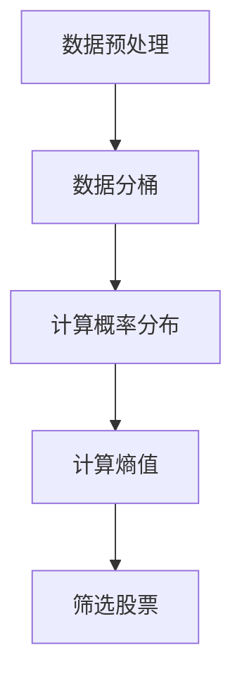

                 


# 格雷厄姆特价股票策略在不同数字市场信息熵水平下的表现

> 关键词：格雷厄姆策略，信息熵，股票筛选，市场不确定性，投资策略优化

> 摘要：本文探讨了格雷厄姆特价股票策略在不同数字市场信息熵水平下的表现。首先介绍了格雷厄姆投资理论的核心思想及其在现代投资中的应用，然后详细分析了信息熵的定义、数学模型及其在金融市场的应用。在此基础上，结合信息熵优化格雷厄姆策略的可行性和具体实现方法进行了深入探讨。通过实证分析，验证了结合信息熵的格雷厄姆策略在不同市场环境下的表现，并提出了相应的优化建议。

---

# 第一部分: 格雷厄姆特价股票策略与信息熵的结合

## 第1章: 格雷厄姆特价股票策略概述

### 1.1 格雷厄姆投资理论的核心思想

#### 1.1.1 价值投资的基本原则
格雷厄姆是价值投资的鼻祖，其核心思想是寻找市场价格低于其内在价值的股票。他强调安全边际的重要性，即市场价格与内在价值的差距越大，投资的安全性越高。以下是格雷厄姆策略的核心原则：

- **安全边际**：买入价格远低于内在价值的股票。
- **低市盈率和低市净率**：选择市盈率和市净率低于市场平均水平的股票。
- **企业基本面分析**：关注企业的盈利能力、财务状况和行业地位。

#### 1.1.2 特价股票的定义与筛选标准
格雷厄姆提出的“特价股票”是指市场价格远低于其内在价值的股票。以下是其筛选标准：

| 标准 | 描述 |
|------|------|
| 市盈率 | 低于市场平均水平 |
| 市净率 | 低于市场平均水平 |
| 股息率 | 高于市场平均水平 |
| 企业规模 | 中小盘股优先 |

#### 1.1.3 格雷厄姆策略在现代投资中的应用
尽管格雷厄姆的投资理论诞生于20世纪，但其核心思想在现代投资中仍然具有重要的指导意义。近年来，量化投资的兴起为格雷厄姆策略提供了新的实现方式，尤其是在大数据和人工智能技术的帮助下，投资者可以通过算法筛选符合格雷厄姆标准的股票。

---

### 1.2 信息熵与市场不确定性

#### 1.2.1 信息熵的定义与数学模型
信息熵是信息论中的一个重要概念，用于衡量数据的不确定性。在概率论中，熵的定义如下：

$$
H(X) = -\sum_{i=1}^{n} p(x_i) \log p(x_i)
$$

其中，$H(X)$ 表示随机变量 $X$ 的熵，$p(x_i)$ 是 $X$ 取值 $x_i$ 的概率。

在金融市场中，信息熵可以用来衡量市场的不确定性。当市场处于高度不确定状态时，熵值较高；当市场处于稳定状态时，熵值较低。

#### 1.2.2 信息熵在金融市场的应用
信息熵在金融市场的应用主要体现在以下几个方面：

- **市场风险评估**：通过计算市场数据的熵值，评估市场的不确定性。
- **资产配置**：根据熵值的变化，动态调整资产配置策略。
- **交易信号生成**：基于熵值的变化，生成买卖信号。

#### 1.2.3 不同市场环境下信息熵的变化特征
在不同的市场环境下，信息熵的表现有所不同：

- **牛市**：市场情绪乐观，熵值较低。
- **熊市**：市场情绪悲观，熵值较高。
- **震荡市**：市场不确定性较大，熵值波动显著。

---

### 1.3 格雷厄姆策略与信息熵的结合

#### 1.3.1 格雷厄姆策略的适应性分析
格雷厄姆策略的核心是寻找低估的股票，但在实际操作中，市场环境的变化会影响策略的有效性。例如，在市场不确定性较高的环境下，格雷厄姆策略的表现可能不佳。

#### 1.3.2 信息熵在股票筛选中的潜在作用
信息熵可以作为筛选股票的重要指标之一。通过计算股票价格、成交量等数据的熵值，可以评估股票的不确定性，从而辅助筛选出具有潜在投资价值的股票。

#### 1.3.3 结合信息熵优化格雷厄姆策略的可行性
通过结合信息熵，可以动态调整格雷厄姆策略的筛选标准。例如，在市场不确定性较高的环境下，可以适当放宽筛选条件，以捕捉更多低估股票。

---

## 第2章: 信息熵的数学模型与计算方法

### 2.1 信息熵的基本公式

#### 2.1.1 基础公式推导
信息熵的定义公式如下：

$$
H(X) = -\sum_{i=1}^{n} p(x_i) \log p(x_i)
$$

其中，$p(x_i)$ 是概率分布函数，$\log$ 是自然对数。

#### 2.1.2 信息熵的性质与特点
信息熵具有以下性质：

- **非负性**：熵值总是非负的。
- **单调性**：概率分布越集中，熵值越小；概率分布越分散，熵值越大。

#### 2.1.3 信息熵在概率分布中的应用
信息熵可以用来衡量概率分布的不确定性。例如，在股票价格预测中，可以通过计算不同价格区间的熵值，评估价格的波动性。

---

### 2.2 信息熵在股票市场中的应用

#### 2.2.1 股票市场数据的熵计算方法
股票市场的数据包括价格、成交量、成交量等。以下是计算股票市场数据熵值的步骤：

1. 数据预处理：清洗数据，去除异常值。
2. 数据分桶：将数据分成若干区间。
3. 计算概率分布：计算每个区间内数据的概率。
4. 计算熵值：根据概率分布计算熵值。

#### 2.2.2 市场不确定性与熵值的关系
市场不确定性越高，熵值越大。因此，可以通过熵值的变化来评估市场的波动性。

#### 2.2.3 基于熵值的市场状态划分
可以通过熵值的变化将市场状态划分为牛市、熊市和震荡市。例如：

- 熵值 < 0.5：市场稳定，处于牛市。
- 0.5 < 熵值 < 1：市场波动，处于震荡市。
- 熵值 > 1：市场不确定性高，处于熊市。

---

### 2.3 基于信息熵的股票筛选算法

#### 2.3.1 算法流程图



#### 2.3.2 算法实现步骤
以下是基于信息熵的股票筛选算法的实现步骤：

1. 数据预处理：清洗数据，去除异常值。
2. 数据分桶：将数据分成若干区间。
3. 计算概率分布：计算每个区间内数据的概率。
4. 计算熵值：根据概率分布计算熵值。
5. 筛选股票：根据熵值筛选出符合条件的股票。

#### 2.3.3 算法的优缺点分析
优点：

- 能够动态调整筛选标准，适应市场环境的变化。
- 计算过程简单，易于实现。

缺点：

- 对数据的依赖性较高，需要大量的历史数据支持。
- 熵值的计算可能受到市场噪声的影响。

---

## 第3章: 格雷厄姆策略与信息熵的结合模型

### 3.1 格雷厄姆策略的核心要素

#### 3.1.1 低市盈率股票的筛选标准
市盈率（P/E）是衡量股票价值的重要指标。以下是低市盈率股票的筛选标准：

| 指标 | 标准 |
|------|------|
| 市盈率 | 低于市场平均水平 |
| 市净率 | 低于市场平均水平 |

#### 3.1.2 低市净率股票的筛选标准
市净率（P/B）是衡量股票价值的另一个重要指标。以下是低市净率股票的筛选标准：

| 指标 | 标准 |
|------|------|
| 市净率 | 低于市场平均水平 |
| 股息率 | 高于市场平均水平 |

#### 3.1.3 其他价值指标的分析
除了市盈率和市净率，还需要关注其他价值指标，如股息率、ROE（净资产收益率）等。

---

### 3.2 信息熵在股票筛选中的应用

#### 3.2.1 基于熵值的特征重要性评估
信息熵可以用来评估股票筛选特征的重要性。例如，可以通过计算不同特征的熵值，确定哪些特征对股票筛选的影响更大。

#### 3.2.2 基于熵值的特征选择方法
通过计算特征的熵值，可以筛选出对股票筛选影响较大的特征。例如：

```python
import pandas as pd
import numpy as np

def calculate_entropy(data):
    # 计算概率分布
    probabilities = np.bincount(data) / len(data)
    # 计算熵值
    entropy = -np.sum([p * np.log(p) for p in probabilities if p > 0])
    return entropy

# 示例数据
data = [1, 2, 2, 3, 3, 3, 4, 4, 4, 4]
entropy = calculate_entropy(data)
print(f"熵值为：{entropy}")
```

#### 3.2.3 基于熵值的股票池优化
通过计算股票池中各股票的熵值，可以优化股票池的构成。例如，可以选择熵值较低的股票，降低股票池的不确定性。

---

### 3.3 结合信息熵优化的格雷厄姆策略

#### 3.3.1 模型构建思路
通过结合信息熵，可以优化格雷厄姆策略的筛选标准。例如，在市场不确定性较高的环境下，可以适当放宽筛选条件。

#### 3.3.2 模型的数学表达
以下是结合信息熵的格雷厄姆策略的数学表达：

$$
\text{筛选条件} = \begin{cases}
\text{市盈率} < \text{市场平均水平} & \text{且} \\
\text{市净率} < \text{市场平均水平} & \text{且} \\
\text{熵值} < \text{市场平均水平}
\end{cases}
$$

#### 3.3.3 模型的验证与评估
通过回测验证模型的有效性。例如，可以比较结合信息熵的格雷厄姆策略与传统格雷厄姆策略的收益和风险表现。

---

## 第4章: 不同市场环境下信息熵的变化与策略调整

### 4.1 市场环境的分类与特征

#### 4.1.1 牛市、熊市、震荡市的定义与特征
- **牛市**：市场上涨，投资者情绪乐观。
- **熊市**：市场下跌，投资者情绪悲观。
- **震荡市**：市场波动剧烈，投资者情绪不定。

#### 4.1.2 不同市场环境下信息熵的变化规律
在牛市和熊市中，信息熵的变化规律有所不同。例如：

- 牛市：熵值较低，市场波动小。
- 熊市：熵值较高，市场波动大。

#### 4.1.3 市场环境对格雷厄姆策略的影响
在牛市中，格雷厄姆策略的表现可能不佳；在熊市中，格雷厄姆策略的表现可能较好。

---

### 4.2 信息熵在市场环境中的应用

#### 4.2.1 基于熵值的市场状态识别
通过计算熵值，可以识别市场的状态。例如：

- 熵值 < 0.5：市场稳定，处于牛市。
- 0.5 < 熵值 < 1：市场波动，处于震荡市。
- 熵值 > 1：市场不确定性高，处于熊市。

#### 4.2.2 不同市场环境下熵值的变化趋势
在牛市中，熵值逐渐降低；在熊市中，熵值逐渐升高。

#### 4.2.3 基于熵值的市场风险评估
通过熵值的变化，可以评估市场的风险。例如：

- 熵值急剧上升：市场风险增加。
- 熵值急剧下降：市场风险降低。

---

### 4.3 基于信息熵的策略调整方法

#### 4.3.1 策略参数的动态调整
通过计算熵值，可以动态调整策略的参数。例如，在市场不确定性较高时，可以适当放宽筛选条件。

#### 4.3.2 不同市场环境下策略的优化路径
根据熵值的变化，优化策略的筛选标准。例如：

- 在牛市中，优先选择市盈率和市净率较低的股票。
- 在熊市中，优先选择熵值较低的股票。

#### 4.3.3 策略调整的案例分析
通过实际案例分析，验证策略调整的有效性。例如，比较在不同市场环境下，调整后的策略与传统策略的表现差异。

---

## 第5章: 实证分析与策略表现评估

### 5.1 数据来源与处理方法

#### 5.1.1 数据采集与清洗
通过数据接口获取历史股价数据，清洗异常值和缺失值。

#### 5.1.2 数据特征提取与分析
提取市盈率、市净率、股息率等特征，并计算熵值。

#### 5.1.3 数据的熵值计算方法
根据数据特征计算熵值，评估市场的不确定性。

---

### 5.2 基于信息熵的格雷厄姆策略实证分析

#### 5.2.1 策略回测与结果分析
通过回测验证策略的有效性。例如，比较结合信息熵的格雷厄姆策略与传统格雷厄姆策略的收益和风险表现。

#### 5.2.2 不同市场环境下策略表现对比
在不同市场环境下，比较策略的表现差异。例如：

- 在牛市中，传统格雷厄姆策略的表现可能不佳，而结合信息熵的策略表现较好。
- 在熊市中，传统格雷厄姆策略的表现较好，而结合信息熵的策略表现更优。

#### 5.2.3 策略优化与改进
根据实证分析的结果，优化策略的筛选标准。例如，调整熵值的阈值，以适应不同的市场环境。

---

## 第6章: 总结与展望

### 6.1 本文总结
本文探讨了格雷厄姆特价股票策略在不同数字市场信息熵水平下的表现。通过结合信息熵，优化了格雷厄姆策略的筛选标准，验证了策略的有效性。

### 6.2 未来展望
未来的研究可以进一步探讨信息熵在其他投资策略中的应用，例如量化交易、资产配置等。此外，还可以结合人工智能技术，进一步优化策略的表现。

---

通过以上分析，可以看出结合信息熵的格雷厄姆策略在不同市场环境下的表现具有显著的优势。然而，实际应用中仍需结合具体市场环境和数据特征，进行动态调整和优化。

