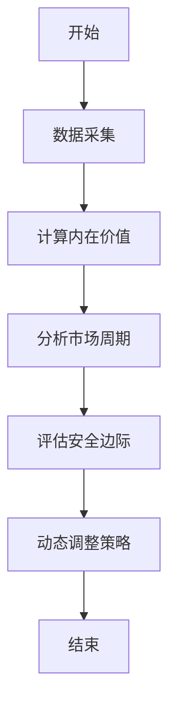
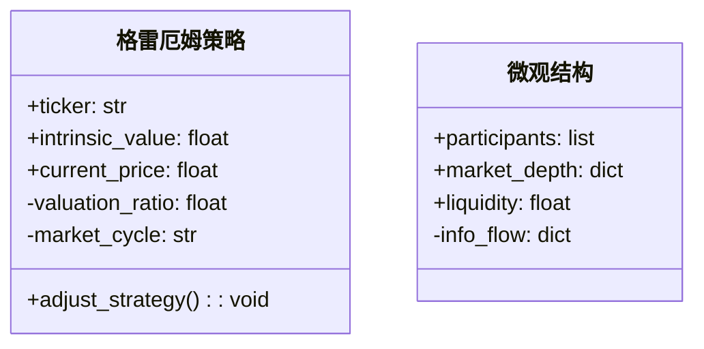
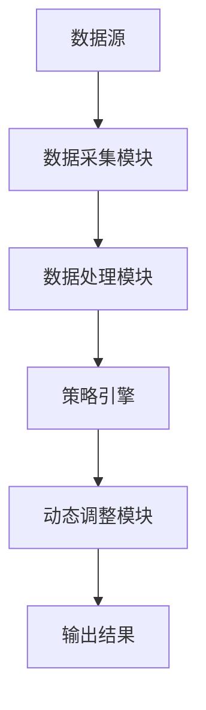

                 


# 格雷厄姆特价股票策略在不同数字市场微观结构周期中的动态调整

> **关键词**：格雷厄姆策略，数字市场，微观结构周期，动态调整，价值投资，算法交易

> **摘要**：本文探讨了格雷厄姆价值投资策略在数字市场中的应用，分析了市场微观结构周期对策略的影响，并提出了动态调整的方法。通过数学模型和算法设计，展示了如何在不同市场条件下优化投资决策。

---

## 第1章：背景介绍

### 1.1 价值投资与格雷厄姆策略概述

#### 1.1.1 价值投资的定义与特点
价值投资是一种以基本面分析为基础的投资策略，旨在通过识别市场价格与内在价值之间的差异来获利。其核心理念是购买低于内在价值的资产，长期持有，等待市场重新评估。

**特点**：
- 长期导向
- 依赖基本面分析
- 低风险、高回报潜力

#### 1.1.2 格雷厄姆的价值投资体系
本杰明·格雷厄姆是价值投资的鼻祖，提出了“安全边际”概念，即购买价格低于估算价值的一定比例，以降低风险。

**关键指标**：
- 市盈率（P/E）
- 市净率（P/B）
- 股息率

#### 1.1.3 格雷厄姆策略在现代投资中的应用
尽管格雷厄姆策略最初应用于传统股票市场，但其核心思想在数字市场中仍具有重要价值，尤其是在寻找被低估资产方面。

---

### 1.2 数字市场微观结构周期

#### 1.2.1 市场周期的定义与分类
市场周期是指市场在不同时间段内表现出的涨跌交替现象。数字市场由于其高频交易和算法驱动的特点，周期更短且波动更大。

**分类**：
- 趋势周期
- 波动周期
- 均衡周期

#### 1.2.2 数字市场的特点
- 高频交易：算法交易主导市场波动。
- 信息传播：新闻和社交媒体影响价格波动。
- 流动性：市场的流动性波动剧烈。

#### 1.2.3 微观结构周期对投资策略的影响
市场周期的变化会影响股票的内在价值和市场价格关系，因此需要动态调整投资策略。

---

### 1.3 动态调整策略的必要性

#### 1.3.1 市场变化对投资策略的影响
市场周期的变化可能导致原本有效的策略失效，因此需要动态调整。

#### 1.3.2 格雷厄姆策略在不同周期中的适用性
在不同的市场周期中，格雷厄姆策略的有效性不同，需要根据市场情况调整安全边际和估值指标。

#### 1.3.3 动态调整策略的核心目标
通过实时数据分析和模型调整，优化投资决策，降低风险，提高收益。

---

## 第2章：核心概念与联系

### 2.1 核心概念原理

| **概念**       | **定义**                                                                 |
|----------------|--------------------------------------------------------------------------|
| 内在价值       | 股票的真正价值，基于公司财务状况和市场地位。                           |
| 安全边际       | 购买价格低于内在价值的一定比例，以降低风险。                             |
| 市场周期       | 市场在不同时间段内表现出的涨跌交替现象。                                   |
| 微观结构       | 市场中的参与者、交易机制和信息流动等因素的总和。                          |

### 2.2 实体关系图

```mermaid
erDiagram
    actor 投资者
    actor 市场参与者
    actor 信息源
    class 市场周期
    class 微观结构
    class 格雷厄姆策略
    class 动态调整
    投资者 --> 市场周期
    投资者 --> 微观结构
    市场参与者 --> 微观结构
    信息源 --> 市场周期
    格雷厄姆策略 --> 微观结构
    格雷厄姆策略 --> 市场周期
    动态调整 --> 格雷厄姆策略
```

### 2.3 微观结构周期对格雷厄姆策略的影响


---

## 第3章：算法原理

### 3.1 动态调整算法框架



### 3.2 格雷厄姆策略的数学模型

股票的内在价值可以通过以下公式计算：

$$
\text{内在价值} = \frac{\text{预期收益}}{\text{折现率}}
$$

### 3.3 动态调整的Python实现

```python
def calculate_intrinsic_value(ticker):
    # 获取财务数据
    data = get_finance_data(ticker)
    # 计算预期收益
    expected_return = data['expected_return']
    # 计算折现率
    discount_rate = data['discount_rate']
    # 计算内在价值
    intrinsic_value = expected_return / discount_rate
    return intrinsic_value

# 示例应用
ticker = "AAPL"
iv = calculate_intrinsic_value(ticker)
print(f"{ticker}的内在价值为：{iv}")
```

---

## 第4章：系统分析与架构设计

### 4.1 领域模型



### 4.2 系统架构



---

## 第5章：项目实战

### 5.1 环境搭建

安装必要的库：
```bash
pip install pandas numpy matplotlib
```

### 5.2 核心代码实现

```python
import pandas as pd
import numpy as np

def get_market_data(ticker):
    # 获取股票数据
    data = pd.DataFrame({
        'price': [100, 98, 95, 105, 110],
        'volume': [1000, 2000, 1500, 800, 1200]
    })
    return data

def calculate_intrinsic_value(data):
    # 计算内在价值
    avg_return = data['price'].mean() * 0.05
    discount_rate = 0.1
    iv = avg_return / discount_rate
    return iv

# 示例
ticker = "AAPL"
data = get_market_data(ticker)
iv = calculate_intrinsic_value(data)
print(f"{ticker}的内在价值为：{iv}")
```

### 5.3 实际案例分析

案例：在波动周期中调整策略。

---

## 第6章：最佳实践与小结

### 6.1 最佳实践

- **定期评估**：持续监控市场周期和微观结构变化。
- **风险管理**：设置止损点，控制风险敞口。
- **数据质量**：确保数据源的准确性和及时性。

### 6.2 小结

本文详细探讨了格雷厄姆策略在数字市场中的应用，通过动态调整策略优化投资决策，帮助投资者在不同市场条件下实现稳健收益。

### 6.3 注意事项

- 算法交易需谨慎，避免过度依赖模型。
- 数据分析需结合市场实际情况，避免机械应用。

### 6.4 拓展阅读

- 格雷厄姆《 Intelligent Investor》
- 《算法交易：数学模型与实践》

---

通过以上步骤，我们可以看到，动态调整格雷厄姆策略在数字市场中的应用需要结合数学模型、算法设计和系统架构，帮助投资者在复杂多变的市场环境中做出明智决策。

