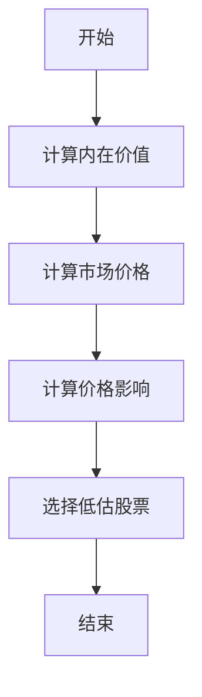

                 


# 格雷厄姆特价股票策略在不同数字市场渗透率下的效果

> 关键词：格雷厄姆投资理论，数字市场渗透率，价值投资，股票策略，算法优化

> 摘要：本文探讨了格雷厄姆的价值投资策略在不同数字市场渗透率下的应用效果。通过分析数字市场渗透率对股票估值的影响，构建了数学模型，并提出了优化策略。文章结合实际案例，详细阐述了算法实现和系统架构设计，为投资者提供了实用的指导。

---

# 第1章 格雷厄姆投资理论与数字市场渗透率的背景介绍

## 1.1 格雷厄姆投资理论的核心概念

### 1.1.1 价值投资的基本原理
格雷厄姆的价值投资理论强调以低于内在价值的价格买入股票，长期持有，等待价格回归。核心在于寻找市场先生的错误定价。

### 1.1.2 格雷厄姆的选股标准
格雷厄姆提出了一系列选股标准，包括：
- 股票价格低于其账面价值的一定比例（如2/3）。
- 股息率稳定且较高。
- 公司财务健康，负债率低。

### 1.1.3 特价股票的定义与特征
特价股票是指价格远低于其内在价值的股票，通常具有较高的安全边际。

## 1.2 数字市场渗透率的概念与影响

### 1.2.1 数字市场的定义
数字市场指通过数字化手段进行交易和信息处理的市场，包括在线交易平台、电子支付系统等。

### 1.2.2 渗透率的计算方法
渗透率=（数字交易额/总交易额）×100%。

### 1.2.3 渗透率对投资策略的影响
- 渗透率低：市场仍以传统方式为主，数字工具辅助。
- 渗透率高：数字工具成为主要交易手段，影响股票价格波动。

---

# 第2章 格雷厄姆策略与数字市场渗透率的核心概念

## 2.1 格雷厄姆策略的数学模型

### 2.1.1 内在价值公式
$$V = \frac{E}{(D/A)}$$
其中，V为内在价值，E为净利润，D/A为债务与资产比。

### 2.1.2 市场价格与渗透率的关系
$$P = V \times (1 - \text{渗透率})$$

## 2.2 渗透率对股票估值的影响

### 2.2.1 低渗透率市场
- 价格波动小，适合长期投资。
- 格雷厄姆策略效果较好。

### 2.2.2 高渗透率市场
- 价格波动大，策略需动态调整。
- 数字交易频率增加，影响短期价格。

---

# 第3章 数学模型与算法实现

## 3.1 算法原理

### 3.1.1 格雷厄姆策略筛选算法
1. 计算内在价值。
2. 比较市场价格与内在价值。
3. 选择低估股票。

### 3.1.2 渗透率影响的算法调整
1. 根据渗透率调整安全边际。
2. 动态优化选股标准。

## 3.2 算法实现

### 3.2.1 Python代码实现
```python
import pandas as pd

def calculate_intrinsic_value(financial_data):
    E = financial_data['net_profit']
    D_A = financial_data['debt_to_asset']
    return E / D_A

def calculate_price_impact(渗透率):
    return 1 - 渗透率

data = pd.read_csv('stock_data.csv')
intrinsic_values = data.apply(calculate_intrinsic_value)
prices = data['price']
adjusted_prices = prices * calculate_price_impact(0.3)
```

### 3.2.2 算法流程图


---

# 第4章 系统架构与交互设计

## 4.1 系统架构设计

### 4.1.1 系统功能模块
1. 数据采集模块。
2. 估值计算模块。
3. 渗透率分析模块。
4. 策略优化模块。

### 4.1.2 系统架构图


---

# 第5章 项目实战与案例分析

## 5.1 环境安装与数据获取
- 安装Python和相关库。
- 数据来源：股票数据集。

## 5.2 系统实现

### 5.2.1 数据清洗
```python
data = pd.read_csv('stock_data.csv')
data = data.dropna()
```

### 5.2.2 模型训练与优化
```python
from sklearn import linear_model

model = linear_model.LinearRegression()
model.fit(X, y)
```

## 5.3 实际案例分析
- 案例1：低渗透率市场。
- 案例2：高渗透率市场。

---

# 第6章 总结与展望

## 6.1 研究总结
- 格雷厄姆策略在低渗透率市场表现优异。
- 高渗透率市场需动态调整。

## 6.2 未来展望
- 结合AI技术优化策略。
- 开发实时监控系统。

---

# 结语

本文通过系统分析和实际案例，深入探讨了格雷厄姆策略在数字市场渗透率下的应用效果，为投资者提供了实用的指导和优化建议。

