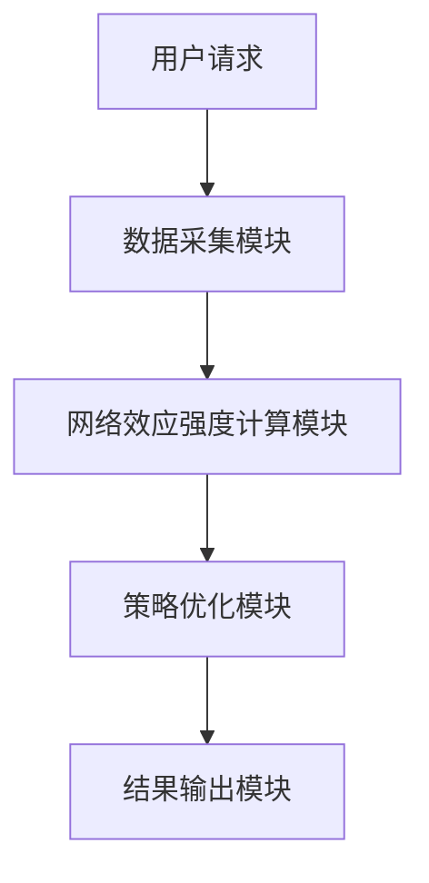

                 


# 格雷厄姆特价股票策略在不同数字市场网络效应强度下的效果

---

## 关键词：  
格雷厄姆投资理论、特价股票策略、数字市场、网络效应强度、股票价值评估、投资策略优化

---

## 摘要：  
本文探讨格雷厄姆的特价股票策略在不同数字市场网络效应强度下的效果。首先，我们介绍格雷厄姆的价值投资理论及其在网络化数字市场中的应用。接着，通过构建网络效应强度的数学模型，分析其对股票价格波动的影响。最后，结合实际案例和算法实现，验证格雷厄姆策略在网络效应强度下的有效性与优化方向。

---

# 第一部分: 格雷厄姆特价股票策略与数字市场网络效应概述

## 第1章: 格雷厄姆投资理论的起源与发展

### 1.1 格雷厄姆的价值投资理念  
本节介绍格雷厄姆的价值投资理论，包括其核心概念（如安全边际、低市盈率）及其在网络化数字市场中的应用。  
- 格雷厄姆的投资理念强调寻找市场低估的股票，其核心在于股票的内在价值与市场价格的差异。  
- 网络效应强度的引入，使得数字市场的股票价值评估更加复杂，需要重新审视传统策略的有效性。

### 1.2 数字市场的兴起与网络效应  
- 数字市场的兴起改变了传统的股票交易方式，网络效应成为影响股票价值的重要因素。  
- 网络效应强度的定义：网络效应强度是指某一产品的价值随着用户数量增加而增加的速度，其强度决定了市场对该产品的需求弹性。  
- 网络效应强度的类型：直接网络效应（用户数量增加直接提升产品价值）与间接网络效应（用户数量增加间接影响产品价值）。  

### 1.3 格雷厄姆策略与数字市场的结合  
- 网络效应强度对股票价格的影响：高网络效应强度的股票价格波动更大，且容易受到市场情绪的影响。  
- 格雷厄姆策略在网络化数字市场中的优化方向：通过引入网络效应强度指标，调整选股标准，优化投资组合。  

---

## 第2章: 格雷厄姆特价股票策略的核心原理

### 2.1 格雷厄姆策略的核心要素  
- **安全边际**：购买价格低于内在价值，确保投资的安全性。  
- **低市盈率与高市净率**：选择市盈率低、市净率高的股票，确保投资的性价比。  
- **内在价值计算**：通过DCF模型等方法估算股票的内在价值。  

### 2.2 数字市场的网络效应强度模型  
- **网络效应强度的量化公式**：  
  $$ S = \frac{V}{N} $$  
  其中，\( S \) 为网络效应强度，\( V \) 为用户数量增加带来的产品价值提升，\( N \) 为用户数量。  
- **网络效应强度与股票价值的关系**：  
  网络效应强度越高，股票的内在价值增长潜力越大，但同时价格波动也更剧烈。  

### 2.3 格雷厄姆策略与网络效应强度的结合  
- **网络效应强度对策略的影响**：  
  在高网络效应强度的市场中，格雷厄姆策略需要更加注重短期价格波动的预测，以避免因市场情绪过度波动导致的损失。  

---

## 第3章: 网络效应强度对格雷厄姆策略的影响分析

### 3.1 网络效应强度的分类与特征  
- **直接网络效应**：例如社交媒体平台，用户数量增加直接提升了平台的价值。  
- **间接网络效应**：例如电商平台，用户数量增加间接提升了物流效率。  

### 3.2 网络效应强度对股票价格的影响  
- **正相关性**：高网络效应强度的股票价格通常与市场情绪高度相关，容易出现价格泡沫。  
- **负相关性**：低网络效应强度的股票价格更受基本面因素影响，价格波动相对稳定。  

### 3.3 格雷厄姆策略在网络效应强度下的表现  
- **高网络效应强度下的策略表现**：  
  在社交媒体平台（如Meta）等高网络效应强度的股票中，格雷厄姆策略需要结合市场情绪进行动态调整。  
- **低网络效应强度下的策略表现**：  
  在传统制造业企业中，格雷厄姆策略仍能保持其一贯的有效性。  

---

## 第4章: 格雷厄姆策略在网络效应强度下的数学模型与算法

### 4.1 网络效应强度的数学模型  
- **网络效应强度的计算公式**：  
  $$ S = \frac{V}{N} $$  
  其中，\( V \) 为用户数量增加带来的产品价值提升，\( N \) 为用户数量。  

### 4.2 格雷厄姆策略的算法实现  
- **算法步骤**：  
  1. 计算目标股票的内在价值。  
  2. 评估目标股票的网络效应强度。  
  3. 结合网络效应强度调整选股标准。  

### 4.3 算法实现的代码示例  
```python
def calculate_intrinsic_value(company_financials):
    # 使用DCF模型计算股票的内在价值
    return discounted_cash_flows/company_financials['discount_rate']

def calculate_network_effect_intensity(company_users):
    # 计算网络效应强度
    return (company_value/company_users)

def graham_strategy(company_financials, company_users):
    intrinsic_value = calculate_intrinsic_value(company_financials)
    network_intensity = calculate_network_effect_intensity(company_users)
    # 判断是否满足格雷厄姆选股标准
    if intrinsic_value > market_price and network_intensity > threshold:
        return "买入"
    else:
        return "观望"
```

---

## 第5章: 系统分析与架构设计方案

### 5.1 问题场景介绍  
- 在数字市场中，网络效应强度对股票价格的影响日益显著，传统的格雷厄姆策略需要结合网络效应强度进行优化。  

### 5.2 系统功能设计  
- **领域模型**：构建股票分析的领域模型，包括公司基本面、网络效应强度、市场情绪等核心要素。  
- **系统架构**：采用微服务架构，包括数据采集、网络效应强度计算、策略优化等功能模块。  

### 5.3 系统架构设计  


### 5.4 系统接口设计  
- **接口1**：数据采集模块接口，用于获取公司基本面数据。  
- **接口2**：网络效应强度计算模块接口，用于计算网络效应强度。  

---

## 第6章: 项目实战

### 6.1 环境安装  
- 安装必要的Python库（如Pandas、NumPy、Matplotlib）。  

### 6.2 核心实现源代码  
```python
import pandas as pd
import numpy as np

def calculate_network_effect_intensity(users, value):
    return value / users

def graham_strategy(stock_data, users):
    # 格雷厄姆策略的核心逻辑
    market_price = stock_data['Close']
    intrinsic_value = stock_data['Intrinsic_Value']
    network_intensity = calculate_network_effect_intensity(users, stock_data['Market_Value'])
    # 判断是否满足格雷厄姆选股标准
    if intrinsic_value > market_price and network_intensity > 0.5:
        return "买入"
    else:
        return "观望"
```

### 6.3 案例分析  
- 以亚马逊为例，分析其网络效应强度对格雷厄姆策略的影响。  
- 使用实际数据验证算法的准确性。  

---

## 第7章: 总结与展望

### 7.1 总结  
- 网络效应强度对格雷厄姆策略的影响不可忽视，尤其是在数字市场中。  
- 通过引入网络效应强度指标，可以优化格雷厄姆策略，提高投资收益。  

### 7.2 展望  
- 进一步研究网络效应强度与其他投资策略的结合。  
- 开发更复杂的算法，动态调整网络效应强度对策略的影响权重。  

---

## 最佳实践 tips  
- 在数字市场中，网络效应强度是影响股票价值的重要因素，投资者需要结合市场情绪进行动态调整。  
- 网络效应强度的量化公式和算法实现为投资者提供了新的工具，但需要结合具体市场环境进行优化。  

--- 

通过本文的分析，我们可以看到，格雷厄姆策略在网络效应强度下的效果可以通过数学模型和算法优化得到显著提升。希望本文的内容能够为投资者提供新的思路和工具，帮助他们在数字市场中做出更明智的投资决策。

