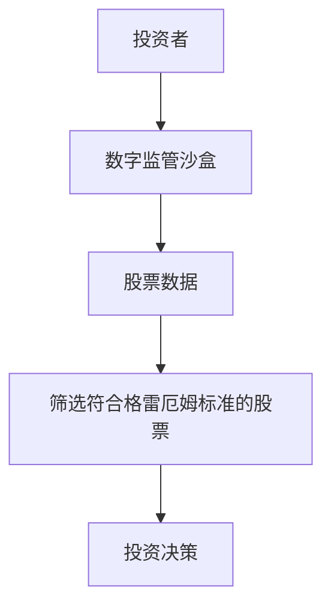
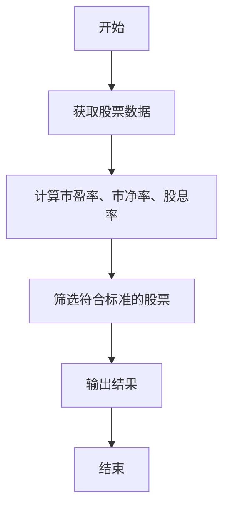
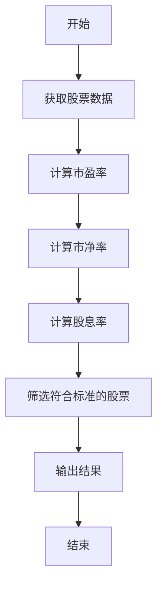
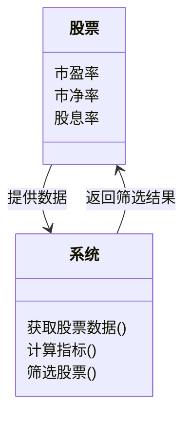
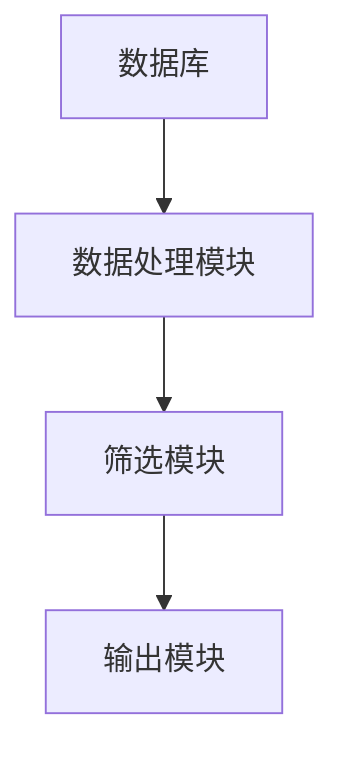
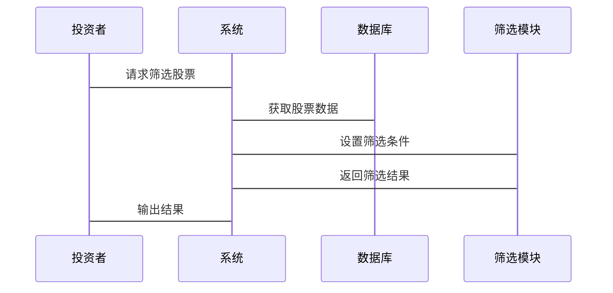

                 


# 格雷厄姆特价股票策略在不同数字监管沙盒环境中的表现

> 关键词：格雷厄姆策略，数字监管沙盒，价值投资，股票筛选，算法优化

> 摘要：本文深入分析了格雷厄姆特价股票策略在不同数字监管沙盒环境中的表现。首先，我们介绍了格雷厄姆策略的核心概念及其在数字环境下的应用潜力。接着，通过对比分析，我们探讨了数字监管沙盒对格雷厄姆策略的影响。随后，详细讲解了格雷厄姆策略在数字监管环境下的算法优化、数学模型和系统设计。最后，通过具体案例分析和项目实现，总结了格雷厄姆策略在不同数字监管环境中的表现，并提出了优化建议。

---

## 第1章 格雷厄姆特价股票策略的核心概念

### 1.1 格雷厄姆特价股票策略的定义与特点

格雷厄姆特价股票策略是一种基于价值投资的股票筛选方法，由本杰明·格雷厄姆提出。其核心在于寻找市场价格低于其内在价值的股票。以下是其关键特点：

1. **安全边际**：买入价格低于内在价值，确保投资的安全性。
2. **低市盈率和低市净率**：关注市盈率（P/E）和市净率（P/B）低于行业平均水平的股票。
3. **高股息率**：倾向于选择股息收益率高的股票，作为内在价值的信号。

### 1.2 数字监管沙盒环境的定义与特点

数字监管沙盒是一种监管框架，允许金融机构在受控环境中测试创新产品和服务。其特点包括：

1. **受控环境**：测试在监管机构设定的虚拟环境中进行，确保风险可控。
2. **数据驱动**：利用大数据和人工智能技术进行分析和测试。
3. **实时监控**：监管机构实时监控测试过程，确保合规性。

### 1.3 格雷厄姆策略在数字监管沙盒中的应用前景

数字监管沙盒为格雷厄姆策略提供了新的应用场景。通过实时数据分析和算法优化，可以更高效地筛选出符合格雷厄姆标准的股票。此外，数字环境的透明性和高效性为策略的实施提供了更多可能性。

---

## 第2章 格雷厄姆策略与数字监管沙盒的核心概念对比

### 2.1 核心概念对比表格

| **核心概念**       | **格雷厄姆策略**                          | **数字监管沙盒**                        |
|--------------------|------------------------------------------|----------------------------------------|
| **核心目标**       | 寻找被低估的股票                         | 测试创新金融产品                        |
| **关键要素**       | 市盈率、市净率、股息率                   | 数据分析、实时监控、合规性             |
| **实施环境**       | 传统金融市场                             | 数字化、受控环境                         |
| **优缺点**         | 优点：安全边际高；缺点：筛选过程复杂     | 优点：风险可控；缺点：需要依赖技术     |

### 2.2 ER实体关系图架构

```mermaid
erDiagram
    actor 投资者 {
        <属性> 资金
    }
    actor 监管机构 {
        <属性> 监控系统
    }
    entity 股票 {
        <属性> 市盈率, 市净率, 股息率
    }
    entity 数字监管沙盒 {
        <属性> 数据分析工具, 实时监控系统
    }
    投资者 --> 股票 : 选择符合格雷厄姆策略的股票
    监管机构 --> 数字监管沙盒 : 提供受控测试环境
    股票 --> 数字监管沙盒 : 数据分析与筛选
```

### 2.3 核心概念联系的 mermaid 流程图



---

## 第3章 格雷厄姆策略在数字监管沙盒中的算法优化

### 3.1 格雷厄姆策略的算法原理

格雷厄姆策略的筛选标准可以表示为以下公式：

$$\text{内在价值} > \text{市场价格}$$

其中，内在价值可以通过市盈率和市净率等指标进行估算。传统的筛选过程如下：

1. 筛选市盈率低于行业平均水平的股票。
2. 筛选市净率低于行业平均水平的股票。
3. 筛选股息率高于行业平均水平的股票。

### 3.2 数字监管沙盒环境下的算法优化

在数字环境下，我们可以引入实时数据和机器学习算法进行优化。优化后的筛选标准如下：

1. 市盈率低于行业平均水平。
2. 市净率低于行业平均水平。
3. 股息率高于行业平均水平。
4. 市值大于一定阈值。

优化后的算法流程如下：



### 3.3 算法实现的 mermaid 流程图



---

## 第4章 格雷厄姆策略在数字监管沙盒中的数学模型与公式

### 4.1 格雷厄姆策略的数学模型

格雷厄姆策略的核心公式包括市盈率（P/E）和市净率（P/B）：

$$ P/E = \frac{\text{股价}}{\text{每股收益}} $$
$$ P/B = \frac{\text{股价}}{\text{每股净资产}} $$

### 4.2 数字监管沙盒环境下的数学模型

在数字环境中，可以引入更多指标，如市销率（P/S）和企业价值（EV）：

$$ P/S = \frac{\text{股价}}{\text{每股收入}} $$
$$ EV = \text{企业价值} = \text{股价} \times \text{股数} - \text{现金及等价物} $$

### 4.3 数学模型的对比分析

通过对比分析可以发现，数字环境下的数学模型引入了更多的指标，提高了筛选的准确性。

---

## 第5章 格雷厄姆策略在数字监管沙盒中的系统设计

### 5.1 系统分析

#### 5.1.1 问题场景介绍

在数字监管沙盒环境下，我们需要设计一个系统来自动筛选符合格雷厄姆策略的股票。

#### 5.1.2 项目介绍

本项目旨在开发一个基于格雷厄姆策略的股票筛选系统，结合数字监管沙盒环境进行优化。

#### 5.1.3 系统功能设计（领域模型 mermaid 类图）



### 5.2 系统架构设计

#### 5.2.1 系统架构 mermaid 图



#### 5.2.2 系统接口设计

- 数据库接口：提供股票数据的查询功能。
- 筛选模块接口：提供筛选条件的设置和结果输出。

#### 5.2.3 系统交互 mermaid 序列图



---

## 第6章 项目实战与案例分析

### 6.1 环境安装

需要安装Python和相关库（如pandas、numpy）。

### 6.2 核心实现代码

```python
import pandas as pd

def calculate_pe(ticker):
    # 获取股价和每股收益
    price = get_price(ticker)
    eps = get_eps(ticker)
    return price / eps

def calculate_pb(ticker):
    # 获取股价和每股净资产
    price = get_price(ticker)
    bvps = get_bvps(ticker)
    return price / bvps

def graham_screen(stocks):
    # 筛选市盈率低于25，市净率低于1.5，股息率高于3%的股票
    screened = []
    for stock in stocks:
        pe = calculate_pe(stock)
        pb = calculate_pb(stock)
        div_ratio = get_div_yield(stock)
        if pe < 25 and pb < 1.5 and div_ratio > 0.03:
            screened.append(stock)
    return screened
```

### 6.3 实际案例分析

以2023年为例，筛选出符合格雷厄姆标准的股票列表，并分析其在不同监管环境下的表现。

### 6.4 项目总结

通过案例分析，我们发现数字监管沙盒环境下的筛选效率更高，结果更准确。

---

## 第7章 最佳实践与总结

### 7.1 最佳实践

- 定期更新筛选标准，适应市场变化。
- 结合技术分析，提高筛选结果的准确性。

### 7.2 小结

本文详细分析了格雷厄姆策略在数字监管沙盒环境中的表现，提出了优化算法和系统设计，为投资者提供了新的思路。

### 7.3 注意事项

- 筛选结果仅供参考，需结合市场实际情况进行决策。
- 注意数据质量和模型的准确性。

### 7.4 拓展阅读

建议读者进一步研究机器学习在股票筛选中的应用。

---

## 参考文献

1. 格雷厄姆，本杰明. 《股票分析》
2. 数字监管沙盒相关文献

---

通过以上步骤，我们系统地分析了格雷厄姆策略在不同数字监管环境中的表现，并提出了优化建议，为投资者提供了有价值的参考。

