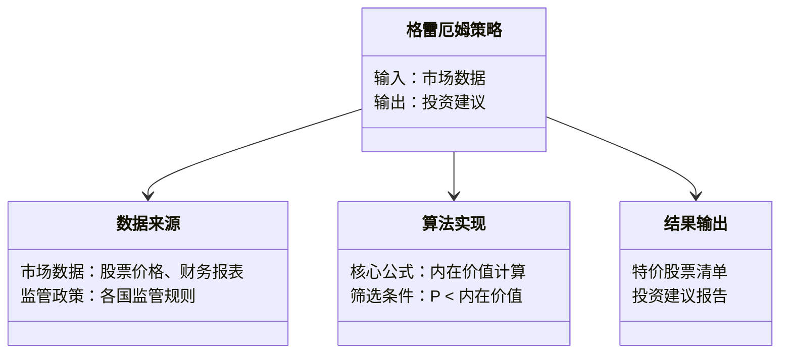
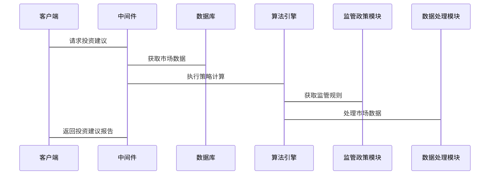

                 

# 《格雷厄姆特价股票策略在不同数字监管科技环境中的表现》

---

## 关键词：
- 格雷厄姆投资策略
- 特价股票
- 数字监管科技
- 股票投资
- 金融市场
- 机器学习
- 算法优化

---

## 摘要：
本文系统地探讨了格雷厄姆特价股票策略在全球不同数字监管科技环境中的表现。文章首先介绍了格雷厄姆投资理论的核心概念及其在数字时代的适用性，随后深入分析了数字监管科技对投资策略的影响。通过数学建模和算法优化，本文提出了改进的格雷厄姆策略，并结合具体案例分析了其在全球主要市场的表现差异。最后，文章总结了策略在不同监管环境下的优劣，并提出了优化建议和风险管理策略。

---

# 第一部分: 格雷厄姆特价股票策略概述

## 第1章: 格雷厄姆投资理论的背景与发展

### 1.1 格雷厄姆投资理论的核心思想
- 价值投资的基本原则
- 投资的长期性与安全性
- 避免情绪化投资的策略

### 1.2 格雷厄姆特价股票的定义
- 特价股票的特征
- 市场低估的原因
- 投资者如何识别特价股票

### 1.3 数字监管科技的兴起
- 数字化金融环境的形成
- 监管科技（RegTech）的概念
- 数字监管对金融市场的深远影响

---

## 第2章: 格雷厄姆策略与数字监管科技的结合

### 2.1 数字化监管环境对投资策略的影响
- 数据驱动的投资决策
- 监管政策对市场波动的调节作用
- 技术如何提升投资策略的执行效率

### 2.2 格雷厄姆策略在数字时代的挑战
- 传统策略与现代市场的冲突
- 数据量爆炸对策略筛选的影响
- 监管政策的动态变化对策略的有效性的影响

### 2.3 数字监管科技对格雷厄姆策略的支持
- 大数据分析技术的应用
- 人工智能在策略优化中的作用
- 区块链技术在交易透明化中的潜力

---

# 第二部分: 格雷厄姆策略的数学模型与算法原理

## 第3章: 格雷厄姆策略的核心公式与筛选算法

### 3.1 格雷厄姆策略的核心公式
- 灵魂公式：内在价值的计算
$$\text{内在价值} = \frac{\text{收益} \times (1 + \text{安全边际})}{\text{折现率}}$$
- 其他相关公式：市盈率、市净率等

### 3.2 格雷厄姆策略的筛选算法
- 股票筛选的步骤与流程
$$\text{筛选条件} = \{P < \text{内在价值},\, P/E < \text{行业平均},\, P/B < 1\}$$

### 3.3 算法的优化与改进
- 基于机器学习的优化方法
- 数字监管科技对算法优化的支持

---

## 第4章: 格雷厄姆策略的系统架构与实现

### 4.1 系统功能设计
- 问题场景介绍
- 领域模型（Mermaid 类图）

### 4.2 系统架构设计
- 系统架构（Mermaid 架构图）

### 4.3 系统接口设计
- 接口描述与交互流程（Mermaid 序列图）

---

# 第三部分: 格雷厄姆策略在不同数字监管环境中的表现

## 第5章: 美国数字监管环境下的策略表现

### 5.1 美国监管框架对策略的影响
- 美国监管政策的特点
- 美国市场的交易机制

### 5.2 美国市场中的策略应用案例
- 具体案例分析与解读
- 策略表现的量化评估

---

## 第6章: 欧洲数字监管环境下的策略表现

### 6.1 欧洲监管框架的特点
- 欧洲监管政策的严格性
- 欧洲市场的特点

### 6.2 欧洲市场中的策略应用案例
- 案例分析与解读
- 策略表现的比较分析

---

## 第7章: 亚洲数字监管环境下的策略表现

### 7.1 亚洲监管框架的特点
- 亚洲监管政策的多样性
- 亚洲市场的特点

### 7.2 亚洲市场中的策略应用案例
- 案例分析与解读
- 策略表现的比较分析

---

## 第8章: 不同监管环境下的策略表现比较与总结

### 8.1 不同监管环境下的策略差异
- 美国、欧洲、亚洲市场的对比分析

### 8.2 策略表现的优劣总结
- 适用性分析
- 优化建议

---

# 第四部分: 格雷厄姆策略的优化与风险管理

## 第9章: 基于机器学习的策略优化

### 9.1 机器学习在策略优化中的应用
- 数据挖掘技术的应用
- 机器学习算法的改进

### 9.2 优化后的策略表现
- 实验结果与分析

---

## 第10章: 风险管理与投资建议

### 10.1 风险管理策略
- 如何控制投资风险
- 监管环境变化的应对策略

### 10.2 投资建议
- 基于策略表现的最佳实践
- 长期投资的建议

---

## 第11章: 未来展望与研究方向

### 11.1 数字监管科技的未来发展趋势
- 监管科技的创新方向
- 数字化金融环境的未来变化

### 11.2 格雷厄姆策略的未来研究方向
- 结合新技术的策略优化
- 全球化视角下的策略应用

---

## 第12章: 结语

### 12.1 核心观点总结
- 格雷厄姆策略的核心价值
- 数字监管科技对策略的深远影响

### 12.2 致谢
- 感谢读者与支持者

---

## 参考文献
- 列出相关书籍、论文、数据来源等

---

## 附录
- 附录A：数学公式汇总
- 附录B：代码实现示例
- 附录C：监管政策对比表

---

通过以上目录，文章将系统地分析格雷厄姆特价股票策略在全球不同数字监管科技环境中的表现，结合理论与实践，为投资者提供有价值的参考与启示。

