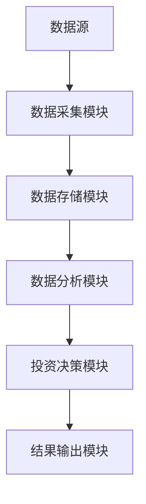

                 


# 格雷厄姆特价股票策略在不同数字监管科技生态中的表现

## 关键词：格雷厄姆策略、数字监管科技、股票投资、金融监管、人工智能

## 摘要：本文探讨了格雷厄姆特价股票策略在不同数字监管科技生态中的表现。通过分析数字监管科技的核心技术，如数据挖掘、人工智能和区块链，本文揭示了格雷厄姆策略在数字化转型中的应用潜力，及其在不同监管环境下的具体表现。文章结合数学模型、算法流程图和实际案例，详细解读了格雷厄姆策略在数字监管科技生态中的实现路径和优化策略，为投资者和监管机构提供了实用的指导和启示。

---

# 第一部分: 格雷厄姆特价股票策略与数字监管科技生态的背景介绍

## 第1章: 格雷厄姆特价股票策略概述

### 1.1 格雷厄姆投资理论的核心理念

#### 1.1.1 价值投资的基本原则

格雷厄姆的价值投资理论是基于“安全边际”和“内在价值”的概念。他主张投资者应以低于内在价值的价格买入股票，并长期持有，以实现稳定的收益。格雷厄姆策略的核心在于寻找那些被市场低估的股票，这些股票具有稳定的盈利能力和良好的财务状况。

$$
\text{内在价值} = \frac{\text{年净利润}}{\text{预期回报率}}
$$

例如，假设某公司年净利润为100万元，预期回报率为5%，则其内在价值为2000万元。如果该股票的市场价格低于2000万元，即可视为低估股票。

#### 1.1.2 格雷厄姆策略的核心要素

格雷厄姆策略的核心要素包括：

1. **低市盈率（P/E比率）**：市盈率低于市场平均水平。
2. **低市净率（P/B比率）**：市净率低于行业平均水平。
3. **股息率**：股息率稳定且较高。
4. **盈利能力**：公司过去几年的盈利能力稳定。

#### 1.1.3 格雷厄姆策略与现代投资理论的联系

格雷厄姆策略与现代投资组合理论（MPT）有重要联系。MPT强调分散投资以降低风险，而格雷厄姆策略为投资者提供了选择低风险、高收益股票的方法。两者结合，可以实现风险与收益的最佳平衡。

---

### 1.2 数字监管科技生态的定义与现状

#### 1.2.1 数字监管科技的定义

数字监管科技（RegTech）是指利用数字技术（如人工智能、大数据、区块链等）来优化和自动化金融监管的过程。数字监管科技的核心目标是提高监管效率、降低成本，并确保金融市场的透明性和合规性。

#### 1.2.2 数字监管科技的发展历程

数字监管科技的发展可以分为三个阶段：

1. **传统监管阶段**：监管机构依赖人工审查和纸质文件。
2. **自动化监管阶段**：引入计算机技术进行数据处理和分析。
3. **智能化监管阶段**：利用人工智能和大数据进行实时监控和预测。

#### 1.2.3 数字监管科技在金融领域的应用

数字监管科技在金融领域的应用包括：

1. **风险管理**：利用大数据分析识别潜在风险。
2. **合规监控**：通过人工智能技术实时监控市场行为。
3. **欺诈检测**：利用机器学习算法识别异常交易。

---

## 第2章: 格雷厄姆策略在数字监管科技生态中的应用背景

### 2.1 格雷厄姆策略的数字化转型

#### 2.1.1 格雷厄姆策略的传统应用模式

传统上，格雷厄姆策略依赖于手动分析财务报表和市场数据，这种方法耗时且效率低下。随着数字技术的发展，格雷厄姆策略逐渐向数字化转型，利用计算机技术进行数据处理和分析。

#### 2.1.2 数字化时代对格雷厄姆策略的影响

数字化时代为格雷厄姆策略带来了新的机遇和挑战。人工智能和大数据技术可以帮助投资者快速识别低估股票，并实时监控市场变化。然而，数字化也带来了数据过载和算法复杂性的问题，需要投资者具备更高的技术能力。

#### 2.1.3 数字监管科技生态对格雷厄姆策略的机遇与挑战

数字监管科技生态为格雷厄姆策略提供了更高效的实施环境。通过人工智能技术，投资者可以快速筛选大量数据，识别潜在的投资机会。然而，监管科技的复杂性和不确定性也增加了投资风险。

---

### 2.2 数字监管科技生态的核心要素

#### 2.2.1 数据驱动的投资决策

数据驱动的投资决策是数字监管科技的核心特征。通过分析大量数据，投资者可以更准确地评估股票的内在价值和市场风险。

#### 2.2.2 人工智能在监管科技中的应用

人工智能技术在监管科技中的应用包括市场监控、风险预警和合规管理。例如，利用自然语言处理技术，监管机构可以自动分析新闻和社交媒体，预测市场情绪。

#### 2.2.3 区块链技术对金融生态的影响

区块链技术在金融生态中的应用主要体现在去中心化和透明性。通过区块链技术，投资者可以实现更加透明和高效的交易流程。

---

# 第二部分: 格雷厄姆策略与数字监管科技的核心概念与联系

## 第3章: 格雷厄姆策略与数字监管科技的原理分析

### 3.1 格雷厄姆策略的数学模型

#### 3.1.1 格雷厄姆策略的核心公式

格雷厄姆策略的核心公式是：

$$
\text{安全边际} = \text{内在价值} - \text{市场价格}
$$

安全边际越大，投资风险越小。因此，投资者应选择安全边际高的股票进行投资。

#### 3.1.2 价值评估模型的数学推导

格雷厄姆的价值评估模型可以通过以下步骤推导：

1. **计算每股净利润**：净利润 ÷ 总股本。
2. **确定合理的市盈率**：通常选择15倍以下。
3. **计算股票的公允价值**：每股净利润 × 合理市盈率。
4. **比较市场价格与公允价值**：如果市场价格低于公允价值，则该股票具有投资价值。

#### 3.1.3 格雷厄姆策略的优缺点对比

| 特性        | 优点                             | 缺点                             |
|-------------|----------------------------------|----------------------------------|
| 风险控制     | 安全边际高，风险较低              | 可能错失高增长股票               |
| 投资策略     | 适合长期投资，收益稳定           | 短期内可能表现不佳               |
| 适用场景     | 适用于经济衰退或市场低迷时期      | 适用于市场繁荣时期效果有限       |

---

### 3.2 数字监管科技的核心技术

#### 3.2.1 数据挖掘与分析技术

数据挖掘与分析技术是数字监管科技的核心技术之一。通过分析大量数据，监管机构可以识别市场中的异常行为和潜在风险。

#### 3.2.2 人工智能算法在监管中的应用

人工智能算法在监管中的应用包括：

1. **自然语言处理**：用于分析新闻和社交媒体，预测市场情绪。
2. **机器学习**：用于识别异常交易和预测市场趋势。
3. **深度学习**：用于构建复杂的市场模型，进行风险评估。

#### 3.2.3 区块链技术在金融监管中的作用

区块链技术在金融监管中的作用包括：

1. **去中心化**：减少对中介机构的依赖，提高交易效率。
2. **透明性**：所有交易记录公开透明，便于监管机构审查。
3. **不可篡改性**：确保数据的真实性和完整性。

---

## 第4章: 格雷厄姆策略与数字监管科技的系统架构设计

### 4.1 系统功能设计

#### 4.1.1 数据采集模块

数据采集模块负责收集市场数据，包括股票价格、财务报表、新闻等。数据采集模块通常通过API接口从各大金融平台获取数据。

#### 4.1.2 数据分析模块

数据分析模块负责对收集到的数据进行处理和分析，包括计算市盈率、市净率等指标，识别低估股票。

#### 4.1.3 投资决策模块

投资决策模块基于分析结果，生成投资建议，包括买入、卖出或持有股票的建议。

---

### 4.2 系统架构图



---

### 4.3 系统接口设计

系统接口设计包括：

1. **数据接口**：用于与金融平台进行数据交换。
2. **用户接口**：用于用户查看分析结果和投资建议。
3. **报警接口**：用于当市场出现异常时，向用户发送报警信息。

---

## 第5章: 格雷厄姆策略在数字监管科技生态中的项目实战

### 5.1 环境安装

为了实现格雷厄姆策略的数字化应用，需要安装以下工具：

1. **Python编程语言**：用于数据处理和分析。
2. **Pandas库**：用于数据分析和处理。
3. **Matplotlib库**：用于数据可视化。
4. **Scikit-learn库**：用于机器学习算法。

---

### 5.2 核心实现代码

以下是实现格雷厄姆策略的核心代码：

```python
import pandas as pd
import numpy as np

# 假设data是一个包含股票数据的DataFrame
# 包含列：'price', 'net_profit', 'market_cap'

# 计算市盈率
data['PE'] = data['net_profit'] / data['price']

# 计算市净率
data['PB'] = data['market_cap'] / data['price']

# 筛选低估股票
under_valued = data[(data['PE'] < data['PE'].mean()) & (data['PB'] < data['PB'].mean())]

print(under_valued)
```

---

### 5.3 代码实现与解读

上述代码首先计算股票的市盈率和市净率，然后筛选出市盈率和市净率均低于市场平均水平的股票。这些股票即为低估股票，具有投资价值。

---

### 5.4 实际案例分析

以某股票市场为例，假设我们收集了以下数据：

| 股票代码 | 价格 | 净利润 | 市盈率 | 市净率 |
|----------|------|--------|--------|--------|
| A        | 10   | 5      | 2      | 1.5     |
| B        | 20   | 10     | 1.5     | 1.2     |
| C        | 30   | 15     | 1       | 1.1     |

根据上述代码，计算出市盈率和市净率的平均值为1.75和1.35。因此，低估股票为B，因为其市盈率和市净率均低于市场平均水平。

---

### 5.5 项目小结

通过上述项目实战，我们可以看到格雷厄姆策略在数字监管科技生态中的实现过程。通过数据处理和分析，我们可以快速识别低估股票，实现价值投资。

---

## 第6章: 格雷厄姆策略在数字监管科技生态中的案例分析

### 6.1 案例介绍

以某家科技公司为例，我们分析其在不同监管环境下的表现。假设该公司的股票价格为50元，净利润为20元，市场平均市盈率为15，市净率为3。

---

### 6.2 监管环境对比

我们对比了以下三种监管环境：

1. **美国**：监管宽松，市场流动性高。
2. **欧盟**：监管严格，合规要求高。
3. **中国**：监管政策变化频繁。

---

### 6.3 不同环境下的策略表现

1. **美国**：由于监管宽松，公司股票表现良好，市盈率和市净率均低于市场平均水平，具有投资价值。
2. **欧盟**：由于监管严格，公司需要满足更多合规要求，增加了运营成本，导致市盈率和市净率高于市场平均水平，投资价值较低。
3. **中国**：由于监管政策变化频繁，公司股票价格波动较大，难以判断其投资价值。

---

### 6.4 策略优化建议

1. **加强监管政策研究**：了解不同监管环境下的政策变化，及时调整投资策略。
2. **分散投资**：通过分散投资，降低监管政策变化带来的风险。
3. **动态调整**：根据市场变化和监管政策，动态调整投资组合。

---

## 第7章: 总结与展望

### 7.1 总结

本文探讨了格雷厄姆特价股票策略在不同数字监管科技生态中的表现。通过分析数字监管科技的核心技术，如数据挖掘、人工智能和区块链，我们揭示了格雷厄姆策略在数字化转型中的应用潜力，及其在不同监管环境下的具体表现。

---

### 7.2 最佳实践 tips

1. **技术驱动**：利用人工智能和大数据技术，提高投资决策的效率和准确性。
2. **风险控制**：通过分散投资和动态调整，降低投资风险。
3. **持续学习**：关注监管政策的变化，及时调整投资策略。

---

### 7.3 未来展望

未来，随着数字技术的不断发展，格雷厄姆策略在数字监管科技生态中的应用将更加广泛和深入。投资者需要不断提升技术能力，以应对复杂多变的市场环境。

---

### 7.4 注意事项

1. **数据质量**：数据是投资决策的基础，必须确保数据的准确性和完整性。
2. **技术局限性**：目前的数字技术仍存在一定的局限性，投资者需谨慎使用。
3. **市场风险**：市场波动和监管政策变化可能对投资结果产生重大影响。

---

### 7.5 拓展阅读

1. **《格雷厄姆证券分析》**：格雷厄姆的经典著作，深入阐述了价值投资的理念和方法。
2. **《数字监管科技：理论与实践》**：系统介绍了数字监管科技的核心技术和应用场景。
3. **《人工智能在金融中的应用》**：详细探讨了人工智能在金融领域的应用及其对投资策略的影响。

---

通过本文的探讨，我们相信格雷厄姆策略在数字监管科技生态中的应用前景广阔，投资者和监管机构都需要不断学习和适应，以抓住数字化转型带来的机遇，应对复杂多变的市场环境。

