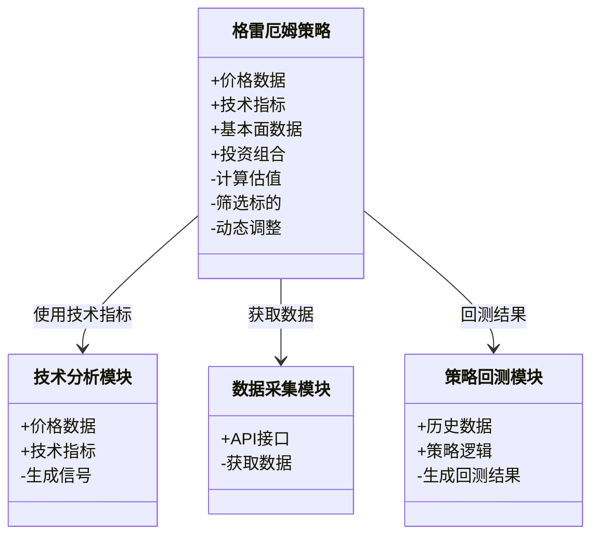
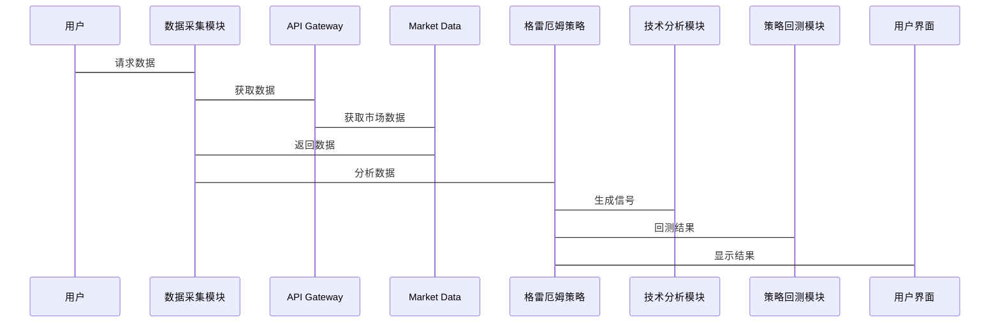

                 


# 格雷厄姆特价股票策略在不同数字货币竞争环境下的调整

## 关键词：格雷厄姆策略，数字货币，投资策略，价值投资，风险管理

## 摘要：本文探讨了如何将格雷厄姆的价值投资策略应用于数字货币市场，分析了数字货币市场的特点，并提出了相应的调整策略，包括技术分析、风险管理、动态调整等方面，旨在为投资者提供有效的指导。

---

# 第1章 格雷厄姆策略与数字货币市场的结合

## 1.1 格雷厄姆投资理论的核心理念

### 1.1.1 价值投资的基本原则
- 格雷厄姆的价值投资强调购买被低估的资产，注重安全边际。
- 通过分析企业的基本面，寻找具有长期稳定增长潜力的公司。

### 1.1.2 格雷厄姆的选股标准
- 低市盈率和市净率。
- 强调企业的财务健康状况，包括低债务、稳定的收益等。

### 1.1.3 格雷厄姆策略在传统股票中的应用
- 通过筛选低估值股票，构建稳健的投资组合。
- 长期持有，避免频繁交易。

## 1.2 数字货币市场的特点

### 1.2.1 数字货币市场的波动性分析
- 数字货币价格波动剧烈，受市场情绪和技术因素影响大。
- 24/7交易，市场参与者众多，信息传播速度快。

### 1.2.2 数字货币市场的参与者与交易机制
- 包括机构投资者、散户、矿工、开发者等。
- 交易机制透明，但市场操纵和虚假信息问题突出。

### 1.2.3 数字货币市场的风险与机遇
- 高波动性带来高风险，但也可能带来高回报。
- 技术创新和市场扩展带来潜在投资机会。

## 1.3 格雷厄姆策略在数字货币市场的适用性

### 1.3.1 格雷厄姆策略的核心要素与数字货币市场的匹配性
- 低市盈率和市净率的指标在数字货币市场中需要重新定义。
- 需要结合技术分析和市场情绪分析。

### 1.3.2 数字货币市场的特殊性对策略调整的影响
- 由于数字货币市场的高波动性，需要更频繁的调整和监控。
- 技术创新和市场变化快，需要动态调整投资组合。

### 1.3.3 格雷厄姆策略在数字货币市场中的潜在优势
- 通过低估值筛选，避免过度投机。
- 强调长期投资，减少短期波动的影响。

## 1.4 本章小结
本章介绍了格雷厄姆的价值投资理论，并分析了其在数字货币市场中的适用性。数字货币市场的高波动性和复杂性要求对传统策略进行调整，结合技术分析和风险管理，以实现稳健的投资收益。

---

# 第2章 格雷厄姆策略在数字货币市场中的调整方法

## 2.1 数字货币市场的估值方法

### 2.1.1 市盈率与市净率的适用性分析
- 市盈率和市净率在数字货币市场中可能不再适用，因为传统企业的盈利模式与数字货币项目不同。
- 需要引入新的估值指标，如交易量、市场资本化、团队背景等。

### 2.1.2 市值与流通量的对比
- 市值反映市场的整体价值，流通量影响市场的流动性。
- 需要综合考虑市值和流通量，避免仅看表面数据。

### 2.1.3 数字货币的内在价值评估模型
- 结合技术实现、团队背景、市场需求等因素，构建综合评估模型。
- 引入市场情绪指数，调整估值结果。

## 2.2 格雷厄姆策略的调整步骤

### 2.2.1 确定投资目标与风险承受能力
- 明确投资目标，如长期收益、短期套利等。
- 评估自身的风险承受能力，合理分配资产。

### 2.2.2 筛选具备投资价值的数字货币
- 利用技术分析工具筛选具有上升趋势的数字货币。
- 通过基本面分析，选择有潜力的项目。

### 2.2.3 构建投资组合并进行动态调整
- 根据市场变化和项目发展，定期调整投资组合。
- 保持分散投资，降低风险。

## 2.3 数字货币市场的风险控制策略

### 2.3.1 设置止损点与止盈点
- 根据技术分析和市场趋势，设定合理的止损和止盈点。
- 使用自动化交易系统严格执行纪律。

### 2.3.2 分散投资与资产配置
- 将资金分散投资于不同类型的数字货币，降低风险。
- 结合传统资产和数字货币，实现资产多元化。

### 2.3.3 定期评估投资组合的健康状况
- 每周或每月评估投资组合的表现，及时发现问题。
- 根据市场变化，调整投资策略。

## 2.4 本章小结
本章详细阐述了如何调整格雷厄姆策略以适应数字货币市场。通过引入新的估值方法、筛选优质项目、构建动态调整的投资组合，结合风险控制措施，投资者可以在高波动性市场中实现稳健收益。

---

# 第3章 数字货币市场的技术分析与量化策略

## 3.1 技术分析在数字货币交易中的应用

### 3.1.1 移动平均线（MA）的使用
- 短期MA（如5日、10日）用于判断短期趋势。
- 长期MA（如50日、200日）用于判断长期趋势。
- 通过MA交叉寻找买卖信号。

### 3.1.2 相对强弱指数（RSI）的解读
- RSI指标用于判断超买超卖状态。
- 当RSI低于30时，可能为买入信号；当RSI高于70时，可能为卖出信号。

### 3.1.3 布林带（Bollinger Bands）的应用
- Bollinger Bands用于判断价格波动性。
- 当价格接近布林带上轨时，可能为卖出信号；当价格接近布林带下轨时，可能为买入信号。

## 3.2 量化交易策略的构建

### 3.2.1 数据收集与清洗
- 使用API获取历史价格和交易量数据。
- 清洗数据，处理缺失值和异常值。

### 3.2.2 特征提取与选择
- 提取技术指标（如RSI、MACD）和市场情绪指标（如社交媒体 sentiment）。
- 使用主成分分析（PCA）降维，减少特征数量。

### 3.2.3 策略回测与优化
- 使用回测平台（如Backtrader）进行策略测试。
- 调整参数，优化策略表现。

## 3.3 格雷厄姆策略与技术分析的结合

### 3.3.1 结合基本面和技术分析筛选投资标的
- 首先通过基本面分析筛选出有潜力的项目。
- 结合技术分析确认入场点和离场点。

### 3.3.2 动态调整投资组合
- 根据技术分析信号，动态调整持仓比例。
- 结合市场情绪变化，优化投资组合。

## 3.4 本章小结
本章探讨了技术分析在数字货币交易中的应用，并提出了量化交易策略。通过结合基本面分析和技术分析，投资者可以更科学地进行投资决策，降低投资风险。

---

# 第4章 数字货币市场的系统分析与架构设计

## 4.1 系统功能设计

### 4.1.1 领域模型（Mermaid 类图）


### 4.1.2 系统架构设计（Mermaid 架构图）


### 4.1.3 系统接口设计
- 数据接口：通过API获取市场数据。
- 策略接口：调用策略模块进行信号生成。
- 用户接口：提供可视化界面，供用户查看策略结果。

### 4.1.4 系统交互设计（Mermaid 序列图）


## 4.2 本章小结
本章从系统架构的角度，设计了格雷厄姆策略在数字货币市场的实现方案。通过模块化设计和接口标准化，确保系统的可扩展性和可维护性。

---

# 第5章 项目实战：基于格雷厄姆策略的数字货币投资系统

## 5.1 环境安装与配置

### 5.1.1 安装Python和相关库
- 安装Python 3.x
- 安装Pandas、Matplotlib、Backtrader等库：
  ```bash
  pip install pandas matplotlib backtrader
  ```

### 5.1.2 数据源配置
- 使用CoinGecko API获取市场数据：
  ```python
  import requests
  response = requests.get("https://api.coingecko.com/api/v3/simple/price?vs_currency=usd&include_last Trade: true")
  ```

## 5.2 核心实现源代码

### 5.2.1 数据采集模块
```python
import pandas as pd
import requests

def get_data(crypto):
    url = f"https://api.coingecko.com/api/v3/simple/price/{crypto}?vs_currency=usd&include_last_trade=true"
    response = requests.get(url)
    data = response.json()
    return {
        'current_price': data['usd'],
        'last_trade': data['last_trade']
    }
```

### 5.2.2 技术分析模块
```python
from backtrader import Strategy

class RsiStrategy(Strategy):
    def __init__(self):
        self.rsi = self.I(rsi, self.data.close, period=14)
        self.buy_threshold = 30
        self.sell_threshold = 70

    def next(self):
        if self.rsi < self.buy_threshold:
            self.buy()
        elif self.rsi > self.sell_threshold:
            self.sell()
```

### 5.2.3 策略回测模块
```python
from backtrader import Broker, Exchange, Market

# 设置策略和数据
cerebro = Cerebro()
cerebro.addstrategy(RsiStrategy)
cerebro.broker = Broker()
cerebro.adddata(Feeds(['BTC/USD']))
```

## 5.3 代码应用解读与分析
- 数据采集模块通过API获取实时数据，提供给策略模块。
- 技术分析模块使用Backtrader框架，实现RSI指标的策略。
- 策略回测模块通过回测历史数据，验证策略的有效性。

## 5.4 实际案例分析
- 以比特币为例，回测过去一年的价格数据。
- 通过策略模块生成买卖信号，分析策略的收益和风险。

## 5.5 项目小结
本章通过实际项目展示了如何将格雷厄姆策略应用于数字货币市场。通过Python编写的核心代码，投资者可以实现自动化交易和策略优化。

---

# 第6章 格雷厄姆策略在数字货币市场的案例分析

## 6.1 案例背景介绍
- 选择一个具有代表性的数字货币项目，如比特币或以太坊。
- 分析项目的市场表现和潜在风险。

## 6.2 策略应用与结果分析
- 使用格雷厄姆策略筛选出具有投资价值的项目。
- 结合技术分析，制定买卖策略。
- 回测策略的收益和风险指标。

## 6.3 策略优化与调整
- 根据回测结果，优化策略参数。
- 结合市场变化，动态调整投资组合。

## 6.4 本章小结
通过实际案例分析，验证了格雷厄姆策略在数字货币市场中的有效性。同时，展示了策略调整的重要性，以应对市场的变化。

---

# 第7章 总结与展望

## 7.1 格雷厄姆策略在数字货币市场的优势
- 通过低估值筛选，减少投资风险。
- 结合技术分析，提高交易效率。

## 7.2 当前策略的局限性
- 数字货币市场的高波动性使策略调整频繁。
- 市场信息不透明，增加了策略实施的难度。

## 7.3 未来研究方向
- 进一步优化格雷厄姆策略，适应市场变化。
- 探索更多技术指标和模型，提高策略的准确性。

## 7.4 投资者建议
- 保持谨慎，逐步调整策略。
- 结合市场动态，灵活应对变化。

## 7.5 本章小结
本章总结了格雷厄姆策略在数字货币市场的应用，并展望了未来的研究方向。投资者应根据市场变化，灵活调整策略，以实现稳健收益。

---

# 结语

通过本文的详细分析，读者可以了解到如何将格雷厄姆的价值投资策略应用于数字货币市场，并通过系统的调整和优化，实现稳健的投资收益。希望本文能够为投资者提供有益的指导和启示。

--- 

> **注意事项**：
> - 本文提供的策略和代码仅为示例，实际投资需谨慎，建议结合市场变化和自身情况制定策略。
> - 本文中的技术分析和策略调整需根据实际情况进行优化，建议在专业人士指导下进行。

---

> **拓展阅读**：
> - 格雷厄姆的《 Intelligent Investor》
> - 《Python for Algorithmic Trading》
> - 加密货币市场分析工具（如CoinMarketCap, TradingView）

--- 

通过以上结构和内容，本文详细探讨了格雷厄姆策略在数字货币市场的应用，结合理论分析、系统设计和实际案例，为投资者提供了全面的指导。

