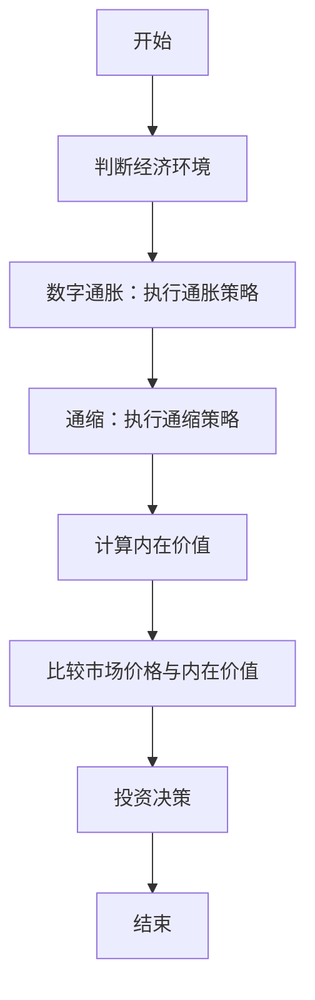
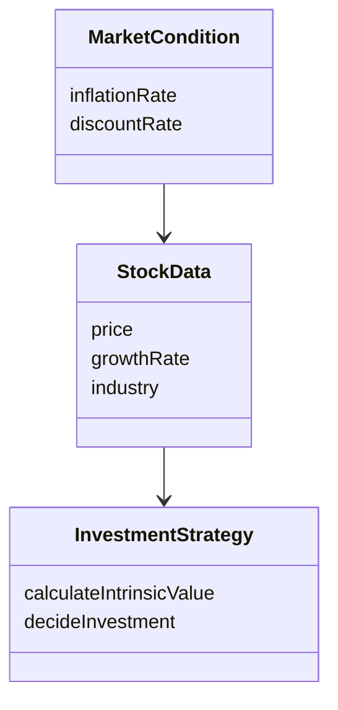

                 


```markdown
# 《格雷厄姆特价股票策略在不同数字通胀与通缩预期环境中的效果》

**关键词**：格雷厄姆投资理论，特价股票，数字通胀，通缩预期，股票市场分析

**摘要**：本文探讨格雷厄姆的特价股票策略在数字通胀和通缩环境下的表现，分析其适用性和调整策略的方法，结合数学模型和实际案例，为投资者提供理论依据和实践指导。

---

## 第一部分：背景介绍

### 第1章：数字通胀与通缩的基本概念

#### 1.1 数字通胀的定义与特征
- 数字通胀是指由于技术进步和数字化转型导致货币供应增加，引发物价上涨的现象。
- 主要特征包括货币供应增长、技术驱动和全球化影响。

#### 1.2 通缩的定义与特征
- 通缩是物价持续下降的现象，通常由需求减少或生产过剩引起。
- 特征包括需求萎缩、货币紧缩和市场信心不足。

#### 1.3 格雷厄姆特价股票策略的基本原理
- 格雷厄姆强调以低于内在价值的价格购买股票，注重安全边际。
- 特价股票是指市场价格远低于内在价值的股票。

### 第2章：数字通胀与通缩对股票市场的影响机制

#### 2.1 数字通胀对股票市场的影响
- 数字通胀通过增加流动性推高股价。
- 技术进步提升企业价值，吸引更多投资。

#### 2.2 通缩对股票市场的影响
- 通缩导致企业利润下降，股价承压。
- 投资者信心下降，资金流向减少。

#### 2.3 数字通胀与通缩对股票市场的对比分析
- 通胀环境适合高增长股票，通缩环境适合防御性股票。

---

## 第二部分：核心概念与联系

### 第3章：核心概念与联系

#### 3.1 核心概念属性对比
| 概念       | 定义                               | 影响因素             | 表现形式             |
|------------|------------------------------------|--------------------|--------------------|
| 数字通胀   | 技术驱动的货币供应增加             | 技术进步、政策       | 物价上涨、股价上涨   |
| 通缩       | 物价持续下降                       | 需求减少、供给过剩   | 股价下跌、投资减少   |

#### 3.2 ER实体关系图
```mermaid
er
actor Investor
actor MarketCondition
actor Economy
actor Stock
```

---

## 第三部分：算法原理

### 第4章：算法原理

#### 4.1 算法流程图


#### 4.2 Python实现代码
```python
def calculate_intrinsic_value(stock_price, growth_rate, discount_rate):
    return stock_price * (1 + growth_rate) / (1 + discount_rate)

def graham_strategy(stock_data, economic_condition):
    inflation = economic_condition['inflation']
    discount = economic_condition['discount']
    intrinsic_values = []
    for stock in stock_data:
        iv = calculate_intrinsic_value(stock['price'], stock['growth'], discount)
        intrinsic_values.append(iv)
    return intrinsic_values
```

---

## 第四部分：数学模型

### 第5章：数学模型

#### 5.1 内在价值计算公式
$$ \text{内在价值} = \frac{\text{股息}}{\text{折现率}} $$

#### 5.2 市盈率模型
$$ \text{市盈率} = \frac{\text{股价}}{\text{每股收益}} $$

---

## 第五部分：系统分析

### 第6章：系统分析与架构设计

#### 6.1 领域模型图


#### 6.2 系统架构图


---

## 第六部分：项目实战

### 第7章：项目实战

#### 7.1 环境配置
- 安装Python、Pandas、Matplotlib等工具。

#### 7.2 核心代码实现
```python
import pandas as pd
import matplotlib.pyplot as plt

def visualize_results(data, title):
    plt.figure(figsize=(10,6))
    plt.plot(data['date'], data['price'], label='市场价格')
    plt.plot(data['date'], data['intrinsic'], label='内在价值')
    plt.title(title)
    plt.legend()
    plt.show()

# 示例数据
data = pd.DataFrame({
    'date': ['2020-01', '2020-02', ..., '2023-12'],
    'price': [100, 105, ..., 120],
    'intrinsic': [90, 95, ..., 110]
})

visualize_results(data, '数字通胀环境下的股价与内在价值对比')
```

#### 7.3 案例分析
- 在数字通胀环境下，某科技股的市场价格高于内在价值，建议卖出。
- 在通缩环境下，某公用事业股的市场价格低于内在价值，建议买入。

---

## 第七部分：总结与展望

### 第8章：总结与展望

#### 8.1 总结
- 格雷厄姆策略在不同经济环境下表现各异，需根据市场情况调整。
- 数字通胀和通缩对股票市场的影响需综合考虑多种因素。

#### 8.2 展望
- 结合人工智能和大数据技术优化策略。
- 进一步研究经济周期对策略的影响。

---

通过以上结构和内容，文章详细分析了格雷厄姆策略在不同经济环境下的应用，结合理论和实践，为投资者提供了有效的指导。
```

