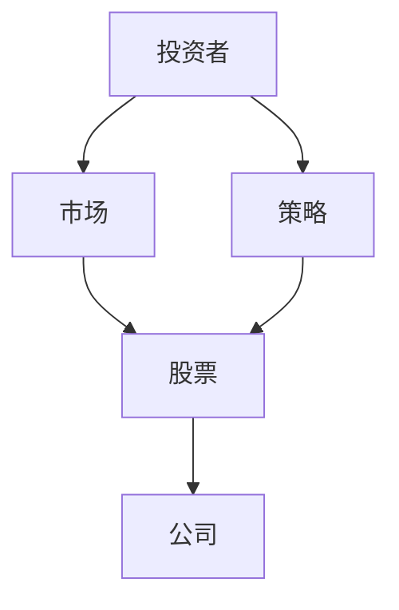
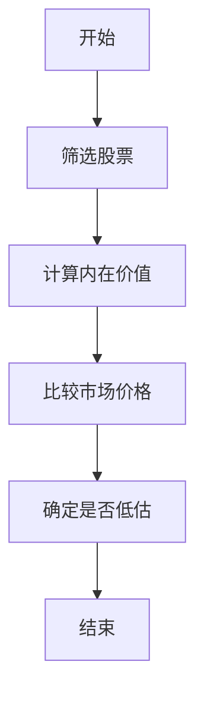
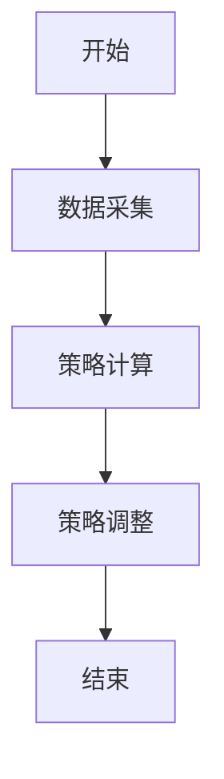
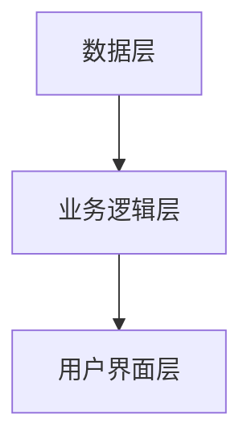
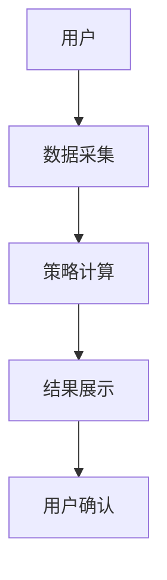

                 


# 格雷厄姆特价股票策略在不同文化背景市场中的适应

## 关键词：
- 格雷厄姆投资策略
- 价值投资
- 文化差异
- 市场适应性
- 股票筛选算法
- 内在价值评估

## 摘要：
本文探讨了格雷厄姆的价值投资策略在不同文化背景市场中的适应性。通过分析市场文化差异、投资者行为模式以及策略实施的具体环境，本文揭示了如何根据市场特点调整投资策略，以实现稳健收益。结合算法设计、系统架构和实际案例，本文为投资者提供了跨文化市场中的策略优化思路。

---

# 第一部分: 格雷厄姆特价股票策略概述

## 第1章: 价值投资与格雷厄姆策略核心概念

### 1.1 价值投资的定义与核心思想
#### 1.1.1 价值投资的起源与发展
价值投资由本杰明·格雷厄姆和戴维德·多德提出，强调以低于内在价值的价格购买股票。这一理念在20世纪30年代经济大萧条时期形成，经过数十年的发展，成为投资领域的重要流派。

#### 1.1.2 格雷厄姆投资理念的核心思想
格雷厄姆认为，市场波动反映的是“市场先生”的情绪，而非公司的实际价值。投资者应关注企业的内在价值，而非短期市场波动。

#### 1.1.3 格雷厄姆策略的基本原则
- **安全边际**：买入价格低于内在价值的股票，以降低风险。
- **长期视角**：投资基于公司的基本面，而非短期市场变化。
- **逆向思维**：在市场恐慌时寻找低估机会。

### 1.2 格雷厄姆特价股票策略的定义与特点
#### 1.2.1 特价股票的定义
特价股票是指市场价格低于其内在价值的股票。格雷厄姆认为，这类股票具有安全边际，是长期投资的理想选择。

#### 1.2.2 格雷厄姆策略的核心要素
- **内在价值计算**：通过分析公司财务数据，估算其真实价值。
- **安全边际**：买入价格与内在价值的差距越大，投资风险越小。

#### 1.2.3 策略的优缺点分析
- **优点**：风险较低，长期收益稳定。
- **缺点**：需要大量数据支持，且在市场波动中可能错失短期收益。

### 1.3 不同文化背景市场的特点
#### 1.3.1 不同市场的文化差异
不同市场的文化背景影响投资者的行为模式。例如，西方市场更注重短期收益，而新兴市场可能更关注公司增长潜力。

#### 1.3.2 各国股市的制度与规则
各国市场的制度差异显著，包括交易规则、监管政策等，这些都会影响投资策略的实施。

#### 1.3.3 市场参与者的行为模式
文化差异影响投资者决策。例如，集体决策在东方市场更常见，而西方市场更倾向于个体决策。

## 第2章: 格雷厄姆策略的核心概念与联系

### 2.1 格雷厄姆策略的核心原理
#### 2.1.1 安全边际的概念
安全边际是买入价格与内在价值的差额。格雷厄姆认为，安全边际越大，投资风险越小。

#### 2.1.2 内在价值的计算方法
内在价值是基于公司财务数据估算的公司真实价值。公式如下：
$$
\text{内在价值} = \frac{\text{每股收益}}{\text{资本成本}}
$$

#### 2.1.3 市场先生的理论
市场先生代表市场情绪，投资者应利用市场先生的恐慌或贪婪，寻找低估或高估的机会。

### 2.2 格雷厄姆策略与市场文化的关系
#### 2.2.1 不同市场中投资者行为的差异
不同市场的投资者行为受文化影响。例如，日本市场的投资者更注重企业声誉，而美国市场更关注财务指标。

#### 2.2.2 市场文化对策略适应性的影响
文化差异可能导致策略调整的必要性。例如，在新兴市场，可能需要更灵活的安全边际要求。

#### 2.2.3 策略在不同文化背景下的变体
在不同市场中，格雷厄姆策略可能需要调整。例如，在新兴市场，可能需要额外关注企业增长潜力。

### 2.3 格雷厄姆策略的实体关系图


## 第3章: 格雷厄姆策略的算法原理

### 3.1 格雷厄姆策略的筛选算法
#### 3.1.1 筛选标准
- **市盈率低于行业平均水平**。
- **市净率低于行业平均水平**。
- **股息率稳定且合理**。

#### 3.1.2 筛选流程
1. 计算股票的内在价值。
2. 比较市场价格与内在价值，确定安全边际。
3. 选择安全边际足够大的股票。

#### 3.1.3 算法优化
通过历史数据分析，优化筛选标准，提高策略的有效性。

### 3.2 算法流程图


### 3.3 格雷厄姆策略的Python实现
```python
def graham_strategy(stock):
    intrinsic_value = stock.intrinsic_value
    market_price = stock.market_price
    margin_of_safety = intrinsic_value - market_price
    if margin_of_safety > 0:
        return True
    else:
        return False
```

## 第4章: 格雷厄姆策略的数学模型

### 4.1 格雷厄姆策略的核心公式
$$
\text{内在价值} = \frac{\text{净利润}}{\text{资本成本}}
$$

### 4.2 不同市场的市盈率对比
$$
\text{市盈率} = \frac{\text{股价}}{\text{每股收益}}
$$

### 4.3 内在价值与市场价格的比较
$$
\text{安全边际} = \text{内在价值} - \text{市场价格}
$$

---

# 第二部分: 格雷厄姆策略在不同文化市场中的适应

## 第5章: 不同文化市场的特点与策略调整

### 5.1 美国市场
#### 5.1.1 美国市场的特点
- 市场成熟，监管严格。
- 投资者行为理性，注重长期价值。

#### 5.1.2 格雷厄姆策略的适应性
美国市场适合格雷厄姆策略，因为市场成熟，公司基本面数据可靠。

### 5.2 日本市场
#### 5.2.1 日本市场的特点
- 市场波动较大，投资者情绪化。
- 企业重视声誉和长期关系。

#### 5.2.2 格雷厄姆策略的调整
需要额外关注企业声誉和市场情绪，适当放宽安全边际要求。

### 5.3 新兴市场
#### 5.3.1 新兴市场的特点
- 市场波动剧烈，信息不透明。
- 企业增长潜力大，但风险也高。

#### 5.3.2 格雷厄姆策略的挑战
新兴市场的数据可靠性较低，可能需要更多调整。

## 第6章: 格雷厄姆策略的系统分析与架构设计

### 6.1 系统功能设计
#### 6.1.1 功能模块
- 数据采集模块：收集市场数据。
- 策略计算模块：计算内在价值和安全边际。
- 策略调整模块：根据市场特点调整策略参数。

#### 6.1.2 功能流程图


### 6.2 系统架构设计
#### 6.2.1 分层架构
- 数据层：存储市场数据。
- 业务逻辑层：实现策略计算。
- 用户界面层：展示结果。

#### 6.2.2 系统架构图


### 6.3 系统接口设计
- 数据接口：与数据源对接。
- 计算接口：实现策略计算。

### 6.4 系统交互流程图


## 第7章: 格雷厄姆策略的项目实战

### 7.1 项目环境安装
- 安装Python和相关库。
- 配置数据源。

### 7.2 系统核心实现
```python
import pandas as pd
import numpy as np

def calculate_intrinsic_value(financial_data):
    net_profit = financial_data['net_profit']
    cost_of_capital = financial_data['cost_of_capital']
    return net_profit / cost_of_capital
```

### 7.3 代码应用解读
- 数据采集：从数据库中获取股票数据。
- 策略计算：计算内在价值和安全边际。
- 结果展示：将结果以可视化形式展示。

### 7.4 实际案例分析
以美国和新兴市场为例，分析策略的实施效果。

### 7.5 项目总结
总结项目实施过程中的经验教训，提出改进建议。

---

# 第三部分: 格雷厄姆策略的优化与展望

## 第8章: 格雷厄姆策略的优化思路

### 8.1 策略优化方向
- 数据优化：提高数据的准确性和全面性。
- 参数调整：根据市场特点动态调整策略参数。

### 8.2 未来展望
随着技术进步，格雷厄姆策略可能与AI结合，实现更精准的投资决策。

---

# 第四部分: 总结与注意事项

## 第9章: 总结
格雷厄姆策略在不同文化市场中的适应性需要结合市场特点进行调整。通过系统设计和算法优化，可以提高策略的有效性。

## 第10章: 注意事项
- 风险提示：投资有风险，需谨慎操作。
- 数据质量：确保数据准确性和可靠性。
- 策略调整：根据市场变化及时调整策略参数。

---

通过以上结构，本文全面分析了格雷厄姆策略在不同文化市场中的适应性，为投资者提供了理论与实践相结合的指导。

