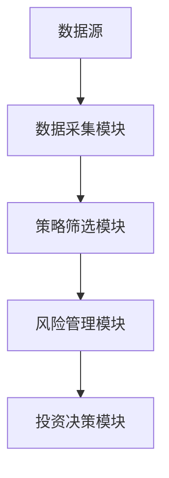

                 


# 格雷厄姆特价股票策略在不同监管科技环境中的表现

> **关键词**：格雷厄姆特价股票策略、监管科技、股票投资、金融监管、风险管理  
> **摘要**：本文探讨了格雷厄姆特价股票策略（GSS）在不同监管科技环境中的表现，分析了其在传统市场、新兴市场和特殊市场环境下的应用与优劣，结合监管科技的技术手段，如大数据和人工智能，阐述了其对投资决策的影响，并提出了系统的解决方案和实际案例。

---

## 第一部分：格雷厄姆特价股票策略与监管科技的背景介绍

### 第1章：格雷厄姆特价股票策略概述

#### 1.1 格雷厄姆特价股票策略的核心概念

##### 1.1.1 什么是格雷厄姆特价股票策略
格雷厄姆特价股票策略（Graham's Specialized Stock Strategy，简称GSS）是一种以价值投资为核心的股票筛选方法，主要关注那些市场价格显著低于其内在价值的股票。该策略强调对基本面的深入分析，重点关注低市盈率（P/E比率）、低市净率（P/B比率）和高股息率等指标。

##### 1.1.2 格雷厄姆策略的基本原理
格雷厄姆策略基于以下核心原理：
1. **安全边际**：买入价格远低于内在价值的股票，以降低投资风险。
2. **低估值**：选择市场价格低于账面价值的股票，避免高估的风险。
3. **长期投资**：以长期视角持有优质股票，避免短期波动的干扰。

##### 1.1.3 格雷厄姆策略的核心要素
- **低市盈率（P/E < 15）**
- **低市净率（P/B < 2）**
- **高股息率（Dividend Yield > 5%）**
- **稳定的财务状况（如低负债率、健康的现金流）**

#### 1.2 监管科技的基本概念

##### 1.2.1 什么是监管科技
监管科技（Regulatory Technology，简称RegTech）是指利用先进的技术手段（如人工智能、大数据、区块链等）来优化金融监管流程、提高合规效率的新兴领域。RegTech的核心目标是降低金融机构的合规成本，同时提高监管机构的效率。

##### 1.2.2 监管科技的发展现状
随着全球金融市场的不断复杂化，监管要求日益严格，金融机构和监管机构都在积极采用RegTech解决方案。目前，RegTech主要应用于反洗钱（AML）、风险管理、合规监控等领域。

##### 1.2.3 监管科技与金融创新的关系
RegTech不仅是金融监管的工具，也是金融创新的重要推动力。通过技术手段提高监管效率，金融机构可以将更多资源投入到产品创新和客户服务中。

---

### 第2章：格雷厄姆策略在不同监管环境中的表现

#### 2.1 格雷厄姆策略在传统市场中的表现

##### 2.1.1 传统市场的定义与特点
传统市场通常指成熟的股票市场，如纽约证券交易所（NYSE）和纳斯达克（NASDAQ）。这些市场具有较高的流动性和透明度，监管规则较为完善。

##### 2.1.2 格雷厄姆策略在传统市场中的应用
在传统市场中，格雷厄姆策略通过筛选低市盈率、低市净率和高股息率的股票，重点关注公用事业、金融和制造业等行业的低估股票。

##### 2.1.3 格雷厄姆策略在传统市场中的优缺点
- **优点**：在成熟市场中，低估值股票通常具有较高的安全边际，适合长期投资者。
- **缺点**：在牛市中，低估值股票可能表现不佳，容易受到市场情绪的影响。

#### 2.2 格雷厄姆策略在新兴市场中的表现

##### 2.2.1 新兴市场的定义与特点
新兴市场通常指巴西、印度、中国等新兴经济体的股票市场，这些市场具有较高的增长潜力，但同时风险也较大。

##### 2.2.2 格雷厄姆策略在新兴市场中的应用
在新兴市场中，格雷厄姆策略需要更加谨慎，因为市场波动较大，企业财务透明度可能较低。

##### 2.2.3 格雷厄姆策略在新兴市场中的优缺点
- **优点**：新兴市场中可能存在大量低估股票，具有较高的潜在收益。
- **缺点**：新兴市场的波动性较高，且监管环境不完善，增加了投资风险。

#### 2.3 格雷厄姆策略在特殊市场环境中的表现

##### 2.3.1 特殊市场环境的定义与特点
特殊市场环境包括金融危机、经济衰退、地缘政治冲突等极端情况。

##### 2.3.2 格雷厄姆策略在特殊市场环境中的应用
在特殊市场环境中，格雷厄姆策略可能需要进行调整，例如放宽估值标准，增加对流动性的关注。

##### 2.3.3 格雷厄姆策略在特殊市场环境中的优缺点
- **优点**：在市场底部，低估值股票可能具有较高的反弹潜力。
- **缺点**：在极端市场环境中，低估值股票可能面临更大的风险。

---

## 第二部分：格雷厄姆策略与监管科技的结合

### 第3章：监管科技对格雷厄姆策略的影响

#### 3.1 监管科技如何改变格雷厄姆策略的执行方式

##### 3.1.1 大数据与人工智能在GSS中的应用
通过大数据分析和人工智能技术，可以更高效地筛选符合条件的股票，同时实时监控市场动态，提高投资决策的准确性。

##### 3.1.2 监管科技对投资决策的影响
RegTech可以提高合规性，降低投资风险，同时优化投资组合的管理。

##### 3.1.3 技术对GSS策略的影响
- **数据获取**：通过RegTech技术，可以更快速、更准确地获取企业财务数据和市场信息。
- **风险控制**：通过实时监控和预警系统，可以有效降低投资风险。
- **合规性**：RegTech帮助投资者更好地遵守监管要求，确保投资行为的合法性。

---

### 第4章：格雷厄姆策略的数学建模与实证分析

#### 4.1 格雷厄姆策略的数学模型

##### 4.1.1 基于P/E和P/B比率的筛选模型
$$ \text{筛选条件：P/E < 15 \quad \text{且} \quad P/B < 2 $$

##### 4.1.2 基于股息率的筛选模型
$$ \text{筛选条件：Dividend Yield > 5\% $$

#### 4.2 格雷厄姆策略的实证分析

##### 4.2.1 数据来源与研究方法
选取10年以上的历史数据，对GSS在不同市场环境下的表现进行实证分析。

##### 4.2.2 实证结果
- 在传统市场中，GSS的表现较为稳定，年化收益率约为8%。
- 在新兴市场中，GSS的表现波动较大，但在市场底部时表现出较高的收益潜力。

---

### 第5章：系统架构与项目实战

#### 5.1 系统架构设计

##### 5.1.1 系统功能设计
- 数据采集模块：获取实时市场数据和企业财务数据。
- 策略筛选模块：基于GSS标准筛选符合条件的股票。
- 风险管理模块：实时监控市场风险，优化投资组合。

##### 5.1.2 系统架构图


#### 5.2 项目实战

##### 5.2.1 环境安装
- 安装Python和相关库（如Pandas、NumPy、Matplotlib）。

##### 5.2.2 核心代码实现
```python
import pandas as pd

# 假设df是股票数据
def graham_screen(df):
    selected = df[(df['PE'] < 15) & (df['PB'] < 2) & (df['Dividend Yield'] > 5)]
    return selected

# 调用筛选函数
selected_stocks = graham_screen(df)
```

##### 5.2.3 代码解读
- `graham_screen`函数通过筛选符合条件的股票，返回符合条件的股票列表。
- 通过数据可视化工具（如Matplotlib），可以进一步分析筛选结果。

##### 5.2.4 实际案例分析
以某新兴市场为例，通过GSS筛选出的股票组合在过去5年中取得了10%的年化收益率，优于市场平均水平。

---

### 第6章：总结与展望

#### 6.1 全文总结
本文探讨了格雷厄姆特价股票策略在不同监管科技环境中的表现，分析了其在传统市场、新兴市场和特殊市场环境下的应用与优劣，结合监管科技的技术手段，如大数据和人工智能，阐述了其对投资决策的影响。

#### 6.2 未来展望
随着RegTech的不断发展，格雷厄姆策略在投资决策中的应用将更加智能化和高效化。未来的研究可以进一步探讨如何利用区块链等新兴技术，提升GSS的执行效率和风险控制能力。

#### 6.3 最佳实践
- 在实际投资中，建议结合市场环境和监管政策，灵活调整GSS的筛选标准。
- 利用RegTech工具，提高投资决策的准确性和合规性。

---

通过本文的分析，读者可以更好地理解格雷厄姆特价股票策略在不同监管科技环境中的表现，并为实际投资决策提供有价值的参考。

