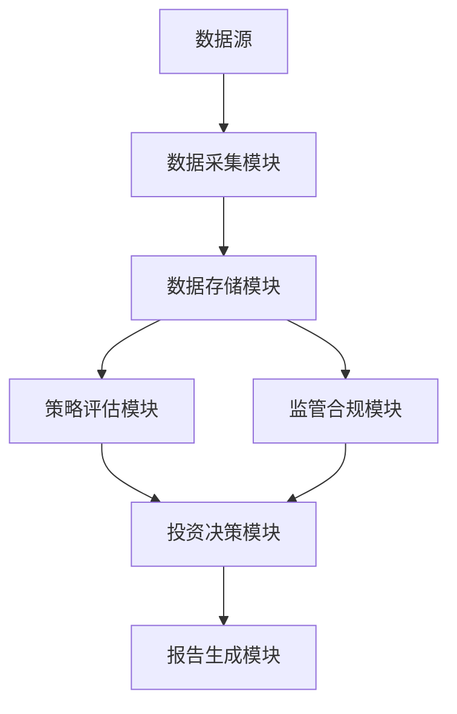
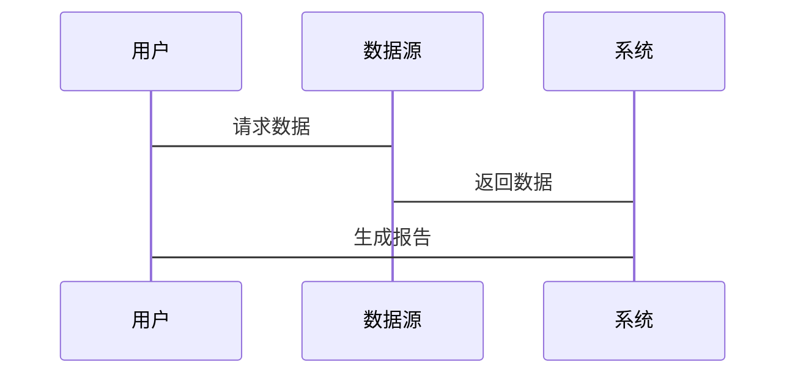

                 


# 格雷厄姆特价股票策略在不同监管科技环境中的表现

> 关键词：格雷厄姆策略、监管科技、股票投资、风险管理、金融科技

> 摘要：本文系统分析了格雷厄姆特价股票策略在不同监管科技环境中的表现，探讨了传统监管环境、数字化监管环境和智能监管环境对策略的影响。通过结合监管科技的核心技术，分析了策略的优缺点、优化方向和实际应用案例，提出了在不同监管环境下优化投资策略的具体方法。

---

## 第1章: 格雷厄姆特价股票策略概述

### 1.1 格雷厄姆投资理论的核心思想

#### 1.1.1 价值投资的定义与核心原则
格雷厄姆的价值投资理论强调以低于内在价值的价格购买优质资产。其核心原则包括:
$$
\text{内在价值} = \text{未来现金流的现值}
$$
这种方法通过安全边际（$ \text{内在价值} - \text{市场价格} $）来降低投资风险。

#### 1.1.2 特价股票的定义与识别标准
特价股票是指市场价格显著低于内在价值的股票。识别标准包括:
- 低市盈率（$ P/E < 15 $）
- 高股息率（$ \text{股息率} > 5\% $）
- 低市净率（$ P/B < 2 $）

#### 1.1.3 格雷厄姆策略在现代投资中的应用
格雷厄姆策略常用于防御性投资，尤其在市场低迷时期表现优异。然而，其在现代金融市场的适应性需要结合监管科技进行优化。

### 1.2 格雷厄姆策略的关键要素

#### 1.2.1 股票内在价值的计算方法
内在价值计算公式：
$$
\text{内在价值} = \sum_{t=1}^{n} \frac{CF_t}{(1 + r)^t}
$$
其中，$CF_t$ 是第 $t$ 年的自由现金流，$r$ 是折现率。

#### 1.2.2 股市波动与安全边际的概念
安全边际公式：
$$
\text{安全边际} = \text{内在价值} - \text{市场价格}
$$
安全边际越大，投资风险越小。

#### 1.2.3 稳健投资策略的实施步骤
1. 确定投资目标和风险承受能力。
2. 选择具有竞争优势的公司。
3. 以低于内在价值的价格买入并长期持有。

### 1.3 格雷厄姆策略的优缺点分析

#### 1.3.1 优点: 长期稳定收益与风险控制
- 通过安全边际降低市场波动风险。
- 稳定的复利增长。

#### 1.3.2 缺点: 短期波动风险与市场适应性
- 短期内可能跑输市场。
- 依赖于对内在价值的准确评估。

#### 1.3.3 现代市场环境对格雷厄姆策略的影响
- 信息透明度提高，内在价值评估更准确。
- 市场波动加剧，安全边际要求更高。

---

## 第2章: 监管科技环境的定义与发展

### 2.1 监管科技的基本概念

#### 2.1.1 RegTech的定义与范围
RegTech（监管科技）是利用技术手段优化金融监管的新兴领域，涵盖合规、反洗钱、风险管理等多个方面。

#### 2.1.2 监管科技的发展历程
1. 传统监管阶段：基于规则的手动监管。
2. 数字化监管阶段：引入大数据和AI技术。
3. 智能监管阶段：实现自动化和智能化监管。

#### 2.1.3 监管科技在金融领域的应用
- 提高监管效率。
- 降低合规成本。
- 优化风险控制。

### 2.2 监管科技的核心技术

#### 2.2.1 人工智能与大数据分析
- 使用AI进行风险预测。
- 通过大数据分析识别异常交易。

#### 2.2.2 区块链技术在监管中的应用
- 提供透明的交易记录。
- 实现去中心化监管。

#### 2.2.3 自动化合规工具的发展
- 自动化报告生成。
- 实时监控合规状态。

### 2.3 监管科技对金融行业的影响

#### 2.3.1 提高监管效率与透明度
- 减少人为干预，提高监管效率。
- 提供实时数据监控，增强透明度。

#### 2.3.2 降低合规成本与风险
- 通过自动化工具减少合规成本。
- 提高风险识别能力，降低合规风险。

#### 2.3.3 推动金融机构数字化转型
- 促进金融机构采用新技术。
- 提高金融服务效率。

---

## 第3章: 格雷厄姆策略与监管科技环境的关系

### 3.1 格雷厄姆策略在不同监管环境下的表现

#### 3.1.1 传统监管环境下的策略表现
- 稳定性高，风险可控。
- 但在市场波动剧烈时，可能错失短期收益。

#### 3.1.2 数字化监管环境下的策略调整
- 利用大数据分析优化内在价值评估。
- 通过AI预测市场波动，动态调整安全边际。

#### 3.1.3 智能监管环境下的策略优化
- 实现智能化风险控制。
- 通过区块链技术提高交易透明度。

### 3.2 监管科技对格雷厄姆策略的影响

#### 3.2.1 数据分析技术对策略实施的支持
- 提供更准确的市场数据。
- 优化内在价值计算模型。

#### 3.2.2 人工智能对策略优化的推动
- 利用AI预测市场趋势。
- 动态调整投资组合。

#### 3.2.3 区块链技术对策略安全性的提升
- 提供透明的交易记录。
- 防止数据篡改，提高数据安全性。

### 3.3 不同监管环境下策略的适应性分析

#### 3.3.1 传统监管环境下的策略实施
- 依赖人工分析，效率较低。
- 但风险可控，适合稳健投资者。

#### 3.3.2 数字化监管环境下的策略调整
- 利用技术手段提高分析效率。
- 需要更高的技术投入。

#### 3.3.3 智能监管环境下的策略创新
- 实现自动化投资决策。
- 提高投资效率和收益。

---

## 第4章: 传统监管环境下的格雷厄姆策略表现

### 4.1 传统监管环境的特点

#### 4.1.1 监管规则的稳定性和确定性
- 规则明确，易于遵循。
- 但可能缺乏灵活性。

#### 4.1.2 市场参与者的合规压力
- 高合规成本。
- 限制了策略的灵活性。

#### 4.1.3 监管机构的执法力度
- 监管严格，但效率较低。
- 增加了市场不确定性。

### 4.2 格雷厄姆策略在传统环境下的实施

#### 4.2.1 策略实施的可行性分析
- 稳定性高，风险可控。
- 但需要较高的市场研究能力。

#### 4.2.2 策略表现的历史案例研究
- 2008年金融危机前的案例。
- 通过安全边际避免重大损失。

#### 4.2.3 策略的风险与挑战
- 短期内可能跑输市场。
- 需要长期的市场研究和数据支持。

### 4.3 传统环境对策略表现的影响

#### 4.3.1 市场波动对策略的影响
- 大幅波动时，安全边际提供保护。
- 但可能错失反弹收益。

#### 4.3.2 监管政策变化对策略的影响
- 政策稳定时表现优异。
- 政策变化时可能需要调整。

#### 4.3.3 市场参与者的策略调
- 竞争加剧，策略优势减弱。
- 需要不断优化策略适应市场变化。

---

## 第5章: 数字化监管环境下的格雷厄姆策略优化

### 5.1 数字化监管环境的特点

#### 5.1.1 数据驱动的监管模式
- 利用大数据进行实时监控。
- 提高监管效率和准确性。

#### 5.1.2 人工智能技术的应用
- 通过AI预测市场趋势。
- 优化内在价值计算模型。

#### 5.1.3 监管机构与金融机构的协作
- 提高信息共享效率。
- 促进策略优化。

### 5.2 格雷厄姆策略在数字化环境下的优化方向

#### 5.2.1 数据分析技术的应用
- 利用大数据优化内在价值评估。
- 通过AI预测市场波动，动态调整策略。

#### 5.2.2 算法优化与策略调整
- 利用机器学习优化投资组合。
- 通过算法交易提高交易效率。

#### 5.2.3 技术与策略的结合
- 实现智能化投资决策。
- 提高策略的灵活性和适应性。

### 5.3 数字化环境对策略表现的提升

#### 5.3.1 提高投资效率
- 通过技术手段减少人工干预。
- 提高数据分析效率。

#### 5.3.2 降低投资风险
- 利用AI预测风险，提前规避。
- 通过大数据分析优化安全边际。

#### 5.3.3 提高投资收益
- 实现精准投资，提高收益。
- 通过技术手段捕捉市场机会。

---

## 第6章: 智能监管环境下的格雷厄姆策略创新

### 6.1 智能监管环境的特点

#### 6.1.1 自动化与智能化监管
- 通过自动化工具实现监管。
- 利用AI技术提高监管效率。

#### 6.1.2 区块链技术的应用
- 提供透明的交易记录。
- 防止数据篡改，提高数据安全性。

#### 6.1.3 监管科技的未来发展
- 技术与监管的深度融合。
- 提高监管效率和透明度。

### 6.2 格雷厄姆策略在智能环境下的创新方向

#### 6.2.1 智能化投资决策
- 利用AI技术实现自动化投资。
- 提高投资决策的准确性和效率。

#### 6.2.2 区块链技术的应用
- 提供透明的交易记录。
- 通过智能合约实现自动化的合规管理。

#### 6.2.3 技术与策略的深度融合
- 实现智能化投资策略。
- 提高策略的灵活性和适应性。

### 6.3 智能环境对策略表现的提升

#### 6.3.1 提高投资效率
- 通过自动化工具减少人工干预。
- 提高数据分析效率。

#### 6.3.2 降低投资风险
- 利用AI技术预测风险，提前规避。
- 通过区块链技术提高交易透明度。

#### 6.3.3 提高投资收益
- 实现精准投资，提高收益。
- 通过技术手段捕捉市场机会。

---

## 第7章: 系统分析与架构设计方案

### 7.1 系统功能设计

#### 7.1.1 数据采集模块
- 采集市场数据、财务数据等。
- 通过大数据分析优化内在价值评估。

#### 7.1.2 策略评估模块
- 利用AI技术评估策略表现。
- 优化投资组合。

#### 7.1.3 监管合规模块
- 监控监管环境变化。
- 优化策略适应监管环境。

#### 7.1.4 报告生成模块
- 生成投资报告。
- 提供策略优化建议。

### 7.2 系统架构设计

#### 7.2.1 系统架构图


#### 7.2.2 系统接口设计
- 数据接口：与数据源对接。
- 报告接口：生成投资报告。
- 监管接口：监控监管环境变化。

#### 7.2.3 系统交互流程


---

## 第8章: 项目实战

### 8.1 环境安装

```bash
# 安装Python环境
pip install python3

# 安装数据分析库
pip install pandas numpy scikit-learn
```

### 8.2 核心代码实现

#### 8.2.1 内在价值计算
```python
def calculate_intrinsic_value(free_cash_flow, discount_rate, horizon):
    present_value = 0
    for t in range(1, horizon+1):
        present_value += free_cash_flow[t] / (1 + discount_rate)**t
    return present_value
```

#### 8.2.2 安全边际计算
```python
def calculate_margin_of_safety(intrinsic_value, market_price):
    return intrinsic_value - market_price
```

#### 8.2.3 投资决策模块
```python
def investment_decision(margin_of_safety, threshold):
    if margin_of_safety > threshold:
        return "买入"
    else:
        return "观望"
```

### 8.3 案例分析与详细解读

#### 8.3.1 案例分析
假设某公司：
- 自由现金流：$100万
- 折现率：8%
- 市场价格：$50

计算内在价值：
$$
\text{内在价值} = \frac{100}{1.08} \approx 92.59 \text{万}
$$
安全边际：
$$
\text{安全边际} = 92.59 - 50 = 42.59 \text{万}
$$
投资决策：买入。

#### 8.3.2 策略优化
结合AI技术预测市场波动，动态调整安全边际。

---

## 第9章: 总结

### 9.1 最佳实践 tips

- 结合监管科技优化策略。
- 定期评估策略表现。
- 加强技术投入，提升数据分析能力。

### 9.2 小结

本文系统分析了格雷厄姆特价股票策略在不同监管科技环境中的表现，提出了在传统、数字化和智能监管环境下的优化方向。

### 9.3 注意事项

- 监管环境变化可能影响策略表现。
- 技术投入需要较高的成本。
- 需要定期评估和优化策略。

### 9.4 拓展阅读

- 格雷厄姆《证券分析》
- 《监管科技：金融科技的新蓝海》
- 《人工智能在金融领域的应用》

--- 

通过本文的分析，读者可以全面理解格雷厄姆策略在不同监管科技环境中的表现，并为实际投资决策提供参考。

