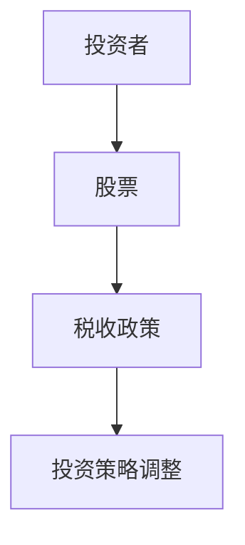
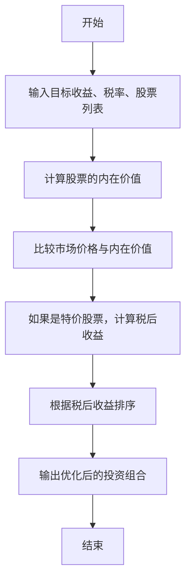
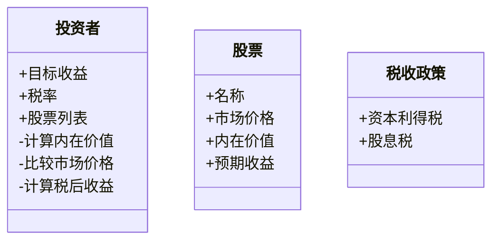
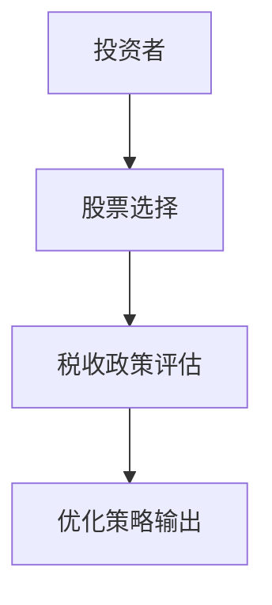
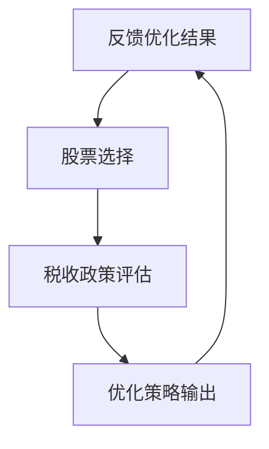

                 


# 格雷厄姆特价股票策略在不同税收环境下的调整

## 关键词：格雷厄姆策略、特价股票、税收环境、投资策略、数学模型、系统架构、项目实战

## 摘要：本文深入探讨格雷厄姆特价股票策略在不同税收环境下的调整方法，通过数学模型和系统设计，分析税收政策对投资策略的影响，提供实际案例和系统实现方案，为投资者优化投资组合提供指导。

---

## 第一部分: 格雷厄姆特价股票策略与税收环境的背景介绍

## 第1章: 格雷厄姆特价股票策略概述

### 1.1 格雷厄姆特价股票策略的定义

#### 1.1.1 特价股票的基本概念
- 特价股票是指市场价格低于其内在价值的股票，通常具有较高的安全边际。
- 格雷厄姆的价值投资理念强调以低于内在价值的价格买入优质股票，以降低风险并实现长期收益。

#### 1.1.2 格雷厄姆投资理念的核心原则
- **安全边际**：买入价格低于内在价值的股票，以确保投资的安全性。
- **长期视角**：关注企业的基本面，选择具有稳定盈利能力和良好财务状况的公司。
- **分散投资**：通过投资多种股票来分散风险，避免过度集中。

#### 1.1.3 特价股票与价值投资的联系
- 特价股票是价值投资的重要组成部分，投资者通过寻找被市场低估的股票，实现超额收益。

### 1.2 税收环境对投资策略的影响

#### 1.2.1 税收政策的基本概念
- 税收政策包括资本利得税、股息税、印花税等，直接影响投资收益和成本。
- 不同国家或地区的税收政策差异显著，对投资者的决策产生重要影响。

#### 1.2.2 不同税收环境下的投资差异
- 高税率环境可能导致投资成本增加，投资者需要调整策略以优化税后收益。
- 低税率环境可能吸引更多投资者，推动股价上涨，但也要警惕潜在的泡沫。

#### 1.2.3 税收环境与投资策略的关系
- 税收政策直接影响投资成本和收益，投资者需要根据税收环境调整投资组合和交易策略。

### 1.3 特价股票策略与税收环境的关系

#### 1.3.1 税收政策对股票投资的影响
- 资本利得税可能影响股票买卖时机，高税率可能导致短期收益减少。
- 股息税可能影响股息再投资的收益，影响复利效果。

#### 1.3.2 不同税收环境下的投资策略调整
- 在高税率环境下，投资者可能更倾向于长期持有，避免频繁交易。
- 在低税率环境下，投资者可能更积极地进行交易，优化税务负担。

#### 1.3.3 税收环境对格雷厄姆策略的具体影响
- 税收环境影响格雷厄姆策略的实施效果，投资者需要在税收优化和价值投资之间找到平衡。

---

## 第2章: 格雷厄姆特价股票策略的核心概念与联系

### 2.1 核心概念原理

#### 2.1.1 格雷厄姆策略的数学模型
- 格雷厄姆策略的核心是寻找市场价格低于内在价值的股票，内在价值可以通过基本面分析计算。
- 内在价值计算公式：
  $$ V = \text{企业未来现金流的现值} $$
  其中，现金流和贴现率受税收政策影响。

#### 2.1.2 税收政策的数学模型
- 税收政策可以通过税率和计税基础影响投资收益：
  $$ \text{税后收益} = \text{收益} \times (1 - \text{税率}) $$

#### 2.1.3 两者之间的联系与相互作用
- 税收政策影响股票的内在价值和市场价值，进而影响格雷厄姆策略的有效性。
- 投资者需要根据税收环境调整内在价值的计算，优化投资组合。

### 2.2 核心概念属性特征对比

#### 2.2.1 特价股票与普通股票的对比
| 属性        | 特价股票          | 普通股票          |
|-------------|-------------------|-------------------|
| 定义         | 市价低于内在价值   | 市价反映市场预期   |
| 投资策略     | 价值投资为主       | 短期交易为主       |
| 风险         | 较低（安全边际）   | 较高（市场波动）   |
| 税收影响     | 税后收益优化       | 税收负担较重       |

#### 2.2.2 不同税收环境下的投资策略对比
| 税收环境     | 高税率           | 低税率           |
|--------------|------------------|------------------|
| 投资策略     | 长期持有，减少交易 | 积极交易，优化税务 |
| 税后收益     | 较低             | 较高             |
| 风险         | 较低（避免短期波动）| 较高（市场波动风险）|

#### 2.2.3 格雷厄姆策略在不同税收环境下的适应性对比
| 税收环境     | 适应性           |
|--------------|------------------|
| 高税率       | 适合长期持有     |
| 低税率       | 适合短期优化     |

### 2.3 ER实体关系图



---

## 第3章: 税收环境下的策略调整算法

### 3.1 算法原理

#### 3.1.1 算法整体思路
1. **评估当前税收政策**：分析资本利得税、股息税等税率。
2. **计算税后收益**：根据税率调整投资收益计算。
3. **优化投资组合**：根据税后收益最大化调整股票选择和持有时间。
4. **调整交易策略**：根据税率差异优化买卖时机。

#### 3.1.2 算法实现步骤

1. **输入参数**：目标收益、税率、股票列表。
2. **计算内在价值**：使用基本面分析模型计算股票的内在价值。
3. **比较市场价格与内在价值**：确定是否为特价股票。
4. **计算税后收益**：
   $$ \text{税后收益} = \text{收益} \times (1 - \text{税率}) $$
5. **调整投资组合**：根据税后收益最大化原则，优化股票选择和持有时间。
6. **输出结果**：生成优化后的投资组合和交易计划。

### 3.2 算法实现

#### 3.2.1 代码实现
```python
def calculate_tax_adjusted_return(tax_rate, pre_tax_return):
    return pre_tax_return * (1 - tax_rate)

def optimize_portfolio(stocks, tax_policy):
    optimized_portfolio = []
    for stock in stocks:
        intrinsic_value = calculate_intrinsic_value(stock)
        market_price = stock['market_price']
        if market_price < intrinsic_value:
            tax_adjusted_return = calculate_tax_adjusted_return(tax_policy['capital_gains_tax'], stock['expected_return'])
            optimized_portfolio.append({'stock': stock, 'tax_adjusted_return': tax_adjusted_return})
    return sorted(optimized_portfolio, key=lambda x: x['tax_adjusted_return'], reverse=True)

# 示例用法
stocks = [{'name': 'Stock A', 'market_price': 50, 'intrinsic_value': 60, 'expected_return': 0.1},
          {'name': 'Stock B', 'market_price': 30, 'intrinsic_value': 40, 'expected_return': 0.15}]

tax_policy = {'capital_gains_tax': 0.15}
result = optimize_portfolio(stocks, tax_policy)
print(result)
```

#### 3.2.2 算法流程图



---

## 第4章: 税收环境下的数学模型与公式

### 4.1 税收影响的数学模型

#### 4.1.1 税后收益计算公式
$$ \text{税后收益} = \text{收益} \times (1 - \text{税率}) $$

#### 4.1.2 税后内在价值计算公式
$$ V_{\text{税后}} = V_{\text{税前}} \times (1 - \text{税率}) $$

#### 4.1.3 税收对投资组合的影响
- 税收政策通过影响收益和成本，改变投资组合的风险和收益比。
- 投资者需要在数学模型中考虑税收因素，优化投资组合。

### 4.2 优化模型

#### 4.2.1 最优化目标函数
$$ \max \sum (\text{收益} \times (1 - \text{税率})) $$

#### 4.2.2 约束条件
- 投资组合中股票数量限制
- 每只股票的持有比例限制
- 税率限制

---

## 第5章: 税收环境下的系统架构设计

### 5.1 系统功能设计

#### 5.1.1 领域模型


#### 5.1.2 系统架构图


#### 5.1.3 接口设计
- 输入接口：目标收益、税率、股票列表
- 输出接口：优化后的投资组合、交易计划

#### 5.1.4 系统交互图


---

## 第6章: 项目实战与案例分析

### 6.1 项目实战

#### 6.1.1 环境安装
- Python编程环境
- 数据分析库（如Pandas、NumPy）
- 图形化工具（如Matplotlib、Seaborn）

#### 6.1.2 核心实现代码
```python
import pandas as pd

def calculate_tax_adjusted_return(tax_rate, pre_tax_return):
    return pre_tax_return * (1 - tax_rate)

def calculate_intrinsic_value(stock):
    # 简化模型，假设内在价值是市场价格的1.2倍
    return stock['market_price'] * 1.2

def optimize_portfolio(stocks, tax_policy):
    optimized_portfolio = []
    for stock in stocks:
        iv = calculate_intrinsic_value(stock)
        market_price = stock['market_price']
        expected_return = stock['expected_return']
        tax_adjusted_return = calculate_tax_adjusted_return(tax_policy['capital_gains_tax'], expected_return)
        optimized_portfolio.append({
            'name': stock['name'],
            'market_price': market_price,
            'intrinsic_value': iv,
            'tax_adjusted_return': tax_adjusted_return
        })
    optimized_portfolio = pd.DataFrame(optimized_portfolio)
    return optimized_portfolio.sort_values('tax_adjusted_return', ascending=False)

# 示例数据
stocks = [
    {'name': 'A', 'market_price': 50, 'expected_return': 0.1},
    {'name': 'B', 'market_price': 30, 'expected_return': 0.15},
    {'name': 'C', 'market_price': 40, 'expected_return': 0.08}
]

tax_policy = {'capital_gains_tax': 0.15}
result = optimize_portfolio(stocks, tax_policy)
print(result)
```

#### 6.1.3 代码应用解读
- **calculate_tax_adjusted_return**：计算税后收益。
- **calculate_intrinsic_value**：简化模型计算内在价值。
- **optimize_portfolio**：根据税后收益排序，选择最优股票组合。

### 6.2 案例分析

#### 6.2.1 案例背景
- 投资者目标：长期价值投资。
- 税收环境：高资本利得税（15%）。

#### 6.2.2 数据分析
| 股票名称 | 市场价格 | 内在价值 | 预期收益 | 税后收益 |
|----------|----------|----------|----------|----------|
| A        | 50       | 60       | 0.1      | 0.085    |
| B        | 30       | 36       | 0.15     | 0.1275   |
| C        | 40       | 48       | 0.08     | 0.068    |

#### 6.2.3 结果分析
- 根据税后收益排序，B > A > C。
- 投资者应优先选择B股票，因其税后收益最高。

### 6.3 项目小结
- 税收环境显著影响投资收益，需在策略中考虑税率因素。
- 优化算法能有效帮助投资者在不同税收环境下做出明智决策。

---

## 第7章: 总结与最佳实践

### 7.1 总结

- 本文系统探讨了格雷厄姆特价股票策略在不同税收环境下的调整方法。
- 通过数学模型和系统设计，提供了优化投资组合的有效方法。

### 7.2 最佳实践

#### 7.2.1 投资者建议
- **关注税收政策**：及时了解当地税收政策变化，优化投资组合。
- **长期持有优质股票**：在高税率环境下，减少交易频率，降低税务负担。
- **分散投资**：通过多样化降低风险，同时优化税后收益。

#### 7.2.2 风险提示
- 税收政策变化可能导致投资收益波动。
- 短期交易可能增加税务负担，需谨慎决策。

### 7.3 小结

- 格雷厄姆策略在不同税收环境下的调整需要结合数学模型和系统设计。
- 通过优化算法和实际案例分析，投资者可以更好地应对复杂的投资环境。

### 7.4 拓展阅读

- 格雷厄姆的《 Intelligent Investor》
- 税收政策对资本市场的影响
- 系统架构设计在金融投资中的应用

---

## 结语

通过本文的分析，投资者可以更好地理解格雷厄姆策略在不同税收环境下的调整方法，并通过实际案例和系统设计优化投资组合，实现长期稳定的收益。

