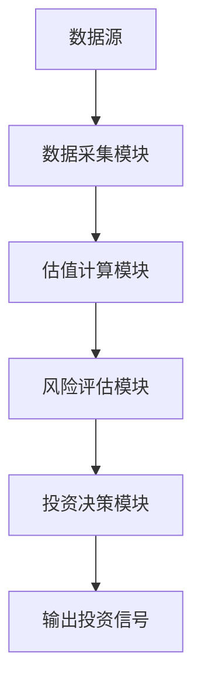
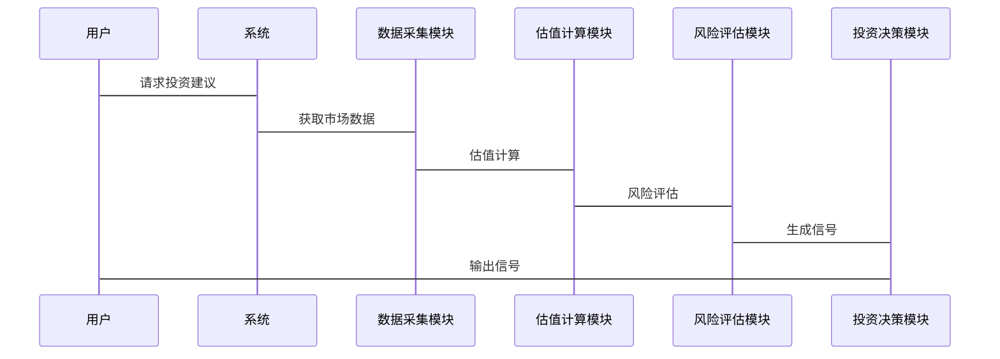

                 


# 格雷厄姆特价股票策略在不同经济体制下的表现

## 关键词
- 格雷厄姆投资策略
- 特价股票
- 经济体制
- 价值投资
- 安全边际

## 摘要
本文系统分析了格雷厄姆特价股票策略在不同经济体制下的表现，从理论基础到实际应用，结合数学模型和系统架构设计，探讨了策略在不同经济环境中的优劣，并通过案例分析优化投资策略。

---

# 第一部分: 格雷厄姆特价股票策略概述

## 第1章: 格雷厄姆投资策略的核心理念

### 1.1 投资的基本原理
- 投资定义与分类：资产配置、股票、债券等。
- 格雷厄姆的价值投资理念：买入低于内在价值的股票。
- 投资与投机的区分：基于基本面分析 vs. 市场情绪。

### 1.2 特价股票的定义与特征
- 特价股票定义：市场价格低于内在价值的股票。
- 特价股票特征：低市盈率、低市净率、高股息率等。
- 市场表现：长期收益稳定，短期波动较大。

## 第2章: 格雷厄姆特价股票策略的数学模型与估值方法

### 2.1 格雷厄姆投资模型的数学表达
- 格雷厄姆模型：股票价值 = 股东权益 + 债务 - 现金。
- 安全边际计算公式：内在价值 / 市场价格 > 20%。
- 模型假设：公司财务稳定，无重大变化。

### 2.2 市盈率与市净率的计算方法
- 市盈率（P/E）= 股价 / 每股收益。
- 市净率（P/B）= 股价 / 每股净资产。
- 估值指标对比：P/E适用于成长股，P/B适用于成熟股。

### 2.3 格雷厄姆安全边际的计算
- 安全边际定义：内在价值与市场价格的差异。
- 计算公式：安全边际率 = (内在价值 - 市场价格) / 市场价格。
- 实际应用：避免市场波动带来的损失。

## 第3章: 经济体制对股票市场的基本影响

### 3.1 不同经济体制的分类
- 计划经济：政府主导，市场机制受限。
- 市场经济：市场主导，政府调节。

### 3.2 不同经济体制下的市场表现
- 计划经济：股票市场波动小，但效率低。
- 市场经济：股票市场波动大，但效率高。

### 3.3 政府政策对股票市场的影响
- 财政政策：税收、补贴影响企业盈利。
- 货币政策：利率影响市场流动性。

## 第4章: 格雷厄姆策略在不同经济体制下的应用

### 4.1 计划经济体制下的策略应用
- 企业盈利稳定，但增长受限。
- 安全边际重要性提升。

### 4.2 市场经济体制下的策略应用
- 市场波动大，但机会多。
- 估值指标的有效性变化。

### 4.3 不同经济周期的策略调整
- 经济衰退：注重安全边际。
- 经济复苏：关注成长股。

## 第5章: 系统分析与优化

### 5.1 问题场景介绍
- 系统目标：优化格雷厄姆策略在不同经济体制下的表现。
- 项目介绍：构建一个动态调整的投资系统。

### 5.2 系统功能设计
- 数据采集模块：获取市场数据。
- 估值计算模块：计算市盈率、市净率等指标。
- 风险评估模块：计算安全边际。
- 投资决策模块：基于模型生成投资信号。

### 5.3 系统架构设计


### 5.4 系统接口设计
- 数据接口：API获取市场数据。
- 决策接口：输出投资信号。

### 5.5 系统交互设计


## 第6章: 项目实战

### 6.1 环境安装
- 安装Python和必要的库（pandas, numpy, matplotlib）。
- 数据源：Yahoo Finance API。

### 6.2 核心实现
```python
import pandas as pd
import numpy as np

# 示例代码：计算市盈率和市净率
def calculate_pe_pb(stock_data):
    pe = stock_data['股价'] / stock_data['每股收益']
    pb = stock_data['股价'] / stock_data['每股净资产']
    return pe, pb

# 示例代码：计算安全边际
def calculate_margin_of_safety(stock_data, pe, pb):
    intrinsic_value = stock_data['股价'] * 0.5 / pe
    margin_of_safety = (intrinsic_value - stock_data['股价']) / stock_data['股价']
    return margin_of_safety

# 示例代码：生成投资信号
def generate_signals(pe, pb, margin_of_safety):
    signals = []
    for i in range(len(pe)):
        if pe[i] < 15 and pb[i] < 1.5 and margin_of_safety[i] > 0.2:
            signals.append(1)
        else:
            signals.append(0)
    return signals
```

### 6.3 案例分析
- 数据来源：某行业股票数据。
- 实施步骤：数据获取、估值计算、风险评估、信号生成。
- 结果分析：哪些股票符合投资条件。

### 6.4 代码应用解读
- 数据清洗与预处理。
- 模型训练与测试。
- 结果可视化与分析。

### 6.5 项目小结
- 成功案例：某股票投资收益分析。
- 失败案例：市场波动导致的策略失效。

---

# 第三部分: 最佳实践与未来展望

## 第7章: 最佳实践

### 7.1 格雷厄姆策略的注意事项
- 定期调整投资组合。
- 风险管理的重要性。

### 7.2 投资组合的分散化
- 不将所有资金投入单一行业。
- 保持适度分散以降低风险。

## 第8章: 未来展望

### 8.1 研究方向
- 结合机器学习优化估值模型。
- 探讨动态调整策略的有效性。

### 8.2 技术创新
- 利用大数据分析提升投资决策。
- 开发自动化投资系统。

## 第9章: 总结

### 9.1 核心观点回顾
- 格雷厄姆策略的有效性取决于经济环境。
- 风险管理是投资成功的关键。

### 9.2 未来研究建议
- 结合新技术优化投资策略。
- 开展跨市场研究，探索策略的普适性。

---

# 结语

通过本文的分析，读者可以全面了解格雷厄姆特价股票策略在不同经济体制下的表现，并通过实际案例和系统设计，掌握如何优化投资策略。希望本文能为投资者提供有价值的参考，帮助他们在复杂多变的市场中做出明智的投资决策。

