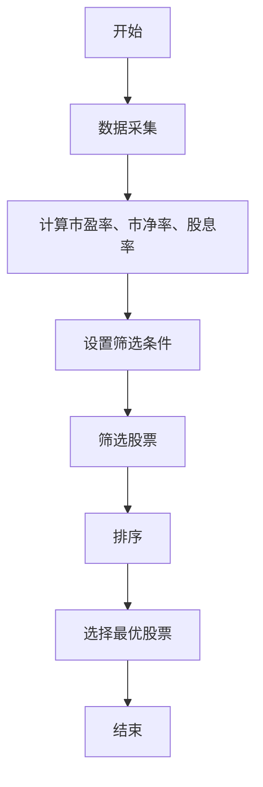
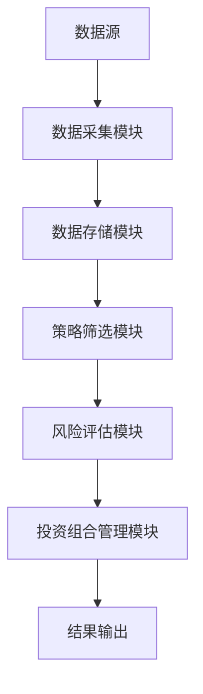

                 


# 格雷厄姆特价股票策略在不同经济周期的调整

## 关键词：格雷厄姆投资理论、经济周期、特价股票、投资策略、价值投资

## 摘要：本文详细探讨了格雷厄姆的价值投资理论在不同经济周期中的应用，分析了如何根据经济环境调整特价股票策略。通过数学模型和算法，结合系统设计与实战案例，展示了如何在不同经济阶段优化投资组合，实现稳健收益。

---

## 第一章：格雷厄姆策略的核心概念

### 1.1 格雷厄姆投资理论的背景

#### 1.1.1 价值投资的起源与发展

价值投资起源于20世纪，由本杰明·格雷厄姆和戴维德·多德共同提出。格雷厄姆是哥伦比亚大学的教授，他的理论奠定了现代价值投资的基础。价值投资的核心在于寻找市场价低于其内在价值的股票，即“特价股票”。

#### 1.1.2 格雷厄姆投资理念的核心思想

格雷厄姆认为，市场波动反映了非理性投资者的行为，而不是公司实际价值的变化。投资者应关注公司的基本面，如盈利能力、财务状况和行业地位，而非市场情绪。

#### 1.1.3 特价股票的定义与特征

特价股票是指市场价格低于其内在价值的股票。其特征包括低市盈率（P/E比率）、低市净率（P/B比率）和高股息率（Dividend Yield）。

### 1.2 经济周期的基本概念

#### 1.2.1 经济周期的定义与分类

经济周期分为四个阶段：衰退、复苏、过热和滞胀。每个阶段的特点如下：

- **衰退期**：GDP下降，失业率上升，企业盈利减少。
- **复苏期**：经济开始恢复，企业盈利逐步回升。
- **过热期**：经济快速增长，可能出现通货膨胀。
- **滞胀期**：经济增长放缓，通货膨胀率高。

#### 1.2.2 不同经济周期对股市的影响

- **衰退期**：股市下跌，投资者恐慌，但某些股票可能被低估。
- **复苏期**：股市逐渐回升，价值股开始表现。
- **过热期**：股市泡沫可能形成，成长股表现较好。
- **滞胀期**：股市波动大，防御性股票表现较优。

#### 1.2.3 经济周期与投资策略的关系

投资者应根据经济周期调整投资策略。例如，在衰退期寻找低估的价值股，在复苏期关注周期性股票，在过热期寻找成长股，在滞胀期选择防御性股票。

### 1.3 格雷厄姆策略与经济周期的联系

#### 1.3.1 格雷厄姆策略在不同经济周期的适用性

格雷厄姆策略在衰退期和复苏期表现最佳，因为此时市场低估了部分股票的价值。在过热期和滞胀期，策略可能需要调整，以避免市场波动带来的风险。

#### 1.3.2 经济周期波动对特价股票的影响

在衰退期，企业盈利下降，但某些行业的股票可能因市场恐慌而被低估。在复苏期，市场逐渐恢复理性，价值股开始被发现。在过热期，市场可能高估股票价值，导致格雷厄姆策略失效。在滞胀期，通货膨胀可能影响股票的内在价值计算。

#### 1.3.3 策略调整的必要性与目标

策略调整的必要性在于不同经济周期下，市场环境和股票表现不同。目标是根据经济周期特点，优化选股标准，提高投资收益，降低风险。

---

## 第二章：格雷厄姆策略的核心概念与联系

### 2.1 核心概念原理

格雷厄姆策略的核心在于通过分析公司的基本面，识别市场价格低于内在价值的股票。内在价值计算公式为：

$$
\text{内在价值} = \frac{\text{预期股息}}{\text{折现率} - \text{股息增长率}}
$$

### 2.2 概念属性对比表格

| 概念         | 特价股票 | 成长股 | 垃圾股 |
|--------------|----------|--------|--------|
| 市盈率（P/E） | 低于市场平均水平 | 高于市场平均水平 | 过高或过低 |
| 市净率（P/B） | 低于1.5 | 无特定要求 | 过高 |
| 股息率       | 高于5% | 无特定要求 | 低 |

### 2.3 ER实体关系图

```mermaid
er
    %% 经济周期与股票类型的关系
    class 经济周期 {
        阶段：字符串
    }
    class 股票类型 {
        类型：字符串
    }
    经济周期 -> 股票类型：影响
```

---

## 第三章：格雷厄姆策略的算法原理

### 3.1 算法原理讲解

格雷厄姆策略的算法包括以下几个步骤：

1. **数据采集**：收集股票的市盈率、市净率、股息率等指标。
2. **筛选标准**：设置筛选条件，如市盈率 < 15，市净率 < 2，股息率 > 3%。
3. **排序与筛选**：根据筛选条件对股票进行排序，找出符合条件的股票。
4. **投资组合优化**：根据经济周期调整投资组合，分散风险。

### 3.2 算法流程图



### 3.3 数学模型与公式

格雷厄姆的内在价值计算公式：

$$
\text{内在价值} = \frac{\text{预期股息}}{\text{折现率} - \text{股息增长率}}
$$

其中，折现率通常取8%-12%，股息增长率取0%-5%。

### 3.4 代码实现

```python
import pandas as pd

# 假设df为股票数据，包含市盈率、市净率、股息率
# 筛选条件：市盈率 < 15，市净率 < 2，股息率 > 3%
filtered_stocks = df[(df['PE'] < 15) & (df['PB'] < 2) & (df['Dividend Yield'] > 0.03)]

# 输出筛选结果
print(filtered_stocks)
```

---

## 第四章：系统分析与架构设计方案

### 4.1 问题场景介绍

本文将构建一个基于格雷厄姆策略的投资管理系统，帮助投资者根据经济周期调整策略，筛选特价股票。

### 4.2 系统功能设计

- **数据采集模块**：采集股票数据和宏观经济指标。
- **策略筛选模块**：根据经济周期调整筛选条件。
- **风险评估模块**：评估市场波动和个股风险。
- **投资组合管理模块**：优化资产配置，分散风险。

### 4.3 系统架构设计



### 4.4 接口设计与交互流程

- **数据接口**：通过API接口获取股票数据和宏观经济指标。
- **用户界面**：提供筛选条件输入和结果展示界面。

---

## 第五章：项目实战

### 5.1 环境安装

安装Python、Pandas、NumPy、Matplotlib等库。

```bash
pip install pandas numpy matplotlib
```

### 5.2 核心实现代码

```python
import pandas as pd
import numpy as np
import matplotlib.pyplot as plt

# 数据加载
df = pd.read_csv('stocks.csv')

# 筛选条件：市盈率 < 15，市净率 < 2，股息率 > 3%
mask = (df['PE'] < 15) & (df['PB'] < 2) & (df['Dividend Yield'] > 0.03)
selected_stocks = df[mask]

# 可视化
selected_stocks['PE'].hist(bins=20, figsize=(10,6))
plt.title('PE分布')
plt.show()
```

### 5.3 案例分析

以2020年经济衰退期为例，筛选出市盈率 < 15，市净率 < 2，股息率 > 3%的股票，构建投资组合，定期评估其表现。

---

## 第六章：最佳实践与小结

### 6.1 小结

格雷厄姆策略在不同经济周期下需要灵活调整，特别是在衰退期和复苏期表现最佳。投资者应根据经济环境调整筛选条件，优化投资组合。

### 6.2 注意事项

- 定期评估投资组合，及时调整策略。
- 保持对宏观经济指标的关注，如GDP增长率、通货膨胀率等。
- 分散投资，降低风险。

### 6.3 拓展阅读

推荐书籍：《The Intelligent Investor》、《股票作手回忆录》。

---

## 附录：完整代码与数据

### 附录A：数据获取代码

```python
import requests
import pandas as pd

url = 'https://example.com/stock_data.csv'
response = requests.get(url)
data = response.text.split('\n')
df = pd.DataFrame([row.split(',') for row in data[1:]])
```

### 附录B：可视化代码

```python
selected_stocks['PE'].plot.hist(bins=20, figsize=(10,6))
plt.title('特价股票PE分布')
plt.xlabel('PE')
plt.ylabel('数量')
plt.show()
```

---

通过以上步骤，投资者可以根据不同经济周期的特点，灵活调整格雷厄姆策略，选择合适的特价股票，实现稳健的投资回报。

