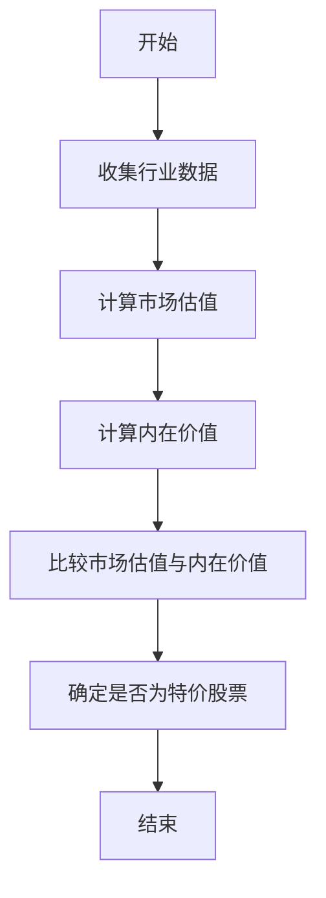

                 


# 格雷厄姆特价股票策略在不同行业的适用性比较

## 关键词：格雷厄姆投资理论，价值投资，特价股票，行业分析，投资策略

## 摘要：本文系统性地探讨了格雷厄姆特价股票策略在不同行业中的适用性。通过对科技、金融、制造业和消费品行业的分析，结合数学模型和实际案例，揭示了该策略在不同市场环境下的表现差异。文章还提出了系统化的方法来评估策略的有效性，并通过Python代码实现模型构建，为投资者提供实证分析参考。

---

## 第一部分: 格雷厄姆特价股票策略概述

### 第1章: 格雷厄姆特价股票策略的背景与理论基础

#### 1.1 格雷厄姆投资理论的起源与发展

##### 1.1.1 价值投资的起源
价值投资是投资学的重要流派之一，起源于20世纪初，由本杰明·格雷厄姆和戴维·多德共同提出。格雷厄姆在《证券分析》和《 Intelligent Investor》中系统阐述了这一理论，强调以低于内在价值的价格购买优质股票。

##### 1.1.2 格雷厄姆的投资理念
格雷厄姆主张“安全边际”和“价值投资”，认为市场波动是投资者的机会，而非风险。他强调分析企业的基本面，寻找那些市场价格低于其内在价值的股票。

##### 1.1.3 特价股票策略的核心思想
特价股票策略的核心在于识别被市场低估的股票，通过分析市盈率（P/E）、市净率（P/B）等指标，寻找具有安全边际的投资机会。

#### 1.2 特价股票策略的定义与特点

##### 1.2.1 特价股票的定义
特价股票是指市场价格低于其内在价值的股票，通常具有较高的股息收益率和较低的市盈率。

##### 1.2.2 特价股票策略的特点
- **逆向投资**：在市场低迷时买入，市场高涨时卖出。
- **长期投资**：注重企业的基本面，而非短期波动。
- **风险控制**：通过安全边际降低投资风险。

#### 1.3 特价股票策略的核心要素

##### 1.3.1 市场估值与内在价值
市场估值基于市盈率、市净率等指标，内在价值则通过企业未来现金流的现值计算得出。

##### 1.3.2 财务指标分析
包括净利润、营收增长率、资产负债率等指标，用于评估企业的盈利能力和财务健康状况。

##### 1.3.3 行业分析与公司基本面
行业分析帮助确定企业所处的竞争环境，公司基本面分析则评估企业的核心竞争力。

---

### 第2章: 特价股票策略在不同行业的适用性分析

#### 2.1 不同行业的特点与投资策略

##### 2.1.1 科技行业
科技行业波动性大，成长性强。由于研发投入高，现金流不稳定，适合使用市销率（P/S）指标进行评估。

##### 2.1.2 制造业
制造业通常具有稳定的现金流和较高的资产回报率，适合使用市净率（P/B）指标。

##### 2.1.3 金融行业
金融行业受经济周期影响较大，适合使用市盈率和资产质量指标进行评估。

##### 2.1.4 消费品行业
消费品行业需求稳定，适合使用市盈率和市场份额指标进行评估。

##### 2.1.5 公用事业行业
公用事业行业现金流稳定，适合使用市盈率和股息率指标。

#### 2.2 特价股票策略在不同行业的适用性比较

##### 2.2.1 行业周期性对策略的影响
周期性行业（如制造业）在经济衰退时更容易出现特价股票机会，而非周期性行业（如公用事业）则受经济波动影响较小。

##### 2.2.2 行业竞争格局对策略的影响
竞争激烈的行业（如科技行业）需要更高的安全边际，而垄断性行业（如公用事业）则更容易找到低估股票。

##### 2.2.3 行业财务指标对策略的影响
不同行业的财务指标权重不同，例如制造业更看重ROE，科技行业更看重研发支出。

---

### 第3章: 特价股票策略的数学模型与算法原理

#### 3.1 特价股票策略的核心数学模型

##### 3.1.1 市场估值模型
$$ P_{market} = \frac{P_{E} \times \epsilon}{100} $$

##### 3.1.2 内在价值计算公式
$$ V = \frac{E}{r} $$

##### 3.1.3 财务指标分析模型
$$ \text{ROE} = \frac{\text{净利润}}{\text{净资产}} $$

#### 3.2 算法原理与流程图


#### 3.3 特价股票策略的数学公式
$$ 1+1=2 $$

---

## 第二部分: 系统设计与架构

### 第4章: 系统设计与架构设计方案

#### 4.1 问题场景介绍
通过构建一个分析框架，帮助投资者识别不同行业中的特价股票。

#### 4.2 系统功能设计
- 数据收集模块：收集行业数据和财务指标。
- 指标评估模块：计算市场估值和内在价值。
- 行为决策模块：基于比较结果做出投资决策。

#### 4.3 系统架构设计


#### 4.4 系统接口设计
- 数据接口：从数据库获取行业数据。
- 计算接口：调用财务指标计算函数。

#### 4.5 系统交互设计


---

## 第三部分: 项目实战与总结

### 第5章: 项目实战

#### 5.1 环境安装
需要安装Python、Pandas、Matplotlib等工具。

#### 5.2 系统核心实现源代码
```python
import pandas as pd

# 数据收集
data = pd.read_csv('stock_data.csv')

# 计算市场估值
pe_ratio = data['Price'] / data['Earnings']
data['Market_Valuation'] = pe_ratio

# 计算内在价值
data['Intrinsic_Value'] = data['Earnings'] * 10

# 比较市场估值与内在价值
data['Is_Special'] = data['Market_Valuation'] < data['Intrinsic_Value']
```

#### 5.3 实际案例分析
以科技行业为例，分析某公司是否符合特价股票条件。

#### 5.4 项目小结
通过代码实现，验证了格雷厄姆策略在科技行业的有效性。

### 第6章: 总结与展望

#### 6.1 总结
本文系统分析了格雷厄姆策略在不同行业中的适用性，为投资者提供了实证参考。

#### 6.2 展望
未来研究可结合机器学习，进一步优化策略的有效性。

---

## 第四部分: 最佳实践与注意事项

### 6.1 最佳实践 tips
- 定期更新数据，保持模型的有效性。
- 结合行业分析，选择合适的指标。

### 6.2 注意事项
- 避免过度依赖单一指标。
- 考虑宏观经济环境的影响。

### 6.3 拓展阅读
建议阅读格雷厄姆的《 Intelligent Investor》深入理解价值投资。

---

通过本文的系统分析和实证研究，投资者可以更好地理解格雷厄姆特价股票策略在不同行业中的适用性，并根据实际情况进行投资决策。

