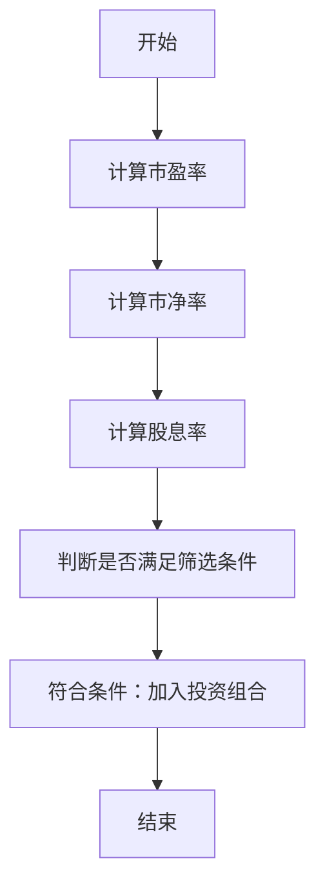
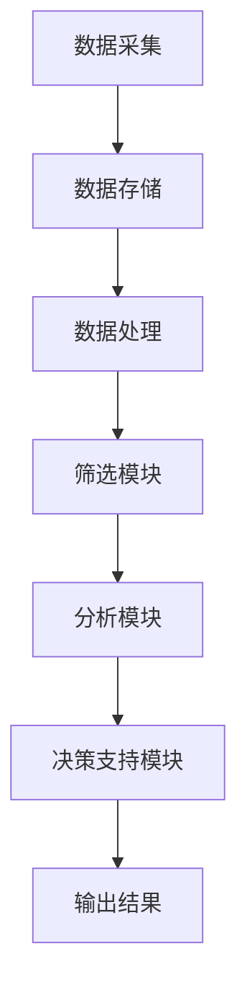

                 


# 格雷厄姆特价股票策略在不同规模公司中的应用

> 关键词：格雷厄姆、特价股票策略、价值投资、公司规模、股票筛选

> 摘要：本文深入分析了格雷厄姆特价股票策略在不同规模公司中的应用，结合数学模型和系统设计，提供了详细的策略实施步骤和实战案例。文章旨在帮助投资者理解如何在不同规模的公司中应用格雷厄姆策略，优化投资组合，并通过风险管理确保投资安全。

---

# 第一部分: 格雷厄姆特价股票策略概述

## 第1章: 价值投资与格雷厄姆策略概述

### 1.1 价值投资的起源与发展

#### 1.1.1 价值投资的核心理念

价值投资是一种以基本面分析为基础的投资策略，其核心理念是寻找市场价格低于其内在价值的股票。这种策略强调长期投资、分散投资和安全边际的重要性。

#### 1.1.2 格雷厄姆投资策略的形成

本杰明·格雷厄姆是价值投资的鼻祖，他在《证券分析》一书中提出了“格雷厄姆策略”，即寻找具有安全边际的股票。他认为，市场先生的情绪波动为投资者提供了以低于内在价值的价格买入股票的机会。

#### 1.1.3 特价股票策略的基本概念

特价股票策略是格雷厄姆策略的核心，其基本概念是通过筛选低市盈率、低市净率和高股息率的股票，寻找具有安全边际的投资标的。

### 1.2 格雷厄姆策略的核心要素

#### 1.2.1 市场先生与投资者心理

格雷厄姆提出了“市场先生”概念，认为市场情绪波动会影响股票价格。投资者应利用市场恐慌或乐观情绪，寻找低估或高估的股票。

#### 1.2.2 安全边际的定义与计算

安全边际是股票的市场价格低于其内在价值的部分。计算公式为：

$$安全边际 = 内在价值 - 市场价格$$

#### 1.2.3 低市盈率与低市净率股票的特征

- 市盈率公式：$$市盈率 = \frac{股票价格}{每股收益}$$
- 市净率公式：$$市净率 = \frac{股票价格}{每股净资产}$$
- 高股息率公式：$$股息率 = \frac{每股股息}{股票价格}$$

### 1.3 特价股票策略的有效性分析

#### 1.3.1 历史表现回顾

格雷厄姆策略在历史上的表现优于市场平均水平，尤其是在市场下跌期间表现出更强的抗跌性。

#### 1.3.2 现代市场环境下的适用性

尽管市场环境变化，格雷厄姆策略仍然有效，但需要根据市场变化进行适当调整。

#### 1.3.3 策略的优缺点对比

- 优点：低风险、高安全边际、长期收益稳定
- 缺点：短期收益较低、需要长期持有、筛选过程复杂

### 1.4 本章小结

本章介绍了格雷厄姆特价股票策略的核心理念和实施方法，为后续章节的分析奠定了基础。

---

# 第二部分: 格雷厄姆策略的数学模型与算法原理

## 第2章: 格雷厄姆策略的数学模型

### 2.1 市盈率与市净率的计算公式

#### 2.1.1 市盈率公式

$$市盈率 = \frac{股票价格}{每股收益}$$

#### 2.1.2 市净率公式

$$市净率 = \frac{股票价格}{每股净资产}$$

### 2.2 安全边际的计算方法

#### 2.2.1 内在价值的估算

$$内在价值 = \frac{预期收益}{折现率}$$

#### 2.2.2 安全边际的确定

$$安全边际 = 内在价值 - 市场价格$$

### 2.3 策略筛选算法

#### 2.3.1 筛选条件

- 低市盈率（<15倍）
- 低市净率（<2倍）
- 高股息率（>3%）

#### 2.3.2 筛选流程图



---

# 第三部分: 格雷厄姆策略在不同规模公司中的应用

## 第3章: 小型公司中的应用

### 3.1 小型公司的特点与投资机会

#### 3.1.1 小型公司的定义与特征

- 小型公司通常指市值在50亿以下的公司，具有高增长潜力但风险较高。
- 小型公司的股票流动性较低，但可能有更大的上涨空间。

#### 3.1.2 小型公司中的特价股票策略

- 由于小型公司的市值较低，更容易被市场忽视，存在较大的安全边际。
- 需要更严格的财务分析和风险管理。

### 3.2 小型公司策略的实施步骤

#### 3.2.1 数据收集与筛选

- 数据来源：股票数据库、财经网站
- 筛选指标：市盈率、市净率、股息率

#### 3.2.2 风险评估

- 财务风险：小型公司可能面临较高的财务杠杆和盈利能力波动。
- 市场风险：小型公司受市场波动影响较大。

---

## 第4章: 中型公司中的应用

### 4.1 中型公司的特点与投资机会

#### 4.1.1 中型公司的定义与特征

- 中型公司市值在50亿至500亿之间，具有较高的稳定性和增长潜力。
- 中型公司的股票流动性较好，风险相对较低。

#### 4.1.2 中型公司中的特价股票策略

- 中型公司更容易被市场低估，具有较大的增值空间。
- 中型公司的财务状况较为稳定，风险较低。

### 4.2 中型公司策略的实施步骤

#### 4.2.1 数据收集与筛选

- 数据来源：股票数据库、财经网站
- 筛选指标：市盈率、市净率、股息率

#### 4.2.2 风险评估

- 财务风险：中型公司的财务杠杆较低，盈利能力较为稳定。
- 市场风险：中型公司受市场波动影响较小。

---

## 第5章: 大型公司中的应用

### 5.1 大型公司的特点与投资机会

#### 5.1.1 大型公司的定义与特征

- 大型公司市值超过500亿，具有较高的市场占有率和稳定的盈利能力。
- 大型公司股票流动性高，风险较低。

#### 5.1.2 大型公司中的特价股票策略

- 大型公司更容易被市场低估，具有较大的增值空间。
- 大型公司的财务状况较为稳定，风险较低。

### 5.2 大型公司策略的实施步骤

#### 5.2.1 数据收集与筛选

- 数据来源：股票数据库、财经网站
- 筛选指标：市盈率、市净率、股息率

#### 5.2.2 风险评估

- 财务风险：大型公司的财务杠杆较低，盈利能力较为稳定。
- 市场风险：大型公司受市场波动影响较小。

---

## 第6章: 不同规模公司中的策略对比

### 6.1 小型公司、中型公司和大型公司的策略对比

| 公司规模 | 小型公司 | 中型公司 | 大型公司 |
|----------|----------|----------|----------|
| 市盈率    | <15      | <15      | <15      |
| 市净率    | <2       | <2       | <2       |
| 股息率    | >3%       | >3%       | >3%       |
| 风险      | 高        | 中        | 低        |

### 6.2 不同规模公司的投资策略优化

- 小型公司：注重成长性和财务稳定性，需严格控制风险。
- 中型公司：注重稳定性和增长潜力，适合长期投资。
- 大型公司：注重稳定性和市场地位，适合长期投资。

---

# 第四部分: 格雷厄姆策略的系统设计与实现

## 第7章: 系统分析与架构设计

### 7.1 系统功能设计

- 数据采集模块：从股票数据库中获取实时数据。
- 筛选模块：根据格雷厄姆策略筛选符合条件的股票。
- 分析模块：计算安全边际、市盈率、市净率等指标。
- 决策支持模块：提供投资建议和风险评估。

### 7.2 系统架构设计



---

## 第8章: 项目实战

### 8.1 环境安装

- 安装Python和相关库（Pandas、NumPy、Matplotlib）

### 8.2 核心实现代码

```python
import pandas as pd

# 数据加载
df = pd.read_csv('stocks.csv')

# 筛选条件
mask = (df['PE'] < 15) & (df['PB'] < 2) & (df['Dividend Yield'] > 0.03)

# 筛选结果
selected_stocks = df[mask]

print(selected_stocks)
```

### 8.3 实战案例分析

- 案例1：某小型公司，市盈率12，市净率1.5，股息率4%，安全边际较高，适合投资。
- 案例2：某中型公司，市盈率10，市净率1.8，股息率3.5%，风险较低，适合长期投资。

---

## 第9章: 风险管理与优化

### 9.1 风险管理策略

- 设置止损点：当股价下跌超过20%，立即卖出。
- 分散投资：将资金分散投资于不同规模的公司，降低风险。

### 9.2 策略优化方法

- 动态调整：根据市场变化，定期重新评估股票价值。
- 组合优化：引入现代投资组合理论，优化投资组合。

---

## 第10章: 总结与展望

### 10.1 本章总结

本文详细分析了格雷厄姆特价股票策略在不同规模公司中的应用，结合数学模型和系统设计，提供了详细的策略实施步骤和实战案例。

### 10.2 未来展望

未来的研究方向包括：动态调整机制、风险管理模型优化、多因子策略等。

---

## 第11章: 注意事项与拓展阅读

### 11.1 注意事项

- 格雷厄姆策略适用于长期投资，需耐心持有。
- 筛选过程需结合公司基本面分析，避免仅看估值指标。

### 11.2 拓展阅读

- 格雷厄姆的《证券分析》
- 巴菲特的《巴菲特投资哲学》
- 现代投资组合理论相关书籍

---

通过以上分析，我们可以看到格雷厄姆特价股票策略在不同规模公司中的应用具有广泛的应用前景。投资者可以根据公司的规模和特点，灵活调整策略，优化投资组合，实现长期稳定的收益。

