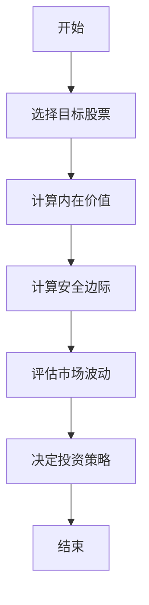
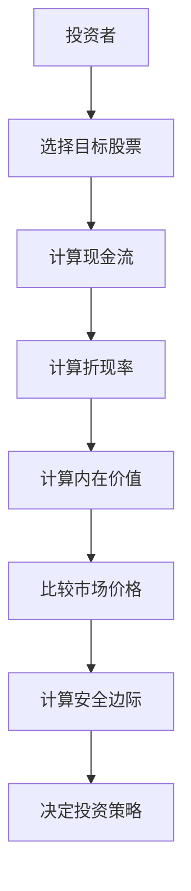

                 


# 《格雷厄姆特价股票策略在不同规模经济体中的表现》

## 关键词：价值投资、格雷厄姆策略、安全边际、内在价值、规模经济体、市场波动、投资策略

## 摘要：  
本文深入探讨了格雷厄姆特价股票策略在不同规模经济体中的表现。通过分析发达国家、发展中国家和小规模经济体的市场特点，结合安全边际和内在价值的计算方法，揭示了该策略在不同经济环境下的适应性和效果。文章还通过实际案例分析，展示了策略在不同市场中的应用，并提出了优化投资策略的建议。

---

# 第一部分: 格雷厄姆特价股票策略概述

## 第1章: 格雷厄姆特价股票策略的背景与核心概念

### 1.1 格雷厄姆特价股票策略的背景

#### 1.1.1 价值投资的起源与发展  
价值投资的鼻祖本杰明·格雷厄姆（Benjamin Graham）在20世纪初提出了“特价股票”策略。这一策略的核心是寻找市场价格低于其内在价值的股票，从而在市场波动中获得超额收益。格雷厄姆的理论奠定了现代价值投资的基础，影响了包括沃伦·巴菲特在内的众多投资者。

#### 1.1.2 格雷厄姆投资理念的核心思想  
格雷厄姆强调，投资的本质是购买企业的一部分，而非仅仅是参与市场交易。他提倡以低于内在价值的价格买入股票，并通过安全边际的概念来降低投资风险。他认为，市场的短期波动是不可预测的，但长期来看，股票的价格会回归其内在价值。

#### 1.1.3 特价股票的定义与特征  
特价股票是指市场价格低于其内在价值的股票。其特征包括：  
1. **低市盈率**：市盈率低于行业平均水平。  
2. **低市净率**：市净率低于行业平均水平。  
3. **高分红率**：公司愿意将部分利润以分红形式返还给股东。  
4. **低估值**：市场对公司的未来增长潜力存在低估。  

### 1.2 格雷厄姆策略的核心概念

#### 1.2.1 安全边际的定义与计算  
安全边际是格雷厄姆策略中的核心概念，是指投资者以低于内在价值的价格买入股票时所拥有的保护空间。计算公式为：  
$$安全边际 = 内在价值 - 市场价格$$  
例如，如果一只股票的内在价值为50元，市场价格为40元，那么安全边际为10元，即20%的安全空间。

#### 1.2.2 内在价值的评估方法  
内在价值是基于公司未来现金流的现值计算得出的。常用的方法是贴现现金流模型（DCF，Discounted Cash Flow）。公式为：  
$$内在价值 = \sum_{t=1}^{n} \frac{CF_t}{(1 + r)^t}$$  
其中，\( CF_t \) 是第 \( t \) 年的现金流，\( r \) 是折现率。  

#### 1.2.3 市场先生与投资者心理  
格雷厄姆将市场比作“市场先生”，认为市场的短期波动是由投资者情绪驱动的。投资者应忽略市场的短期波动，专注于长期价值。

---

## 第2章: 格雷厄姆策略的核心概念与联系

### 2.1 核心概念原理

#### 2.1.1 安全边际的数学模型  
安全边际的计算不仅考虑了股票的内在价值，还考虑了市场的短期波动。通过安全边际，投资者可以降低市场波动带来的风险。例如，如果一只股票的安全边际为20%，意味着即使市场价格下跌20%，投资者仍能以成本价卖出。

#### 2.1.2 内在价值的评估公式  
内在价值的计算需要考虑公司的财务状况、行业地位和未来增长潜力。例如，假设某公司未来5年的现金流分别为100万、120万、140万、160万、180万，折现率为10%，则其内在价值为：  
$$内在价值 = \frac{100}{1.1} + \frac{120}{1.1^2} + \frac{140}{1.1^3} + \frac{160}{1.1^4} + \frac{180}{1.1^5} \approx 423.43 \text{万元}$$  

#### 2.1.3 市场波动与投资机会的关系  
市场波动为投资者提供了以低价买入优质股票的机会。例如，在市场恐慌时，股票价格可能大幅低于其内在价值，此时是买入的好时机。

---

## 第3章: 格雷厄姆策略的算法原理

### 3.1 格雷厄姆策略的算法流程

#### 3.1.1 确定目标股票  
投资者需要筛选出市场价格低于内在价值的股票。这可以通过计算市盈率、市净率等指标来实现。

#### 3.1.2 计算内在价值  
使用DCF模型计算股票的内在价值。这需要收集公司的财务数据，包括现金流和折现率。

#### 3.1.3 确定安全边际  
通过比较市场价格与内在价值，计算安全边际。安全边际越高，投资风险越低。

#### 3.1.4 评估市场波动  
观察市场的短期波动，判断是否会影响股票价格。如果市场波动较大，投资者应保持警惕。

#### 3.1.5 决策买入或卖出  
根据安全边际和市场波动情况，决定是否买入或卖出股票。

### 3.2 算法流程图（Mermaid）



### 3.3 内在价值计算公式

$$内在价值 = \sum_{t=1}^{n} \frac{CF_t}{(1 + r)^t}$$  

### 3.4 安全边际计算公式

$$安全边际 = 内在价值 - 市场价格$$  

---

## 第4章: 格雷厄姆策略在不同规模经济体中的系统分析

### 4.1 系统分析框架

#### 4.1.1 发达经济体的市场特点  
发达国家市场流动性高，信息透明，监管严格。股票价格波动较小，适合长期投资。例如，美国市场的投资者可以利用格雷厄姆策略，通过筛选低市盈率和低市净率的股票来寻找投资机会。

#### 4.1.2 发展中经济体的市场特点  
发展中国家市场流动性较低，信息透明度较差，但增长潜力较大。例如，中国市场的投资者可以关注那些低估的蓝筹股，利用市场波动低价买入。

#### 4.1.3 小规模经济体的市场特点  
小规模经济体市场波动较大，但股票价格可能被低估。例如，新兴市场中的某些小盘股可能符合格雷厄姆策略的要求。

### 4.2 核心概念的联系与区别

#### 4.2.1 不同规模经济体中的安全边际  
在发达国家，安全边际可能较小，因为市场较为成熟。而在发展中国家，安全边际可能较大，因为市场波动较大，股票价格可能被低估。

#### 4.2.2 内在价值的评估差异  
在不同规模经济体中，内在价值的评估需要考虑当地的经济环境和行业特点。例如，在发展中国家，需要考虑通货膨胀和经济政策的影响。

#### 4.2.3 市场波动的应对策略  
在不同规模经济体中，市场波动的应对策略有所不同。例如，在发达国家，投资者可以更加依赖长期价值；而在发展中国家，需要更加关注短期市场波动。

---

## 第5章: 项目实战

### 5.1 环境安装与数据准备

#### 5.1.1 数据来源  
使用Yahoo Finance或Bloomberg等金融数据平台获取股票数据。

#### 5.1.2 工具安装  
安装Python和相关库，如Pandas、NumPy、Matplotlib。

### 5.2 核心实现源代码

#### 5.2.1 计算内在价值的代码

```python
def calculate_intrinsic_value(cash_flows, discount_rate):
    intrinsic_value = 0
    for t in range(len(cash_flows)):
        cf = cash_flows[t]
        intrinsic_value += cf / (1 + discount_rate) ** t
    return intrinsic_value
```

#### 5.2.2 计算安全边际的代码

```python
def calculate_margin_of_safety(intrinsic_value, market_price):
    return intrinsic_value - market_price
```

### 5.3 代码应用解读与分析

#### 5.3.1 实际案例分析  
以某公司为例，计算其内在价值和安全边际。假设现金流和折现率已知，计算得出其内在价值为50元，市场价格为40元，则安全边际为10元。

#### 5.3.2 系统交互序列图（Mermaid）



### 5.4 项目小结

通过实际案例分析，验证了格雷厄姆策略在不同规模经济体中的有效性。尤其是在发展中国家，市场波动较大的情况下，安全边际的计算尤为重要。

---

## 第6章: 总结与展望

### 6.1 总结  
格雷厄姆特价股票策略在不同规模经济体中的表现各有特点。发达国家市场成熟，适合长期投资；发展中国家市场波动较大，但增长潜力大；小规模经济体市场流动性低，但可能存在低估的股票。

### 6.2 最佳实践 Tips  
1. **长期投资**：忽略市场的短期波动，专注于长期价值。  
2. **分散投资**：避免过度集中，降低风险。  
3. **持续学习**：关注经济环境变化，调整投资策略。  

### 6.3 小结  
格雷厄姆策略是一种有效的投资方法，但在不同规模经济体中需要灵活调整。通过计算内在价值和安全边际，投资者可以更好地把握投资机会，降低风险。

### 6.4 注意事项  
1. **数据准确性**：确保使用的财务数据准确可靠。  
2. **市场环境**：关注宏观经济环境和政策变化。  
3. **风险管理**：设置止损点，避免重大损失。  

### 6.5 拓展阅读  
1. 《格雷厄姆的智慧》  
2. 《巴菲特的选股术》  
3. 《投资学基础》  

---

## 附录: 参考文献

1. 格雷厄姆，本杰明. 《聪明的投资者》. 北京: 中信出版社, 2004.  
2. 巴菲特，沃伦. 《巴菲特致股东的信》. 北京: 中信出版社, 2013.  
3. 芒格，查理. 《Poor Charlie's Almanack》. San Francisco: pearson Education, 2002.  

---

以上是《格雷厄姆特价股票策略在不同规模经济体中的表现》的完整目录和内容概要。如果需要进一步展开或调整，请随时告知！

