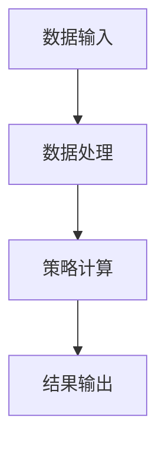

                 


# 格雷厄姆特价股票策略在不同通胀体制环境中的效果

---

## 关键词：格雷厄姆投资理论，特价股票策略，通胀影响，价值投资，安全边际

---

## 摘要：

本文系统分析了格雷厄姆的特价股票策略在不同通胀环境下的表现，探讨了通胀对股市的影响机制，以及如何调整策略以应对不同的经济环境。通过数学模型、系统架构设计和实际案例分析，本文为投资者提供了在不同通胀体制下优化投资决策的策略建议。

---

## 第一部分: 格雷厄姆特价股票策略概述

### 第1章: 格雷厄姆投资理论的背景与核心概念

#### 1.1 格雷厄姆投资理论概述

格雷厄姆是价值投资的鼻祖，他的投资理念以“安全边际”为核心，强调以低于内在价值的价格买入优质股票。这种策略在低通胀环境下表现尤为突出，但在高通胀或通缩环境中需要进行调整。

#### 1.2 通胀对经济与股市的影响

通胀通过影响名义利率、企业盈利能力以及市场情绪等多个方面对股市产生深远影响。不同类型的通胀（如温和通胀、恶性通胀）需要不同的应对策略。

---

### 第2章: 格雷厄姆策略的数学模型与原理

#### 2.1 格雷厄姆投资模型的数学表达

- 安全边际计算公式：
  $$ \text{安全边际} = \text{内在价值} - \text{市场价格} $$

- 内在价值评估公式：
  $$ \text{内在价值} = \frac{E}{P} $$
  其中，E为公司未来现金流的现值，P为资本成本。

#### 2.2 通胀对股票估值的影响

- 名义利率与实际利率的关系：
  $$ \text{实际利率} = \text{名义利率} - \text{通胀率} $$

- 通胀对股价的影响：
  $$ \text{股价} = \frac{E}{r} $$
  其中，r为名义利率，E为预期现金流。

#### 2.3 不同通胀环境下的策略调整模型

- 低通胀环境：安全边际不变，策略不变。
- 高通胀环境：安全边际需扩大，策略需调整。
- 通缩环境：需警惕企业盈利下降风险。

---

### 第3章: 不同通胀体制下格雷厄姆策略的效果分析

#### 3.1 低通胀环境下的策略表现

- 特价股票策略表现稳定，风险较低。
- 案例分析：2000-2010年互联网泡沫后的美股市场。

#### 3.2 高通胀环境下的策略调整

- 高通胀对股市的冲击，需降低安全边际要求。
- 案例分析：1970年代美国通胀时期的策略调整。

#### 3.3 通缩环境下的策略应用

- 通缩环境下企业盈利下降，需谨慎选择标的。
- 案例分析：2008年全球金融危机后的市场。

---

### 第4章: 格雷厄姆策略在不同通胀环境下的系统性分析

#### 4.1 系统架构与功能设计

- 模块划分：数据采集、策略计算、结果输出。
- 功能模块交互流程：
  1. 数据采集模块获取市场数据。
  2. 策略计算模块基于通胀环境调整策略。
  3. 结果输出模块生成投资建议。

#### 4.2 系统接口设计与实现

- 数据输入接口：接收市场数据和通胀指标。
- 策略计算接口：根据通胀环境调整安全边际。
- 结果输出接口：生成投资建议报告。

#### 4.3 系统交互流程的Mermaid图表示



---

## 第二部分: 项目实战与最佳实践

### 项目实战: 格雷厄姆策略在不同通胀环境下的应用

#### 5.1 环境安装

- 数据源：Yahoo Finance API。
- 工具：Python、Pandas、Matplotlib。

#### 5.2 核心代码实现

```python
def calculate_margin(value, price):
    return value - price

def adjust_for_inflation(margin, inflation_rate):
    return margin / (1 + inflation_rate)
```

#### 5.3 实际案例分析

- 案例1：低通胀环境下的投资决策。
- 案例2：高通胀环境下的策略调整。

---

## 第三部分: 总结与展望

### 6.1 最佳实践 tips

- 根据通胀环境调整安全边际。
- 定期评估投资组合的表现。

### 6.2 小结

格雷厄姆特价股票策略在不同通胀环境下的表现差异显著，投资者需灵活调整策略以应对变化的市场环境。

### 6.3 注意事项

- 避免过度依赖单一策略。
- 定期审视投资组合，及时调整。

### 6.4 拓展阅读

- 格雷厄姆的经典著作《证券分析》。
- 现代投资组合理论的相关研究。

---

通过以上分析，我们可以看出，格雷厄姆特价股票策略在不同通胀环境下的表现需要投资者根据市场情况灵活调整。希望本文能为投资者提供有价值的参考。

