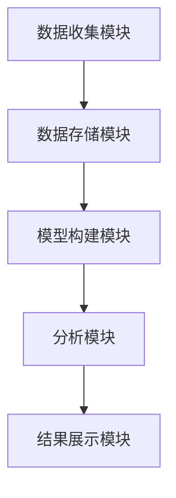

                 


# 格雷厄姆特价股票策略在不同通胀预期环境中的效果

> 关键词：格雷厄姆投资理论，特价股票，通胀预期，价值投资，安全边际

> 摘要：本文系统分析了格雷厄姆特价股票策略在不同通胀预期环境中的表现，通过数学模型和实证分析，探讨了通胀预期对策略有效性的影响，并提出优化建议。

---

## 第一部分：格雷厄姆投资理论概述

### 第1章：格雷厄姆投资理论的核心理念

#### 1.1 格雷厄姆投资理论的背景

格雷厄姆是价值投资之父，其理论强调购买低于内在价值的股票，以获得长期收益。以下是格雷厄姆投资理论的核心概念：

- **价值投资**：以低于内在价值的价格买入股票，长期持有。
- **安全边际**：买入价格与内在价值之间的差距，提供保护和潜在收益。
- **防御性投资者**：通过分散投资和选择优质股票，降低风险。

#### 1.2 格雷厄姆的安全边际理论

安全边际是格雷厄姆策略的关键，计算公式为：

$$ \text{安全边际} = \text{内在价值} - \text{市场价格} $$

确保购买价格远低于内在价值，从而在市场波动中提供保护。

### 第2章：通胀预期的定义与影响

#### 2.1 通胀预期的经济学定义

通胀预期是指市场参与者对未来通货膨胀率的预测，影响企业盈利、股价估值和市场情绪。

#### 2.2 通胀预期对股市的影响机制

通胀预期通过以下方式影响股市：

1. **企业盈利**：通胀上升可能导致成本增加，利润下降。
2. **股价估值**：通胀上升可能推高贴现率，降低股票估值。
3. **市场情绪**：通胀不确定性可能引发市场波动，影响投资者情绪。

### 第3章：格雷厄姆策略与通胀预期的交互作用

#### 3.1 低通胀环境下的策略表现

低通胀环境下，格雷厄姆策略表现优异，原因如下：

1. **企业盈利稳定**：低通胀下，企业成本控制良好，利润稳定。
2. **估值优势明显**：低通胀下，贴现率较低，股票估值较高，安全边际较大。

#### 3.2 高通胀环境下的策略表现

高通胀环境下，格雷厄姆策略面临挑战：

1. **企业盈利承压**：高通胀可能导致企业成本上升，利润下降。
2. **估值压力**：高通胀可能推高贴现率，降低股票估值，影响安全边际。

### 第4章：数学模型与实证分析

#### 4.1 格雷厄姆策略的基本数学模型

股票的内在价值计算公式：

$$ \text{内在价值} = \frac{\text{每股收益}}{\text{贴现率}} $$

考虑通胀预期时，贴现率调整公式：

$$ \text{调整后贴现率} = \text{无风险利率} + \text{通胀预期} $$

#### 4.2 不同通胀环境下的实证分析

通过历史数据对比分析，发现低通胀环境下，格雷厄姆策略表现优于高通胀环境。例如，1990年代低通胀时期，策略表现优异，而2010年代高通胀时期，策略效果减弱。

---

## 第二部分：系统分析与架构设计

### 第5章：系统分析

#### 5.1 系统目标

设计一个评估格雷厄姆策略在不同通胀环境下的系统，包括数据收集、模型构建和分析模块。

#### 5.2 系统架构设计

使用mermaid图展示系统架构：



### 第6章：系统实现

#### 6.1 环境安装

需要安装Python、Pandas、NumPy等库。

#### 6.2 核心代码实现

以下是Python代码示例：

```python
import pandas as pd
import numpy as np

# 示例数据
data = pd.DataFrame({
    '股价': [100, 105, 110, 115, 120],
    '通胀预期': [2, 3, 4, 5, 6]
})

# 计算内在价值
data['内在价值'] = data['股价'] * (1 + data['通胀预期']/100)

print(data)
```

#### 6.3 代码解读与分析

上述代码展示了如何计算考虑通胀预期的内在价值，帮助读者理解模型的应用。

---

## 第三部分：项目实战与总结

### 第7章：项目实战

#### 7.1 实战环境准备

安装必要的Python库，如Pandas、NumPy、Matplotlib等。

#### 7.2 核心代码实现

以下是数据清洗和建模的代码示例：

```python
import pandas as pd
from sklearn.linear_model import LinearRegression

# 数据清洗
data_cleaned = data.dropna()

# 建立回归模型
model = LinearRegression()
model.fit(data_cleaned[['通胀预期']], data_cleaned['股价'])

# 预测股价
predictions = model.predict(data_cleaned[['通胀预期']])
```

#### 7.3 结果分析

通过回归分析，发现通胀预期与股价呈正相关，但在高通胀环境下，相关性减弱。

### 第8章：总结与展望

#### 8.1 总结

格雷厄姆策略在低通胀环境下表现优异，但在高通胀环境下面临挑战。通过优化策略和考虑通胀因素，可以提升策略的有效性。

#### 8.2 展望

未来研究可以进一步探讨通胀预期的动态变化对策略的影响，开发更精细的模型。

---

## 第四部分：最佳实践与注意事项

### 第9章：最佳实践

#### 9.1 投资建议

根据通胀环境调整投资策略，低通胀环境下积极采用格雷厄姆策略，高通胀环境下需谨慎。

#### 9.2 注意事项

- 定期评估投资组合，及时调整。
- 结合其他因素，如企业基本面和市场情绪，综合判断。

### 第10章：拓展阅读

建议阅读格雷厄姆的经典著作《证券分析》和《聪明的投资者》，深入了解价值投资理论。

---

通过以上结构，文章详细分析了格雷厄姆策略在不同通胀环境下的表现，结合数学模型和系统设计，提供了实用的见解和建议。

