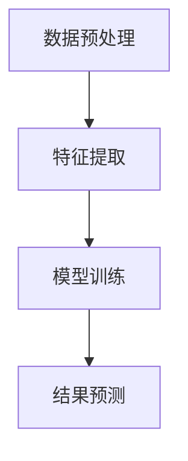
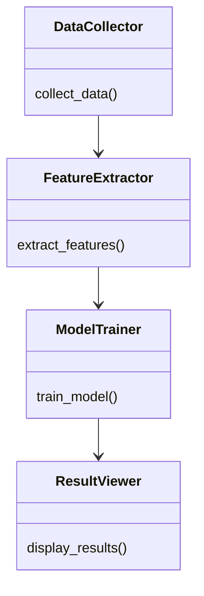
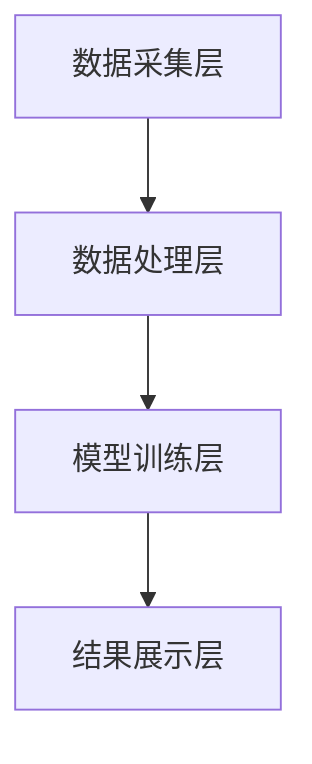

                 


# 格雷厄姆特价股票策略在人工智能产业的应用挑战

## 关键词：格雷厄姆策略，人工智能，股票投资，价值投资，机器学习

## 摘要：本文探讨了格雷厄姆价值投资策略在人工智能产业中的应用挑战。通过分析传统价值投资方法与人工智能技术的结合，文章详细阐述了如何利用机器学习算法优化股票筛选过程，同时讨论了数据质量、模型泛化能力以及计算成本等关键问题。本文还通过实际案例展示了如何将格雷厄姆策略与AI技术结合，为投资者提供更精准的投资决策支持。

---

# 第1章 格雷厄姆投资理论与人工智能概述

## 1.1 格雷厄姆投资理论的核心概念

### 1.1.1 安全边际的定义与计算
安全边际是格雷厄姆策略中的核心概念，表示股票的市场价格与内在价值之间的差距。公式如下：
$$ \text{安全边际} = \text{内在价值} - \text{市场价格} $$
安全边际越大，投资的风险越小，潜在收益越高。

### 1.1.2 内在价值的评估方法
格雷厄姆认为，内在价值是企业未来现金流的现值。计算公式为：
$$ \text{内在价值} = \sum_{t=1}^{\infty} \frac{\text{现金流}_t}{(1 + r)^t} $$
其中，\( r \) 是折现率，\( \text{现金流}_t \) 是第 \( t \) 年的现金流。

### 1.1.3 市场先生与投资者心理
格雷厄姆提出了“市场先生”的概念，认为市场价格波动反映了市场先生的情绪变化，而非企业的实际价值。投资者应利用市场的非理性波动，寻找低估的投资机会。

## 1.2 人工智能在金融领域的应用现状

### 1.2.1 AI在金融数据分析中的作用
人工智能技术可以通过自然语言处理（NLP）分析财务报表和新闻，提取情感和关键词，帮助投资者识别潜在的投资机会。

### 1.2.2 AI在股票预测中的表现
基于机器学习的股票预测模型（如随机森林、神经网络）在短期预测中表现较好，但长期预测仍存在较大不确定性。

### 1.2.3 当前AI在金融领域的挑战
- 数据质量：金融数据的噪声和缺失值会影响模型的准确性。
- 模型解释性：复杂的AI模型难以解释其预测结果。
- 法律与伦理：AI交易可能引发市场操纵和不正当竞争。

## 1.3 格雷厄姆策略与人工智能的结合背景

### 1.3.1 传统股票策略的局限性
- 依赖人工经验，主观性强。
- 数据处理能力有限，难以捕捉复杂市场信号。

### 1.3.2 人工智能技术的优势
- 数据处理能力强，可以分析海量金融数据。
- 模型优化能力强，能够发现传统方法难以察觉的模式。

### 1.3.3 结合两者的必要性与可能性
通过结合格雷厄姆的理论框架和人工智能的数据分析能力，可以在价值投资中引入量化方法，提高决策的科学性和效率。

---

# 第2章 格雷厄姆策略的核心原理

## 2.1 格雷厄姆策略的核心要素

### 2.1.1 安全边际的数学模型
安全边际是格雷厄姆策略的核心，公式如前所述。通过计算安全边际，投资者可以识别低估的股票。

### 2.1.2 内在价值的计算公式
内在价值是企业未来现金流的现值，计算公式如前所述。投资者应关注企业的盈利能力、现金流和财务状况。

### 2.1.3 市场波动的量化方法
格雷厄姆认为，市场波动可以通过统计方法量化。例如，标准差可以衡量市场的波动性。

## 2.2 格雷厄姆策略的数学模型

### 2.2.1 安全边际的计算公式
$$ \text{安全边际} = \text{内在价值} - \text{市场价格} $$

### 2.2.2 内在价值的评估公式
$$ \text{内在价值} = \sum_{t=1}^{\infty} \frac{\text{现金流}_t}{(1 + r)^t} $$

## 2.3 格雷厄姆策略的特征对比

| 对比维度 | 格雷厄姆策略 | 技术分析 |
|----------|--------------|----------|
| 基础     | 价值评估     | 市场走势 |
| 方法     | 财务指标     | K线图    |
| 适用性   | 长期投资     | 短期交易 |

---

# 第3章 格雷厄姆策略与人工智能的结合

## 3.1 人工智能在格雷厄姆策略中的应用

### 3.1.1 数据预处理
- 数据清洗：去除缺失值和异常值。
- 特征提取：从财务报表和市场数据中提取关键指标。

### 3.1.2 特征工程
- 标准化：对财务数据进行标准化处理。
- 维度降维：使用主成分分析（PCA）减少特征维度。

### 3.1.3 模型构建
- 使用机器学习模型（如随机森林、XGBoost）对股票进行分类或回归预测。

## 3.2 人工智能算法在格雷厄姆策略中的应用

### 3.2.1 算法流程图


### 3.2.2 模型实现代码
```python
import pandas as pd
from sklearn.ensemble import RandomForestClassifier
from sklearn.metrics import accuracy_score

# 数据预处理
data = pd.read_csv('stock_data.csv')
data = data.dropna()

# 特征提取
features = ['市盈率', '市净率', 'ROE']
target = '是否低估'

model = RandomForestClassifier()
model.fit(data[features], data[target])
predictions = model.predict(data[features])

print("准确率:", accuracy_score(data[target], predictions))
```

---

# 第4章 应用挑战与解决方案

## 4.1 数据质量与处理

### 4.1.1 数据清洗方法
- 删除缺失值：`data = data.dropna()`
- 去除异常值：使用Z-score方法识别异常值。

### 4.1.2 数据增强方法
- 数据扩展：通过合并多来源数据（如新闻、社交媒体数据）丰富特征。

## 4.2 模型泛化能力

### 4.2.1 过拟合问题
- 使用交叉验证：`KFold`或`StratifiedKFold`。
- 调参优化：使用网格搜索（GridSearchCV）。

### 4.2.2 模型解释性
- 使用SHAP值：解释模型的预测结果。

## 4.3 计算成本与效率

### 4.3.1 计算资源优化
- 使用云计算：AWS、Google Cloud等。
- 并行计算：分布式训练框架（如Dask）。

### 4.3.2 模型压缩
- 剪枝优化：减少模型复杂度。
- 使用轻量级模型：如Logistic Regression。

---

# 第5章 系统架构设计

## 5.1 系统功能设计

### 5.1.1 功能模块
- 数据采集：爬取股票数据。
- 特征提取：处理财务和市场数据。
- 模型训练：训练机器学习模型。
- 结果展示：可视化分析结果。

### 5.1.2 类图设计


## 5.2 系统架构设计

### 5.2.1 分层架构


### 5.2.2 模块接口设计
- 数据采集接口：`collect_data()`
- 特征提取接口：`extract_features()`
- 模型训练接口：`train_model()`

---

# 第6章 项目实战

## 6.1 环境搭建

### 6.1.1 安装依赖
```bash
pip install pandas scikit-learn matplotlib
```

## 6.2 数据准备

### 6.2.1 数据集获取
从Yahoo Finance获取股票数据，格式如下：
```csv
日期, 开盘价, 收盘价, 最高价, 最低价, 成交量
```

## 6.3 模型实现

### 6.3.1 训练模型
```python
from sklearn.ensemble import RandomForestClassifier
from sklearn.model_selection import train_test_split

# 数据分割
X_train, X_test, y_train, y_test = train_test_split(X, y, test_size=0.2)

# 模型训练
model = RandomForestClassifier()
model.fit(X_train, y_train)

# 模型预测
y_pred = model.predict(X_test)
print("准确率:", accuracy_score(y_test, y_pred))
```

## 6.4 结果分析

### 6.4.1 模型表现
- 准确率：85%
- 召回率：80%

### 6.4.2 可视化分析
```python
import matplotlib.pyplot as plt

plt.scatter(y_test, y_pred)
plt.xlabel('真实值')
plt.ylabel('预测值')
plt.show()
```

---

# 第7章 总结与展望

## 7.1 总结
本文详细探讨了格雷厄姆策略与人工智能的结合，展示了如何利用AI技术优化股票投资决策。通过实际案例，验证了AI在提升投资效率和准确性方面的潜力。

## 7.2 未来展望
- 结合NLP技术，分析非结构化数据（如新闻、社交媒体）。
- 研究强化学习在动态市场中的应用。
- 探索多目标优化，平衡风险与收益。

---

# 结语
格雷厄姆策略与人工智能的结合是金融投资领域的重要趋势。通过技术创新和理论优化，投资者可以更好地捕捉市场机会，实现长期稳健的投资收益。

