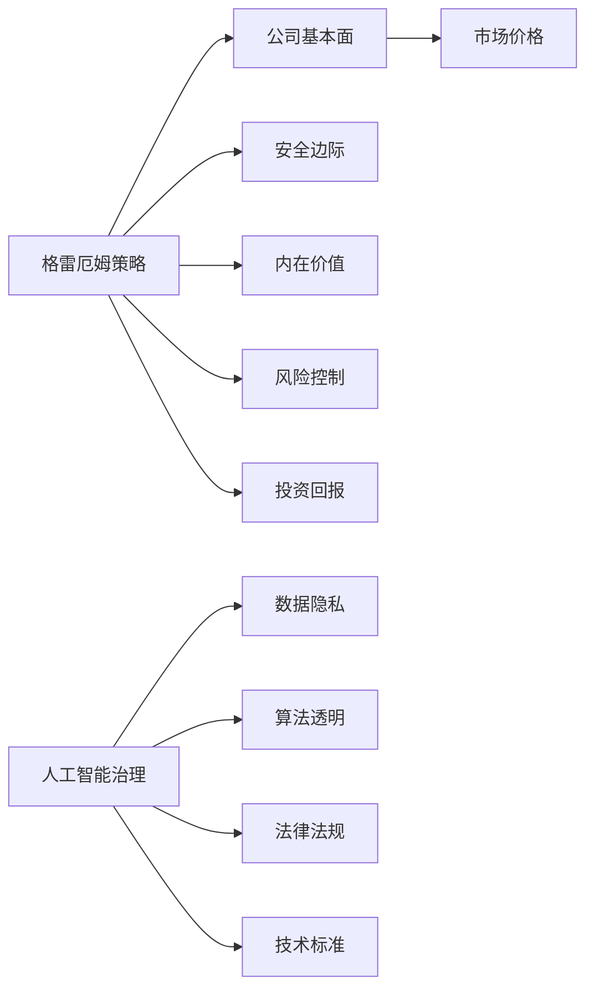
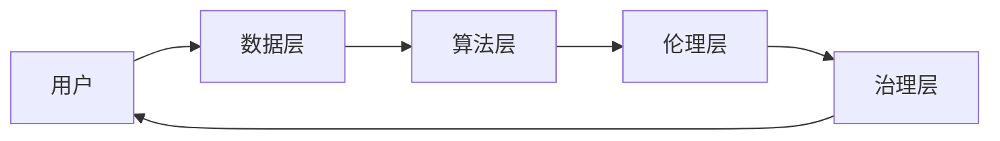

                 


# 格雷厄姆特价股票策略在人工智能治理产业的应用挑战

## 关键词：
- 格雷厄姆策略
- 人工智能治理
- 价值投资
- 股票策略
- 产业应用

## 摘要：
本文探讨了格雷厄姆的价值投资策略在人工智能治理产业中的应用挑战。首先，介绍了格雷厄姆策略的核心概念，包括价值投资的基本原理和特价股票的识别标准。接着，分析了人工智能治理产业的背景和特点，探讨了格雷厄姆策略在该领域的应用潜力。通过数学模型和算法实现，详细阐述了价值投资与人工智能治理的结合方式。最后，通过实际案例分析，展示了如何在AI治理中应用格雷厄姆策略，并提出了最佳实践和未来展望。

---

# 第一部分: 格雷厄姆特价股票策略与人工智能治理产业的背景介绍

## 第1章: 格雷厄姆策略的核心概念

### 1.1 格雷厄姆特价股票策略的定义
#### 1.1.1 价值投资的基本原理
价值投资是一种长期投资策略，核心是寻找市场价格低于其内在价值的资产。格雷厄姆策略强调深入分析公司的基本面，关注市盈率、市净率等指标，寻找被市场低估的股票。

#### 1.1.2 格雷厄姆策略的核心要素
- **安全边际**：买入价格低于内在价值，确保投资的安全性。
- **内在价值计算**：通过分析公司的财务数据，估算其真实价值。
- **长期视角**：关注公司的长期盈利能力，而非短期市场波动。

#### 1.1.3 特价股票的识别标准
- **低市盈率（P/E）**：市盈率低于行业平均水平。
- **低市净率（P/B）**：市净率低于行业平均水平。
- **高股息率**：公司愿意分红，且股息率合理。

### 1.2 人工智能治理产业的背景
#### 1.2.1 人工智能技术的快速发展
人工智能技术的快速发展带来了巨大的经济和社会价值，但也引发了一系列治理问题，如数据隐私、算法偏见、伦理问题等。

#### 1.2.2 人工智能治理的必要性
随着人工智能技术的广泛应用，治理问题日益重要。如何规范人工智能技术的使用，确保其符合社会价值观和法律法规，成为一项重要任务。

#### 1.2.3 人工智能治理的核心挑战
- **技术复杂性**：人工智能系统的复杂性使得治理难度加大。
- **法律法规滞后**：现有法律法规难以适应新技术的发展。
- **全球性问题**：人工智能治理需要全球协作。

## 第2章: 格雷厄姆策略在人工智能治理中的应用潜力

### 2.1 格雷厄姆策略在投资领域的应用
#### 2.1.1 价值投资的基本原则
价值投资强调长期、稳健的投资，注重公司的基本面和内在价值，避免短期市场波动的影响。

#### 2.1.2 格雷厄姆策略的选股方法
- **基本面分析**：关注公司的财务状况、盈利能力、管理层质量等。
- **安全边际**：买入价格低于内在价值，降低投资风险。

### 2.2 人工智能治理产业的特点
#### 2.2.1 人工智能治理的核心领域
- 数据隐私保护
- 算法透明性
- 伦理规范

#### 2.2.2 人工智能治理的行业现状
当前，人工智能治理还处于起步阶段，缺乏统一的标准和规范，存在较大的不确定性。

#### 2.2.3 人工智能治理的未来趋势
随着技术的发展，人工智能治理将更加注重技术与社会的结合，形成更加完善的治理体系。

### 2.3 格雷厄姆策略在人工智能治理中的应用潜力
#### 2.3.1 价值投资与人工智能治理的契合点
- 长期视角：人工智能治理需要长期的投入和建设。
- 基础设施：人工智能治理需要构建稳健的基础设施，类似于价值投资中的安全边际。

#### 2.3.2 格雷厄姆策略在人工智能治理中的创新应用
- **治理框架设计**：借鉴格雷厄姆的内在价值理念，设计人工智能治理的框架和标准。
- **风险管理**：通过安全边际的概念，降低人工智能治理中的风险。

#### 2.3.3 人工智能治理产业中的投资机会
人工智能治理的市场需求将快速增长，相关产业将面临巨大的投资机会，价值投资者可以在这一领域找到新的投资标的。

---

# 第二部分: 格雷厄姆策略与人工智能治理的核心概念与联系

## 第3章: 核心概念的原理与属性对比

### 3.1 格雷厄姆策略的核心原理
#### 3.1.1 价值投资的数学模型
$$ V = \frac{E}{P} $$
其中，V是内在价值，E是公司盈利，P是市场价格。

#### 3.1.2 格雷厄姆策略的量化指标
- 市盈率（P/E）
- 市净率（P/B）
- 股息率（D/P）

#### 3.1.3 价值投资的风险控制机制
通过安全边际和分散投资来降低风险。

### 3.2 人工智能治理的核心原理
#### 3.2.1 人工智能治理的框架体系
- 数据治理
- 算法治理
- 伦理治理

#### 3.2.2 人工智能治理的法律法规
- 《通用数据保护条例》（GDPR）
- 《人工智能伦理准则》

#### 3.2.3 人工智能治理的技术手段
- 数据脱敏
- 算法审计
- 伦理审查

### 3.3 核心概念的属性对比
#### 3.3.1 格雷厄姆策略与人工智能治理的目标对比
| 对比维度 | 格雷厄姆策略 | 人工智能治理 |
|----------|--------------|---------------|
| 目标     | 实现长期投资回报 | 确保人工智能技术的合规性和伦理性 |

#### 3.3.2 格雷厄姆策略与人工智能治理的实施路径对比
| 对比维度 | 格雷厄姆策略 | 人工智能治理 |
|----------|--------------|---------------|
| 实施路径 | 基于基本面分析选择股票 | 建立治理体系和标准 |

#### 3.3.3 格雷厄姆策略与人工智能治理的风险特征对比
| 对比维度 | 格雷厄姆策略 | 人工智能治理 |
|----------|--------------|---------------|
| 风险特征 | 价格波动风险 | 技术风险、法律风险 |

### 3.4 核心概念的ER实体关系图



---

## 第4章: 格雷厄姆策略在人工智能治理中的算法原理

### 4.1 格雷厄姆策略的算法实现
#### 4.1.1 价值投资的数学模型
$$ V = \frac{E}{P} $$
其中，V是内在价值，E是公司盈利，P是市场价格。

#### 4.1.2 格雷厄姆策略的实现步骤


#### 4.1.3 Python代码示例
```python
def calculate_intrinsic_value(enterprise_value, earning_per_share):
    return enterprise_value / earning_per_share

# 示例数据
enterprise_value = 1000000
earning_per_share = 50
intrinsic_value = calculate_intrinsic_value(enterprise_value, earning_per_share)
print(f"内在价值: {intrinsic_value}")
```

### 4.2 人工智能治理的算法框架
#### 4.2.1 人工智能治理的算法流程


#### 4.2.2 人工智能治理的实现步骤
- 数据收集：收集与人工智能治理相关的数据。
- 数据预处理：清洗数据，去除噪声。
- 模型训练：训练分类模型，识别治理问题。
- 模型评估：评估模型的准确性和稳定性。
- 治理决策：基于模型结果，制定治理策略。

### 4.3 格雷厄姆策略与人工智能治理的算法结合
#### 4.3.1 格雷厄姆策略在治理中的应用
- 通过价值投资的模型，评估治理方案的可行性。
- 通过安全边际的概念，降低治理中的风险。

#### 4.3.2 人工智能治理中的数学模型
$$ R = \sum_{i=1}^{n} w_i x_i $$
其中，R是治理风险，\( w_i \) 是风险权重，\( x_i \) 是风险因素。

---

# 第三部分: 格雷厄姆策略在人工智能治理中的系统分析与架构设计

## 第5章: 系统分析与架构设计方案

### 5.1 问题场景介绍
人工智能治理需要解决数据隐私、算法透明、伦理审查等问题，需要构建一个稳健的治理体系。

### 5.2 系统功能设计
- 数据治理：数据脱敏、数据分类。
- 算法治理：算法审计、算法解释。
- 伦理治理：伦理审查、风险评估。

### 5.3 系统架构设计


### 5.4 系统接口设计
- 数据接口：API用于数据交换。
- 算法接口：API用于算法调用。
- 伦理接口：API用于伦理审查。

### 5.5 系统交互流程图


---

## 第6章: 项目实战

### 6.1 环境安装
- 安装Python和相关库（如numpy、pandas、scikit-learn）。

### 6.2 核心代码实现
#### 6.2.1 价值投资模型
```python
import pandas as pd
import numpy as np

def calculate_intrinsic_value(stock_data):
    stock_data['intrinsic_value'] = stock_data['enterprise_value'] / stock_data['earning_per_share']
    return stock_data

# 示例数据
data = {
    'enterprise_value': [1000000, 2000000, 1500000],
    'earning_per_share': [50, 75, 60]
}
df = pd.DataFrame(data)
result = calculate_intrinsic_value(df)
print(result)
```

#### 6.2.2 人工智能治理模型
```python
from sklearn.tree import DecisionTreeClassifier

def train_governance_model(data):
    model = DecisionTreeClassifier()
    model.fit(data['features'], data['labels'])
    return model

# 示例数据
data = {
    'features': [[1, 2, 3], [4, 5, 6], [7, 8, 9]],
    'labels': [0, 1, 0]
}
model = train_governance_model(data)
print(model)
```

### 6.3 案例分析
假设我们有一个人工智能公司，需要评估其数据隐私治理方案的内在价值。通过格雷厄姆策略，我们分析公司的基本面，计算其内在价值，并与市场价格进行比较，决定是否投资。

### 6.4 项目小结
通过实际案例分析，我们展示了如何将格雷厄姆策略应用于人工智能治理产业中，为投资者提供了新的视角和方法。

---

## 第7章: 总结与展望

### 7.1 最佳实践
- 价值投资者应关注人工智能治理产业的长期潜力。
- 人工智能治理需要构建稳健的治理体系，确保技术的合规性和伦理性。

### 7.2 小结
本文探讨了格雷厄姆策略在人工智能治理产业中的应用挑战，分析了核心概念和算法原理，提出了系统的架构设计方案，并通过实际案例展示了如何将格雷厄姆策略应用于人工智能治理产业中。

### 7.3 注意事项
- 格雷厄姆策略的应用需要结合具体的投资环境和市场条件。
- 人工智能治理需要全球协作，制定统一的标准和规范。

### 7.4 拓展阅读
- 格雷厄姆的《 Intelligent Investor》
- 人工智能治理的相关文献和报告

---

通过以上步骤，我们系统地分析了格雷厄姆策略在人工智能治理产业中的应用挑战，为投资者和治理者提供了新的视角和方法。未来，随着人工智能技术的不断发展，格雷厄姆策略的应用潜力将更加广泛，值得进一步研究和探索。

