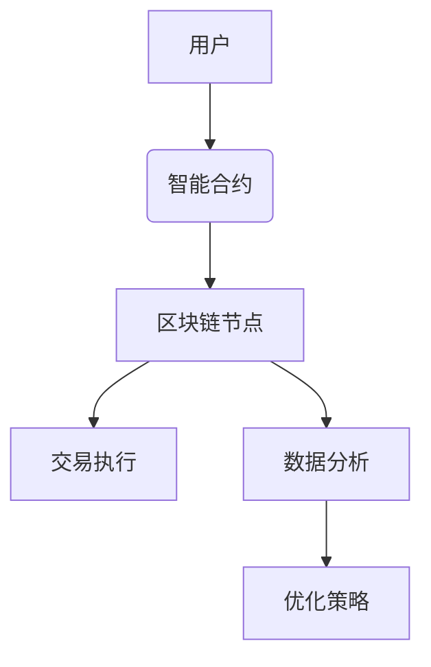
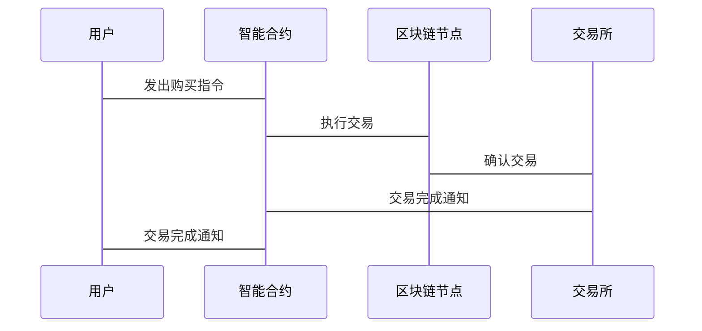
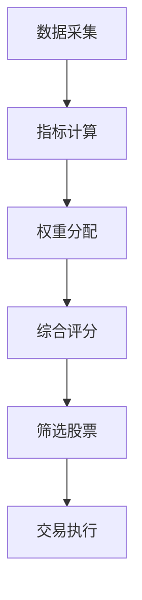

                 


# 《格雷厄姆特价股票策略在区块链驱动的金融市场中的应用》

## 关键词：
格雷厄姆投资理论、区块链技术、智能合约、金融创新、分布式账本

## 摘要：
本文探讨如何将格雷厄姆的投资策略与区块链技术相结合，分析其在金融市场中的应用潜力。通过区块链的透明性和智能合约的优势，优化股票筛选和交易流程，提升投资效率和安全性。

---

# 第一部分：格雷厄姆特价股票策略概述

## 第1章：格雷厄姆投资理论的核心思想

### 1.1 价值投资的基本原则

- **价值投资的定义**：寻找市场低估的股票，长期持有，等待其价值回归。
- **核心原则**：
  1. 购买股票视为购买企业的一部分。
  2. 避免短期波动，关注长期价值。
  3. 依赖安全边际，即买入价格远低于内在价值。

### 1.2 特价股票的定义与筛选标准

- **低估标准**：市盈率、市净率等指标低于行业平均水平。
- **筛选流程**：
  1. 筛选低市盈率股票。
  2. 分析财务报表，评估企业盈利能力。
  3. 考虑行业地位和竞争优势。

### 1.3 格雷厄姆策略在传统金融中的应用

- **成功案例**：巴菲特早期投资策略深受格雷厄姆影响。
- **局限性**：依赖人工筛选，耗时且成本高，易受市场情绪影响。

## 第2章：区块链技术的基本概念

### 2.1 区块链的定义与特点

- **区块链定义**：分布式账本技术，通过去中心化和共识机制确保数据不可篡改。
- **主要特点**：
  1. 去中心化：无单一点控制，降低单点故障风险。
  2. 可追溯性：每笔交易可追踪，提高透明度。
  3. 安全性：通过加密算法确保数据安全。

### 2.2 区块链的核心技术

- **分布式账本**：所有节点共享同一账本，确保数据一致性。
- **共识机制**：如PoW、PoS，确保所有节点达成一致。
- **智能合约**：自动执行预设条件的代码，简化交易流程。

### 2.3 区块链在金融领域的应用潜力

- **数字资产交易**：比特币等加密货币的交易和结算。
- **去中心化金融（DeFi）**：智能合约实现借贷、交易等金融活动。
- **证券发行与交易**：区块链技术简化 IPO 过程，提高效率。

## 第3章：本书的研究背景与意义

### 3.1 传统金融市场的痛点分析

- **信息不对称**：投资者获取信息不全面，影响决策。
- **交易成本高**：中介费用增加投资者负担。
- **透明度低**：传统交易中间环节多，易滋生腐败。

### 3.2 区块链技术如何解决金融问题

- **提高透明度**：区块链记录所有交易，便于追溯和审计。
- **降低交易成本**：智能合约自动执行，减少中介依赖。
- **提升安全性**：分布式账本难以篡改，降低数据丢失或被篡改风险。

### 3.3 格雷厄姆策略与区块链结合的创新点

- **自动化筛选**：利用区块链数据实时更新，自动筛选低估股票。
- **智能合约交易**：自动执行买卖指令，减少人为干预。
- **数据透明性**：所有交易记录在区块链上，提高数据可靠性。

### 3.4 本书的结构安排

- **各章节内容概述**：
  - 第1章：介绍格雷厄姆策略和区块链技术。
  - 第2章：详细分析区块链技术及其在金融中的应用。
  - 第3章：探讨策略优化和系统设计。
  - 第4章：提供项目实战和案例分析。
  - 第5章：总结经验，提出注意事项。

---

# 第二部分：区块链驱动的金融市场分析

## 第4章：区块链驱动的金融市场分析

### 4.1 区块链在金融市场的应用场景

- **数字资产交易**：比特币、以太坊等加密货币的交易和结算。
- **智能合约应用**：自动化执行金融合同，如贷款、保险理赔。
- **证券发行与交易**：利用区块链技术实现安全、高效的证券发行和交易。

### 4.2 区块链技术如何优化金融交易

- **提高交易效率**：智能合约自动执行，减少人工干预。
- **降低交易成本**：去中心化减少中介费用。
- **增强透明度**：所有交易记录可追溯，便于监管和审计。

---

# 第三部分：系统架构与算法原理

## 第5章：系统架构设计

### 5.1 系统功能设计

- **功能模块**：
  - 数据采集：实时采集股票价格、财务数据。
  - 智能合约：根据设定条件自动执行交易。
  - 交易执行：通过区块链网络完成交易。
  - 数据分析：利用大数据分析优化筛选策略。

### 5.2 系统架构图



### 5.3 系统接口设计

- **数据接口**：与数据源（如交易所）对接，获取实时数据。
- **交易接口**：与区块链节点交互，执行智能合约交易。
- **用户接口**：提供可视化界面，供用户查看和管理投资组合。

### 5.4 交互流程图



## 第6章：算法原理与优化

### 6.1 传统格雷厄姆策略的数学模型

$$ \text{安全边际} = \text{内在价值} - \text{市场价格} $$

### 6.2 区块链优化的策略模型

$$ \text{优化筛选} = \sum_{i=1}^{n} (\text{指标}_i \times \text{权重}_i) $$

### 6.3 优化过程的mermaid流程图



---

# 第四部分：项目实战与案例分析

## 第7章：项目实战

### 7.1 环境安装

- **安装以太坊开发环境**：使用Node.js和Solidity。
- **安装智能合约开发工具**：如 Remix 或 Truffle Suite。

### 7.2 核心代码实现

```javascript
// 格雷厄姆策略智能合约
contract Gre格缪尔策略 {
    function evaluateStock(address stockToken) public returns (bool buy) {
        uint price = getStockPrice(stockToken);
        uint intrinsicValue = calculateIntrinsicValue(stockToken);
        return price < intrinsicValue * 0.8;
    }
}
```

### 7.3 案例分析

- **案例背景**：某公司股票市盈率远低于行业平均水平。
- **实施过程**：通过智能合约自动判断并执行购买指令。
- **结果分析**：成功捕捉低估股票，实现收益增长。

---

# 第五部分：总结与展望

## 第8章：最佳实践与注意事项

### 8.1 实施过程中的注意事项

- **数据源可靠性**：确保数据准确可靠。
- **智能合约安全**：避免合约漏洞导致损失。
- **合规性问题**：遵守相关法律法规，确保交易合法性。

### 8.2 经验总结

- **技术创新**：区块链技术显著提升了交易效率和透明度。
- **成本降低**：通过去中介化减少交易成本。
- **风险管理**：智能合约需经过严格测试，避免漏洞。

### 8.3 拓展阅读

- 推荐书籍：《区块链：通向未来的集体货币》、《格雷厄姆证券分析》。
- 推荐项目：以太坊、Polygon、SOLANA。

## 第9章：结语

通过将格雷厄姆的投资策略与区块链技术相结合，投资者可以更高效、安全地进行股票交易。区块链的透明性和智能合约的优势，为传统投资策略带来了革新，未来在金融领域的应用前景广阔。

--- 

# 结束语

感谢您的阅读，希望本文能为您提供有价值的信息和启发。如需进一步探讨，请随时联系。

