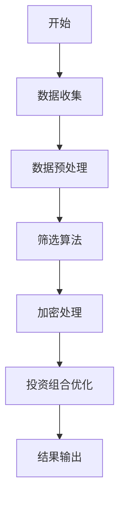

                 


# 《格雷厄姆特价股票策略在后量子加密金融时代的应用》

## 关键词：
- 格雷厄姆投资理论
- 特价股票策略
- 后量子加密
- 金融安全
- 加密技术

## 摘要：
本文探讨了格雷厄姆特价股票策略在后量子加密金融时代的应用，结合了投资理论与加密技术，分析了两者的结合如何增强金融交易的安全性，并通过数学模型和实际案例展示了其在现代金融中的潜力。

---

# 第1章：背景与核心概念

## 1.1 格雷厄姆投资理论的起源与发展

### 1.1.1 格雷厄姆价值投资理论
格雷厄姆是价值投资的鼻祖，其核心在于寻找市场价格低于内在价值的股票。他提出的“安全边际”概念强调在价格显著低于价值时买入，以降低风险。

### 1.1.2 特价股票策略
格雷厄姆策略专注于寻找那些被市场低估的股票，通过分析公司基本面，如市盈率、市净率等指标，筛选出具有投资价值的股票。

### 1.1.3 后量子加密时代的金融安全挑战
随着量子计算的发展，传统加密算法如RSA可能面临被破解的风险，威胁金融交易的安全性。后量子加密技术作为解决方案，提供了抵抗量子攻击的能力。

## 1.2 后量子加密技术的背景

### 1.2.1 量子计算对传统加密技术的威胁
量子计算机的出现使得许多基于因数分解的传统加密算法面临被破解的风险，这促使了后量子加密技术的研发。

### 1.2.2 后量子加密技术的定义与特点
后量子加密技术基于数学难题，如格、纠错码等，设计出抗量子攻击的算法，如NIST标准化的NIST PQC标准。

### 1.2.3 金融领域对后量子加密技术的需求
金融行业涉及大量敏感数据，如交易记录和股价信息，必须在后量子时代采用新的加密技术，确保数据的机密性和完整性。

## 1.3 格雷厄姆策略与后量子加密的结合

### 1.3.1 格雷厄姆策略在金融安全中的应用
格雷厄姆策略通过价值分析，筛选出优质股票，结合后量子加密技术，保障交易过程的安全性。

### 1.3.2 后量子加密技术对金融交易安全的保障
后量子加密技术保护了投资者的交易数据，防止被量子计算机破解，确保格雷厄姆策略实施过程中的数据安全。

### 1.3.3 结合两者的创新应用前景
将格雷厄姆策略与后量子加密技术结合，不仅提升了投资决策的科学性，还确保了金融交易的安全性，具有广阔的应用前景。

---

# 第2章：格雷厄姆特价股票策略的核心概念

## 2.1 格雷厄姆投资理论的数学模型

### 2.1.1 格雷厄姆价值投资公式
格雷厄姆提出了内在价值公式：  
$$\text{内在价值} = \frac{\text{年收益} \times 4.25}{\text{市盈率}}$$  
该公式帮助投资者估算股票的真正价值，寻找价格低于内在价值的股票。

### 2.1.2 特价股票的筛选标准
格雷厄姆筛选股票的标准包括：
1. 低市盈率（低于15）
2. 低市净率（低于1.5）
3. 高股息率
4. 强大的财务状况

### 2.1.3 股票内在价值的计算方法
通过分析公司财务报表，计算每股收益（EPS）、市盈率（P/E）等指标，评估股票是否被低估。

## 2.2 后量子加密技术的数学基础

### 2.2.1 椭圆曲线加密的数学原理
椭圆曲线加密基于离散对数问题，通过点加法运算实现加密。  
椭圆曲线方程：  
$$y^2 = x^3 + ax + b$$  
加密过程涉及私钥和公钥的生成，确保数据的机密性和完整性。

### 2.2.2 格雷厄姆策略与后量子加密的数学联系
将后量子加密技术应用于格雷厄姆策略的数据传输中，确保筛选过程中的数据安全，防止被截获或篡改。

### 2.2.3 金融数据加密的安全性分析
通过后量子加密算法对金融数据进行加密，确保在传输和存储过程中不会被量子计算机破解，保障了投资策略的安全性。

## 2.3 核心概念的对比与联系

### 2.3.1 格雷厄姆策略与后量子加密的对比分析
| 特性 | 格雷厄姆策略 | 后量子加密技术 |
|------|--------------|-----------------|
| 目标 | 寻找低估股票 | 保护数据安全 |
| 方法 | 价值分析 | 加密算法 |
| 应用 | 投资决策 | 数据加密 |

### 2.3.2 核心概念的ER实体关系图

```mermaid
er
actor Investor {
  id: int
  name: string
}
actor StockMarket {
  id: int
  stock_price: float
}
actor InvestmentStrategy {
  id: int
  strategy_type: string
}
```

### 2.3.3 核心概念的属性特征对比表格

| 特性 | 格雷厄姆策略 | 后量子加密技术 |
|------|--------------|-----------------|
| 安全性 | 依赖市场分析 | 高安全加密 |
| 依赖性 | 数据准确性 | 加密算法强度 |
| 优势 | 高收益潜力 | 数据安全性 |

---

# 第3章：算法原理与数学模型

## 3.1 格雷厄姆策略的算法实现

### 3.1.1 数据收集与预处理
收集历史股价、财务报表等数据，预处理包括数据清洗和特征提取。

### 3.1.2 特价股票筛选算法
通过格雷厄姆筛选标准，识别出符合条件的股票，输出投资组合。

### 3.1.3 投资组合优化算法
根据风险承受能力和收益目标，优化投资组合，降低风险。

## 3.2 后量子加密算法的实现

### 3.2.1 椭圆曲线加密算法的实现
使用Python库实现椭圆曲线加密，包括密钥生成和签名验证。

### 3.2.2 格雷厄姆策略与后量子加密的结合算法
在数据传输过程中应用后量子加密算法，保护敏感数据。

### 3.2.3 加密算法的性能优化
优化加密算法，提升加密速度，减少对投资决策的影响。

## 3.3 算法的数学模型与公式

### 3.3.1 格雷厄姆策略的数学模型
$$\text{内在价值} = \frac{\text{年收益}}{\text{股息率}} \times \text{安全边际}$$

### 3.3.2 后量子加密的数学模型
椭圆曲线加密基于以下数学问题：  
$$y = mx + b$$  
其中$m$是斜率，$b$是截距，用于生成公钥和签名。

### 3.3.3 算法流程图



---

## 总结

通过结合格雷厄姆策略和后量子加密技术，不仅提升了投资决策的准确性，还确保了金融交易的安全性，为投资者在后量子时代提供了有力的保障。未来，随着技术的发展，这种结合将更加广泛，为金融行业带来更大的价值。

