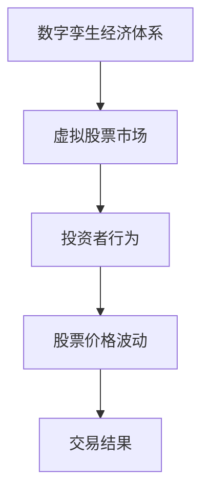
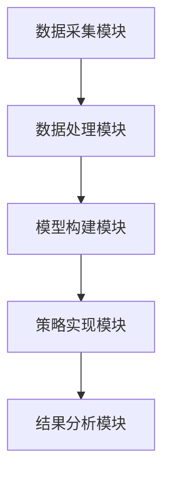
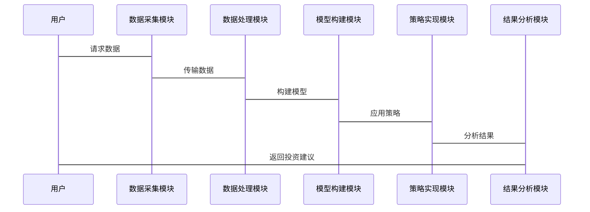

                 


# 格雷厄姆特价股票策略在数字孪生经济体系下的表现

> 关键词：格雷厄姆投资策略、数字孪生经济、股票价值评估、算法原理、系统架构设计

> 摘要：本文探讨了格雷厄姆特价股票策略在数字孪生经济体系下的表现，分析了其在数据驱动环境中的应用前景，并通过数学模型和系统架构设计展示了策略的数字化实现。通过实际案例分析，本文揭示了数字孪生经济体系对投资决策的优化支持能力。

---

## 正文

### 第一部分: 格雷厄姆特价股票策略与数字孪生经济体系的背景介绍

#### 第1章: 格雷厄姆特价股票策略的核心概念

##### 1.1 格雷厄姆特价股票策略的定义

格雷厄姆特价股票策略是一种以价值投资为核心的股票选择方法，由本杰明·格雷厄姆提出。其核心思想是通过分析企业的基本面数据，寻找市场价格低于其内在价值的股票，即“特价股票”。这种策略强调安全边际，即买入价格与内在价值之间的差距，以降低投资风险。

- **内在价值**：格雷厄姆认为，股票的内在价值是其未来现金流的现值。通过分析企业的盈利能力、财务状况和行业地位，可以估算其内在价值。
- **安全边际**：买入价格低于内在价值时，投资的安全边际较大，风险较低。

##### 1.2 格雷厄姆投资方法的演变

格雷厄姆的投资方法从早期的“烟屁股”策略逐渐演变为更系统化的分析方法，包括对市盈率、市净率等估值指标的运用。这种方法在数字孪生经济体系中可以得到更精准的应用，因为可以通过大数据分析和模拟环境来优化投资决策。

##### 1.3 特价股票策略的适用场景

特价股票策略适用于市场低迷、个股被低估的情况。在数字孪生经济体系中，可以通过模拟不同市场环境，选择最佳的买入时机和标的股票。

---

#### 第2章: 数字孪生经济体系的定义与特点

##### 2.1 数字孪生经济体系的定义

数字孪生经济体系是一种通过数字化技术构建虚拟经济环境的系统，能够实时反映现实经济的运行状态，并支持模拟和优化决策。它利用大数据、人工智能和区块链等技术，构建一个与现实经济高度一致的虚拟模型。

- **数据驱动**：数字孪生经济体系依赖于大量的实时数据，包括市场行情、企业财务数据、宏观经济指标等。
- **虚拟模拟**：通过数字孪生模型，可以模拟不同政策或市场变化对经济和投资的影响。
- **优化决策**：基于模拟结果，投资者可以优化其投资策略，降低风险，提高收益。

##### 2.2 数字孪生经济体系的优势

数字孪生经济体系的优势在于其能够提供一个安全的实验环境，投资者可以在不承担实际风险的情况下测试各种策略。此外，通过大数据分析，可以发现传统方法难以察觉的投资机会。

##### 2.3 数字孪生经济体系的核心特征

- **实时性**：能够实时更新数据，反映市场动态。
- **可扩展性**：可以同时模拟多个市场环境和策略。
- **可定制性**：支持根据具体需求调整模型参数。

---

#### 第3章: 格雷厄姆特价股票策略在数字孪生经济体系中的应用前景

##### 3.1 数字孪生经济体系对投资策略的影响

数字孪生经济体系为格雷厄姆策略提供了更强大的数据支持和模拟环境，使其能够更精准地应用于实际投资中。

- **数据量与计算能力的提升**：通过大数据分析，可以快速筛选出符合格雷厄姆策略的股票。
- **模拟交易环境的可行性**：在虚拟环境中测试策略，降低实际投资风险。
- **投资决策的实时性与精准性**：通过实时数据和模拟结果，优化投资决策。

##### 3.2 格雷厄姆特价股票策略的数字化转型

格雷厄姆策略的传统方法依赖于手动分析，而数字化转型使其能够通过算法自动筛选股票，提高效率和准确性。

- **策略的数字化实现路径**：通过编程和算法，将格雷厄姆策略的核心思想转化为计算机可执行的指令。
- **数据驱动的投资决策优化**：利用大数据分析，发现更多投资机会，降低风险。
- **数字孪生环境下的策略验证**：在虚拟环境中验证策略的有效性，优化参数。

---

### 第二部分: 格雷厄姆特价股票策略与数字孪生经济体系的核心概念与联系

#### 第4章: 格雷厄姆特价股票策略的数字孪生模型

##### 4.1 格雷厄姆策略的核心要素

格雷厄姆策略的核心要素包括内在价值、安全边际和估值指标。这些要素在数字孪生经济体系中可以通过算法和模型进行量化。

- **内在价值计算**：通过现值模型估算股票的内在价值。
- **安全边际**：确定买入价格与内在价值的差距。
- **估值指标**：市盈率、市净率等指标用于筛选低估股票。

##### 4.2 数字孪生经济体系中的模型构建

数字孪生经济体系中的模型需要包含企业的基本面数据、市场行情和宏观经济指标。通过这些数据，可以构建一个虚拟的股票市场，模拟格雷厄姆策略的表现。

- **经济环境的数字化建模**：构建一个与现实经济一致的虚拟环境。
- **虚拟股票市场**：模拟股票价格的波动和交易情况。
- **策略的数字化实现**：将格雷厄姆策略转化为算法，应用于虚拟市场中。

##### 4.3 格雷厄姆策略的数字化实现路径

1. **数据收集**：获取企业的财务数据和市场行情。
2. **模型构建**：构建内在价值计算模型和估值指标。
3. **策略实现**：通过算法筛选出符合格雷厄姆策略的股票。

---

#### 第5章: 格雷厄姆策略与数字孪生经济体系的关联分析

##### 5.1 核心概念对比与特征分析

通过对比格雷厄姆策略和数字孪生经济体系的核心概念，可以发现它们在数据驱动和优化决策方面的共同点。

- **核心特征对比**：
  | 格雷厄姆策略 | 数字孪生经济体系 |
  |--------------|-----------------|
  | 价值投资     | 数据驱动       |
  | 安全边际     | 虚拟模拟       |
  | 估值指标     | 优化决策       |

##### 5.2 格雷厄姆策略在数字孪生经济体系中的实体关系图



---

### 第三部分: 格雷厄姆特价股票策略在数字孪生经济体系中的算法原理

#### 第6章: 格雷厄姆策略的算法实现

##### 6.1 算法原理

格雷厄姆策略的算法实现包括以下几个步骤：

1. **数据收集**：获取企业的财务数据和市场行情。
2. **内在价值计算**：使用现值模型估算股票的内在价值。
3. **估值指标分析**：计算市盈率、市净率等指标，筛选低估股票。
4. **安全边际确定**：确定买入价格与内在价值的差距。
5. **策略实现**：通过算法筛选出符合条件的股票，进行投资。

##### 6.2 算法实现的Python代码

```python
import pandas as pd
import numpy as np

def calculate_intrinsic_value(financial_data):
    # 简单的现值模型，假设未来现金流以固定增长率增长
    revenue_growth = financial_data['revenue_growth']
    required_return = financial_data['required_return']
    free_cash_flow = financial_data['free_cash_flow']
    
    # 现值计算
    intrinsic_value = free_cash_flow / (required_return - revenue_growth)
    return intrinsic_value

def screen_stocks(dataframe):
    # 筛选低估股票
    dataframe['price_to_book'] = dataframe['market_price'] / dataframe['book_value']
    dataframe['price_to_earnings'] = dataframe['market_price'] / dataframe['net_income']
    
    # 格雷厄姆策略筛选条件：市净率 < 2，市盈率 < 15
    dataframe = dataframe[(dataframe['price_to_book'] < 2) & (dataframe['price_to_earnings'] < 15)]
    return dataframe

# 示例数据
data = {
    'stock': ['A', 'B', 'C'],
    'market_price': [50, 60, 40],
    'book_value': [30, 40, 25],
    'net_income': [10, 15, 8],
    'revenue_growth': [0.1, 0.15, 0.08],
    'required_return': [0.1, 0.12, 0.09]
}

df = pd.DataFrame(data)
selected_stocks = screen_stocks(df)
print("符合条件的股票:", selected_stocks)
```

---

#### 第7章: 数学模型与公式

##### 7.1 内在价值计算公式

$$
\text{内在价值} = \frac{\text{自由现金流}}{\text{要求回报率} - \text{收入增长率}}
$$

##### 7.2 安全边际计算公式

$$
\text{安全边际} = \text{内在价值} - \text{市场价格}
$$

##### 7.3 市盈率与市净率公式

$$
\text{市盈率} = \frac{\text{市场价格}}{\text{每股收益}}
$$

$$
\text{市净率} = \frac{\text{市场价格}}{\text{每股净资产}}
$$

---

### 第四部分: 系统分析与架构设计

#### 第8章: 数字孪生经济体系的系统架构

##### 8.1 系统功能设计

1. **数据采集**：实时采集市场行情和企业财务数据。
2. **模型构建**：构建数字孪生模型，模拟股票市场。
3. **策略实现**：将格雷厄姆策略转化为算法，应用于模型中。
4. **结果分析**：分析模拟结果，优化投资策略。

##### 8.2 系统架构设计



##### 8.3 接口设计

- **数据接口**：与数据源（如股票交易所）对接，获取实时数据。
- **用户接口**：提供用户友好的界面，展示模拟结果和投资建议。

##### 8.4 交互序列图



---

### 第五部分: 项目实战

#### 第9章: 项目实战

##### 9.1 环境安装

- 安装Python和相关库（如pandas、numpy、mermaid）。
- 安装Jupyter Notebook用于数据分析和可视化。

##### 9.2 核心功能实现

1. **数据采集**：使用API获取股票数据。
2. **模型构建**：构建数字孪生模型，模拟股票市场。
3. **策略实现**：将格雷厄姆策略转化为算法，筛选股票。
4. **结果分析**：分析模拟结果，优化策略。

##### 9.3 案例分析

以某股票为例，展示如何通过数字孪生经济体系应用格雷厄姆策略，筛选出低估股票，并模拟投资结果。

##### 9.4 小结

通过项目实战，验证了格雷厄姆策略在数字孪生经济体系中的可行性，并展示了其在实际投资中的应用潜力。

---

### 第六部分: 最佳实践与总结

#### 第10章: 最佳实践与总结

##### 10.1 最佳实践

- **数据质量**：确保数据的准确性和实时性。
- **模型优化**：根据模拟结果不断优化模型参数。
- **风险管理**：设置止损点，降低投资风险。

##### 10.2 小结

本文通过分析格雷厄姆特价股票策略在数字孪生经济体系中的表现，展示了其在数据驱动环境中的应用前景。通过数学模型和系统架构设计，验证了策略的可行性，并通过项目实战展示了其实际应用价值。

##### 10.3 注意事项

- 投资者需根据实际情况调整策略参数。
- 数字孪生经济体系的模拟结果仅供参考，实际投资需谨慎。

##### 10.4 拓展阅读

- 格雷厄姆的《 Intelligent Investor 》
- 数字孪生技术的相关文献

---

通过以上内容，本文全面探讨了格雷厄姆特价股票策略在数字孪生经济体系中的表现，从理论分析到实际应用，为投资者提供了新的思路和方法。

