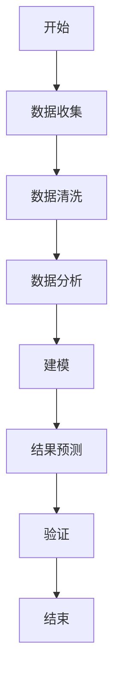
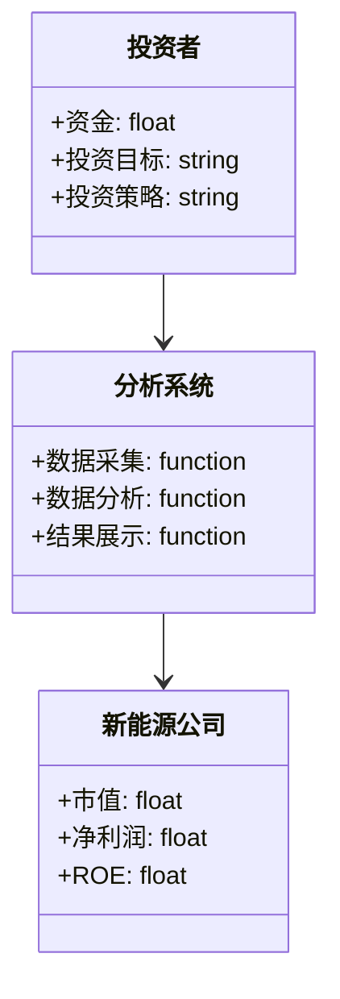

                 


# 格雷厄姆特价股票策略在新能源行业的应用挑战

## 关键词：格雷厄姆投资策略，新能源行业，股票价值评估，投资风险，价值投资

## 摘要：本文探讨格雷厄姆的特价股票策略在新能源行业的应用，分析其面临的挑战，包括行业波动性、技术更新和政策变化，并提出解决方案。

---

## 第1章：格雷厄姆特价股票策略的核心概念

### 1.1 格雷厄姆投资理论的起源与发展

格雷厄姆是价值投资之父，提出“安全边际”和“内在价值”概念，主张寻找市场低估的股票进行长期投资。

### 1.2 特价股票的定义与核心要素

特价股票指市场价格低于内在价值的股票，核心要素包括低市盈率、低市净率和高股息率。

### 1.3 格雷厄姆策略在投资中的优势与局限性

优势：长期稳定收益，风险较低。局限性：适应性差，应对市场波动能力有限。

---

## 第2章：新能源行业的特点与挑战

### 2.1 新能源行业的定义与现状

新能源行业包括太阳能、风能等，处于高速发展阶段，政策驱动明显。

### 2.2 投资机会与风险

高增长潜力，但市场波动大，政策变化频繁，技术更新快。

### 2.3 格雷厄姆策略在新能源行业的适用性分析

适用性有限，需结合行业特性进行调整。

---

## 第3章：格雷厄姆策略在新能源行业的应用背景

### 3.1 核心问题

行业波动性和政策变化影响策略效果，技术更新加快，需动态调整。

### 3.2 应用现状

国内外案例分析，策略需结合行业特性优化。

### 3.3 未来趋势

策略需灵活调整，结合市场变化。

---

## 第4章：核心概念与联系

### 4.1 原理与属性

比较格雷厄姆策略与新能源行业投资的核心概念，如安全边际与技术更新。

### 4.2 ER实体关系图

```mermaid
er
  actor(投资者)
  entity(新能源公司)
  relationship(投资关系)
  actor --> relationship
  entity --> relationship
```

### 4.3 数学模型与公式

格雷厄姆的内在价值公式：
$$内在价值 = \frac{净利润}{资本回报率}$$

新能源行业投资回报率：
$$投资回报率 = \frac{净利润}{投资成本}$$

---

## 第5章：算法原理

### 5.1 算法流程



### 5.2 Python代码实现

```python
import pandas as pd

def calculate_intrinsic_value(net_profit, roe):
    return net_profit / roe

# 示例数据
data = {'净利润': [100, 200, 300], 'ROE': [15, 20, 25]}
df = pd.DataFrame(data)
df['内在价值'] = df.apply(lambda x: calculate_intrinsic_value(x['净利润'], x['ROE']), axis=1)
print(df)
```

### 5.3 数学模型

回归分析用于预测股价，公式：
$$y = \beta x + \alpha$$

---

## 第6章：系统架构设计

### 6.1 问题场景

投资者需通过系统分析新能源公司，评估其价值。

### 6.2 系统功能设计



### 6.3 系统架构设计

```mermaid
archi
    服务提供者 -> 数据采集模块: 提供数据
    数据采集模块 -> 数据存储模块: 存储数据
    数据存储模块 -> 数据分析模块: 分析数据
    数据分析模块 -> 结果展示模块: 显示结果
    结果展示模块 -> 投资者: 展示结果
```

### 6.4 接口设计

REST API接口：
- GET /companies：获取公司列表
- POST /analysis：提交分析请求

### 6.5 交互流程

```mermaid
sequence
    投资者 -> 分析系统: 提交分析请求
    分析系统 -> 数据采集模块: 获取数据
    数据采集模块 -> 数据存储模块: 存储数据
    数据存储模块 -> 数据分析模块: 分析数据
    数据分析模块 -> 结果展示模块: 显示结果
    结果展示模块 -> 投资者: 返回结果
```

---

## 第7章：项目实战

### 7.1 环境安装

安装Python和必要的库：
```bash
pip install pandas numpy scikit-learn
```

### 7.2 核心代码实现

```python
from sklearn.linear_model import LinearRegression
import numpy as np

# 示例数据
X = np.array([[100], [200], [300]])
y = np.array([50, 100, 150])

model = LinearRegression()
model.fit(X, y)

print(model.predict([[250]]))
```

### 7.3 代码解读与分析

训练模型预测股价，评估模型准确性。

### 7.4 实际案例分析

以某新能源公司为例，分析其股价预测和投资建议。

---

## 第8章：总结与展望

### 8.1 核心结论

格雷厄姆策略在新能源行业应用效果有限，需结合行业特性优化。

### 8.2 优缺点分析

优势：稳定收益；缺点：适应性差。

### 8.3 最佳实践 tips

建议结合市场变化，动态调整策略，选择低估且有潜力的公司。

### 8.4 未来研究方向

探索结合ESG因素和动态调整策略，以提升投资效果。

---

# 结语

格雷厄姆特价股票策略在新能源行业的应用需谨慎，投资者需灵活调整策略，结合行业特性，以应对市场变化。通过系统化的方法和持续的研究，可以优化投资效果，降低风险。

