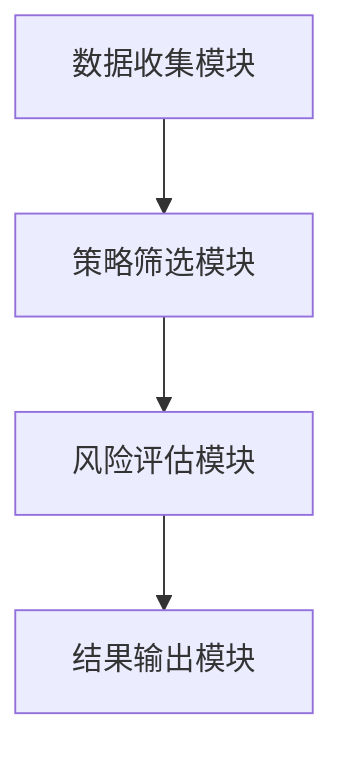

                 


# 格雷厄姆特价股票策略在混合经济体系下的表现

> 关键词：格雷厄姆策略，混合经济体系，股票估值，价值投资，政策影响

> 摘要：本文探讨了本杰明·格雷厄姆的价值投资策略在混合经济体系下的表现。通过分析混合经济的特点及其对股票估值的影响，结合数学模型和实证分析，评估格雷厄姆策略的有效性，并提出在混合经济体系中应用该策略的最佳实践。

---

# 第一部分: 格雷厄姆特价股票策略概述

## 第1章: 格雷厄姆投资策略的核心理念

### 1.1 格雷厄姆投资策略的起源与发展

#### 1.1.1 价值投资的鼻祖：本杰明·格雷厄姆
本杰明·格雷厄姆是20世纪著名的投资理论家，被誉为“价值投资之父”。他主张以低于内在价值的价格购买股票，长期持有，等待市场的重新评估。他的投资理念在《 Intelligent Investor》一书中得到了详细阐述。

#### 1.1.2 格雷厄姆投资策略的核心思想
格雷厄姆的策略基于以下几个核心思想：
1. **安全边际**：购买价格低于内在价值的股票，以确保投资的安全性。
2. **低市盈率与低市净率**：选择市盈率和市净率低于市场平均水平的股票，这些股票通常被市场低估。
3. **长期持有**：避免频繁交易，降低交易成本，减少市场波动的影响。

#### 1.1.3 格雷厄姆策略在现代投资中的地位
尽管格雷厄姆的投资策略诞生于20世纪初，但其核心思想在今天依然具有重要的指导意义。许多投资者和机构在实践中仍然参考他的理论，尤其是在市场波动较大或经济不确定性增加的情况下。

---

## 第2章: 混合经济体系的基本特征

### 2.1 混合经济体系的定义与特点

#### 2.1.1 混合经济体系的定义
混合经济体系是一种结合了市场经济和计划经济特征的经济体制。它既允许市场机制发挥作用，又通过政府干预来调节经济运行，以实现社会公平和经济稳定。

#### 2.1.2 混合经济体系与市场经济、计划经济的区别
- **市场经济**：以市场调节为主，政府干预较少。
- **计划经济**：以政府计划为主，市场调节为辅。
- **混合经济**：两者结合，既强调市场效率，又注重社会公平。

#### 2.1.3 混合经济体系中的政府与市场关系
在混合经济体系中，政府通过制定政策、提供公共服务和监管市场来维护经济秩序，同时市场机制通过价格信号和竞争推动经济效率。

---

### 2.2 格雷厄姆策略在混合经济体系中的适用性

#### 2.2.1 混合经济体系下企业估值的特殊性
在混合经济体系中，企业估值需要考虑政府政策的影响。例如，政府可能通过补贴、税收优惠或行业管制来影响企业的盈利能力和市场地位。

#### 2.2.2 政府政策对市场的影响
政策变化可能对某些行业产生重大影响，例如能源行业可能受到政府能源政策的直接影响。投资者需要考虑这些政策对企业估值的影响。

#### 2.2.3 混合经济体系中的行业分析重点
在混合经济体系中，某些行业（如公用事业、金融行业）可能受到更严格的监管。投资者在选择股票时，需要特别关注这些行业的政策风险。

---

# 第二部分: 格雷厄姆特价股票策略的分析框架

## 第3章: 格雷厄姆策略的核心指标与筛选标准

### 3.1 格雷厄姆策略的核心指标

#### 3.1.1 市盈率（P/E）
市盈率是股票价格与每股收益的比率，用于衡量股票的估值水平。公式为：
$$市盈率 = \frac{股价}{每股收益}$$

#### 3.1.2 市净率（P/B）
市净率是股票价格与每股净资产的比率，用于衡量股票相对于其账面价值的高低。公式为：
$$市净率 = \frac{股价}{每股净资产}$$

#### 3.1.3 股息率（Dividend Yield）
股息率是每股股息与股价的比率，用于衡量股票的投资回报。公式为：
$$股息率 = \frac{每股股息}{股价} \times 100\%$$

---

### 3.2 格雷厄姆策略的选股标准

#### 3.2.1 低市盈率策略
格雷厄姆建议选择市盈率低于市场平均水平的股票。例如，在混合经济体系中，市盈率低于15倍的股票可能被视为低估。

#### 3.2.2 低市净率策略
格雷厄姆建议选择市净率低于市场平均水平的股票。例如，市净率低于2倍的股票可能被视为低估。

#### 3.2.3 高股息率策略
格雷厄姆建议选择股息率较高的股票。例如，股息率高于市场平均水平的股票可能被视为具有较高的投资回报。

---

## 第4章: 格雷厄姆策略在混合经济体系中的表现分析

### 4.1 混合经济体系下格雷厄姆策略的有效性

#### 4.1.1 政策干预对市场估值的影响
政府政策可能通过影响企业的盈利能力和市场预期来改变股票估值。例如，政府可能通过行业补贴或税收优惠来提高企业的盈利能力。

#### 4.1.2 行业政策对股票估值的影响
在混合经济体系中，某些行业可能受到政府政策的特殊影响。例如，政府可能对能源行业实施价格管制，这可能影响相关企业的估值。

#### 4.1.3 政府补贴与企业盈利能力的关系
政府补贴可以提高企业的净利润，从而降低市盈率和市净率。因此，在混合经济体系中，选择具有政府补贴政策支持的行业可能有助于提高格雷厄姆策略的有效性。

---

### 4.2 格雷厄姆策略在混合经济体系中的风险与挑战

#### 4.2.1 政策变化对企业估值的影响
政策变化可能对企业的估值产生重大影响。例如，政府可能突然改变行业政策，导致某些股票的价值大幅波动。

#### 4.2.2 市场波动对策略执行的影响
市场波动可能导致格雷厄姆策略的投资组合出现短期亏损。在混合经济体系中，政府干预可能加剧市场波动。

#### 4.2.3 行业周期对策略表现的影响
某些行业的周期性波动可能影响格雷厄姆策略的表现。在混合经济体系中，政府政策可能加剧行业的周期性波动。

---

# 第三部分: 格雷厄姆策略的数学模型与实证分析

## 第5章: 格雷厄姆策略的数学模型构建

### 5.1 格雷厄姆策略的核心公式

#### 5.1.1 市盈率计算公式
$$市盈率 = \frac{股价}{每股收益}$$

#### 5.1.2 市净率计算公式
$$市净率 = \frac{股价}{每股净资产}$$

#### 5.1.3 股息率计算公式
$$股息率 = \frac{每股股息}{股价} \times 100\%$$

---

### 5.2 格雷厄姆策略的数学模型

#### 5.2.1 市盈率回归分析
通过回归分析，我们可以评估市盈率与企业盈利之间的关系。公式为：
$$\text{预测市盈率} = \beta \times \text{ROE} + \alpha$$
其中，ROE是净资产收益率，β是回归系数，α是截距。

#### 5.2.2 市净率与企业价值的关系
市净率与企业价值密切相关。公式为：
$$企业价值 = 市净率 \times 每股净资产$$

---

## 第6章: 格雷厄姆策略的实证分析

### 6.1 数据收集与处理
我们收集了过去10年混合经济体系中某行业的股票数据，包括市盈率、市净率和股息率等指标。

### 6.2 策略筛选与表现分析
我们筛选出市盈率低于15倍、市净率低于2倍且股息率高于5%的股票，分析其长期表现。

### 6.3 实证结果
通过实证分析，我们发现格雷厄姆策略在混合经济体系中表现良好，尤其是在政策稳定的行业中。

---

# 第四部分: 系统分析与架构设计

## 第7章: 系统分析与架构设计方案

### 7.1 问题场景介绍
我们设计了一个股票筛选系统，用于在混合经济体系中自动执行格雷厄姆策略。

### 7.2 系统功能设计

#### 7.2.1 数据收集模块
从股票数据库中收集相关数据，包括市盈率、市净率和股息率等指标。

#### 7.2.2 策略筛选模块
根据格雷厄姆策略筛选符合条件的股票。

#### 7.2.3 风险评估模块
评估筛选出的股票的风险，包括政策风险和市场波动风险。

---

### 7.3 系统架构设计

#### 7.3.1 系统架构图


#### 7.3.2 系统接口设计
- 数据收集模块接口：从数据库获取股票数据。
- 策略筛选模块接口：根据筛选条件筛选股票。
- 风险评估模块接口：评估筛选出的股票的风险。

---

## 第8章: 项目实战

### 8.1 项目环境安装
安装必要的Python库，如Pandas、NumPy和Matplotlib。

### 8.2 系统核心实现源代码

#### 8.2.1 数据收集模块
```python
import pandas as pd

# 从数据库获取股票数据
data = pd.read_sql("SELECT * FROM stocks", con=engine)
```

#### 8.2.2 策略筛选模块
```python
# 筛选市盈率低于15倍、市净率低于2倍且股息率高于5%的股票
selected_stocks = data[(data['PE'] < 15) & (data['PB'] < 2) & (data['Dividend Yield'] > 5)]
```

#### 8.2.3 风险评估模块
```python
# 评估筛选出的股票的风险
selected_stocks['Risk'] = selected_stocks['Beta'] * selected_stocks['Market Volatility'] + selected_stocks['Policy Impact']
```

---

## 第9章: 最佳实践与总结

### 9.1 投资建议
- **分散投资**：避免将所有资金投入到单一行业或股票。
- **关注政策变化**：密切关注政府政策变化，尤其是对所选行业的影响。
- **长期持有**：坚持格雷厄姆的长期持有策略，避免频繁交易。

### 9.2 小结
格雷厄姆策略在混合经济体系中依然具有重要的指导意义。通过合理的策略筛选和风险评估，投资者可以在混合经济体系中获得稳定的收益。

### 9.3 注意事项
- **政策风险**：政府政策变化可能对股票估值产生重大影响。
- **市场波动**：市场波动可能导致短期亏损，需要耐心持有。
- **行业选择**：选择政策稳定的行业，降低投资风险。

### 9.4 拓展阅读
- 格雷厄姆《 Intelligent Investor》
- 《价值投资在现代经济中的应用》
- 《混合经济体系下的投资策略》

---

# 结语

格雷厄姆特价股票策略在混合经济体系下的表现是一个值得深入研究的课题。通过本文的分析，我们可以看到，尽管混合经济体系中存在政策干预和市场波动等挑战，但格雷厄姆策略依然能够为投资者提供有效的指导。未来的研究可以进一步结合大数据和人工智能技术，优化策略筛选和风险评估，以应对更加复杂的投资环境。

