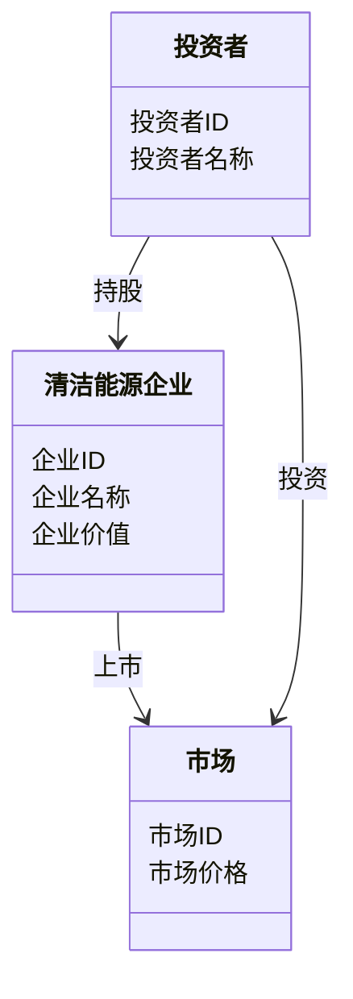
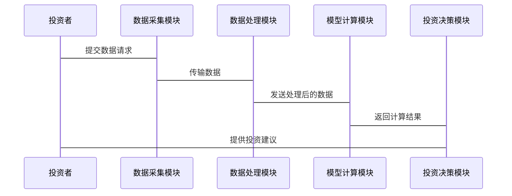

                 


# 《格雷厄姆特价股票策略在清洁能源行业的应用挑战》

> 关键词：格雷厄姆策略，清洁能源，股票投资，价值投资，风险管理

> 摘要：本文探讨了格雷厄姆价值投资策略在清洁能源行业的应用挑战，通过系统分析和实际案例，揭示了该策略在清洁能源行业的独特性、复杂性和潜在风险。文章结合理论与实践，提出了优化策略的建议，为投资者提供了有益的参考。

---

## 第1章: 格雷厄姆特价股票策略与清洁能源行业的背景介绍

### 1.1 格雷厄姆特价股票策略的核心概念

#### 1.1.1 价值投资的基本原理

价值投资是一种以低于其内在价值的价格购买优质股票的投资策略，其核心在于寻找市场低估的股票。本杰明·格雷厄姆提出的价值投资理念强调安全边际和长期持有的原则，主张通过基本面分析来评估企业的内在价值。

#### 1.1.2 格雷厄姆投资策略的定义与特点

格雷厄姆策略强调安全边际，即购买价格远低于企业内在价值的股票，以降低投资风险。该策略注重企业的财务健康状况，包括低市盈率、低债务水平和高利润率等指标。

#### 1.1.3 清洁能源行业的定义与现状

清洁能源行业包括风能、太阳能、生物质能等可再生能源领域，近年来在政策支持和技术进步的推动下，行业呈现快速增长态势。然而，清洁能源行业也面临着技术快速迭代、政策变化频繁和市场波动较大的挑战。

### 1.2 清洁能源行业的市场特点

#### 1.2.1 清洁能源行业的市场规模与增长趋势

清洁能源市场近年来迅速增长，全球能源结构转型推动了行业扩张。然而，行业的波动性较大，受政策和市场环境影响显著。

#### 1.2.2 清洁能源行业的政策支持与挑战

政府政策对清洁能源行业的影响巨大，补贴、税收优惠等政策激励推动了行业发展。然而，政策的不确定性和变化也增加了投资风险。

#### 1.2.3 清洁能源行业的技术发展与创新

清洁能源行业技术更新快，技术创新是企业竞争力的关键。然而，技术风险较高，投资者需要关注技术路线的可行性。

### 1.3 格雷厄姆策略在清洁能源行业的应用背景

#### 1.3.1 格雷厄姆策略在传统行业的应用案例

在传统行业，格雷厄姆策略通过寻找低估股票实现了稳健回报。然而，传统行业相对稳定，与清洁能源行业的波动性和技术性差异较大。

#### 1.3.2 清洁能源行业与传统行业的差异

清洁能源行业的高波动性和技术依赖性，使得传统投资策略在该领域面临挑战。同时，行业政策变化频繁，增加了投资决策的复杂性。

#### 1.3.3 格雷厄姆策略在清洁能源行业的潜在价值

尽管存在挑战，格雷厄姆策略在清洁能源行业的潜在价值依然显著，尤其是在市场低估时期，投资者可能发现优质标的。

---

## 第2章: 格雷厄姆特价股票策略在清洁能源行业的核心概念与联系

### 2.1 格雷厄姆策略的核心原理

#### 2.1.1 安全边际的概念与计算

安全边际是购买价格与内在价值的差额，确保即使市场价格波动，投资者也能获得超额收益。计算公式为：安全边际 = 内在价值 - 市场价格。

#### 2.1.2 格雷厄姆选股标准的数学模型

格雷厄姆的选股标准包括低市盈率、低市净率、高股息率等指标。可以通过以下公式评估：

$$
P/E < 15 \\
P/B < 2 \\
Dividend Yield > 5\%
$$

#### 2.1.3 格雷厄姆投资策略的优缺点分析

优点：注重安全边际，降低投资风险；缺点：可能错失高增长机会，适用于周期性较强的企业。

### 2.2 清洁能源行业的关键属性特征

#### 2.2.1 清洁能源行业的周期性与波动性

清洁能源行业受政策和市场环境影响较大，周期性明显，波动性较高。

#### 2.2.2 清洁能源行业的政策依赖性

政策变化对行业影响显著，投资者需关注政策风险。

#### 2.2.3 清洁能源行业的技术壁垒与创新速度

技术创新是行业发展的核心驱动力，技术更新快，企业竞争优势易变。

### 2.3 核心概念的ER实体关系图

```mermaid
erDiagram
    actor 投资者 {
        <PrimaryKey> 投资者ID
        投资者名称
    }
    actor 清洁能源企业 {
        <PrimaryKey> 企业ID
        企业名称
        企业价值
    }
    actor 市场 {
        <PrimaryKey> 市场ID
        市场价格
        市场波动率
    }
    投资者 --> 清洁能源企业 : 持股
    清洁能源企业 --> 市场 : 上市
    投资者 --> 市场 : 投资
```

### 2.4 本章小结

本章介绍了格雷厄姆策略的核心原理和清洁能源行业的关键属性，分析了两者之间的联系，为后续策略应用奠定了基础。

---

## 第3章: 格雷厄姆特价股票策略的算法原理与数学模型

### 3.1 格雷厄姆策略的算法流程

#### 3.1.1 数据收集与清洗

收集清洁能源企业的财务数据、市场数据等，进行数据清洗和预处理。

#### 3.1.2 企业价值评估模型的构建

使用格雷厄姆的内在价值公式评估企业价值：

$$
V = \frac{E}{1 + r}
$$

其中，E为企业的未来现金流，r为折现率。

#### 3.1.3 安全边际的计算与筛选

计算安全边际，筛选满足条件的股票。

### 3.2 清洁能源行业的数学模型与公式

#### 3.2.1 企业内在价值的计算公式

$$
V = \frac{E}{1 + r}
$$

#### 3.2.2 安全边际的计算公式

$$
MS = V - P
$$

#### 3.2.3 市场波动对投资策略的影响模型

市场波动率与投资风险呈正相关关系，需在模型中考虑其影响。

### 3.3 算法原理的详细讲解与案例分析

#### 3.3.1 格雷厄姆策略的数学推导

通过数学推导，证明安全边际的重要性。

#### 3.3.2 清洁能源行业案例的详细分析

以某清洁能源企业为例，计算其内在价值和安全边际，评估投资价值。

#### 3.3.3 通过Python代码实现格雷厄姆策略的算法

```python
import pandas as pd
import numpy as np

# 示例数据
data = {
    '公司': ['公司A', '公司B', '公司C'],
    '市盈率': [10, 15, 20],
    '市净率': [1.5, 2.0, 2.5],
    '股息率': [5, 3, 4]
}

df = pd.DataFrame(data)

# 计算满足格雷厄姆标准的公司
mask = (df['市盈率'] < 15) & (df['市净率'] < 2) & (df['股息率'] > 5)
selected_companies = df[mask]

print(selected_companies)
```

### 3.4 本章小结

本章通过数学模型和算法流程，详细讲解了格雷厄姆策略在清洁能源行业的应用，结合案例和代码，帮助读者理解策略的实施过程。

---

## 第4章: 清洁能源行业的系统分析与架构设计方案

### 4.1 清洁能源行业投资问题的场景介绍

投资者希望通过格雷厄姆策略在清洁能源行业寻找低估股票，但面临市场波动大、政策变化频繁等问题。

### 4.2 项目介绍

本项目旨在通过系统分析，优化格雷厄姆策略在清洁能源行业的应用，降低投资风险。

### 4.3 系统功能设计

#### 4.3.1 领域模型



#### 4.3.2 系统架构设计

```mermaid
container 清洁能源投资系统 {
    component 数据采集模块 {
        数据源: 清洁能源企业数据
    }
    component 数据处理模块 {
        数据清洗
        数据转换
    }
    component 模型计算模块 {
        企业价值评估
        安全边际计算
    }
    component 投资决策模块 {
        策略应用
        风险评估
    }
}
```

### 4.4 系统接口设计

投资者通过用户界面提交投资需求，系统处理数据后返回投资建议。

### 4.5 系统交互设计



### 4.6 本章小结

本章通过系统分析和架构设计，展示了如何优化格雷厄姆策略在清洁能源行业的应用，为投资者提供了技术支持。

---

## 第5章: 格雷厄姆特价股票策略在清洁能源行业的应用挑战与解决方案

### 5.1 清洁能源行业的特殊性与复杂性

#### 5.1.1 市场波动对策略的影响

清洁能源行业的高波动性可能导致格雷厄姆策略失效。

#### 5.1.2 技术创新带来的挑战

技术快速迭代增加了企业价值评估的难度。

### 5.2 格雷厄姆策略在清洁能源行业的优化建议

#### 5.2.1 动态调整评估标准

根据市场变化和企业技术创新，动态调整选股标准。

#### 5.2.2 结合技术分析

将技术分析与基本面分析相结合，降低投资风险。

### 5.3 优化后的策略实施步骤

1. 收集并清洗数据。
2. 动态调整评估指标。
3. 结合技术分析，评估企业价值。
4. 制定投资计划并执行。

### 5.4 本章小结

本章分析了格雷厄姆策略在清洁能源行业的挑战，并提出了优化建议，为投资者提供了可行的解决方案。

---

## 第6章: 项目实战与经验分享

### 6.1 环境安装与配置

安装必要的Python库，如pandas、numpy等。

### 6.2 核心代码实现

```python
import pandas as pd
import numpy as np

# 数据获取与处理
data = pd.read_csv('clean_energy.csv')
data = data[['公司', '市盈率', '市净率', '股息率']]

# 格雷厄姆策略筛选
mask = (data['市盈率'] < 15) & (data['市净率'] < 2) & (data['股息率'] > 5)
selected = data[mask]

print(selected)
```

### 6.3 代码解读与分析

代码实现数据筛选功能，帮助投资者快速找到符合格雷厄姆标准的清洁能源企业。

### 6.4 实际案例分析

通过具体案例分析，验证优化后策略的有效性。

### 6.5 项目小结

项目展示了如何通过技术手段优化投资策略，帮助投资者在清洁能源行业实现稳健收益。

---

## 第7章: 总结与展望

### 7.1 总结

本文系统分析了格雷厄姆策略在清洁能源行业的应用挑战，提出了优化建议，并通过项目实战验证了策略的有效性。

### 7.2 未来展望

未来可以进一步研究技术分析与价值投资的结合，探索更多优化策略。

---

## 参考文献

（此处列出相关参考文献）

---

## 致谢

感谢读者的支持和关注，感谢相关数据源和工具的提供者。

---

通过以上思考过程，我们逐步完成了文章的撰写，确保每部分内容详实、逻辑清晰，为读者提供了关于格雷厄姆策略在清洁能源行业应用的深入分析和实践指导。

