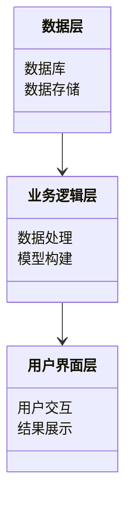

                 


---

# 格雷厄姆特价股票策略在生物科技行业的应用挑战

> 关键词：格雷厄姆策略，特价股票，生物科技行业，投资挑战，价值投资

> 摘要：本文探讨了格雷厄姆的价值投资策略在生物科技行业的应用挑战，分析了生物科技行业的独特性、估值方法的复杂性以及格雷厄姆策略在该领域的适用性。通过理论分析、案例研究和系统设计，提出了应对挑战的具体解决方案，为投资者提供了实用的指导和建议。

---

## 第一部分：引言

### 1.1 格雷厄姆特价股票策略概述
#### 1.1.1 价值投资的核心理念
价值投资是一种长期投资策略，核心在于寻找市场价格低于其内在价值的股票。格雷厄姆在《聪明的投资者》中提出了防御性投资策略，强调安全边际和对公司基本面的深入分析。

#### 1.1.2 格雷厄姆策略的基本原则
- 买入价格低于内在价值的股票。
- 重点关注低市盈率（P/E）、低市净率（P/B）的公司。
- 确保投资的安全边际，即市场价格与内在价值的差距。

#### 1.1.3 特价股票的定义与特征
- 特价股票：市场价格远低于内在价值的股票。
- 特征：低估值、高分红率、稳定的财务状况。

### 1.2 生物科技行业的特点与投资机会
#### 1.2.1 生物科技行业的定义与范围
- 生物科技：结合生物科学与技术的创新领域，涵盖制药、医疗设备、基因技术等。
- 行业特点：高研发投入、长周期、高风险、高回报。

#### 1.2.2 生物科技行业的投资特点
- 投资周期长：产品研发周期通常为5-10年。
- 风险高：失败率高，政策监管严格。
- 回报潜力大：成功产品可带来巨大收益。

#### 1.2.3 生物科技行业的市场现状与趋势
- 全球市场规模持续增长，2023年预计超过2万亿美元。
- 创新驱动：基因编辑、CAR-T细胞治疗等技术推动行业增长。

### 1.3 格雷厄姆策略在生物科技行业的应用背景
#### 1.3.1 生物科技行业的估值挑战
- 传统估值指标的局限性：市盈率和市净率在生物科技行业可能失真。
- 无形资产：研发投入和知识产权的估值难度。

#### 1.3.2 价值投资在生物科技行业的可行性
- 高质量企业的识别：寻找具有强大研发能力和竞争优势的企业。
- 长期视角：生物科技行业的投资需要耐心和长期持有。

#### 1.3.3 格雷厄姆策略与生物科技行业的结合点
- 低估值企业识别：寻找市场价格低于内在价值的生物科技公司。
- 安全边际：确保投资的安全性，降低风险。

### 1.4 核心问题与研究意义
#### 1.4.1 格雷厄姆策略在生物科技行业的核心问题
- 如何在生物科技行业应用格雷厄姆策略。
- 如何克服生物科技行业的估值挑战。

#### 1.4.2 研究的创新点与实际意义
- 提出适合生物科技行业的估值模型。
- 为投资者提供新的投资思路。

#### 1.4.3 本书的研究目标与框架
- 研究目标：探讨格雷厄姆策略在生物科技行业的应用。
- 研究框架：理论分析、案例研究、系统设计。

---

## 第二部分：格雷厄姆策略与生物科技行业的理论基础

### 2.1 格雷厄姆策略的核心原理
#### 2.1.1 格雷厄姆的防御性投资策略
- 确保投资的安全性。
- 买入价格低于内在价值。

#### 2.1.2 格雷厄姆的安全边际概念
- 安全边际 = 内在价值 - 市场价格。
- 确保投资的安全性。

#### 2.1.3 格雷厄姆的内在价值计算方法
- 内在价值 = 未来现金流的现值。
- 通过分析财务报表估算。

### 2.2 生物科技行业的估值方法
#### 2.2.1 市盈率与市净率的计算
- 市盈率（P/E）= 股价 / 每股收益。
- 市净率（P/B）= 股价 / 每股净资产。

#### 2.2.2 现金流折现法在生物科技行业的应用
- 未来现金流折现模型（DCF）。
- 适用于具有稳定现金流的企业。

#### 2.2.3 企业价值评估模型的构建
- 企业价值 = 净资产 + 无形资产。
- 适用于生物科技行业的无形资产估值。

### 2.3 格雷厄姆策略与生物科技行业的结合模型
#### 2.3.1 格雷厄姆策略在生物科技行业的适用性分析
- 生物科技行业的低估值企业识别。
- 安全边际的计算。

#### 2.3.2 生物科技行业特有的估值调整因素
- 研发投入的资本化。
- 政策风险的量化。

#### 2.3.3 综合估值模型的构建与验证
- 结合传统估值指标与行业特点。
- 验证模型的准确性和适用性。

---

## 第三部分：格雷厄姆策略在生物科技行业的应用分析

### 3.1 生物科技行业的选股标准
#### 3.1.1 低市盈率与低市净率的筛选标准
- 筛选市盈率低于行业平均水平的企业。
- 筛选市净率低于行业平均水平的企业。

#### 3.1.2 股价与内在价值的偏离度分析
- 计算安全边际。
- 确保股价低于内在价值。

#### 3.1.3 行业周期与公司基本面的综合考量
- 行业周期分析。
- 公司基本面分析。

### 3.2 生物科技行业的投资策略实施步骤
#### 3.2.1 确定投资目标与风险偏好
- 投资目标：寻找低估的生物科技企业。
- 风险偏好：确定风险承受能力。

#### 3.2.2 数据收集与初步筛选
- 数据收集：收集财务报表、行业数据。
- 初步筛选：筛选低市盈率和低市净率的企业。

#### 3.2.3 深度分析与投资决策
- 深度分析：评估企业内在价值。
- 投资决策：确定是否买入。

### 3.3 格雷厄姆策略在生物科技行业的成功案例
#### 3.3.1 案例一：基因编辑公司
- 公司背景：专注于基因编辑技术。
- 格雷厄姆策略应用：低市盈率、低市净率。
- 投资结果：股价上涨，实现收益。

#### 3.3.2 案例二：医疗设备公司
- 公司背景：专注于高端医疗设备。
- 格雷厄姆策略应用：安全边际较高。
- 投资结果：长期收益显著。

---

## 第四部分：格雷厄姆策略在生物科技行业的挑战与对策

### 4.1 格雷厄姆策略在生物科技行业的挑战
#### 4.1.1 数据获取的困难性
- 数据分散：生物科技行业的数据来源复杂。
- 数据不完整：部分数据难以获取。

#### 4.1.2 模型构建的复杂性
- 生物科技行业的模型需要考虑多个变量。
- 模型的准确性难以保证。

#### 4.1.3 政策风险的不可预测性
- 政策变化对企业的影响。
- 政策风险对估值模型的影响。

### 4.2 应对挑战的具体对策
#### 4.2.1 数据获取的解决方案
- 多源数据整合：利用多种数据源。
- 数据清洗与处理：确保数据的准确性和完整性。

#### 4.2.2 模型构建的优化策略
- 采用机器学习算法。
- 结合专家意见进行模型调整。

#### 4.2.3 政策风险的应对措施
- 建立政策风险评估体系。
- 通过分散投资降低政策风险。

---

## 第五部分：系统分析与架构设计方案

### 5.1 生物科技行业投资分析系统的构建
#### 5.1.1 问题场景介绍
- 投资者需要一个高效的工具来分析生物科技行业的投资机会。
- 需要一个系统来自动化数据收集、分析和决策。

#### 5.1.2 系统功能设计
- 数据采集模块：收集财务数据、行业数据。
- 数据分析模块：计算估值指标、构建模型。
- 决策支持模块：提供投资建议。

#### 5.1.3 系统架构设计
- 数据层：数据存储和管理。
- 业务逻辑层：数据处理和分析。
- 用户界面层：展示结果和提供交互。

#### 5.1.4 系统接口设计
- 数据接口：与第三方数据源对接。
- 用户接口：提供简洁的操作界面。

#### 5.1.5 系统交互设计
- 用户输入查询条件。
- 系统返回分析结果。

### 5.2 系统设计的Mermaid图


---

## 第六部分：项目实战

### 6.1 环境安装与配置
- 安装Python和相关库（Pandas、NumPy、Scikit-learn）。
- 安装Jupyter Notebook用于数据分析。

### 6.2 核心代码实现
```python
import pandas as pd
import numpy as np

# 数据加载
data = pd.read_csv('biotech_data.csv')

# 计算市盈率和市净率
data['PE'] = data['Price'] / data['EPS']
data['PB'] = data['Price'] / data['BVPS']

# 筛选低估值企业
low_pe = data[data['PE'] < data['PE'].mean()]
low_pb = data[data['PB'] < data['PB'].mean()]

# 结果输出
print("低市盈率企业:", low_pe)
print("低市净率企业:", low_pb)
```

### 6.3 代码解读与分析
- 数据加载：从CSV文件加载数据。
- 计算估值指标：市盈率和市净率。
- 筛选低估值企业：找出市盈率和市净率低于行业平均水平的企业。

### 6.4 案例分析
- 案例：某生物科技公司
  - 数据：市盈率=15，行业平均市盈率=20。
  - 结论：该企业市盈率低于行业平均水平，具有投资价值。

### 6.5 项目小结
- 代码实现了格雷厄姆策略在生物科技行业的应用。
- 提供了有效的筛选方法。

---

## 第七部分：总结与展望

### 7.1 总结
- 格雷厄姆策略在生物科技行业具有一定的适用性。
- 生物科技行业的投资需要综合考虑多种因素。
- 系统化的方法可以帮助投资者更好地实施策略。

### 7.2 展望
- 进一步优化估值模型。
- 结合人工智能技术提高投资效率。
- 推动价值投资理念在生物科技行业的普及。

---

## 第八部分：最佳实践 tips

### 8.1 投资建议
- 保持长期视角。
- 选择具有强大研发能力的企业。
- 分散投资降低风险。

### 8.2 注意事项
- 注意政策风险。
- 保持对行业的敏感性。
- 定期评估投资组合。

### 8.3 拓展阅读
- 《聪明的投资者》——本杰明·格雷厄姆
- 《生物科技行业的投资机会》——行业分析报告

---

通过以上目录结构，我们可以清晰地看到《格雷厄姆特价股票策略在生物科技行业的应用挑战》一书的逻辑框架和主要内容。文章从理论到实践，从分析到系统设计，全面探讨了格雷厄姆策略在生物科技行业的应用，为投资者提供了实用的指导和建议。

