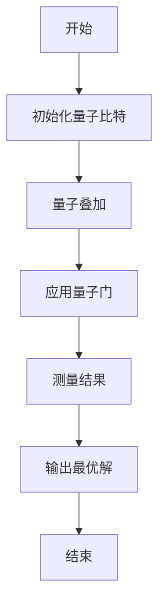
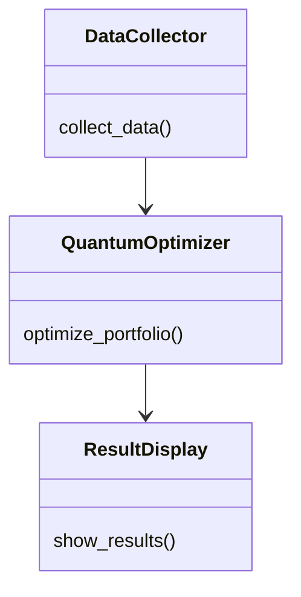

                 


# 格雷厄姆特价股票策略在量子计算时代的潜在应用

## 关键词：格雷厄姆策略，量子计算，投资组合优化，价值投资，大数据分析

## 摘要：  
本文探讨了格雷厄姆价值投资策略在量子计算时代的潜在应用。通过分析量子计算的基本原理及其在金融领域的优势，本文提出了如何利用量子计算优化格雷厄姆策略，包括投资组合优化、风险评估和市场预测等方面。文章结合理论与实践，详细阐述了量子算法在投资决策中的应用，并通过案例分析展示了其实际效果。

---

## 第1章: 格雷厄姆特价股票策略与量子计算概述

### 1.1 格雷厄姆投资理论的背景与核心思想

#### 1.1.1 价值投资的起源与发展  
价值投资是一种基于对公司内在价值的评估来决定投资行为的策略，由本杰明·格雷厄姆在20世纪初提出。格雷厄姆强调以低于内在价值的价格买入股票，长期持有，等待市场重新评估其价值。这种方法在当时被认为是稳健的投资策略，尤其在市场波动较大时表现突出。

#### 1.1.2 格雷厄姆投资策略的核心要素  
格雷厄姆策略的核心在于“安全边际”和“内在价值”两个概念：  
1. **内在价值**：指公司未来现金流的现值，是衡量股票价值的基准。  
2. **安全边际**：指买入价格与内在价值之间的折扣，确保即使市场波动，投资者也能获得正收益。  

格雷厄姆策略还强调分散投资和长期持有，以降低风险并避免短期市场的波动影响。

#### 1.1.3 特价股票的定义与识别标准  
特价股票是指市场价格显著低于其内在价值的股票。识别标准包括：  
1. 市净率（P/B）低于行业平均水平。  
2. 市盈率（P/E）低于行业平均水平。  
3. 股价低于每股净资产（NAV）。  

### 1.2 量子计算的基本原理

#### 1.2.1 量子计算的定义与特点  
量子计算是一种利用量子力学原理进行计算的技术，其核心是利用量子叠加和量子纠缠的特性来处理信息。与经典计算机相比，量子计算机在处理特定问题时具有指数级的计算速度优势。

#### 1.2.2 量子计算与经典计算的主要区别  
1. **量子叠加**：量子计算机可以同时处理多种状态，而经典计算机只能逐个处理。  
2. **量子纠缠**：量子比特之间的纠缠使得信息传递速度远超经典计算机。  
3. **并行计算**：量子计算机可以在同一时间处理大量数据，适合复杂的优化问题。  

#### 1.2.3 量子计算在金融领域的潜在应用  
1. **投资组合优化**：利用量子算法优化投资组合的收益与风险比。  
2. **市场预测**：通过量子并行性加速市场趋势的预测。  
3. **风险管理**：快速评估市场波动对投资组合的影响。  

---

## 第2章: 格雷厄姆策略与量子计算的结合潜力

### 2.1 格雷厄姆策略在现代金融中的局限性

#### 2.1.1 传统价值投资的挑战  
1. **数据量增加**：现代金融市场数据量巨大，传统方法难以高效处理。  
2. **计算复杂度**：内在价值的计算需要处理大量非结构化数据，传统方法效率低下。  
3. **市场波动加快**：高频交易和算法交易使得市场波动更加剧烈，传统策略难以及时调整。  

#### 2.1.2 数据量与计算复杂度的限制  
传统格雷厄姆策略依赖于对财务报表的分析，但在大数据时代，需要处理更多非结构化数据（如新闻、社交媒体数据），这对传统方法是巨大的挑战。

#### 2.1.3 传统模型在高速市场中的不足  
传统模型的计算速度和处理能力难以满足高频交易的需求，且难以实时捕捉市场波动。

### 2.2 量子计算如何提升投资决策的效率

#### 2.2.1 量子计算在大数据分析中的优势  
1. **并行处理**：量子计算机可以同时处理大量数据，适合大数据分析。  
2. **优化算法**：量子优化算法可以快速找到最优解，提高投资组合效率。  

#### 2.2.2 量子计算与投资组合优化  
量子计算机可以通过量子退火算法（Quantum Annealing）优化投资组合的收益与风险比。例如，利用量子计算机优化股票权重，以最小化风险并最大化收益。

#### 2.2.3 量子计算在风险管理中的潜在价值  
量子计算机可以实时评估市场波动对投资组合的影响，帮助投资者快速调整策略。

---

## 第3章: 格雷厄姆策略与量子计算的理论框架

### 3.1 格雷厄姆策略的数学模型

#### 3.1.1 股票内在价值的计算公式  
内在价值（V）的计算公式可以表示为：  
$$ V = \frac{CF}{r - g} $$  
其中，CF是公司未来现金流，r是贴现率，g是增长率。

#### 3.1.2 安全边际的量化方法  
安全边际（M）的计算公式为：  
$$ M = V - P $$  
其中，P是市场价格，V是内在价值。

#### 3.1.3 市场波动对策略的影响分析  
市场波动会导致股票价格偏离内在价值，安全边际的宽度直接影响投资决策的稳健性。

### 3.2 量子计算在策略优化中的数学模型

#### 3.2.1 量子优化算法的数学表达  
量子退火算法可以表示为：  
$$ \min_{x} \quad f(x) $$  
其中，$x$ 是量子比特的状态，$f(x)$ 是目标函数（如投资组合的风险收益比）。

#### 3.2.2 量子叠加与投资组合优化的关系  
量子叠加使得量子计算机可以同时探索多个投资组合，从而快速找到最优解。

#### 3.2.3 量子计算在风险评估中的数学模型  
量子计算机可以利用量子概率分布（QPD）进行风险评估：  
$$ QPD = \sum_{i=1}^{n} p_i |x_i\rangle $$  
其中，$p_i$ 是概率，$|x_i\rangle$ 是量子态。

---

## 第4章: 格雷厄姆策略与量子计算的算法实现

### 4.1 量子计算优化格雷厄姆策略的算法设计

#### 4.1.1 量子投资组合优化算法的流程图  


#### 4.1.2 量子计算在股票筛选中的具体应用  
通过量子算法筛选出符合格雷厄姆标准的股票，例如利用量子条件判断筛选低价股。

#### 4.1.3 量子算法与传统算法的对比分析  
量子算法在处理复杂优化问题时，效率远高于传统算法。

### 4.2 量子计算实现的代码示例

#### 4.2.1 量子计算环境的安装与配置  
以Qiskit为例，安装量子计算环境：  
```bash
pip install qiskit
```

#### 4.2.2 量子投资组合优化的Python代码实现  
```python
from qiskit import QuantumCircuit, execute, Aer
from qiskit.circuit import QuantumRegister, ClassicalRegister

def quantum_portfolio_optimization(n):
    qr = QuantumRegister(n)
    cr = ClassicalRegister(n)
    qc = QuantumCircuit(qr, cr)
    # 初始化量子状态
    qc.h(qr)
    qc.measure(qr, cr)
    return qc

# 执行量子电路
simulator = Aer.get_backend('qasm_simulator')
circuit = quantum_portfolio_optimization(5)
job = execute(circuit, simulator)
result = job.result()
print(result.get_counts())
```

#### 4.2.3 代码的功能解读与优化建议  
上述代码实现了量子投资组合优化的基本框架，通过量子叠加和测量，输出最优解。

---

## 第5章: 系统架构与项目实战

### 5.1 系统架构设计

#### 5.1.1 系统功能模块划分  
1. 数据收集模块：收集股票数据。  
2. 量子计算模块：执行量子算法优化投资组合。  
3. 结果输出模块：显示优化结果。  

#### 5.1.2 系统架构的Mermaid类图  


#### 5.1.3 系统接口设计与交互流程  
1. 数据收集模块接收输入数据。  
2. 量子计算模块处理数据并输出优化结果。  
3. 结果输出模块展示结果。  

### 5.2 项目实战与案例分析

#### 5.2.1 项目环境的搭建与配置  
安装必要的库和工具，例如Qiskit、NumPy、Pandas。

#### 5.2.2 核心算法的实现与测试  
通过量子算法优化投资组合，测试其性能。

#### 5.2.3 实际案例的分析与结果解读  
以实际股票数据为例，展示量子计算优化后的投资组合效果。

---

## 第6章: 最佳实践与未来展望

### 6.1 最佳实践与注意事项

#### 6.1.1 量子计算在投资中的实际应用建议  
1. 结合经典算法，避免过于依赖单一方法。  
2. 定期更新模型，适应市场变化。  

#### 6.1.2 格雷厄姆策略在量子计算时代的优化方向  
1. 利用量子计算处理更多非结构化数据。  
2. 提高模型的实时性与适应性。  

#### 6.1.3 投资者在采用新技术时的风险管理策略  
1. 分散投资，降低风险。  
2. 定期评估策略的有效性。  

### 6.2 未来展望与研究方向

#### 6.2.1 量子计算在金融领域的未来发展  
量子计算有望在金融建模、市场预测和风险管理等方面发挥更大作用。

#### 6.2.2 格雷厄姆策略与量子计算结合的未来研究  
1. 研究量子计算对价值投资理论的改进。  
2. 探讨量子计算在多因素模型中的应用。  

---

## 总结

格雷厄姆特价股票策略在量子计算时代的潜在应用为价值投资领域带来了新的可能性。通过量子计算的高效计算能力，投资者可以更快速、更精准地优化投资组合，降低风险，提高收益。未来，随着量子计算技术的不断发展，格雷厄姆策略将与量子计算结合得更加紧密，为投资者提供更强大的工具和方法。

