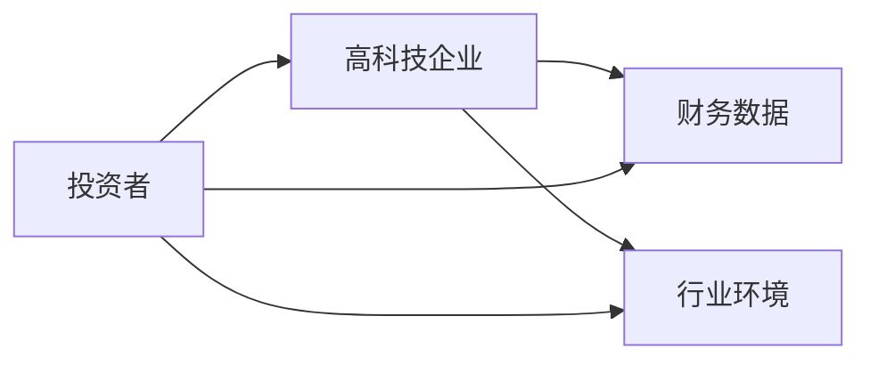
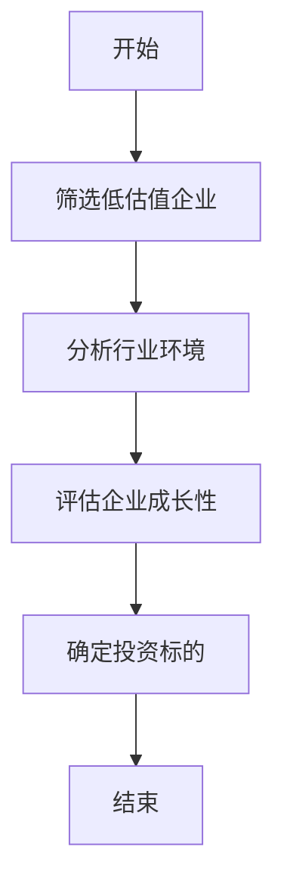

                 


# 格雷厄姆特价股票策略在高科技行业的应用挑战

> 关键词：格雷厄姆策略、价值投资、高科技行业、股票估值、投资策略

> 摘要：本文探讨了格雷厄姆特价股票策略在高科技行业的应用挑战，分析了传统价值投资方法与高科技行业特点之间的矛盾，并提出了结合量化分析与行业特性的解决方案。通过系统设计与项目实战，展示了如何在高科技行业中实现价值投资策略，并提供了可操作的代码实现与案例分析。

---

# 第一章: 格雷厄姆特价股票策略与高科技行业的结合

## 1.1 格雷厄姆投资理论的核心概念

### 1.1.1 价值投资的基本原理
价值投资的核心理念是寻找市场低估的股票，即股票的价格低于其内在价值。格雷厄姆提出的“安全边际”概念要求投资者以低于内在价值的价格买入股票，从而在市场波动中降低风险。

$$\text{安全边际} = \text{内在价值} - \text{市场价格}$$

### 1.1.2 格雷厄姆的选股标准
格雷厄姆提出了以下选股标准：
1. **低市盈率（P/E）**：市盈率低于市场平均水平。
2. **低市净率（P/B）**：市净率低于行业平均水平。
3. **高股息率**：股息率高于市场平均水平。
4. **稳定的盈利能力**：公司过去几年的盈利情况稳定。

### 1.1.3 特价股票的定义与特征
特价股票是指那些市场价格低于其内在价值的股票。其主要特征包括：
- 市盈率低于行业平均水平。
- 市净率低于行业平均水平。
- 盈利能力稳定，ROE（净资产收益率）较高。

## 1.2 高科技行业的特点与投资机遇

### 1.2.1 高科技行业的定义与范围
高科技行业通常指那些依赖技术创新、知识密集型的行业，包括：
- 半导体行业
- 软件开发
- 人工智能
- 5G通信
- 生物技术

### 1.2.2 高科技行业的增长模式
高科技行业的主要增长模式包括：
1. **技术创新驱动**：通过技术突破推动业绩增长。
2. **市场规模扩大**：通过拓展市场实现增长。
3. **并购整合**：通过并购整合资源，快速扩大规模。

### 1.2.3 高科技行业的投资风险与收益
高科技行业的投资风险主要体现在：
- 市场波动大：高科技股票价格波动剧烈。
- 技术风险：技术更新换代快，容易被替代。
- 财务风险：研发投入高，盈利能力不稳定。

但同时，高科技行业也具有较高的投资收益，尤其是那些能够持续创新并占据市场领导地位的公司。

## 1.3 格雷厄姆策略与高科技行业的结合点

### 1.3.1 格雷厄姆策略在高科技行业的适用性
格雷厄姆策略的核心是寻找被市场低估的股票，这与高科技行业中的某些公司相符，尤其是那些暂时被市场忽视但具有强大基本面的公司。

### 1.3.2 高科技行业中的特价股票特征
高科技行业中的特价股票通常具有以下特征：
- 低市盈率：市盈率低于行业平均水平。
- 低市净率：市净率低于行业平均水平。
- 高股息率：股息率高于市场平均水平。
- 稳定的盈利能力：过去几年的ROE稳定且高于行业平均水平。

### 1.3.3 两者的结合对投资的影响
通过结合格雷厄姆策略与高科技行业的特点，投资者可以在高科技行业中找到那些被市场低估但具有强大基本面的公司，从而实现超额收益。

---

# 第二章: 格雷厄姆策略在高科技行业的核心概念

## 2.1 核心概念的原理与属性

### 2.1.1 价值投资的核心原理
价值投资的核心原理是通过分析公司的基本面，找到市场价格低于内在价值的股票。其核心属性包括：
- **内在价值**：公司未来现金流的现值。
- **安全边际**：市场价格与内在价值之间的差距。
- **低估值**：市盈率、市净率等估值指标低于行业平均水平。

### 2.1.2 高科技企业的估值模型
高科技企业的估值模型包括：
1. **市盈率模型**：P/E = 市场价格 / 每股收益。
2. **市净率模型**：P/B = 市场价格 / 每股净资产。
3. **现金流折现模型**：DCF = 现金流的现值。

### 2.1.3 核心概念的属性对比
以下是高科技行业与传统行业在格雷厄姆策略中的属性对比：

| 属性           | 高科技行业          | 传统行业          |
|----------------|---------------------|-------------------|
| 市盈率         | 高                  | 中低             |
| 市净率         | 高                  | 中低             |
| 盈利稳定性     | 低                  | 高               |
| 技术风险       | 高                  | 低               |
| 市场波动性     | 高                  | 低               |

### 2.1.4 ER实体关系图
以下是格雷厄姆策略与高科技行业之间的ER实体关系图：



## 2.2 核心概念的联系与对比

### 2.2.1 价值与成长的平衡
格雷厄姆策略强调价值投资，而高科技行业更注重成长性。在高科技行业中应用格雷厄姆策略时，需要在价值与成长之间找到平衡点。

### 2.2.2 高科技企业的周期性分析
高科技行业具有较强的周期性，通常在经济衰退期表现不佳，而在经济复苏期表现优异。因此，在应用格雷厄姆策略时，需要考虑行业的周期性特征。

### 2.2.3 核心概念的动态调整
由于高科技行业的特点，格雷厄姆策略需要动态调整，例如：
1. 定期更新估值指标。
2. 关注行业趋势和技术变革。
3. 调整安全边际的要求。

---

# 第三章: 格雷厄姆策略在高科技行业的算法原理

## 3.1 格雷厄姆策略的核心算法

### 3.1.1 低市盈率策略
低市盈率策略的核心思想是寻找市盈率低于行业平均水平的股票。其数学模型如下：

$$\text{低市盈率股票} = \{P/E < \text{行业平均P/E}\}$$

### 3.1.2 低市净率策略
低市净率策略的核心思想是寻找市净率低于行业平均水平的股票。其数学模型如下：

$$\text{低市净率股票} = \{P/B < \text{行业平均P/B}\}$$

### 3.1.3 高股息率策略
高股息率策略的核心思想是寻找股息率高于行业平均水平的股票。其数学模型如下：

$$\text{高股息率股票} = \{\text{股息率} > \text{行业平均股息率}\}$$

## 3.2 高科技行业的估值算法

### 3.2.1 市盈率模型
市盈率模型的公式为：

$$P/E = \frac{\text{市场价格}}{\text{每股收益}}$$

### 3.2.2 市净率模型
市净率模型的公式为：

$$P/B = \frac{\text{市场价格}}{\text{每股净资产}}$$

### 3.2.3 现金流折现模型
现金流折现模型（DCF）的公式为：

$$\text{DCF} = \sum_{t=1}^{n} \frac{\text{现金流}}{(1 + r)^t} + \frac{\text{终值}}{(1 + r)^n}$$

其中，$r$为折现率，$n$为现金流的期限。

## 3.3 算法流程图



## 3.4 算法实现代码

```python
import pandas as pd

def grah
```

