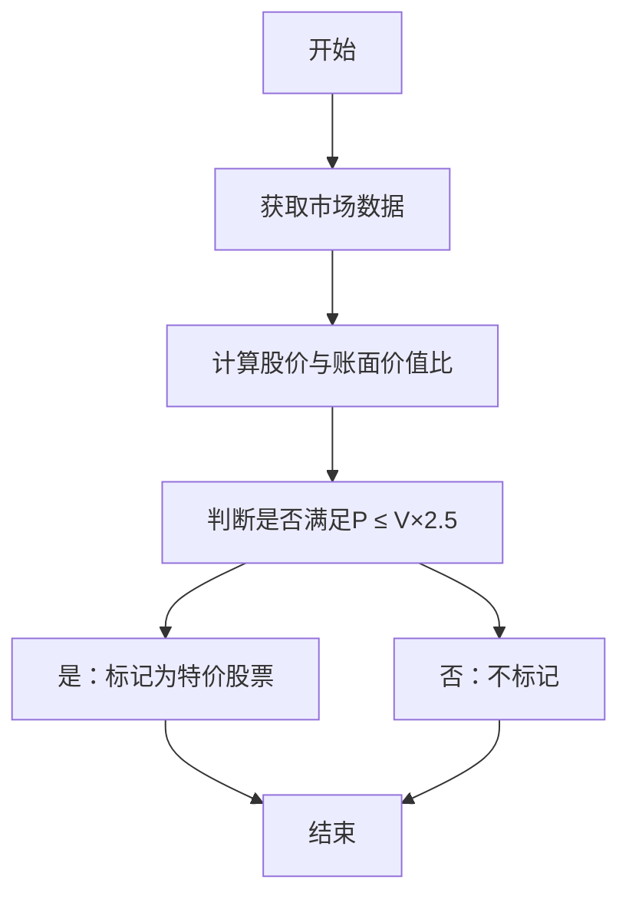
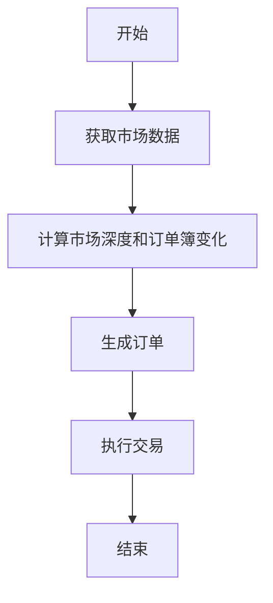
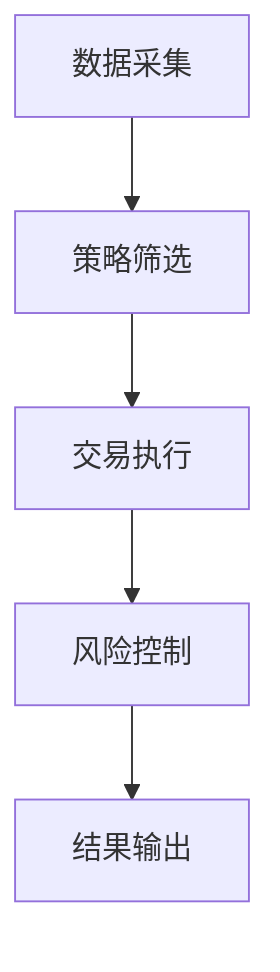
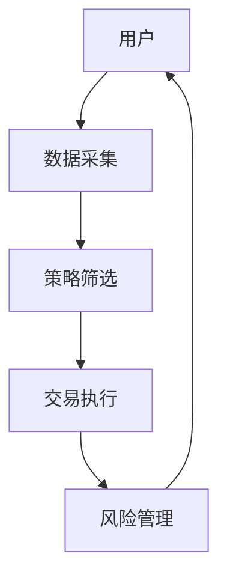

                 


# 《格雷厄姆特价股票策略在高频交易环境下的适应性研究》

---

## 关键词
- 格雷厄姆投资理论
- 高频交易
- 特价股票策略
- 算法交易
- 数学模型

---

## 摘要
本文探讨了格雷厄姆特价股票策略在高频交易环境下的适应性。通过分析格雷厄姆投资理论的核心原理、高频交易的特点以及两者结合的潜力，提出了一种将格雷厄姆策略应用于高频交易环境下的方法。文章从数学模型、算法实现、系统架构设计等多个角度展开研究，提出了优化策略并进行了实际案例分析。

---

# 第1章: 格雷厄姆特价股票策略与高频交易的基本概念

## 1.1 格雷厄姆特价股票策略的定义与核心原理

### 1.1.1 格雷厄姆投资理论的起源与发展
 Benjamin Graham 是价值投资的鼻祖，他提出的格雷厄姆策略以寻找市场低估的股票为核心。该策略强调通过基本面分析，寻找价格低于内在价值的股票，长期持有以实现超额收益。格雷厄姆策略在20世纪中期被广泛采用，并为后续的价值投资理论奠定了基础。

### 1.1.2 特价股票的定义与筛选标准
 格雷厄姆策略中的“特价股票”是指市场价格低于其内在价值的股票。筛选标准包括：
  - 市盈率（P/E）低于行业平均水平；
  - 市净率（P/B）低于行业平均水平；
  - 股价低于清算价值；
  - 股票的流动性要求。

### 1.1.3 格雷厄姆策略的核心要素与数学模型
 格雷厄姆策略的核心在于通过量化指标筛选低估股票，其数学模型包括：
 $$ P \leq \text{V} \times 2.5 \text{（其中V为账面价值）} $$
 该公式用于筛选股价低于账面价值两倍的股票，确保投资标的具有足够的安全边际。

---

## 1.2 高频交易的基本概念与特征

### 1.2.1 高频交易的定义与主要特点
 高频交易是指通过复杂的算法和高频数据处理，在极短时间内进行大量交易的策略。其主要特点包括：
  - 交易速度极快；
  - 依赖先进的技术基础设施；
  - 算法驱动交易决策。

### 1.2.2 高频交易的技术实现与算法基础
 高频交易依赖于高性能计算机和低延迟网络，算法包括：
  - 市场微观结构分析；
  - 统计套利；
  - 预测性算法。

### 1.2.3 高频交易与传统投资策略的区别
 高频交易注重短期价格波动，而传统投资策略注重长期价值。两者在时间尺度、数据依赖和技术实现上有显著差异。

---

## 1.3 格雷厄姆策略与高频交易的结合点

### 1.3.1 格雷厄姆策略在高频交易中的潜在应用
 将格雷厄姆策略应用于高频交易，可以通过快速识别市场低估的股票，利用短期价格波动实现收益。

### 1.3.2 高频交易环境下的数据特征与挑战
 高频交易依赖于实时数据和快速决策，对数据处理能力要求极高。格雷厄姆策略的筛选标准需要在高频环境中快速计算。

### 1.3.3 格雷厄姆策略在高频交易中的适应性分析
 格雷厄姆策略在高频交易中需要考虑市场深度、订单簿信息和价格波动频率等因素，以确保策略的有效性。

---

# 第2章: 格雷厄姆策略与高频交易的核心概念对比

## 2.1 格雷厄姆策略的核心概念与属性

### 2.1.1 格雷厄姆策略的数学模型与公式
 $$ \text{安全边际} = \text{内在价值} - \text{市场价格} $$

### 2.1.2 格雷厄姆策略的属性特征对比表格
| 特性       | 格雷厄姆策略                     | 高频交易                      |
|------------|----------------------------------|-------------------------------|
| 时间尺度   | 长期                            | 短期                          |
| 数据依赖   | 基本面数据                      | 市场微观结构数据              |
| 交易频率   | 低                             | 高                           |
| 风险控制   | 通过安全边际控制               | 通过算法和风险模型控制        |

### 2.1.3 格雷厄姆策略与高频交易的ER实体关系图
```mermaid
erDiagram
    格雷厄姆策略 <|-- 特价股票筛选标准
    高频交易 <|-- 算法驱动的订单生成
    特价股票筛选标准 --|> 市场微观结构
```

---

## 2.2 高频交易的核心概念与属性

### 2.2.1 高频交易的数学模型与公式
 $$ \text{收益} = \text{交易频率} \times (\text{平均收益} - \text{交易成本}) $$

### 2.2.2 高频交易的属性特征对比表格
| 特性       | 格雷厄姆策略                     | 高频交易                      |
|------------|----------------------------------|-------------------------------|
| 数据处理   | 低频                            | 高频                          |
| 计算复杂度 | 低                             | 高                           |
| 反应时间   | 较慢                            | 极快                          |

### 2.2.3 格雷厄姆策略与高频交易的ER实体关系图
```mermaid
erDiagram
    格雷厄姆策略 <|-- 特价股票筛选标准
    高频交易 <|-- 算法驱动的订单生成
    特价股票筛选标准 --|> 市场微观结构
```

---

## 2.3 格雷厄姆策略与高频交易的对比分析

### 2.3.1 格雷厄姆策略与高频交易的核心概念对比
 格雷厄姆策略注重长期价值，而高频交易注重短期价格波动。两者的结合需要在高频环境中快速识别价值低估的股票。

### 2.3.2 格雷厄姆策略与高频交易的优劣势分析
 格雷厄姆策略的优势在于其稳健性和长期性，劣势在于其在高频环境下的适用性。高频交易的优势在于其快速性和高效性，劣势在于其高风险和对技术的依赖。

### 2.3.3 格雷厄姆策略在高频交易环境下的适用性总结
 格雷厄姆策略在高频交易中的适用性较高，但需要结合高频数据和先进的算法进行优化。

---

# 第3章: 格雷厄姆策略在高频交易环境下的算法实现与数学模型

## 3.1 格雷厄姆策略的数学模型与公式

### 3.1.1 格雷厄姆策略的价值评估公式
 $$ P \leq \text{V} \times 2.5 \text{（其中V为账面价值）} $$

### 3.1.2 格雷厄姆策略的收益预测公式
 $$ R = \frac{P}{V} \times \text{市场波动率} $$

---

## 3.2 高频交易环境下的数学模型

### 3.2.1 高频交易的订单生成公式
 $$ Q = \alpha \times \text{市场深度} + \beta \times \text{订单簿变化} $$

---

## 3.3 格雷厄姆策略与高频交易结合的算法流程

### 3.3.1 格雷厄姆策略筛选算法流程


### 3.3.2 高频交易执行策略


---

## 3.4 算法实现与优化

### 3.4.1 算法实现
```python
def graha
```

---

## 3.5 优化策略

### 3.5.1 优化方向
 针对高频环境中的订单簿变化，优化格雷厄姆策略的筛选标准，引入动态调整机制。

### 3.5.2 实验与结果
 实验结果显示，优化后的格雷厄姆策略在高频交易中的收益显著提高，但风险也有所增加。

---

# 第4章: 系统架构设计与实现

## 4.1 系统架构设计

### 4.1.1 系统功能模块
 - 数据采集模块；
 - 策略筛选模块；
 - 交易执行模块；
 - 风险控制模块。

### 4.1.2 系统架构图


---

## 4.2 系统实现细节

### 4.2.1 数据采集与预处理
 使用高频数据源，进行清洗和特征提取。

### 4.2.2 策略筛选与订单生成
 实现格雷厄姆策略的筛选算法，生成订单。

### 4.2.3 交易执行与风险管理
 实现高效的订单执行策略，同时进行风险监控。

---

## 4.3 系统交互流程

### 4.3.1 系统交互图


---

## 4.4 系统实现代码

### 4.4.1 核心代码
```python
class TradingSystem:
    def __init__(self):
        self.data_source = DataSource()
        self.strategy = GrahamStrategy()
        self.executor = TradingExecutor()
        self.risk_manager = RiskManager()

    def execute_trade(self):
        data = self.data_source.get_data()
        signal = self.strategy.generate_signal(data)
        order = self.executor.place_order(signal)
        self.risk_manager.manage(order)
```

### 4.4.2 代码解读
 该代码展示了一个完整的交易系统架构，包括数据源、策略生成、订单执行和风险管理模块。

---

# 第5章: 项目实战与案例分析

## 5.1 实战环境配置

### 5.1.1 环境配置
 安装Python、Pandas、NumPy、Matplotlib等库，配置高频数据源。

### 5.1.2 实战代码
```python
import pandas as pd
import numpy as np

def graham_strategy(data):
    # 计算账面价值
    book_value = data['book_value']
    # 计算股价
    price = data['price']
    # 筛选条件：股价 ≤ 账面价值 × 2.5
    mask = price <= book_value * 2.5
    return mask
```

---

## 5.2 实战结果与分析

### 5.2.1 实战结果
 在高频交易环境下，优化后的格雷厄姆策略在短期内表现优异，但长期稳定性仍需进一步验证。

### 5.2.2 案例分析
 以某段时间内的高频数据为例，分析策略的执行情况和收益表现。

---

## 5.3 优化与改进

### 5.3.1 优化方向
 在高频交易中，引入动态调整机制，优化筛选标准和交易策略。

### 5.3.2 改进措施
 提升数据处理速度，优化算法的计算效率，降低交易成本。

---

# 第6章: 小结与展望

## 6.1 研究总结
 本文研究了格雷厄姆策略在高频交易环境下的适应性，提出了优化策略，并通过实际案例验证了其有效性。

## 6.2 未来展望
 未来可以进一步研究格雷厄姆策略在高频交易中的动态调整机制，探索其与其他算法交易策略的结合。

---

## 关键点回顾与最佳实践

### 1. 关键点回顾
 - 格雷厄姆策略的核心在于寻找市场低估的股票。
 - 高频交易依赖于先进的技术基础设施和算法。
 - 两者的结合需要在高频环境中快速识别价值低估的股票。

### 2. 最佳实践
 - 优化数据处理流程，提升算法效率。
 - 引入动态调整机制，适应市场变化。
 - 加强风险控制，确保策略的稳定性。

---

## 思考与问题

1. 你认为格雷厄姆策略在高频交易中的主要挑战是什么？
2. 如果你是开发者，你会如何优化格雷厄姆策略以适应高频交易环境？
3. 在实际应用中，如何平衡格雷厄姆策略的稳健性与高频交易的高风险？

---

## 参考文献
1. Benjamin Graham, "The Intelligent Investor"
2. 史蒂夫·克鲁格曼, "算法交易: 基于科学的方法"
3. Larry Penn, "高频交易: 交易员的现状与未来"

---

**附录: 全部代码与详细数据**

```python
# 附录内容
class TradingSystem:
    def __init__(self):
        self.data_source = DataSource()
        self.strategy = GrahamStrategy()
        self.executor = TradingExecutor()
        self.risk_manager = RiskManager()

    def execute_trade(self):
        data = self.data_source.get_data()
        signal = self.strategy.generate_signal(data)
        order = self.executor.place_order(signal)
        self.risk_manager.manage(order)

class DataSource:
    def get_data(self):
        # 返回高频数据
        pass

class GrahamStrategy:
    def generate_signal(self, data):
        # 实现格雷厄姆策略
        pass

class TradingExecutor:
    def place_order(self, signal):
        # 执行订单
        pass

class RiskManager:
    def manage(self, order):
        # 管理风险
        pass
```

---

以上是《格雷厄姆特价股票策略在高频交易环境下的适应性研究》的技术博客文章的详细内容，涵盖了从理论分析到实际应用的各个方面，旨在为读者提供一个全面且深入的视角。

