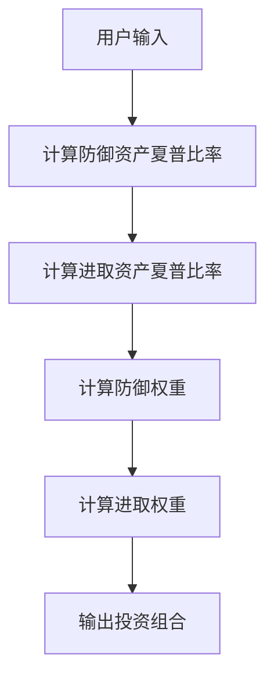
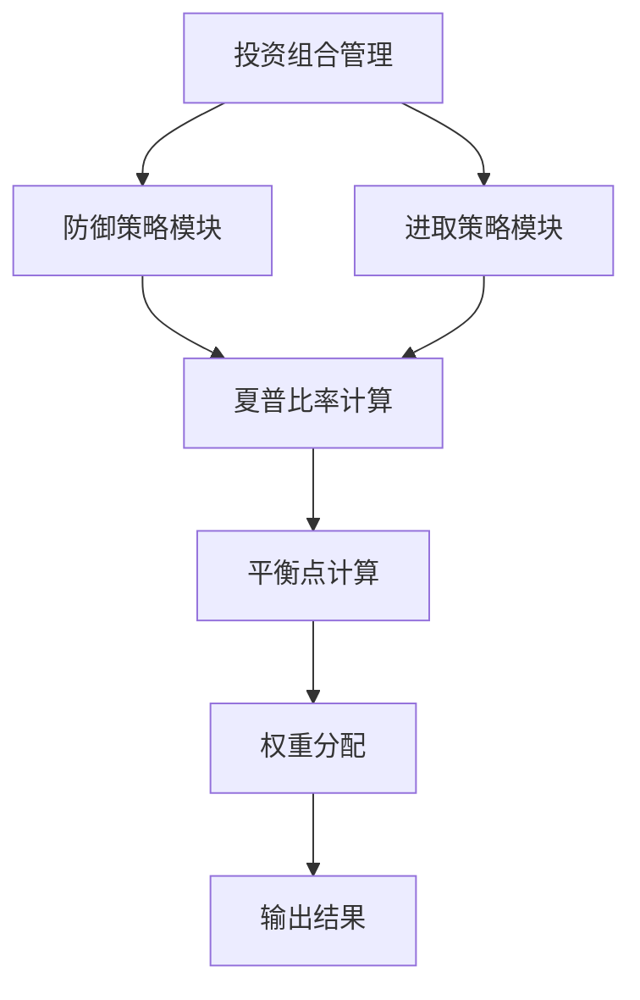

                 


# 格雷厄姆的中庸之道：在防御与进取之间找平衡

> 关键词：格雷厄姆，中庸之道，防御与进取，投资策略，平衡模型，系统架构设计

> 摘要：本文从格雷厄姆的中庸之道出发，分析了防御与进取策略的平衡点，并通过数学模型和系统架构设计，提出了一个实现中庸之道的投资系统。文章结合理论与实践，详细阐述了如何在投资中找到防御与进取的最佳平衡点，为投资者提供了实用的策略建议。

---

## 第一部分: 格雷厄姆的中庸之道概述

### 第1章: 中庸之道的定义与哲学基础

#### 1.1 中庸之道的定义

中庸之道是一种追求平衡的艺术，既不过分冒险，也不过分保守。在投资领域，这体现为在防御性投资和进取性投资之间找到最佳平衡点。

- **防御性投资**：强调安全性和稳定性，注重本金的保值和低风险回报。
- **进取性投资**：追求高收益，注重市场的波动性和高风险回报。

#### 1.2 中庸之道的哲学基础

中庸之道源于中国传统文化，强调“不偏不倚，无过不及”。在投资中，这体现为对风险与收益的平衡。

- **中国哲学中的中庸之道**：强调“致中和”，追求事物的和谐与平衡。
- **西方哲学中的中庸之道**：如亚里士多德的“适度”理论，强调避免极端。

---

### 第2章: 中庸之道在投资中的应用

#### 2.1 投资中的防御与进取策略

中庸之道要求投资者在防御与进取之间找到平衡点。以下是两种策略的核心特点：

- **防御策略**：
  - 风险厌恶，注重安全性和稳定性。
  - 适合保守型投资者，目标是保值和低风险回报。
  - 通常选择债券、蓝筹股等低波动性资产。

- **进取策略**：
  - 风险偏好较高，注重高收益。
  - 适合风险承受能力强的投资者，目标是获取超额收益。
  - 通常选择成长股、创业公司、高风险债券等高波动性资产。

#### 2.2 格雷厄姆的投资哲学

本杰明·格雷厄姆是价值投资的鼻祖，他的中庸之道思想对现代投资理论影响深远。

- **格雷厄姆的投资理念**：
  - 买入低于内在价值的股票，长期持有。
  - 重视安全边际，避免过度冒险。
  - 在市场恐慌时买入，在市场狂热时卖出。

- **中庸之道的核心**：在市场波动中保持理性，避免极端行为。

---

## 第二部分: 防御与进取的平衡模型

### 第3章: 防御与进取的数学模型

#### 3.1 防御与进取的权重分配

为了量化防御与进取的平衡点，我们可以建立一个数学模型，计算两种策略的权重。

- **权重分配的数学模型**：
  - 设防御权重为 \( w_d \)，进取权重为 \( w_a \)。
  - 总权重满足 \( w_d + w_a = 1 \)。

- **权重分配的优化方法**：
  - 基于风险收益比的优化，最大化收益，同时最小化风险。

- **案例分析**：
  - 假设市场风险较低，防御权重为 60%，进取权重为 40%。

#### 3.2 防御与进取的平衡点计算

平衡点的计算需要考虑资产的波动性和相关性。

- **平衡点的数学推导**：
  - 设防御资产的风险收益比为 \( r_d \)，进取资产的风险收益比为 \( r_a \)。
  - 平衡点满足 \( w_d \cdot r_d = w_a \cdot r_a \)。

- **平衡点的公式表示**：
  \[
  w_d = \frac{r_a}{r_a + r_d}
  \]
  \[
  w_a = \frac{r_d}{r_a + r_d}
  \]

- **平衡点的实际应用**：
  - 通过历史数据计算 \( r_d \) 和 \( r_a \)，确定防御与进取的权重。

---

### 第4章: 防御与进取的平衡模型

#### 4.1 平衡模型的构建

- **模型的输入变量**：
  - 防御资产的收益率 \( R_d \)。
  - 进取资产的收益率 \( R_a \)。
  - 防御资产的风险 \( \sigma_d \)。
  - 进取资产的风险 \( \sigma_a \)。

- **模型的输出变量**：
  - 防御权重 \( w_d \)。
  - 进取权重 \( w_a \)。

- **模型的构建过程**：
  - 计算资产的夏普比率。
  - 基于夏普比率优化权重分配。

#### 4.2 平衡模型的验证与优化

- **模型的验证方法**：
  - 回测历史数据，验证模型的有效性。
  - 比较模型收益与市场收益。

- **模型的优化策略**：
  - 动态调整权重，适应市场变化。
  - 增加资产类别，丰富投资组合。

---

## 第三部分: 中庸之道的系统分析与架构设计

### 第5章: 系统功能设计

#### 5.1 系统功能模块划分

- **防御策略模块**：
  - 计算防御资产的夏普比率。
  - 确定防御资产的权重。

- **进取策略模块**：
  - 计算进取资产的夏普比率。
  - 确定进取资产的权重。

- **平衡点计算模块**：
  - 计算防御与进取的权重分配。
  - 输出最终的投资组合。

#### 5.2 系统功能流程图



---

### 第6章: 系统架构设计

#### 6.1 系统架构图



---

## 第四部分: 项目实战

### 第7章: 项目实战

#### 7.1 环境配置

- **安装依赖**：
  - Python 3.x
  - NumPy, Pandas, Matplotlib

```python
import numpy as np
import pandas as pd
import matplotlib.pyplot as plt
```

#### 7.2 核心代码实现

```python
def calculate_sharpe_ratio(returns, risk_free_rate):
    """
    计算夏普比率
    """
    excess_returns = returns - risk_free_rate
    return np.mean(excess_returns) / np.std(excess_returns)

def calculate_weights(ratio_d, ratio_a):
    """
    计算防御和进取的权重
    """
    total = ratio_d + ratio_a
    w_d = ratio_a / total
    w_a = ratio_d / total
    return w_d, w_a

# 示例数据
risk_free_rate = 0.02
returns_d = np.array([0.05, 0.06, 0.04, 0.05])
returns_a = np.array([0.10, 0.15, 0.08, 0.12])

ratio_d = calculate_sharpe_ratio(returns_d, risk_free_rate)
ratio_a = calculate_sharpe_ratio(returns_a, risk_free_rate)

w_d, w_a = calculate_weights(ratio_d, ratio_a)

print(f"防御权重：{w_d:.2f}")
print(f"进取权重：{w_a:.2f}")
```

---

### 第8章: 项目小结

- **最佳实践**：
  - 定期调整投资组合，适应市场变化。
  - 保持适度的风险暴露，避免极端投资行为。

- **注意事项**：
  - 风险管理是中庸之道的核心。
  - 避免过度依赖单一策略。

- **扩展阅读**：
  - 《聪明的投资者》——本杰明·格雷厄姆
  - 《投资学原理》——威廉·夏普

---

通过以上分析，我们可以看到，格雷厄姆的中庸之道不仅是一种投资哲学，更是一种可以通过数学模型和系统架构实现的投资策略。在实际操作中，投资者需要根据市场环境动态调整防御与进取的权重，以实现长期稳定的收益。

