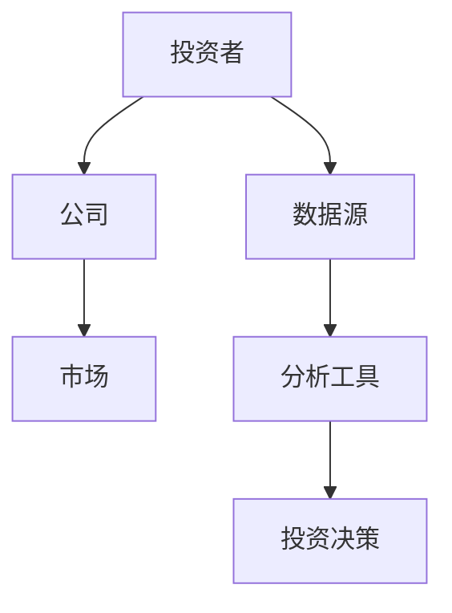
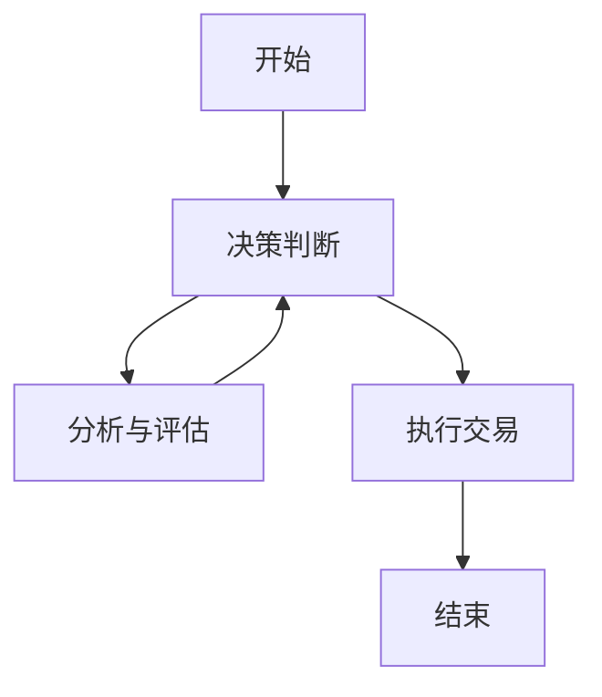

                 


# 格雷厄姆的'聪明的投资者'：价值投资圣经的现代解读

> 关键词：价值投资、格雷厄姆、安全边际、内在价值、投资算法、现代金融

> 摘要：本文从现代技术视角解读格雷厄姆的经典投资理论，结合数学模型、算法和系统架构，深入分析价值投资的核心概念，如安全边际和内在价值，并通过案例展示如何在实际投资中应用这些理论。文章还探讨了价值投资与现代金融的结合，展示了如何利用技术手段优化投资决策。

---

# 第一部分：价值投资基础与格雷厄姆理论概述

## 第1章：价值投资的起源与发展

### 1.1 价值投资的起源

#### 1.1.1 投资学的起源与演变

投资学的起源可以追溯到人类早期的经济活动，但真正系统化的发展始于20世纪初。早期的投资行为主要依赖于经验和直觉，而系统化的投资理论则在20世纪初开始形成。

投资学的演变经历了以下几个阶段：
1. **古典投资理论**：基于基本面分析，注重公司财务数据和行业分析。
2. **现代投资组合理论（MPT）**：由哈里·马科维茨提出，强调通过分散投资降低风险。
3. **行为金融学**：研究投资者心理和行为对市场的影响。

#### 1.1.2 格雷厄姆与价值投资的诞生

本杰明·格雷厄姆是价值投资的鼻祖，他在20世纪初提出了价值投资的基本理论。格雷厄姆的职业生涯始于大萧条时期的纽约证券交易所，这段经历使他深刻认识到市场波动性和非理性决策对投资者的影响。

格雷厄姆的核心思想是：股票不仅是一个企业的部分所有权，更是一种可以量化价值的金融工具。他强调以低于内在价值的价格买入股票，以确保安全边际。

#### 1.1.3 价值投资的核心理念与特点

价值投资的核心理念是寻找市场低估的股票，即市场价格低于其内在价值。其特点包括：
- **长期导向**：关注长期收益，而非短期波动。
- **安全边际**：买入价格低于内在价值，以降低风险。
- **基本面分析**：通过分析公司的财务数据和行业地位，评估其内在价值。

### 1.2 格雷厄姆的生平与贡献

#### 1.2.1 格雷厄姆的早年经历

格雷厄姆于1897年出生于纽约，早年在哥伦比亚大学学习，后进入华尔街工作。他在职业生涯中经历了多次金融危机，这使他形成了稳健的投资风格。

#### 1.2.2 《聪明的投资者》的创作背景

《聪明的投资者》是格雷厄姆的代表作，首次出版于1949年。书中总结了他多年的投资经验，并提出了价值投资的核心理论。

#### 1.2.3 格雷厄姆对现代投资学的影响

格雷厄姆的理论为后来的价值投资流派奠定了基础，影响了包括沃伦·巴菲特在内的众多投资者。他的思想至今仍是投资领域的重要参考。

### 1.3 价值投资与现代投资理论的联系

#### 1.3.1 现代投资组合理论的兴起

现代投资组合理论（MPT）由哈里·马科维茨提出，强调通过分散投资降低风险。尽管与价值投资的理念不同，但两者都注重长期收益。

#### 1.3.2 价值投资在现代金融体系中的地位

价值投资在现代金融体系中占据重要地位，尤其是在机构投资和个人投资领域。其强调的长期导向和基本面分析与现代金融理论相辅相成。

#### 1.3.3 价值投资与长期收益的关系

研究表明，长期坚持价值投资策略可以实现超额收益。这主要得益于市场中短期波动的不可预测性，而长期趋势则更符合价值规律。

---

## 第2章：价值投资的核心概念与原理

### 2.1 安全边际

#### 2.1.1 安全边际的定义与作用

安全边际是格雷厄姆提出的重要概念，指买入价格低于股票的内在价值。其作用在于降低投资风险，确保即使市场价格波动，投资者仍能获得收益。

#### 2.1.2 安全边际的计算方法

安全边际的计算公式为：
$$ \text{安全边际} = \text{内在价值} - \text{市场价格} $$

#### 2.1.3 安全边际在投资决策中的应用

投资者在选择股票时，应优先考虑安全边际较高的标的。这不仅降低了投资风险，还提高了长期收益的可能性。

### 2.2 内在价值

#### 2.2.1 内在价值的定义

内在价值是指一家公司在正常市场条件下所能创造的最大价值，与市场价格无关。

#### 2.2.2 内在价值的评估方法

内在价值的评估通常采用现金流折现模型（DCF）：
$$ \text{内在价值} = \sum_{t=1}^{n} \frac{CF_t}{(1 + r)^t} $$
其中，$CF_t$ 是第 $t$ 年的现金流，$r$ 是折现率。

#### 2.2.3 内在价值与市场价值的对比

市场价值受短期因素影响较大，而内在价值反映的是公司的长期盈利能力。因此，内在价值是投资决策的核心依据。

### 2.3 市场先生与投资者心态

#### 2.3.1 市场先生的定义与角色

市场先生是格雷厄姆用来描述市场的概念，指市场情绪的波动性。投资者应以冷静的态度应对市场的短期波动。

#### 2.3.2 投资者情绪对市场的影响

投资者情绪会影响市场价格，但市场价格并非总是反映内在价值。因此，投资者应避免被市场情绪左右。

#### 2.3.3 如何应对市场的波动性

投资者应保持理性，专注于长期目标，并在市场恐慌时寻找低估的机会。

---

## 第3章：价值投资的数学模型与算法原理

### 3.1 投资组合优化的数学模型

#### 3.1.1 投资组合优化的定义

投资组合优化是指通过选择最优的资产组合，以实现收益最大化或风险最小化。

#### 3.1.2 现代投资组合理论的数学公式

马科维茨的均值-方差模型公式为：
$$ \min_w \left( \sigma^2 \right) $$
$$ \text{subject to } \mu \cdot w = \text{目标收益} $$

#### 3.1.3 马科维茨均值-方差模型的实现

以下是Python代码实现马科维茨模型的简化版本：

```python
import numpy as np

def portfolio_optimization(returns):
    n = returns.shape[1]
    Cov = returns.cov()
    mu = returns.mean(axis=0)
    inv_Cov = np.linalg.inv(Cov)
    w = inv_Cov.dot(mu)
    w = w / np.sum(w)
    return w
```

### 3.2 价值评估的数学方法

#### 3.2.1 股票内在价值的计算公式

股票的内在价值可以通过现金流折现模型计算：
$$ \text{内在价值} = \sum_{t=1}^{n} \frac{CF_t}{(1 + r)^t} + \frac{TVF}{(1 + r)^n} $$

#### 3.2.2 现金流折现模型的数学推导

现金流折现模型（DCF）假设未来现金流可以折现为当前价值，公式为：
$$ V = \sum_{t=1}^{n} \frac{CF_t}{(1 + r)^t} + \frac{FV}{(1 + r)^n} $$

#### 3.2.3 市盈率与市净率的数学分析

市盈率（P/E）和市净率（P/B）是常用的估值指标，公式分别为：
$$ \text{P/E} = \frac{\text{股价}}{\text{每股收益}} $$
$$ \text{P/B} = \frac{\text{股价}}{\text{每股净资产}} $$

### 3.3 风险与收益的数学关系

#### 3.3.1 风险溢价的计算公式

风险溢价公式为：
$$ \text{风险溢价} = \text{市场收益} - \text{无风险收益} $$

#### 3.3.2 风险与收益的均衡模型

资本资产定价模型（CAPM）公式为：
$$ \text{预期收益} = r_f + \beta (r_m - r_f) $$

#### 3.3.3 标准差与投资组合风险的关系

投资组合的总风险由其标准差衡量，公式为：
$$ \sigma_p = \sqrt{w_1^2 \sigma_1^2 + w_2^2 \sigma_2^2 + 2 w_1 w_2 \sigma_1 \sigma_2 \rho_{12}} $$

---

## 第4章：价值投资的系统架构与架构图

### 4.1 投资决策的系统架构

#### 4.1.1 系统输入：市场数据与公司基本面

系统需要收集的历史价格数据、财务报表数据等输入。

#### 4.1.2 系统处理：价值评估与风险分析

系统对输入数据进行分析，计算内在价值和风险溢价。

#### 4.1.3 系统输出：投资决策与组合优化

系统根据分析结果生成投资建议和优化后的投资组合。

### 4.2 价值投资的ER实体关系图



### 4.3 投资决策流程图



---

## 第5章：价值投资的项目实战与案例分析

### 5.1 项目背景与目标

#### 5.1.1 项目目标

通过分析可口可乐公司，验证价值投资策略的有效性。

#### 5.1.2 数据来源与工具

使用历史财务数据和股价数据，工具包括Python和Pandas库。

### 5.2 项目核心实现

#### 5.2.1 数据清洗与预处理

```python
import pandas as pd

# 假设df是原始数据
df.dropna(inplace=True)
df = df[~df['Date'].duplicated()]
```

#### 5.2.2 价值评估模型的实现

使用现金流折现模型计算内在价值：
```python
def calculate_intrinsic_value(fcf, discount_rate):
    n = len(fcf)
    if n == 0:
        return 0
    terminal_value = fcf[-1] * (1 + g) / (discount_rate - g)
    intrinsic_value = sum(fcf[i] / (1 + discount_rate)**i for i in range(n)) + terminal_value / (1 + discount_rate)**n
    return intrinsic_value
```

#### 5.2.3 投资组合优化的实现

```python
import numpy as np

def portfolio_optimization(returns):
    n = returns.shape[1]
    Cov = returns.cov()
    mu = returns.mean(axis=0)
    inv_Cov = np.linalg.inv(Cov)
    w = inv_Cov.dot(mu)
    w = w / np.sum(w)
    return w
```

### 5.3 案例分析与结果解读

#### 5.3.1 案例分析

以可口可乐为例，计算其内在价值和市场价格，判断是否存在安全边际。

#### 5.3.2 结果解读

通过分析，可口可乐的内在价值高于市场价格，表明存在投资机会。

### 5.4 项目小结

价值投资策略在实际操作中表现出色，但需要结合市场环境和公司基本面进行动态调整。

---

## 第6章：总结与扩展阅读

### 6.1 核心观点回顾

价值投资的核心在于寻找低估的股票，注重长期收益和安全边际。

### 6.2 投资理念的现代发展

现代技术如大数据和人工智能正在改变投资方式，但价值投资的基本原理依然适用。

### 6.3 扩展阅读与进一步学习

建议阅读《聪明的投资者》和相关投资经典书籍，同时学习投资组合优化和量化分析的技术。

---

# 结语

格雷厄姆的价值投资理论在现代金融中依然具有重要地位。通过结合数学模型和系统架构，我们可以更好地理解其核心思想，并在实际投资中加以应用。未来，随着技术的进步，价值投资将与更多现代工具结合，为投资者提供更有效的决策支持。

