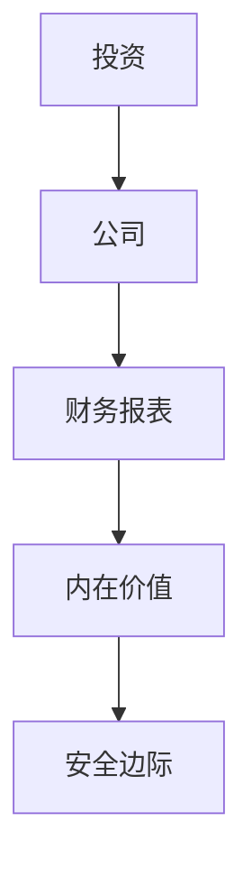
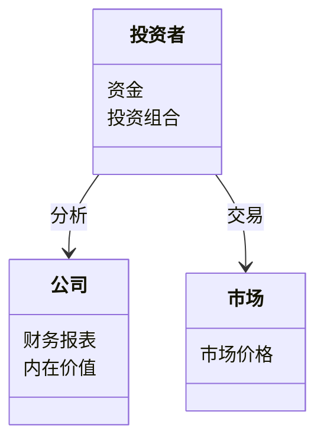
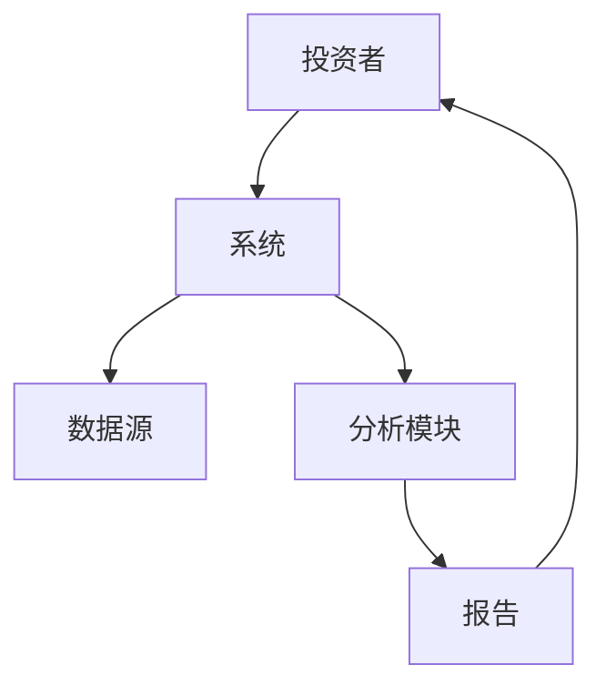

                 


# 格雷厄姆的Formula Investing：系统化投资方法

## 关键词：投资方法，价值投资，系统化投资，格雷厄姆，Formula Investing

## 摘要：本文深入探讨了格雷厄姆的Formula Investing方法，从其核心理念、数学模型到系统化投资方法，结合实际案例和系统架构设计，为读者提供全面的理解和应用指导。

---

# 第一部分: 格雷厄姆的Formula Investing概述

## 第1章: 投资概述与格雷厄姆的Formula Investing

### 1.1 投资的基本概念

#### 1.1.1 投资的定义与分类
- 投资是指将资金投入某一资产或项目，以期在未来获得收益或资本增值的行为。
- 分类：股票、债券、房地产、货币市场工具等。

#### 1.1.2 格雷厄姆的生平与贡献
- Benjamin Graham：20世纪初著名投资家，价值投资之父。
- 贡献：提出“安全边际”和“内在价值”概念，开创了基本面分析方法。

#### 1.1.3 Formula Investing的核心理念
- 以基本面分析为基础，通过数学公式计算内在价值，寻找被市场低估的投资标的。
- 强调长期投资和分散投资，降低风险。

---

## 第2章: 核心概念与联系

### 2.1 价值投资的核心概念

#### 2.1.1 内在价值的定义与计算
- 内在价值（Intrinsic Value）：企业未来现金流的现值。
- 计算公式：
  $$ V = \frac{E}{P} $$
  其中，E为未来现金流，P为折现率。

#### 2.1.2 安全边际的原理与应用
- 安全边际：内在价值与市场价格之间的差额，提供缓冲以应对市场波动。
- 应用：选择市场价格低于内在价值的企业进行投资。

#### 2.1.3 股票与企业价值的关系
- 股票是企业的部分所有权，其价值取决于企业的盈利能力。
- 企业价值 = 股权价值 + 债务价值。

### 2.2 格雷厄姆的公式分析

#### 2.2.1 内在价值公式
- 格雷厄姆的内在价值公式：
  $$ V = \frac{E}{P} $$
  其中，E为预期收益，P为折现率。

#### 2.2.2 市盈率与市净率的比较
- 市盈率（P/E）：股价与每股收益的比率。
- 市净率（P/B）：股价与每股净资产的比率。
- 比较：市盈率适用于盈利稳定的公司，市净率适用于净资产较多的公司。

#### 2.2.3 其他相关公式与应用
- 总资产周转率：
  $$ \text{总资产周转率} = \frac{\text{营业收入}}{\text{平均总资产}} $$
- 净利润率：
  $$ \text{利润率} = \frac{\text{净利润}}{\text{营业收入}} $$

### 2.3 核心概念的联系与对比

#### 2.3.1 价值投资与成长投资的对比
| 对比维度 | 价值投资 | 成长投资 |
|----------|----------|----------|
| 核心理念 | 低估值 | 高增长 |
| 投资标的选择 | 市价 < 内在价值 | 高成长性 |

#### 2.3.2 Formula Investing与技术分析的对比
| 对比维度 | Formula Investing | 技术分析 |
|----------|------------------|----------|
| 基础 | 基本面分析 | 市场走势 |
| 工具 | 财务报表 | K线图、均线 |

#### 2.3.3 核心概念的ER实体关系图


---

## 第3章: 格雷厄姆公式与数学模型

### 3.1 格雷厄姆公式原理

#### 3.1.1 内在价值公式
- 内在价值计算：
  $$ V = \frac{E}{P} $$
  其中，E为预期收益，P为折现率。

#### 3.1.2 市盈率与市净率的计算
- 市盈率公式：
  $$ \text{市盈率} = \frac{\text{股价}}{\text{每股收益}} $$
- 市净率公式：
  $$ \text{市净率} = \frac{\text{股价}}{\text{每股净资产}} $$

#### 3.1.3 安全边际的数学表达
- 安全边际公式：
  $$ \text{安全边际} = V - P $$

### 3.2 数学模型与公式

#### 3.2.1 内在价值公式
$$ V = \frac{E}{P} $$

#### 3.2.2 市盈率与市净率的比较
- 市盈率：
  $$ \text{市盈率} = \frac{\text{股价}}{\text{每股收益}} $$
- 市净率：
  $$ \text{市净率} = \frac{\text{股价}}{\text{每股净资产}} $$

#### 3.2.3 其他相关公式与应用
- 净利润公式：
  $$ \text{净利润} = \text{营业收入} - \text{成本} - \text{费用} $$

---

## 第4章: 系统分析与架构设计

### 4.1 问题场景介绍

#### 4.1.1 问题描述
- 传统投资方法依赖经验判断，存在主观性强、风险高的问题。
- Formula Investing通过系统化的方法，利用数学模型和基本面分析，降低投资风险。

### 4.2 系统功能设计

#### 4.2.1 领域模型设计


#### 4.2.2 系统架构设计


---

## 第5章: 项目实战

### 5.1 环境安装

#### 5.1.1 安装Python环境
```bash
python --version
pip install numpy pandas matplotlib
```

### 5.2 核心代码实现

#### 5.2.1 内在价值计算
```python
import pandas as pd

def calculate_intrinsic_value(earnings, discount_rate):
    return earnings / discount_rate

# 示例数据
df = pd.DataFrame({'Earnings': [100, 200, 300], 'Discount Rate': [0.1, 0.12, 0.08]})
df['Intrinsic Value'] = df.apply(lambda x: calculate_intrinsic_value(x['Earnings'], x['Discount Rate']), axis=1)
print(df)
```

#### 5.2.2 安全边际计算
```python
def calculate_margin_of_safety(intrinsic_value, market_price):
    return intrinsic_value - market_price

# 示例数据
iv = [150, 250, 350]
mp = [120, 200, 300]
df = pd.DataFrame({'Intrinsic Value': iv, 'Market Price': mp})
df['Margin of Safety'] = df.apply(lambda x: calculate_margin_of_safety(x['Intrinsic Value'], x['Market Price']), axis=1)
print(df)
```

### 5.3 案例分析

#### 5.3.1 案例选择
- 公司A：预期收益100，折现率0.1，市场价格120。
- 计算内在价值：
  $$ V = \frac{100}{0.1} = 1000 $$
- 安全边际：
  $$ \text{安全边际} = 1000 - 120 = 880 $$

#### 5.3.2 分析与解读
- 内在价值远高于市场价格，建议买入。

### 5.4 项目小结
- 通过Python代码实现内在价值和安全边际的计算，帮助投资者系统化地选择投资标的。

---

## 第6章: 最佳实践与小结

### 6.1 核心要点总结
- 格雷厄姆的Formula Investing通过系统化的方法，利用基本面分析和数学模型，帮助投资者做出理性的投资决策。
- 内在价值和安全边际是核心工具。

### 6.2 注意事项
- 公式仅作为参考，需结合实际情况调整。
- 市场波动和公司基本面变化需持续关注。

### 6.3 拓展阅读
- 《证券分析》：格雷厄姆的经典著作，深入阐述价值投资理论。
- 现代投资组合理论：马克owitz的均值-方差模型。

---

通过本文的系统化分析，读者可以全面理解格雷厄姆的Formula Investing方法，并将其应用于实际投资中。

