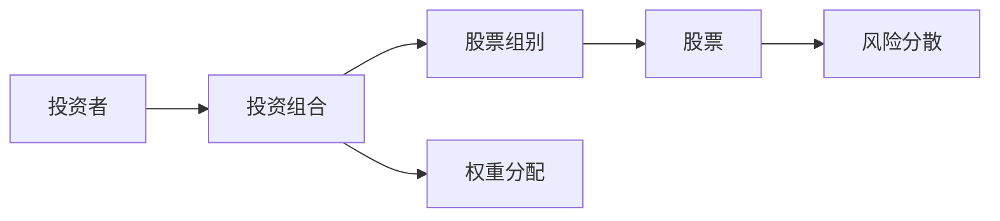
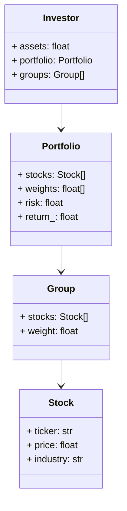
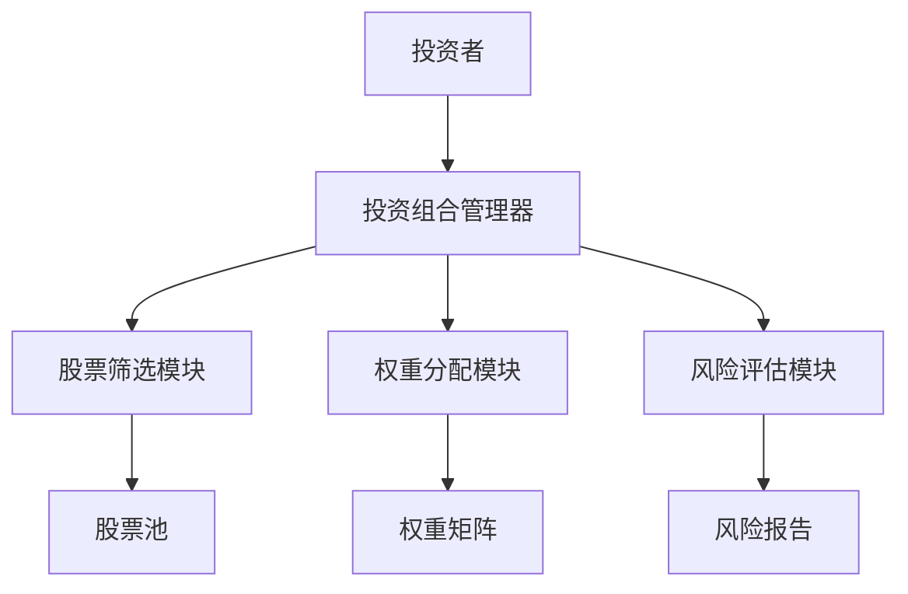

                 


# 格雷厄姆的Group Approach：分散风险的智慧

## 关键词：
- 投资风险管理
- 分散投资策略
- 风险控制
- 组合优化
- 现代投资组理论

## 摘要：
本文深入探讨了格雷厄姆提出的Group Approach投资策略，详细分析了其核心理念、数学模型和算法原理。通过结合现代投资组理论，本文展示了如何利用分散投资来降低风险，并通过实际案例和系统架构设计，为读者提供了一个全面的理解和应用框架。

---

# 第一部分: 格雷厄姆的Group Approach概述

## 第1章: Group Approach的起源与背景

### 1.1 投资风险管理的核心问题

#### 1.1.1 投资风险的定义与分类
投资风险是指在投资过程中，由于市场波动、经济变化等因素导致投资收益低于预期或出现损失的可能性。投资风险可以分为系统性风险（市场风险）和非系统性风险（特定风险）。系统性风险影响整个市场，如经济衰退、通货膨胀等；非系统性风险则与特定资产或行业相关，如公司经营不善或行业政策变化。

#### 1.1.2 格雷厄姆的投资理念与哲学
本杰明·格雷厄姆是价值投资的鼻祖，他强调以合理价格投资于具有稳定价值的企业。他认为，投资者应关注企业的内在价值，而非市场的短期波动。他的投资理念强调安全边际和长期稳健的收益。

#### 1.1.3 Group Approach的提出背景
在20世纪30年代，格雷厄姆与大卫·多德共同提出“安全分析”的概念，即通过深入分析企业的财务状况和内在价值来选择投资标的。Group Approach是其思想的延伸，旨在通过分散投资于多个具有相似特性的股票来降低非系统性风险。

---

### 1.2 Group Approach的核心概念

#### 1.2.1 分散投资的原理
分散投资是指将资金分配到多个不同的资产或股票中，以降低单一资产波动带来的风险。通过多样化，投资者可以减少特定资产或行业带来的损失，从而实现更稳定的收益。

#### 1.2.2 风险与收益的平衡
分散投资的目的是在控制风险的同时，追求合理的收益。通过合理分配资产权重，投资者可以在不同市场条件下保持投资组合的稳定性。

#### 1.2.3 Group Approach的特点
- **选择性**：只选择具有相似特性和良好基本面的股票。
- **分散性**：通过投资多个股票降低特定风险。
- **长期性**：注重企业的长期价值，而非短期波动。

---

### 1.3 Group Approach与传统投资方法的区别

#### 1.3.1 传统投资方法的局限性
传统投资方法往往依赖于市场预测或单一资产的选择，这使得投资者容易受到市场波动的影响。此外，传统方法可能忽视了资产之间的相关性，导致风险集中。

#### 1.3.2 Group Approach的优势与创新
Group Approach通过分散投资于多个具有相似特性的股票，有效降低了非系统性风险。其创新在于将股票分为多个“组”，每组内的股票具有相似的特性，从而实现风险的分散。

#### 1.3.3 对比分析
| 对比维度 | 传统投资方法 | Group Approach |
|----------|--------------|----------------|
| 投资策略 | 单一资产选择 | 多资产分散投资 |
| 风险控制 | 依赖市场预测 | 通过多样化降低风险 |
| 收益目标 | 追求高收益 | 追求稳定收益 |

---

## 第2章: Group Approach的核心原理

### 2.1 分散风险的数学模型

#### 2.1.1 投资组合的方差计算
投资组合的总风险可以用方差来衡量。假设我们有$n$只股票，每只股票的收益率为$R_i$，权重为$w_i$，则投资组合的方差为：
$$ \sigma_p^2 = \sum_{i=1}^{n} \sum_{j=1}^{n} w_i w_j \sigma_{ij} $$
其中，$\sigma_{ij}$是股票$i$和股票$j$之间的协方差。

#### 2.1.2 协方差矩阵的构建
协方差矩阵描述了股票之间收益的波动关系。通过计算每对股票之间的协方差，可以构建一个$n \times n$的矩阵，用于优化投资组合。

#### 2.1.3 现代投资组理论基础
现代投资组理论（MPT）认为，通过优化投资组合的权重，可以在给定风险下获得最大收益。Group Approach是MPT的一种具体实现，通过将股票分为多个组别，优化每组的权重。

---

### 2.2 Group Approach的风险分散机制

#### 2.2.1 股票池的选择标准
Group Approach要求选择具有相似特性的股票，如行业、规模、估值指标等。通过筛选，确保每组股票之间的相关性较低，从而降低风险。

#### 2.2.2 股票权重的分配策略
根据股票的风险和收益特征，计算每组股票的最优权重。通常采用均值-方差优化模型，使得投资组合的风险最小化，同时最大化预期收益。

#### 2.2.3 组合优化的数学模型
优化模型如下：
$$ \min_w \sigma_p^2 $$
$$ \text{subject to} \quad \sum_{i=1}^{n} w_i = 1 $$

---

### 2.3 核心概念的ER实体关系图



---

## 第3章: Group Approach的算法原理

### 3.1 现代投资组优化算法

#### 3.1.1 均值-方差优化模型
均值-方差优化是现代投资组理论的核心。通过计算每只股票的预期收益率和协方差矩阵，优化投资组合的权重，使得在给定风险下收益最大化。

#### 3.1.2 Markowitz有效前沿的构建
Markowitz有效前沿是所有可能投资组合中风险-收益比最优的集合。通过计算多个投资组合的方差和预期收益，找到最优前沿。

#### 3.1.3 优化算法的实现步骤
1. 计算每只股票的预期收益率和协方差矩阵。
2. 使用优化算法（如拉格朗日乘数法）求解最优权重。
3. 绘制有效前沿并选择最优组合。

---

### 3.2 分散投资组合的实现

#### 3.2.1 股票池的筛选与排序
根据股票的行业、规模和估值指标进行筛选，确保每组股票具有相似的特性。

#### 3.2.2 权重分配的数学公式
假设每组股票的权重为$w_i$，则：
$$ \sum_{i=1}^{n} w_i = 1 $$

#### 3.2.3 优化算法的Python实现

```python
import numpy as np
import pandas as pd
from sklearn.covariance import LedoitWOLF

# 假设 stocks 是股票收益率数据
stocks = pd.DataFrame(...)
cov_matrix = LedoitWOLF().fit(stocks).covariance_
n = len(stocks.columns)

# 定义优化问题
def portfoliooptimize(cov_matrix, n):
    cov = cov_matrix.values
    inv_cov = np.linalg.inv(cov)
    weights = inv_cov @ np.ones(n)
    weights = weights / np.sum(weights)
    return weights

weights = portfoliooptimize(cov_matrix, n)
```

---

## 第4章: Group Approach的系统分析与架构设计

### 4.1 系统功能设计

#### 4.1.1 领域模型类图



---

### 4.2 系统架构设计



---

## 第5章: Group Approach的项目实战

### 5.1 环境安装

#### 5.1.1 安装必要的库
```bash
pip install numpy pandas scikit-learn matplotlib
```

#### 5.1.2 数据获取
```python
import pandas as pd
data = pd.read_csv('stocks.csv')
```

### 5.2 核心代码实现

#### 5.2.1 股票池筛选
```python
def select_stocks(data, industry):
    return data[data['industry'] == industry]
```

#### 5.2.2 权重分配
```python
def calculate_weights(stocks):
    n = len(stocks)
    return np.ones(n) / n
```

---

## 第6章: 总结与展望

### 6.1 总结
本文详细介绍了格雷厄姆的Group Approach投资策略，从理论到实践，展示了如何通过分散投资降低风险。通过数学模型和算法实现，确保投资组合的稳健性。

### 6.2 未来展望
随着大数据和人工智能的发展，Group Approach可以进一步优化，如引入机器学习算法进行股票筛选和权重分配。此外，结合实时市场数据，可以实现动态投资组合调整。

---

## 最佳实践 Tips

1. **风险控制**：始终将风险控制放在首位，避免过度集中投资。
2. **持续学习**：关注市场变化和新技术，不断优化投资策略。
3. **分散投资**：通过多样化降低特定风险，实现稳健收益。

---

## 小结
通过本文的分析，读者可以深入了解格雷厄姆的Group Approach，并将其应用于实际投资中。无论是个人投资者还是机构投资者，都可以通过分散投资实现长期稳健的收益。

---

## 注意事项
- 投资有风险，需谨慎操作。
- 本文内容仅供参考，具体投资决策需结合实际情况。

---

## 拓展阅读
1. 《投资学》——作者：查尔斯·埃里森
2. 《Python金融计算》——作者：罗斯·阿诺特
3. 《投资组合优化算法》——作者：约翰·马歇尔

--- 

通过以上内容，您可以系统地理解和应用格雷厄姆的Group Approach，实现分散风险的智慧投资。

