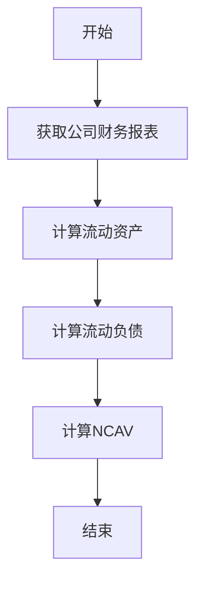

                 

# 格雷厄姆的NCAV策略：寻找极度低估的股票

> 关键词：价值投资，NCAV策略，格雷厄姆，股票分析，低估股票

> 摘要：本文深入探讨了格雷厄姆的NCAV（Net Current Asset Value）策略，这是一种用于寻找市场中被低估的股票的投资方法。通过详细分析NCAV策略的背景、理论基础、计算方法、实际应用以及系统架构，本文为投资者提供了如何利用这一策略进行股票筛选和投资决策的指导。文章还结合实际案例，展示了NCAV策略在不同市场环境下的应用效果，并提出了在实际操作中需要注意的事项和优化建议。

---

## 第1章: NCAV策略的背景与核心概念

### 1.1 价值投资与NCAV策略的起源

#### 1.1.1 价值投资的基本理念
价值投资是一种长期投资策略，强调购买那些市场价格低于其内在价值的资产。其核心在于寻找市场先生（Mr. Market）定价错误的机会。格雷厄姆是价值投资的鼻祖，他提出的“ Margin of Safety（安全边际）”概念是价值投资的核心思想。

#### 1.1.2 格雷厄姆的投资哲学
格雷厄姆认为，市场的短期波动是不可预测的，但长期来看，股票的价格会回归其内在价值。投资者应该关注企业的基本面，寻找那些具有强大财务健康状况和合理估值的企业进行投资。

#### 1.1.3 NCAV策略的提出与演变
NCAV（Net Current Asset Value）策略是格雷厄姆提出的一种具体的价值投资方法，主要用于筛选那些市场价格远低于其净流动资产价值的公司。这种方法最初出现在格雷厄姆的著作《 Intelligent Investor》中，并在后续的实践中不断完善和优化。

---

### 1.2 NCAV策略的核心概念

#### 1.2.1 NCAV的定义与计算公式
NCAV（Net Current Asset Value）是指公司流动资产的公允价值减去流动负债的公允价值。具体公式为：
$$ NCAV = \text{流动资产} - \text{流动负债} $$

在实际应用中，NCAV策略通常将流动资产和流动负债的公允价值进行调整，以确保计算的准确性。

#### 1.2.2 NCAV与其它价值指标的对比
以下是NCAV与其他常见价值指标的对比：

| 指标名称      | 定义与计算公式                                                                 |
|---------------|------------------------------------------------------------------------------|
| 市盈率（P/E）  | $P/E = \frac{\text{股价}}{\text{每股收益}}$                                  |
| 市净率（P/B）  | $P/B = \frac{\text{股价}}{\text{每股净资产}}$                                |
| EV/EBITDA      | $\text{EV/EBITDA} = \frac{\text{企业价值}}{\text{息税折旧及摊销前利润}}$      |
| NCAV          | $NCAV = \text{流动资产} - \text{流动负债}$                                   |

NCAV的独特之处在于它专注于流动资产和流动负债的差额，这使得它特别适合用于评估那些具有较高流动资产和较低流动负债的公司。

#### 1.2.3 NCAV策略的核心要素与属性
NCAV策略的核心要素包括：
1. 流动资产：包括现金、应收账款、存货等。
2. 流动负债：包括应付账款、短期负债等。
3. 安全边际：市场价格远低于NCAV，通常要求$NCAV \text{Ratio} \leq 2$。

---

### 1.3 NCAV策略的理论基础

#### 1.3.1 市场有效性的探讨
NCAV策略基于市场的有效性不足这一假设。格雷厄姆认为，市场在短期中可能低估或高估某些股票，但长期来看会趋于合理。因此，NCAV策略适用于那些被市场暂时低估的公司。

#### 1.3.2 价值与价格的偏离原理
股票的市场价格与内在价值之间的偏离为投资者提供了套利机会。当市场价格远低于内在价值时，投资者可以以较低的价格买入股票，等待其价格回归内在价值时卖出。

#### 1.3.3 投资者心理与市场定价偏差
投资者的心理偏差（如过度恐惧、贪婪）会导致市场价格偏离其真实价值。NCAV策略利用了这种偏差，寻找那些被市场过度低估的公司。

---

### 1.4 NCAV策略的适用范围与边界

#### 1.4.1 适用的行业与企业规模
NCAV策略适用于那些流动资产占比较高、负债结构清晰的行业，如制造业、批发零售业等。对于规模较小的公司，NCAV策略可能更为有效。

#### 1.4.2 策略的局限性与潜在风险
1. **行业限制**：NCAV策略在某些行业（如高科技行业）可能效果不佳。
2. **短期波动**：市场短期波动可能导致NCAV策略失效。
3. **流动性风险**：某些公司可能流动性较差，难以迅速变现。

#### 1.4.3 策略的有效性与市场周期的关系
NCAV策略在熊市或经济衰退期可能表现更好，因为市场可能更倾向于低估优质公司。而在牛市中，市场情绪高涨，NCAV策略可能较难找到合适的标的。

---

## 1.5 本章小结
本章介绍了格雷厄姆NCAV策略的背景、核心概念和理论基础，分析了其适用范围和潜在风险。接下来，我们将深入探讨NCAV策略的数学模型与计算方法，帮助投资者更好地理解和应用这一策略。

---

## 第2章: NCAV策略的数学模型与计算方法

### 2.1 NCAV的计算公式与步骤

#### 2.1.1 NCAV的定义与计算公式
$$ NCAV = \text{流动资产} - \text{流动负债} $$

其中，流动资产包括现金、应收账款、存货等，流动负债包括应付账款、短期负债等。

#### 2.1.2 NCAV比率的计算与应用
$$ NCAV \text{Ratio} = \frac{NCAV}{\text{市场价格}} $$

格雷厄姆建议投资者选择那些$NCAV \text{Ratio} \leq 2$的公司进行投资。

---

### 2.2 NCAV策略的筛选标准

#### 2.2.1 格雷厄姆的原始筛选标准
1. 市场价格低于NCAV。
2. $NCAV \text{Ratio} \leq 2$。
3. 公司具有持续的盈利能力。

#### 2.2.2 现代NCAV策略的优化与调整
1. 结合市盈率、市净率等其他指标进行综合评估。
2. 考虑宏观经济环境和行业周期。

---

### 2.3 NCAV策略的数学模型与图表

#### 2.3.1 NCAV计算的流程图

#### 2.3.2 NCAV与市场价格的关系图

---

### 2.4 本章小结
本章详细介绍了NCAV策略的数学模型与计算方法，并通过流程图和关系图展示了其应用过程。接下来，我们将从系统架构的角度深入探讨NCAV策略的实现。

---

## 第3章: NCAV策略的系统分析与架构设计

### 3.1 系统分析

#### 3.1.1 系统目标与范围
系统目标是帮助投资者筛选出符合NCAV策略的股票，提供投资决策支持。

#### 3.1.2 系统功能需求
1. 数据采集：获取公司财务数据。
2. NCAV计算：计算NCAV值和NCAV比率。
3. 筛选与排序：根据筛选标准对股票进行排序。
4. 报告生成：生成投资报告。

---

### 3.2 系统架构设计

#### 3.2.1 系统模块划分
1. 数据采集模块。
2. 数据处理模块。
3. NCAV计算模块。
4. 报告生成模块。

#### 3.2.2 模块之间的关系

#### 3.2.3 系统架构图

---

### 3.3 系统接口设计

#### 3.3.1 数据接口
1. 数据来源：Yahoo Finance、Google Finance等。
2. 数据格式：CSV、JSON。

#### 3.3.2 用户界面
1. 输入：股票代码、筛选条件。
2. 输出：NCAV比率、投资建议。

---

### 3.4 系统交互设计

#### 3.4.1 系统交互流程图

---

### 3.5 本章小结
本章从系统架构的角度分析了NCAV策略的实现过程，并通过模块划分和流程图展示了系统的整体架构。

---

## 第4章: NCAV策略的实战应用与案例分析

### 4.1 NCAV策略的筛选标准与实际应用

#### 4.1.1 筛选标准
1. 市场价格低于NCAV。
2. $NCAV \text{Ratio} \leq 2$。
3. 公司具有持续的盈利能力。

#### 4.1.2 案例分析
以某公司为例，假设其流动资产为1000万元，流动负债为500万元，市场价格为5元/股。计算NCAV和NCAV比率：
$$ NCAV = 1000 - 500 = 500 \text{万元} $$
$$ NCAV \text{Ratio} = \frac{500}{5 \times \text{总股本}} $$

---

### 4.2 NCAV策略在不同市场环境下的表现

#### 4.2.1 牛市中的应用
牛市中，市场情绪高涨，NCAV比率可能普遍偏高，因此NCAV策略的投资机会较少。

#### 4.2.2 熊市中的应用
熊市中，市场恐慌导致许多优质公司被低估，NCAV策略可能表现较好。

---

### 4.3 本章小结
本章通过实际案例分析了NCAV策略的应用效果，并探讨了其在不同市场环境下的表现。

---

## 第5章: NCAV策略的优化与拓展

### 5.1 NCAV策略的优化建议

#### 5.1.1 结合其他指标
将NCAV比率与其他指标（如市盈率、市净率）结合使用，提高筛选的准确性。

#### 5.1.2 动态调整
根据市场环境动态调整筛选标准，例如在熊市中降低筛选门槛。

---

### 5.2 NCAV策略的拓展应用

#### 5.2.1 多因子模型
将NCAV比率纳入多因子模型，构建更加稳健的投资组合。

#### 5.2.2 行业轮动策略
根据行业周期变化，动态调整NCAV策略的应用。

---

### 5.3 本章小结
本章提出了NCAV策略的优化建议，并探讨了其在多因子模型和行业轮动中的应用。

---

## 第6章: NCAV策略的风险管理与投资组合优化

### 6.1 风险管理

#### 6.1.1 风险来源
1. 市场风险：股票价格波动。
2. 流动性风险：标的公司流动性差。

#### 6.1.2 风险控制措施
1. 分散投资：避免过度集中。
2. 定期复评：及时调整投资组合。

---

### 6.2 投资组合优化

#### 6.2.1 投资组合构建
1. 根据NCAV比率筛选标的。
2. 结合其他因素优化组合。

#### 6.2.2 绩效评估
通过回测和实证分析评估投资组合的绩效。

---

### 6.3 本章小结
本章探讨了NCAV策略的风险管理与投资组合优化方法。

---

## 第7章: 总结与展望

### 7.1 本文总结
本文详细探讨了格雷厄姆的NCAV策略，分析了其理论基础、计算方法和实际应用，并提出了优化建议。

### 7.2 未来展望
未来的研究可以进一步探讨NCAV策略在不同市场环境下的表现，以及如何结合人工智能技术提高筛选效率。

---

## 参考文献
1. 格雷厄姆，本杰明. 《 Intelligent Investor》. 哈佛商业评论出版社，1972.
2. 葛兰维，大卫. 《The New York Times Stock Answer》. 哈珀出版社，1984.
3. 史蒂夫·罗斯. 《价值投资策略与实践》. 机械工业出版社，2020.

---

## 致谢
感谢读者的耐心阅读，感谢在写作过程中给予帮助和支持的朋友们。

