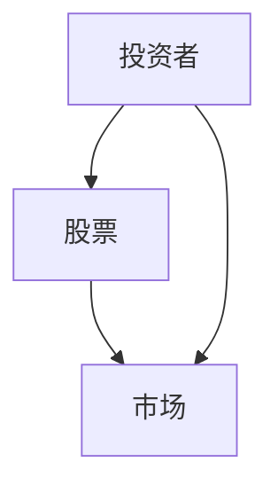
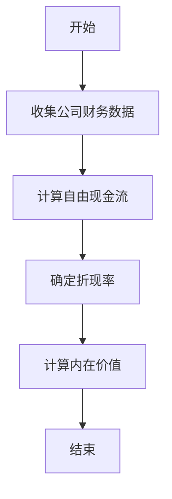
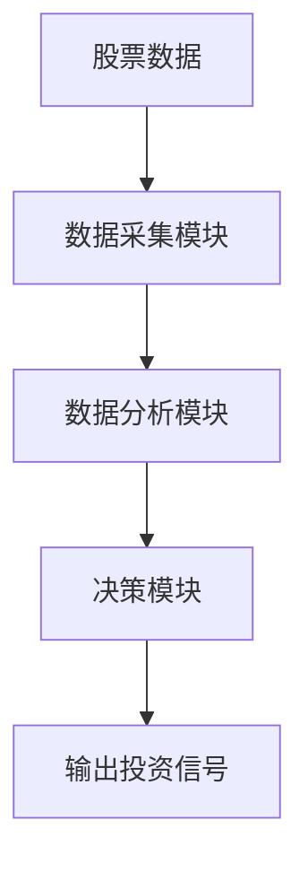
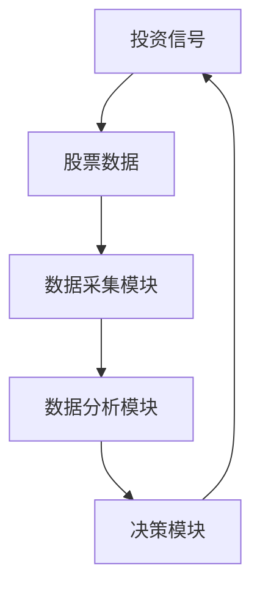

                 


# 《格雷厄姆的价值投资传承》

---

## 关键词：
- 价值投资
- 格雷厄姆
- 投资策略
- 内在价值
- 投资系统架构
- 投资算法

---

## 摘要：
《格雷厄姆的价值投资传承》一书深入探讨了价值投资的核心理念、算法模型及其在现代投资中的应用。通过分析格雷厄姆的投资理论，结合数学模型和系统架构，本书为读者提供了从理论到实践的完整投资解决方案。文章内容涵盖价值投资的背景介绍、核心概念、算法原理、系统设计、项目实战以及总结与展望，帮助投资者理解如何通过科学的方法实现长期稳定的收益。

---

## 第一部分：价值投资的背景与核心理念

### 第1章：价值投资的背景介绍

#### 1.1 价值投资的定义与特点
- 1.1.1 价值投资的定义
  - 价值投资是一种以低于内在价值的价格购买优质资产的投资策略。
  - 核心理念：市场先生是情绪化的，市场波动提供投资机会。

- 1.1.2 价值投资的核心特点
  - 长期投资视角
  - 以安全边际为核心
  - 逆向投资策略

- 1.1.3 价值投资与传统投资的区别
  - 传统投资：基于技术分析和短期趋势。
  - 价值投资：基于基本面分析和长期价值。

#### 1.2 价值投资的背景与问题背景
- 1.2.1 当前投资市场的现状
  - 投资者情绪化决策普遍存在。
  - 市场波动加剧，短期收益诱惑大。

- 1.2.2 投资者行为的误区
  - 追涨杀跌，缺乏独立思考。
  - 忽略长期价值，过度关注短期收益。

- 1.2.3 价值投资的兴起与发展
  - 格雷厄姆与巴菲特的价值投资理论奠定了基础。
  - 现代价值投资在量化分析和系统化投资中的应用。

### 第2章：价值投资的核心概念与联系

#### 2.1 核心概念原理
- 2.1.1 安全边际
  - 安全边际 = 内在价值 - 市场价格。
  - 通过安全边际降低投资风险。

- 2.1.2 内在价值
  - 内在价值是资产的真实价值。
  - 计算方法：基于现金流折现法（DCF）。

- 2.1.3 市场先生
  - 市场先生：代表市场情绪。
  - 通过市场先生的行为发现投资机会。

#### 2.2 核心概念对比分析
- 2.2.1 传统投资方法与价值投资的对比
  | 对比维度 | 传统投资 | 价值投资 |
  |----------|----------|----------|
  | 投资依据 | 技术分析 | 基本面分析 |
  | 投资期限 | 短期 | 长期 |
  | 风险控制 | 依赖止损 | 依赖安全边际 |

- 2.2.2 不同价值投资策略的对比
  - 股息投资策略
  - 低市盈率策略
  - 低市净率策略

- 2.2.3 价值投资与其他投资流派的对比
  - 技术分析流派
  - 成长投资流派
  - 非基本面分析流派

#### 2.3 实体关系架构图


---

## 第二部分：价值投资的算法与数学模型

### 第3章：价值投资的算法原理

#### 3.1 内在价值计算的算法流程
- 3.1.1 数据收集
  - 收集公司财务数据（收入、利润、现金流等）。
  - 获取行业基准和市场数据。

- 3.1.2 计算自由现金流
  - 自由现金流 = 净利润 + 非现金费用 - 投资支出。

- 3.1.3 确定折现率
  - 使用加权平均资本成本（WACC）作为折现率。

- 3.1.4 计算内在价值
  - 内在价值 = ∑(自由现金流 / (1 + r)^t)。

#### 3.2 内在价值计算公式
- 公式：$$\text{内在价值} = \frac{\text{未来现金流的现值}}{\text{折现率}}$$

#### 3.3 内在价值计算流程图


---

### 第4章：价值投资的数学模型与代码实现

#### 4.1 内在价值计算的Python代码实现
```python
def calculate_intrinsic_value(cash_flows, discount_rate):
    present_value = 0
    for year, cash_flow in enumerate(cash_flows):
        present_value += cash_flow / (1 + discount_rate) ** year
    return present_value

# 示例数据
cash_flows = [100, 150, 200, 250]
discount_rate = 0.1

iv = calculate_intrinsic_value(cash_flows, discount_rate)
print(f"内在价值：{iv}")
```

#### 4.2 代码实现解读
- 收集现金流数据。
- 计算每一年的现值。
- 求和得到内在价值。
- 输出结果。

---

## 第三部分：价值投资的系统架构与实现

### 第5章：价值投资的系统架构设计

#### 5.1 系统功能设计
- 数据采集模块
  - 从数据库或API获取股票数据。
- 数据分析模块
  - 计算内在价值、安全边际。
- 决策模块
  - 根据分析结果生成投资信号。

#### 5.2 系统架构图


#### 5.3 系统接口设计
- 数据接口：提供API获取股票数据。
- 分析接口：提供计算内在价值的服务。
- 决策接口：提供投资信号输出。

#### 5.4 系统交互流程图


---

### 第6章：价值投资的项目实战

#### 6.1 项目背景
- 分析某公司的内在价值。
- 应用价值投资策略进行投资决策。

#### 6.2 数据收集与分析
- 收集公司财务数据。
- 计算自由现金流和折现率。

#### 6.3 投资决策
- 计算内在价值。
- 确定安全边际。
- 生成投资信号。

#### 6.4 实战代码实现
```python
# 示例代码：计算内在价值
def calculate_intrinsic_value(cash_flows, discount_rate):
    present_value = 0
    for year, cash_flow in enumerate(cash_flows):
        present_value += cash_flow / (1 + discount_rate) ** year
    return present_value

# 示例数据
cash_flows = [100, 150, 200, 250]
discount_rate = 0.1

iv = calculate_intrinsic_value(cash_flows, discount_rate)
print(f"内在价值：{iv}")
```

#### 6.5 实战结果分析
- 内在价值计算结果。
- 安全边际计算结果。
- 投资信号输出。

---

## 第四部分：总结与展望

### 第7章：总结与展望

#### 7.1 核心内容总结
- 价值投资的核心理念。
- 内在价值计算的算法模型。
- 系统架构设计与实现。

#### 7.2 投资策略建议
- 以安全边际为核心。
- 长期投资视角。
- 逆向投资策略。

#### 7.3 小结与注意事项
- 价值投资需要长期坚持。
- 投资者需具备独立思考能力。
- 风险控制是投资成功的关键。

#### 7.4 拓展阅读
- 格雷厄姆的《聪明的投资者》。
- 巴菲特的《致股东的信》。
- 现代价值投资理论的相关书籍。

---

## 结语
通过系统的分析与实践，我们深入理解了格雷厄姆的价值投资理论，并将其与现代投资技术相结合，构建了完整的投资解决方案。希望本文能为投资者提供科学的指导，帮助他们在复杂的市场中实现长期稳定的收益。

