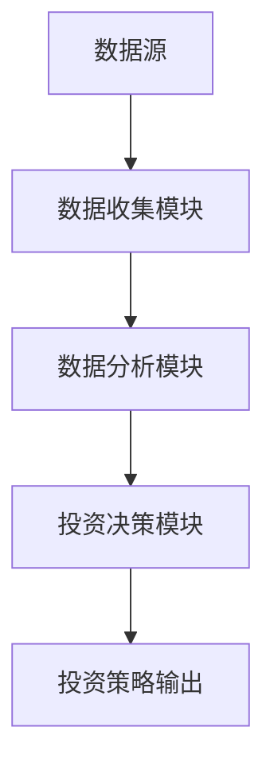

                 


```markdown
# 格雷厄姆的价值投资实践案例

> 关键词：价值投资、格雷厄姆、安全边际、内在价值、投资策略、案例分析

> 摘要：本文将深入探讨格雷厄姆的价值投资理论及其在实践中的应用案例。通过分析经典投资案例，结合现代技术手段，详细阐述价值投资的核心理念、算法原理、系统架构及投资组合管理方法，帮助读者全面理解并掌握价值投资的精髓。

---

## 第一部分：价值投资的背景与核心理念

### 第1章：价值投资的起源与发展

#### 1.1 价值投资的起源
- 1.1.1 投资学的演进历程
  - 早期投资理念的局限性
  - 格雷厄姆对传统投资理论的突破
- 1.1.2 格雷厄姆与价值投资的诞生
  - 本杰明·格雷厄姆的生平简介
  - 《证券分析》的出版与影响
- 1.1.3 价值投资的核心理念
  - 投资的本质：购买企业而非股票
  - 安全边际的重要性

#### 1.2 格雷厄姆的价值投资理论
- 1.2.1 安全边际的概念
  - 安全边际的定义
  - 安全边际的计算方法
- 1.2.2 内在价值的计算
  - 内在价值的定义
  - 内在价值与市场价格的关系
- 1.2.3 市场先生与投资者心态
  - 市场先生的定义
  - 投资者心态对投资决策的影响
  - 如何应对市场波动

---

## 第二部分：价值投资的核心策略

### 第2章：价值投资的策略与方法

#### 2.1 质量型投资
- 2.1.1 质量型投资的定义
- 2.1.2 质量型投资的特点
- 2.1.3 质量型投资的适用场景

#### 2.2 价格型投资
- 2.2.1 价格型投资的定义
- 2.2.2 价格型投资的特点
- 2.2.3 价格型投资的适用场景

#### 2.3 格雷厄姆的经典投资策略
- 2.3.1 投资组合的构建原则
- 2.3.2 股票筛选标准
  - 股票筛选的定义
  - 股票筛选的标准
  - 股票筛选的实施步骤

---

## 第三部分：价值投资的系统架构与算法原理

### 第3章：价值投资的系统架构

#### 3.1 投资决策系统的构建
- 3.1.1 问题场景介绍
  - 价值投资的核心目标
  - 系统化投资决策的必要性
- 3.1.2 系统功能设计
  - 数据收集模块
  - 数据分析模块
  - 投资决策模块
- 3.1.3 系统架构设计
  - 采用分层架构
  - 数据流与模块交互

#### 3.2 系统架构图


---

### 第4章：价值投资的算法原理

#### 4.1 内在价值计算算法
- 4.1.1 算法原理
  - 现金流量折现法
  - 市盈率法
  - 市净率法
- 4.1.2 算法实现
  - 现金流量折现法的Python代码示例
  ```python
  def calculate_intrinsic_value(enterprise_value, free_cash_flow):
      return enterprise_value / free_cash_flow
  ```

#### 4.2 安全边际计算算法
- 4.2.1 算法原理
  - 安全边际的定义
  - 安全边际的计算公式
- 4.2.2 算法实现
  ```python
  def calculate_margin_of_safety(intrinsic_value, market_price):
      return intrinsic_value - market_price
  ```

---

## 第四部分：价值投资的实战案例分析

### 第5章：经典案例分析

#### 5.1 案例一：X公司的分析
- 5.1.1 公司背景
- 5.1.2 数据分析
- 5.1.3 投资决策

#### 5.2 案例二：Y公司的分析
- 5.2.1 公司背景
- 5.2.2 数据分析
- 5.2.3 投资决策

---

## 第五部分：价值投资的现代应用与未来发展

### 第6章：现代价值投资的发展

#### 6.1 数字化与智能化对价值投资的影响
- 6.1.1 量化投资的兴起
- 6.1.2 人工智能在价值投资中的应用

#### 6.2 价值投资的未来趋势
- 6.2.1 在新兴市场的应用
- 6.2.2 技术分析与价值投资的结合

---

## 第六部分：总结与最佳实践

### 第7章：总结与小结

#### 7.1 核心要点回顾
- 格雷厄姆的价值投资理念
- 安全边际与内在价值的重要性
- 投资者心态与风险管理

#### 7.2 实战中的注意事项
- 价值投资的长期性
- 数据分析的准确性
- 风险管理的重要性

#### 7.3 最佳实践 Tips
- 定期复盘与调整
- 学习与积累
- 保持理性与耐心

---

## 第七部分：附录

### 附录A：常用投资工具与资源

### 附录B：价值投资相关书籍推荐

---

通过本文的详细分析，读者可以全面理解格雷厄姆的价值投资理论，并能够在实际投资中灵活运用这些方法。价值投资不仅是一种投资策略，更是一种需要长期坚持的投资理念。
```

