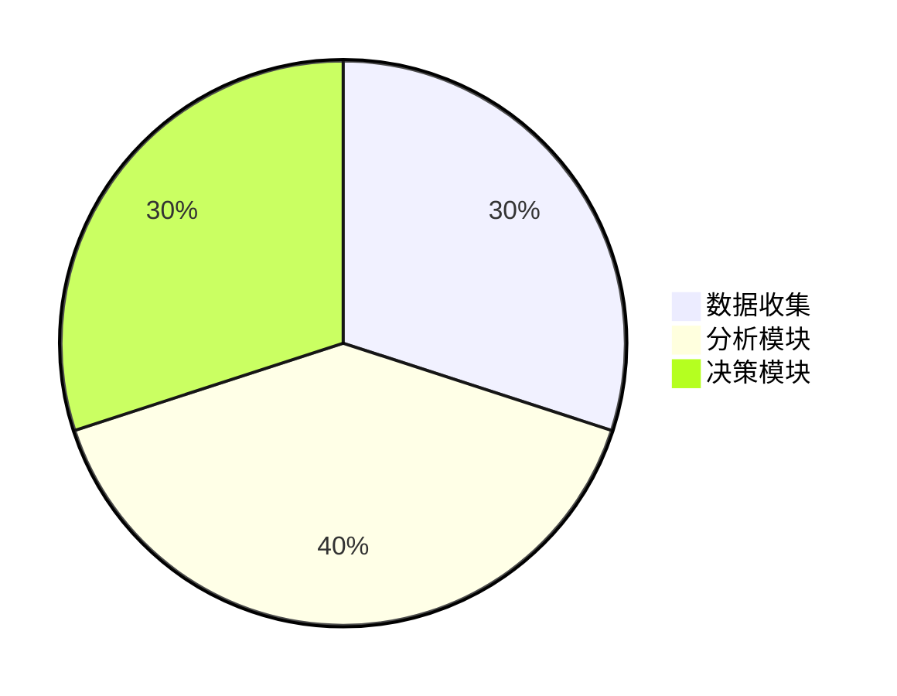
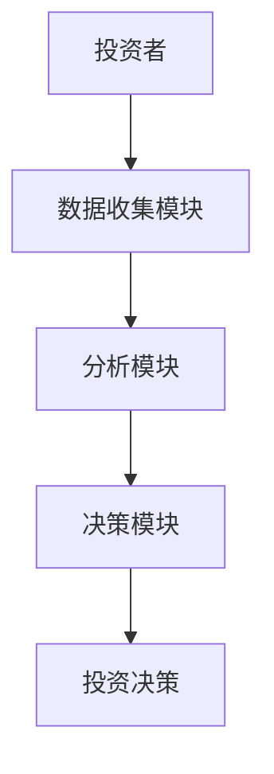
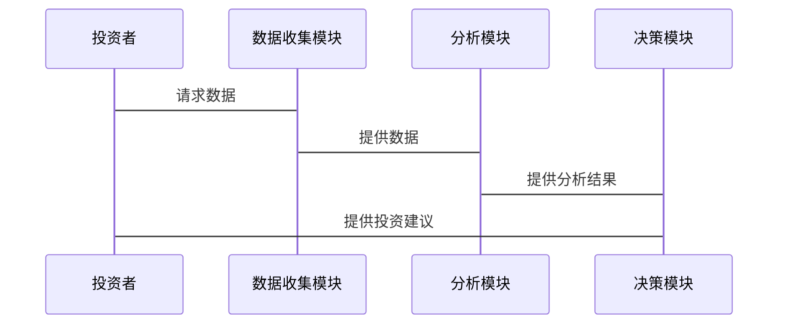

                 


# 《格雷厄姆的价值投资者应具备的素质》

> 关键词：价值投资，格雷厄姆，安全边际，基本面分析，投资策略

> 摘要：本文深入探讨了格雷厄姆的价值投资理念，分析了投资者在价值投资中应具备的素质，包括心理素质、分析能力、策略制定等方面。通过系统的理论分析和实战案例，帮助读者全面理解价值投资的核心要素和实际应用。

---

# 第一部分: 格雷厄姆的价值投资基础

## 第1章: 价值投资的起源与发展

### 1.1 价值投资的起源

#### 1.1.1 投资学的起源与演变

投资学作为一门学科，其起源可以追溯到古代的贸易和金融活动。然而，现代投资学的形成经历了多个阶段，从古典经济学到现代金融理论的发展，奠定了今天价值投资的基础。以下是投资学的演变过程：

1. **古典经济学阶段**：以亚当·斯密和大卫·李嘉图为代表，研究了资本积累和分配的基本原理。
2. **19世纪末至20世纪初**：现代金融市场的形成，股票交易所的出现推动了投资理论的发展。
3. **20世纪初**：本杰明·格雷厄姆等人提出价值投资理念，奠定了现代投资学的基础。

#### 1.1.2 格雷厄姆与价值投资的诞生

本杰明·格雷厄姆是价值投资的鼻祖，他在1934年出版的《证券分析》一书中首次系统地阐述了价值投资的理念。格雷厄姆的经历使他认识到市场的非理性波动，从而提出了以基本面分析为核心的价值投资方法。

#### 1.1.3 价值投资的核心理念

价值投资的核心理念是通过深入分析企业的基本面，寻找市场价格低于其内在价值的投资标的。格雷厄姆强调安全边际的重要性，即买入价格远低于企业内在价值，以降低投资风险。

### 1.2 格雷厄姆的投资哲学

#### 1.2.1 投资的本质与目标

格雷厄姆认为，投资的本质是通过购买低于内在价值的资产，实现长期的资本增值。投资的目标是通过安全边际获得稳定且高于平均的收益。

#### 1.2.2 格雷厄姆的投资策略

格雷厄姆的投资策略强调防御性投资，即选择那些具有稳定收益和强大财务状况的企业，避免高风险的投资。

#### 1.2.3 价值投资的长期视角

价值投资是一种长期投资策略，格雷厄姆认为市场的短期波动无法预测，但长期来看，价格终将回归其内在价值。

### 1.3 价值投资的核心概念

#### 1.3.1 价值与价格的定义

- **价值**：指企业的内在价值，包括资产、收益、现金流等因素。
- **价格**：指市场上证券的实际交易价格。

#### 1.3.2 安全边际的原理

安全边际是买入价格与内在价值之间的差距，用于降低投资风险。

#### 1.3.3 资产评估的基本方法

格雷厄姆提出了多种评估企业内在价值的方法，包括市盈率、市净率等指标的分析。

### 1.4 价值投资的边界与外延

#### 1.4.1 价值投资的适用范围

价值投资适用于那些具有明确财务数据和稳定收益的企业。

#### 1.4.2 价值投资与其他投资策略的对比

- **成长投资**：注重企业的成长潜力，而非当前的估值。
- **指数投资**：通过分散投资降低风险，但不主动寻找低估标的。

#### 1.4.3 价值投资的局限性

- 价值投资需要大量的研究和分析，对普通投资者来说门槛较高。
- 市场波动可能会影响短期收益。

### 1.5 核心概念的结构与要素

#### 1.5.1 核心概念的层次分解

- **内在价值**：企业的基本面分析。
- **市场价格**：市场波动的影响。
- **安全边际**：价格与价值的差距。

#### 1.5.2 核心要素的特征对比

以下是核心要素的特征对比：

| 比较项       | 内在价值         | 市场价格         | 安全边际       |
|--------------|------------------|------------------|----------------|
| 定义         | 企业的实际价值   | 市场交易价格     | 买入价格与内在价值的差额 |
| 变动因素     | 财务状况、收益   | 市场情绪、供需     | 投资策略、市场波动   |
| 可控性       | 部分可控（通过企业分析） | 不可控           | 可控（通过策略选择） |

#### 1.5.3 核心概念的ER实体关系图

以下是核心概念的ER实体关系图：

```mermaid
erDiagram
    企业价值(Entity: 企业价值) {
        <属性>
        资产: 银行账户
        收益: 整数
        现金流: 整数
    }
    市场价格(Entity: 市场价格) {
        <属性>
        交易价格: 银行账户
        市场情绪: 文本
    }
    安全边际(Entity: 安全边际) {
        <属性>
        买入价格: 银行账户
        内在价值: 银行账户
    }
    企业价值 --> 市场价格: 影响
    企业价值 --> 安全边际: 决定
    安全边际 --> 市场价格: 受影响
```

---

## 第2章: 投资者心理与行为分析

### 2.1 投资者心理的构成

#### 2.1.1 理性与感性心理的平衡

投资者在决策过程中需要平衡理性和感性，避免情绪化决策。

#### 2.1.2 投资者常见心理偏差

- **过度自信**：认为自己能够准确预测市场。
- **从众心理**：盲目跟随市场趋势。

#### 2.1.3 心理因素对投资决策的影响

心理因素可能导致投资者做出非理性的投资决策，影响投资结果。

### 2.2 投资者行为的分析框架

#### 2.2.1 行为金融学的基本原理

行为金融学研究投资者的心理和行为对市场的影响。

#### 2.2.2 投资者行为的分类与特征

- **乐观型**：认为市场上涨概率高。
- **悲观型**：认为市场下跌概率高。

#### 2.2.3 格雷厄姆对投资者行为的洞察

格雷厄姆强调避免从众心理，坚持独立思考。

### 2.3 投资者心理与价值投资的结合

#### 2.3.1 心理因素对价值投资策略的影响

心理因素可能影响投资者对价值投资策略的坚持。

#### 2.3.2 如何克服心理偏差

通过严格的纪律和系统化的分析，减少心理偏差的影响。

#### 2.3.3 建立稳定的投资心态

投资者需要具备稳定的心态，避免过度波动。

---

## 第3章: 价值投资的核心策略

### 3.1 基本分析与价值评估

#### 3.1.1 基本分析的定义与方法

基本分析通过对企业财务报表的分析，评估其内在价值。

#### 3.1.2 财务指标的分析与解读

关键财务指标包括市盈率、市净率、股息率等。

#### 3.1.3 企业价值的评估模型

常用的评估模型包括DCF模型和可比公司分析。

### 3.2 防御性投资策略

#### 3.2.1 防御性投资的定义

防御性投资是指选择那些具有稳定收益和强大财务状况的企业。

#### 3.2.2 防御性投资的特征

- **低风险**：企业财务状况稳定。
- **高分红**：企业提供稳定的股息收入。

#### 3.2.3 防御性投资的实施步骤

1. 选择具有稳定收益的企业。
2. 分析企业的财务报表。
3. 计算安全边际。

### 3.3 投资组合管理

#### 3.3.1 投资组合的定义

投资组合是指投资者持有的多种证券的组合。

#### 3.3.2 投资组合的构建策略

- **分散投资**：降低风险。
- **定期调整**：根据市场变化进行调整。

#### 3.3.3 投资组合的风险管理

通过分散投资和风险评估，降低投资组合的整体风险。

---

## 第4章: 投资风险管理

### 4.1 风险识别与评估

#### 4.1.1 风险的定义与分类

- **系统性风险**：市场整体波动带来的风险。
- **非系统性风险**：特定企业或行业带来的风险。

#### 4.1.2 风险评估的方法

通过财务报表分析和市场分析，评估潜在风险。

### 4.2 风险管理计划

#### 4.2.1 风险控制策略

- **设定止损点**：当投资损失达到一定比例时卖出。
- **分散投资**：降低非系统性风险。

#### 4.2.2 风险调整后的投资策略

根据风险评估结果，调整投资组合。

### 4.3 应对市场波动的策略

#### 4.3.1 市场波动的定义与影响

市场波动可能导致投资组合的短期损失。

#### 4.3.2 应对市场波动的策略

- **长期持有**：忽略短期波动，关注长期价值。
- **动态调整**：根据市场变化进行调整。

---

## 第5章: 长期投资理念与心态培养

### 5.1 长期投资理念

#### 5.1.1 长期投资的优势

- **复利效应**：长期投资能够实现财富的复利增长。
- **忽略短期波动**：长期视角使投资者不受短期市场影响。

#### 5.1.2 长期投资的挑战

- **耐心不足**：投资者可能因短期波动而放弃。
- **市场认知错误**：可能错误判断长期趋势。

### 5.2 心态培养

#### 5.2.1 心态培养的重要性

- **保持耐心**：长期投资需要耐心等待。
- **避免贪婪与恐惧**：避免因市场波动而做出错误决策。

#### 5.2.2 心态管理技巧

- **定期反思**：分析自己的投资决策，总结经验教训。
- **建立投资纪律**：制定明确的投资计划并严格执行。

---

## 第6章: 价值投资的系统分析与架构设计

### 6.1 系统分析

#### 6.1.1 问题场景介绍

投资者需要在复杂的市场环境中做出决策，需要系统的分析方法。

#### 6.1.2 系统功能设计

- **数据收集**：收集企业的财务数据和市场数据。
- **分析模块**：进行基本面分析和价值评估。
- **决策模块**：根据分析结果做出投资决策。

#### 6.1.3 系统架构设计

以下是系统架构设计的Mermaid图：



### 6.2 系统架构设计

#### 6.2.1 系统架构图

以下是系统架构图：



### 6.3 系统接口设计

#### 6.3.1 接口设计

- **数据接口**：从数据库获取企业数据。
- **分析接口**：调用分析模块进行价值评估。

#### 6.3.2 交互流程图

以下是交互流程图：



---

## 第7章: 价值投资的项目实战

### 7.1 环境安装

#### 7.1.1 系统环境

- 操作系统：Windows 10或更高版本
- 开发工具：Python 3.8+

#### 7.1.2 必要的库

- pandas
- numpy
- matplotlib

### 7.2 核心实现源代码

#### 7.2.1 数据收集模块

```python
import pandas as pd

def collect_data(ticker):
    # 模拟数据收集
    data = {
        'Revenue': [100, 200, 300],
        'Net Income': [50, 100, 150],
        'Cash Flow': [20, 40, 60]
    }
    return pd.DataFrame(data)
```

#### 7.2.2 分析模块

```python
def calculate_intrinsic_value(df):
    # 简单的内在价值计算
    return df['Net Income'].mean() * 2.5
```

#### 7.2.3 决策模块

```python
def make_decision(ticker, price, intrinsic_value):
    if price < intrinsic_value * 0.9:
        return "买入"
    elif price > intrinsic_value * 1.1:
        return "卖出"
    else:
        return "持有"
```

### 7.3 代码应用解读与分析

通过上述代码，投资者可以实现数据收集、价值评估和决策制定的自动化。

### 7.4 实际案例分析

以某公司为例，通过代码进行分析，得出投资建议。

### 7.5 项目小结

总结项目实施过程中的经验和教训，提出改进建议。

---

## 第8章: 总结与展望

### 8.1 核心观点总结

- 价值投资需要深入分析企业的基本面。
- 心理素质和纪律性是成功的关键。

### 8.2 未来展望

- 技术的进步将为价值投资提供更多工具和方法。
- 价值投资理念在不同市场环境下的应用需要进一步研究。

### 8.3 最佳实践 tips

- **坚持学习**：不断更新知识和技能。
- **保持耐心**：长期投资需要耐心等待。
- **避免情绪化决策**：坚持理性分析。

---

## 第9章: 小结

通过本文的分析，读者可以全面理解格雷厄姆的价值投资理念，掌握投资者应具备的素质，并通过系统的分析和实战案例，提升自己的投资能力。

---

## 第10章: 注意事项与拓展阅读

### 10.1 投资风险提示

- 投资有风险，入市需谨慎。
- 不要盲目跟风，独立思考。

### 10.2 拓展阅读

- 《证券分析》——本杰明·格雷厄姆
- 《价值投资入门》——查理·芒格

---

以上是《格雷厄姆的价值投资者应具备的素质》的完整目录和内容框架，希望对您有所帮助。

