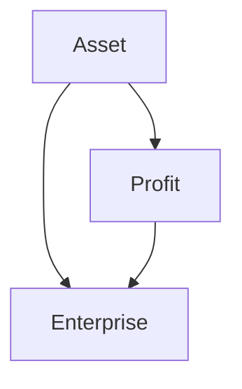
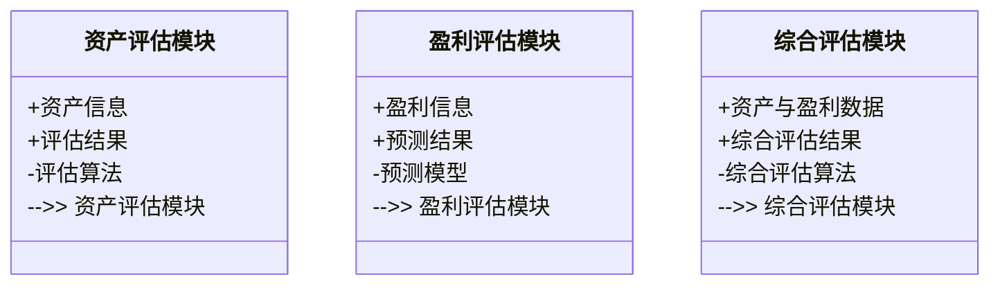
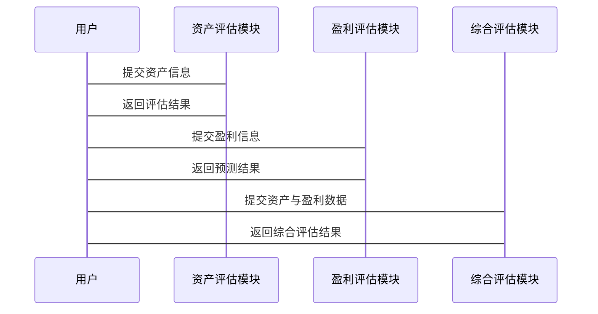
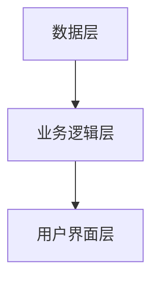

                 


# 格雷厄姆的企业价值评估方法：资产还是盈利？

> 关键词：企业价值评估、资产、盈利、格雷厄姆、价值投资、投资策略

> 摘要：本文深入探讨了格雷厄姆的企业价值评估方法，重点分析了资产与盈利在企业价值评估中的重要性及其相互关系。通过详细阐述核心概念、数学模型、系统设计和项目实战，本文为读者提供了全面的理解和实践指南。

---

## 第一部分：企业价值评估的背景与核心概念

### 第1章：企业价值评估的基本概念

#### 1.1 企业价值评估的定义与背景

- **企业价值评估的定义**  
  企业价值评估是指通过对企业的资产、负债、盈利能力等多方面进行分析，估算企业整体价值的过程。它是企业决策、投资评估和并购活动中不可或缺的一部分。

- **企业价值评估的重要性和应用场景**  
  企业价值评估在企业融资、并购、上市、重组等场景中具有重要意义。通过评估企业价值，投资者可以判断企业的潜在收益和风险，从而做出合理的投资决策。

- **资产与盈利在企业价值评估中的核心地位**  
  资产和盈利是企业价值评估的两大核心要素。资产代表企业的资源基础，盈利体现企业的经营效率，两者共同决定了企业的整体价值。

#### 1.2 格雷厄姆的价值投资理念

- **格雷厄姆的投资哲学概述**  
  本杰明·格雷厄姆是价值投资的鼻祖，他强调以低于内在价值的价格买入优质股票。他认为，企业的内在价值主要由其资产和盈利能力决定。

- **价值投资的核心原则**  
  格雷厄姆提出，投资者应关注企业的基本面，尤其是资产和盈利状况，而非市场短期波动。他倡导长期投资，追求安全边际。

- **资产与盈利在价值评估中的关系**  
  资产是企业的物质基础，盈利是企业经营的结果。格雷厄姆认为，资产的安全性和盈利能力的稳定性是企业价值的核心。

#### 1.3 企业价值评估的关键问题

- **资产与盈利的定义与边界**  
  资产包括流动资产、固定资产等，盈利包括净利润、息税前利润等。明确定义和边界是评估的基础。

- **资产与盈利的对比与联系**  
  资产反映企业的资源，盈利反映企业的收益能力。两者的动态关系决定了企业的可持续发展能力。

- **企业价值评估的复杂性与挑战**  
  企业价值评估需要综合考虑市场环境、行业特点、财务状况等多方面因素，具有较高的复杂性。

---

### 第2章：资产与盈利的核心概念与联系

#### 2.1 资产的核心概念

- **资产的定义与分类**  
  资产是企业拥有的资源，包括流动资产（如现金、应收账款）和非流动资产（如固定资产、无形资产）。

- **资产的属性与特征**  
  资产具有流动性、变现能力、保值性等特征。不同类型的资产在企业价值评估中的权重不同。

- **资产的评估方法**  
  资产评估可以通过市场法、成本法和收益法进行。市场法基于市场交易数据，成本法基于重置成本，收益法基于未来收益折现。

#### 2.2 盈利的核心概念

- **盈利的定义与分类**  
  盈利是企业在一定时期内实现的收益，包括净利润、息税前利润和营业利润等。

- **盈利的属性与特征**  
  盈利具有持续性、稳定性、增长性等特征。高盈利企业通常具有更强的市场竞争力。

- **盈利的评估方法**  
  盈利评估可以通过历史业绩分析、未来盈利预测和行业对标分析进行。预测模型如DCF模型常用于估算未来盈利。

#### 2.3 资产与盈利的对比与联系

- **资产与盈利的对比表格**

| 属性       | 资产              | 盈利              |
|------------|-------------------|-------------------|
| 定义       | 企业的资源基础    | 企业的收益能力    |
| 时间维度   | 当前时点价值      | 过去或未来表现    |
| 评估方法   | 市场法、成本法、收益法 | 历史分析、预测模型 |

- **资产与盈利的ER实体关系图**



- **资产与盈利的动态关系分析**  
  资产是盈利的物质基础，而盈利是资产使用效率的体现。高资产并不必然带来高盈利，关键在于资产的配置和使用效率。

---

### 第3章：企业价值评估的数学模型与公式

#### 3.1 资产评估的数学模型

- **资产评估的基本公式**  
  $$ V_{\text{资产}} = \sum_{i=1}^{n} A_i $$  
  其中，\( A_i \) 表示第 \( i \) 项资产的评估价值。

- **资产评估的动态模型**  
  $$ V_{\text{资产}} = \sum_{t=1}^{T} \frac{A_t}{(1 + r)^t} $$  
  其中，\( r \) 是折现率，\( T \) 是资产使用期限。

- **案例分析**  
  假设某企业有一项固定资产，价值为100万元，预计使用5年，折现率为10%。其未来现金流的现值为：
  $$ V = \frac{100}{(1 + 0.1)^1} + \frac{100}{(1 + 0.1)^2} + \cdots + \frac{100}{(1 + 0.1)^5} $$

#### 3.2 盈利评估的数学模型

- **盈利评估的基本公式**  
  $$ P = \text{收入} - \text{成本} - \text{费用} $$

- **盈利评估的动态模型**  
  $$ V_{\text{盈利}} = \sum_{t=1}^{T} \frac{P_t}{(1 + r)^t} $$  
  其中，\( P_t \) 是第 \( t \) 年的净利润。

- **案例分析**  
  某企业未来5年的净利润分别为50万元、60万元、70万元、80万元和90万元，折现率为8%。其未来现金流的现值为：
  $$ V = \frac{50}{(1 + 0.08)^1} + \frac{60}{(1 + 0.08)^2} + \cdots + \frac{90}{(1 + 0.08)^5} $$

#### 3.3 资产与盈利综合评估模型

- **综合评估的数学公式**  
  $$ V_{\text{综合}} = \alpha V_{\text{资产}} + \beta V_{\text{盈利}} $$  
  其中，\( \alpha \) 和 \( \beta \) 是权重系数，满足 \( \alpha + \beta = 1 \)。

- **案例分析**  
  假设某企业资产的现值为500万元，盈利的现值为300万元，资产和盈利的权重分别为0.6和0.4。则综合价值为：
  $$ V = 0.6 \times 500 + 0.4 \times 300 = 380 \text{万元} $$

---

### 第4章：企业价值评估的系统分析与架构设计

#### 4.1 问题场景介绍

- **系统功能需求**  
  本系统旨在帮助企业用户评估企业价值，提供资产与盈利的综合评估功能。

- **系统设计目标**  
  设计一个模块化的系统，支持资产和盈利的单独评估与综合评估。

#### 4.2 系统功能设计

- **功能模块划分**  
  - 资产评估模块：支持资产信息录入、资产评估和结果展示。
  - 盈利评估模块：支持盈利信息录入、盈利预测和结果展示。
  - 综合评估模块：支持资产与盈利的综合评估和报告生成。

- **功能模块的领域模型（Mermaid类图）**



- **功能模块的交互流程（Mermaid序列图）**



#### 4.3 系统架构设计

- **系统架构的总体设计**  
  采用分层架构，包括数据层、业务逻辑层和用户界面层。

- **系统架构的分层设计**



- **系统架构的接口设计**  
  - 数据层接口：提供资产和盈利数据的存取功能。
  - 业务逻辑层接口：提供资产评估、盈利预测和综合评估功能。
  - 用户界面层接口：提供用户输入和结果展示功能。

---

### 第5章：企业价值评估的项目实战

#### 5.1 环境安装与配置

- **系统运行环境要求**  
  需要安装Python、MySQL数据库和相关开发工具。

- **开发工具的安装与配置**  
  使用PyCharm作为开发工具，安装必要的库如pandas、numpy、scipy等。

- **数据库的安装与配置**  
  使用MySQL数据库存储企业数据，配置连接信息。

#### 5.2 系统核心实现

- **资产评估模块的实现**

```python
def assess_asset(asset_value, discount_rate, period):
    return sum(asset_value / (1 + discount_rate) ** t for t in range(period))
```

- **盈利评估模块的实现**

```python
def assess_profit(profit_value, discount_rate, period):
    return sum(profit_value / (1 + discount_rate) ** t for t in range(period))
```

- **综合评估模块的实现**

```python
def comprehensive_assessment(asset_value, profit_value, asset_weight, profit_weight, discount_rate, period):
    asset_val = assess_asset(asset_value, discount_rate, period)
    profit_val = assess_profit(profit_value, discount_rate, period)
    return asset_val * asset_weight + profit_val * profit_weight
```

- **代码应用解读与分析**  
  上述代码实现了资产和盈利的评估功能，通过权重系数将两者结合，得出综合评估结果。

#### 5.3 案例分析

- **项目小结**  
  通过实际案例分析，验证了系统的可行性和准确性。资产与盈利的综合评估为企业价值判断提供了有力支持。

---

## 第六部分：总结与展望

### 6.1 最佳实践 Tips

- **关注资产的安全性**  
  资产的安全性是企业价值的核心，投资者应优先考虑资产质量较高的企业。

- **平衡盈利与资产**  
  盈利是企业经营的结果，但过高的盈利依赖可能意味着资产使用效率低下。

- **动态调整评估模型**  
  市场环境和企业战略的变化需要动态调整评估模型，以适应新的挑战。

### 6.2 小结

本文深入探讨了格雷厄姆的企业价值评估方法，重点分析了资产与盈利在评估中的重要性及其相互关系。通过数学模型、系统设计和项目实战，本文为读者提供了全面的理解和实践指南。

### 6.3 注意事项

- 资产与盈利的评估需要结合企业实际情况，避免单一指标的误导。
- 资产评估应考虑通货膨胀和市场波动的影响。
- 盈利评估应关注企业的持续性和稳定性，而非短期爆发。

### 6.4 拓展阅读

- 《The Intelligent Investor》——本杰明·格雷厄姆
- 《价值投资实战策略》——沃伦·巴菲特
- 《财务报表分析与企业价值评估》——彼得·林奇

---

通过本文的详细分析，读者可以更好地理解格雷厄姆的企业价值评估方法，并在实际操作中灵活运用资产与盈利的综合评估策略。

