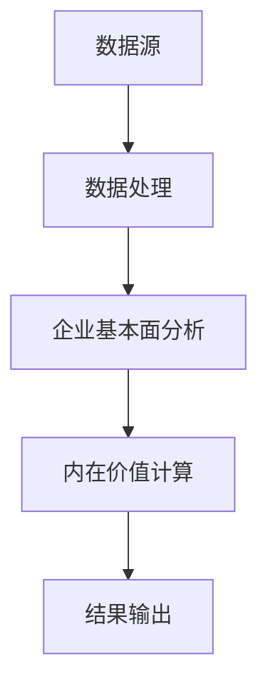
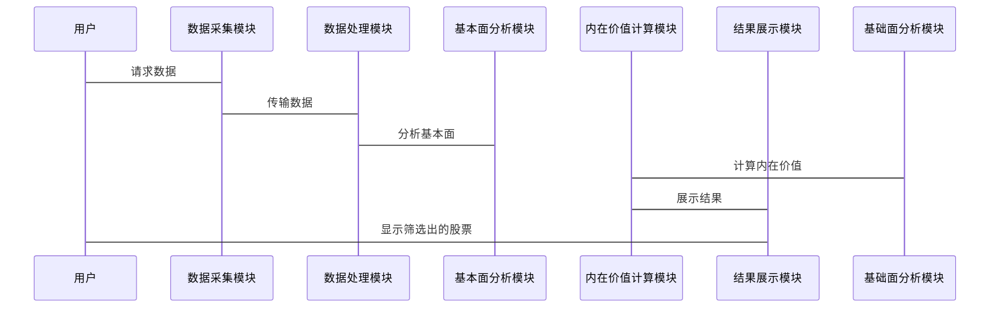

                 

# 格雷厄姆的净净股票策略：寻找极度低估的公司

> 关键词：格雷厄姆，净净股票策略，价值投资，基本面分析，内在价值，低估股票

> 摘要：本文深入探讨了格雷厄姆的净净股票策略，解释了其核心概念、算法原理以及在实际投资中的应用。通过系统分析和案例研究，本文揭示了如何识别和投资于极度低估的公司，帮助投资者在市场中寻找价值洼地，实现长期稳定的收益。

---

## 第一章: 格雷厄姆投资理念与净净股票策略背景

### 1.1 格雷厄姆投资理念的核心思想

#### 1.1.1 价值投资的定义与特点
- **价值投资**：一种以低于其内在价值的价格购买优质股票的投资策略，强调长期持有和安全边际。
- **特点**：
  - 长期视角：关注企业的内在价值而非短期市场波动。
  - 安全边际：购买价格远低于内在价值，以降低风险。
  - 逆向投资：在市场恐慌时寻找机会，避免盲目跟风。

#### 1.1.2 格雷厄姆的投资哲学
- **格雷厄姆的投资理念**：
  - 投资的本质是购买企业的一部分，而非投机市场波动。
  - 市场先生是情绪化的，投资者应利用市场的非理性来获取超额收益。
  - 价值投资的核心是寻找“烟屁股”——即被市场抛弃的优质股票。

#### 1.1.3 净净股票策略的起源与背景
- 净净股票策略是格雷厄姆在其著作《证券分析》中提出的一种投资方法，旨在通过基本面分析找到市场价格远低于其内在价值的公司。

### 1.2 净净股票策略的定义与特征

#### 1.2.1 净净股票的定义
- 净净股票是指市场价格远低于其内在价值的股票，通常具有较高的安全边际。

#### 1.2.2 净净股票的核心特征
- **低市盈率（P/E）**：市盈率低于行业平均水平，表明市场对其盈利能力的低估。
- **低市净率（P/B）**：市净率低于账面价值，反映市场对其资产价值的低估。
- **高股息率**：股息率高，可能表明公司具有稳定的盈利能力和较高的分红能力。

#### 1.2.3 净净股票与其他股票投资策略的区别
- 与成长型投资策略不同，净净股票策略更关注低估而非高增长。
- 与指数投资策略不同，净净股票策略强调个股选择而非市场分散。

### 1.3 净净股票策略的应用场景

#### 1.3.1 市场周期与投资机会
- 在市场低迷或衰退时期，更容易找到被低估的股票。
- 在市场恐慌时，投资者情绪低落，导致股票价格偏离其真实价值。

#### 1.3.2 如何识别极度低估的公司
- **基本面分析**：分析公司的财务报表，评估其盈利能力、成长性和财务健康状况。
- **估值指标**：通过市盈率、市净率等指标判断股票是否被低估。
- **行业比较**：将公司与同行业进行对比，寻找相对低估的标的。

#### 1.3.3 净净股票策略的适用人群
- 适合具有较强分析能力和长期投资耐心的投资者。
- 适合在市场低迷时期寻找安全边际的投资者。

### 1.4 本章小结
本章介绍了格雷厄姆的投资理念，重点阐述了净净股票策略的核心思想、定义、特征以及应用场景，为后续章节的分析奠定了基础。

---

## 第二章: 净净股票策略的核心概念与联系

### 2.1 净净股票策略的核心原理

#### 2.1.1 格雷厄姆的内在价值计算方法
- **内在价值公式**：
  $$ V = \frac{E}{(1 + r)^n} $$
  其中，V为内在价值，E为未来现金流，r为折现率，n为时间跨度。
- **计算步骤**：
  1. 预测未来现金流。
  2. 确定合适的折现率。
  3. 计算内在价值。
- **案例分析**：
  某公司未来5年的预期现金流分别为100万、120万、150万、180万、200万，假设折现率为8%。
  内在价值计算如下：
  $$ V = \frac{100}{1.08} + \frac{120}{1.08^2} + \frac{150}{1.08^3} + \frac{180}{1.08^4} + \frac{200}{1.08^5} $$
  计算结果约为500万。

#### 2.1.2 净净股票策略的数学模型
- **净净股票筛选公式**：
  $$ \text{安全边际} = \frac{\text{内在价值}}{\text{市场价格}} - 1 $$
  当安全边际为正时，表明股票被低估。

#### 2.1.3 企业基本面分析的关键指标
- **盈利能力**：净利润率、ROE（净资产收益率）。
- **成长性**：收入增长率、净利润增长率。
- **财务健康状况**：资产负债率、流动比率。

### 2.2 净净股票策略与企业基本面的关系

#### 2.2.1 企业盈利能力分析
- **净利润率**：
  $$ \text{净利润率} = \frac{\text{净利润}}{\text{营业收入}} $$
  低净利润率可能表明公司盈利能力较弱。

#### 2.2.2 企业成长性评估
- **收入增长率**：
  $$ \text{收入增长率} = \frac{\text{本期收入} - \text{上期收入}}{\text{上期收入}} \times 100\% $$
  高收入增长率可能表明公司具有成长潜力。

#### 2.2.3 企业财务健康状况分析
- **资产负债率**：
  $$ \text{资产负债率} = \frac{\text{总负债}}{\text{总资产}} \times 100\% $$
  过高的资产负债率可能表明公司财务风险较大。

### 2.3 净值与市场价的对比分析

#### 2.3.1 净值与市场价的定义
- **净值**：公司每股净资产价值。
- **市场价**：股票在市场上的交易价格。

#### 2.3.2 净值与市场价的差异分析
- **差异计算**：
  $$ \text{差异} = \text{市场价} - \text{净值} $$
  当差异为负时，表明股票价格低于其净值。

#### 2.3.3 净值与市场价的动态关系
- 市场价格受投资者情绪影响较大，而净值反映公司的实际资产价值。
- 在市场恐慌时，股票价格可能远低于净值，此时是投资的好时机。

### 2.4 本章小结
本章详细阐述了净净股票策略的核心原理，包括内在价值计算、安全边际评估以及企业基本面分析的关键指标，为后续的策略实施提供了理论基础。

---

## 第三章: 净净股票策略的算法原理与数学模型

### 3.1 净净股票策略的算法流程

#### 3.1.1 数据收集与处理
- 收集目标公司的财务数据，包括收入、利润、资产、负债等。
- 数据清洗和预处理，确保数据的准确性和完整性。

#### 3.1.2 企业基本面分析
- 计算盈利能力、成长性和财务健康状况的指标。
- 对比分析同行业公司的指标，寻找相对低估的标的。

#### 3.1.3 内在价值计算与市场价对比
- 使用格雷厄姆的内在价值公式计算公司的内在价值。
- 对比市场价格与内在价值，计算安全边际。

#### 3.1.4 筛选符合条件的股票
- 筛选市场价格远低于内在价值的股票。
- 综合考虑公司的基本面和行业地位，选择具有长期投资价值的股票。

### 3.2 净净股票策略的数学模型

#### 3.2.1 内在价值计算公式
$$ V = \frac{E}{(1 + r)^n} $$
- **E**：未来现金流。
- **r**：折现率。
- **n**：时间跨度。

#### 3.2.2 安全边际计算公式
$$ \text{安全边际} = \frac{V}{P} - 1 $$
- **V**：内在价值。
- **P**：市场价格。

#### 3.2.3 估值指标
- **市盈率（P/E）**：
  $$ \text{P/E} = \frac{\text{市场价格}}{\text{每股收益}} $$
- **市净率（P/B）**：
  $$ \text{P/B} = \frac{\text{市场价格}}{\text{每股净资产}} $$

### 3.3 净值与市场价的对比分析

#### 3.3.1 净值与市场价的差异计算
$$ \text{差异} = \text{市场价} - \text{净值} $$

#### 3.3.2 净值与市场价的动态变化
- 市场价格受短期因素影响波动较大。
- 净值反映公司的真实资产价值，相对稳定。

#### 3.3.3 净值与市场价的比率分析
- **市净率**：
  $$ \text{市净率} = \frac{\text{市场价格}}{\text{净值}} $$
  低市净率可能表明股票被低估。

### 3.4 本章小结
本章通过详细阐述净净股票策略的算法流程和数学模型，展示了如何通过内在价值计算和市场价对比来筛选被低估的股票，为投资者提供了科学的决策依据。

---

## 第四章: 净净股票策略的系统分析与架构设计

### 4.1 系统功能设计

#### 4.1.1 数据采集模块
- 收集目标公司的财务数据，包括收入、利润、资产、负债等。
- 数据来源：上市公司财报、行业报告等。

#### 4.1.2 企业基本面分析模块
- 计算盈利能力、成长性和财务健康状况的指标。
- 对比分析同行业公司的指标，寻找相对低估的标的。

#### 4.1.3 内在价值计算模块
- 使用格雷厄姆的内在价值公式计算公司的内在价值。
- 对比市场价格与内在价值，计算安全边际。

#### 4.1.4 结果展示模块
- 显示筛选出的被低估股票列表。
- 展示股票的基本面分析结果和安全边际。

### 4.2 系统架构设计

#### 4.2.1 数据流图

#### 4.2.2 系统架构图

#### 4.2.3 系统接口设计
- **数据接口**：与数据源（如数据库、API）对接，获取财务数据。
- **计算接口**：实现内在价值计算和安全边际评估的函数。
- **结果展示接口**：将筛选出的股票列表和分析结果展示给用户。

#### 4.2.4 系统交互流程

### 4.3 本章小结
本章通过系统分析和架构设计，展示了如何构建一个基于净净股票策略的投资系统，为投资者提供了高效的投资工具。

---

## 第五章: 净净股票策略的案例分析与实际应用

### 5.1 案例分析

#### 5.1.1 案例背景
- 某制造公司，当前股价为10元，每股净资产为15元，净利润率为5%，收入增长率为10%。

#### 5.1.2 数据分析
- **市净率**：
  $$ \text{P/B} = \frac{10}{15} = 0.67 $$
- **安全边际**：
  $$ \text{安全边际} = \frac{15}{10} - 1 = 0.5 $$
  安全边际为50%，表明股票被低估。

#### 5.1.3 投资建议
- 该股票市场价格远低于其净值，具有较高的安全边际，适合长期投资。

### 5.2 实际应用

#### 5.2.1 选择投资标的
- 筛选出满足净净股票条件的公司，如市净率低于1、安全边际超过50%。

#### 5.2.2 构建投资组合
- 将筛选出的股票按行业分散投资，降低风险。
- 定期调整投资组合，跟踪公司的基本面变化。

#### 5.2.3 风险管理
- 设定止损点，避免重大损失。
- 定期评估投资组合的绩效，优化投资策略。

### 5.3 本章小结
本章通过实际案例分析和应用，展示了如何在实际投资中应用净净股票策略，帮助投资者识别和投资于被低估的公司。

---

## 第六章: 净净股票策略的局限性与挑战

### 6.1 净净股票策略的局限性

#### 6.1.1 市场周期性的影响
- 在市场高涨时，很难找到被低估的股票。
- 在市场低迷时，虽然容易找到被低估的股票，但公司可能面临经营困境。

#### 6.1.2 数据的局限性
- 数据质量影响分析结果。
- 未来现金流预测的不确定性。

#### 6.1.3 投资者情绪的影响
- 市场恐慌可能导致股票价格过度低估，增加投资风险。

### 6.2 净净股票策略的挑战

#### 6.2.1 如何应对市场波动
- 保持长期投资视角，避免短期市场波动的干扰。
- 坚持安全边际原则，选择具有长期投资价值的公司。

#### 6.2.2 如何评估公司的未来现金流
- 建立合理的现金流预测模型，考虑多种因素的影响。
- 定期更新现金流预测，适应市场变化。

#### 6.2.3 如何管理投资组合
- 分散投资，降低风险。
- 定期评估投资组合的绩效，优化投资策略。

### 6.3 本章小结
本章分析了净净股票策略的局限性和挑战，强调了在实际应用中需要注意的问题，为投资者提供了更全面的投资视角。

---

## 第七章: 净净股票策略的总结与最佳实践

### 7.1 总结

#### 7.1.1 净净股票策略的核心思想
- 寻找市场价格远低于其内在价值的公司。
- 通过基本面分析和估值指标判断股票是否被低估。

#### 7.1.2 投资策略的关键点
- 坚持价值投资，注重安全边际。
- 长期持有，避免短期波动的干扰。

### 7.2 最佳实践

#### 7.2.1 投资者心态管理
- 保持理性，避免情绪化决策。
- 坚持长期投资，耐心等待市场回归合理估值。

#### 7.2.2 数据分析与研究
- 持续学习，提升基本面分析能力。
- 关注行业动态，了解公司的经营环境。

#### 7.2.3 定期复盘与优化
- 定期评估投资组合的绩效。
- 根据市场变化调整投资策略。

### 7.3 小结

---

## 关键词
格雷厄姆，净净股票策略，价值投资，基本面分析，内在价值，低估股票

---

## 摘要
本文深入探讨了格雷厄姆的净净股票策略，解释了其核心概念、算法原理以及在实际投资中的应用。通过系统分析和案例研究，本文揭示了如何识别和投资于极度低估的公司，帮助投资者在市场中寻找价值洼地，实现长期稳定的收益。

